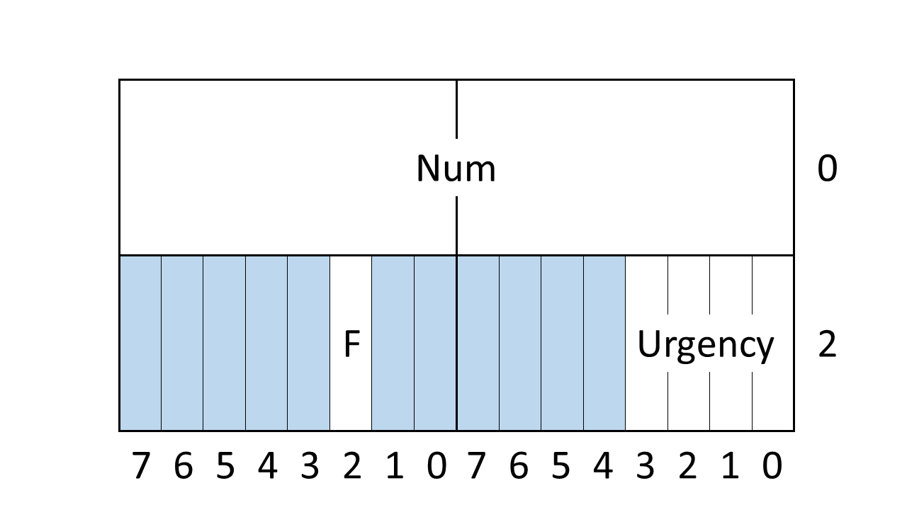

.. include:: ../../../global.txt

.. index:: single: DO-178C/ED-12C; Compliance

Compliance with DO-178C/ED-12C Guidance: Analysis
=================================================

Overview
--------

|do-178c| uses the term "requirement" to identify the expected
behavior of the system, the software, or a part thereof. The desired
functions are formulated at the system level as "system requirements"
and are refined and elaborated into "software requirements". |do-178c|
identifies several categories of software requirements.

.. index:: single: DO-178C/ED-12C; High-Level Requirement (HLR)
.. index:: single: DO-178C/ED-12C; Low-Level Requirement (LLR)
.. index:: single: DO-178C/ED-12C; Executable Object Code (EOC)
.. index:: High-Level Requirement (HLR)
.. index:: Low-Level Requirement (LLR)
.. index:: Executable Object Code (EOC)

The High-Level Requirements (HLR) define the expected behavior of the
complete software loaded on the target computer, independent of the
software architecture. The HLR are further refined into one or more
lower levels, specifying the expected behavior of each software
subpart (component) based on the architecture definition. The lowest
level of requirements (the LLR) and the architecture are translated
into source code, which finally is compiled to produce the Executable
Object Code (EOC).

Within this basic framework, the development process activities
(requirements definition, design, coding, and integration) should be
conducted so as to reduce the likelihood of introducing
errors. Verification process activities are designed to detect errors
through multiple filters, by assessing the same artifacts in different
ways. This naturally applies to the EOC, whose verification involves
checking compliance with the requirements at each level, using both
normal and abnormal inputs. Such verification comprises manual
reviews, automated analyses (possibly including the use of formal
methods), and testing based on the software requirements. Finally, the
EOC verification must itself be verified.

.. index:: V software life cycle

While it is not a |do-178c| concept, a *V* cycle is often used to
represent the complete software life cycle. A variation of the
traditional *V* cycle, oriented around the |do-178c| processes, was
shown earlier in :numref:`Airborn_SW_fig1`. As is seen in that figure,
AdaCore tools mostly apply towards the bottom stages of the *V* cycle:

* Design (architecture + LLR), coding and integration (EOC
  generation), for the development activities.
* Design and source code review / analysis and LLR testing, for the
  verification activities.

Additional support is provided for design activities in conjunction
with two technology supplements (Object-Oriented Technology and Formal
Methods).

.. index:: GNATcheck
.. index:: GNAT Static Analysis Suite (GNAT SAS)
.. index:: GNATcheck
.. index:: GNATstack
.. index:: GNAT Dynamic Analysis Suite (GNAT DAS)
.. index:: GNATtest
.. index:: TGen
.. index:: GNATcoverage
.. index:: GNATfuzz

Language development environments provide the foundation for AdaCore's
toolchains, including support for Ada, C, C++, and Rust.
Complementary tools support several verification activities for Ada:

* GNATstack for stack checking (which also supports C),
* the GNAT Static Analysis Suite, or GNAT SAS, for defect and
  vulnerability detection, code standard checking (GNATcheck), and
  code metrics generation (GNATmetric)
* the GNAT Dynamic Analysis Suite, or GNAT DAS, for testing (GNATtest,
  TGen), structural code coverage analysis (GNATcoverage, which also
  supports C and C++), processor emulation (GNATemulator), and fuzzing
  (GNATfuzz).

To show how AdaCore tools can be used in connection with the software
life cycle processes for a system that is to be assessed against
|do-178c|, several possible scenarios will be described:

.. index:: Use Case 1a: Traditional development process excluding OOT
.. index:: Use Case 1b: Traditional development process including OOT

* Use Case 1: Traditional development process, excluding or including
   OOT The development process produces requirements specified in text
   (natural language) that are implemented in Ada source code.  A code
   standard defines a set of restrictions, which may or may not
   include limitations on object-oriented features. Both cases need to
   be considered:

   * Use Case 1a: No use is made of object oriented technology or
     related techniques
   * Use Case 1b: Ada's OOT features are used, and the guidance in
     |do-332| is considered

.. index:: DO-333/ED-216: Formal Methods
.. index:: Use Case 2: Using SPARK and Formal Methods

* Use Case 2: Using SPARK and Formal Methods
   The development uses a formal description of the low-level
   requirements, namely SPARK / Ada 2012 contracts.  A formal analysis
   is performed, and credit is claimed on reducing the testing. The
   certification effort follows the additional guidance from the
   Formal Methods Supplement (|do-333|).

In the tables that appear in this chapter, the references shown in
parentheses for the objectives identify the table, objective number,
and paragraph reference for the objective in the |do-178c| standard or
the relevant technology supplement. For example, A-2[6]: 5.3.1.a
refers to Table A-2, Objective 6, paragraph 5.3.1a.

.. index:: single: Use Case 1a: Traditional development process
           excluding OOT; Coding with Ada 2012

Use case #1a: Coding with Ada 2012
----------------------------------

The adoption of Ada as the coding language brings a number of benefits
during design, coding, and testing, both from language features (as
summarized in the table below) and from the AdaCore ecosystem.

.. index:: single: Ada language; Benefits

.. _Airborn_SW_Benefits_of_the_Ada_language:

Benefits of the Ada language
~~~~~~~~~~~~~~~~~~~~~~~~~~~~~

.. list-table::
   :header-rows: 1
   :widths: 16, 84

   * - |blankcell|
     - **Contributions**

   * - **Objectives**
     - - Software Coding (A-2[6]: 5.3.1.a)
       - Reviews and Analyses of Source Code:
          - Verifiability (A-5[3]- 6.3.4.c)
          - Accuracy and consistency (A-5[6]- 6.3.4.f)
       - Test Coverage Analysis:
          - Test coverage for Data Coupling and Control Coupling
            achieved (A-7[8] - 6.4.4.d)

   * - **Activities**
     - - Software Coding (5.3.2.a)
       - Reviews and Analyses of Source Code (6.3.4)
       - Structural Coverage Analysis (6.4.4.2.c, 6.4.4.2.d)
       - Structural Coverage Analysis Resolution (6.4.4.3)

Ada's most significant contribution is towards the reliability of the
written code; the language is designed to promote readability and
maintainability, and to detect errors early in the software
development process. This section will summarize several Ada features
that help meet these goals.

.. index:: single: Ada language; Modulatization
.. index:: single: Ada language; Information hiding
.. index:: single: Ada language; Packages
.. index:: single: Ada language; Programming in the large
.. index:: single: Ada language; Object-Oriented Programming (OOP)

Modularization
^^^^^^^^^^^^^^

Ada's package facility was designed for *programming in the large*:
designing a system comprising millions of lines of code through
modules (packages) that maximize reuse while making explicit the
allowed inter-module dependencies.  Ada directly supports the software
engineering principle of *information hiding*, with a package
comprising an interface (its specification) and an implementation (its
body). A package specification itself is separated into a *visible part*
that is accessible externally, and optionally a *private part*
that can only be accessed by the associated package body and by the
private parts and bodies of child packages.  Packages support
programming by composition (bottom-up design), programming by
decomposition (top-down design), and programming by extension
(Object-Oriented Programming).

Packages make clear syntactically, and enforce with compile-time
checks, the ways in which one module can depend on another; in
|do-178c| terms, their coupling.  They thus help meet the |do-178c|
objective A-7[8] of achieving test coverage of the system's control
and data coupling.  For example, if a compilation unit :ada:`Q` has a
:ada:`with` dependence on package :ada:`P`, then :ada:`Q` has a
potential data coupling on any data item defined in the visible part
of the specification for :ada:`P`, and likewise a potential control
coupling on any subprogram defined in the visible part of the
specification for :ada:`P`. These couplings are actualized if :ada:`Q`
references these items, and they must be demonstrated by structural
code coverage tests.  On the other hand, data items or subprograms
defined in :ada:`P`'s private part or package body are inaccessible to
:ada:`Q` (any such accesses would be flagged as compile-time errors),
and thus they do not constitute a coupling for :ada:`Q`.  For further
details, see
:ref:`Airborn_SW_Data_and_control_coupling_coverage_with_GNATcoverage`.

.. index:: single: Ada language; Strong typing

Strong typing
^^^^^^^^^^^^^

The emphasis on early error detection and program clarity is perhaps
most clearly illustrated in the language's *strong typing*. A type in
Ada is a semantic entity that can embody static (and possibly also
dynamic) constraints. For example:

.. code-block:: ada

    type Ratio is digits 16 range -1.0 .. 1.0;

In the above example, :ada:`Ratio` is a floating-point type. Two
constraints are specified:

* :ada:`digits` specifies the minimum precision needed for objects of this
  type, in terms of decimal digits. Here the compiler will likely
  choose a 64-bit representation. If the target architecture only
  supports 32-bit floating-point, the compiler will reject the
  program.
* :ada:`range` defines the set of acceptable values. Here, only values
  between :ada:`-1.0` and :ada:`1.0` (inclusive) are acceptable; an
  attempt to assign a value outside this range to a variable of type
  :ada:`Ratio` will raise the :ada:`Constraint_Error` run-time
  exception.

Strong typing means an absence of implicit conversions (implicit
*casts*), since such conversions can mask logical errors. For example:

.. code-block:: ada

    type Miles      is digits 16;
    type Kilometers is digits 16;
    ...
    Distance_1 : Miles;
    Distance_2 : Kilometers;
    ...
    Distance_1 := Distance_2; -- Illegal, rejected at compile time

Both :ada:`Miles` and :ada:`Kilometers` are 16-digit floating-point
types (the range constraint is optional in a floating-point type
declaration) but they are different types, and thus the assignment is
illegal. Likewise, it is illegal to combine :ada:`Miles` and
:ada:`Kilometers` in an expression; :ada:`Miles + Kilometers` would
also be rejected by the compiler.

With strong typing the program's data can be partitioned so that an
object of a given type can only be processed using operations that
make sense for that type. This helps prevent data mismatch errors.

Explicit conversions between related types are allowed, either
predefined (for example between any two numeric types) or supplied by
the programmer. Explicit conversions make the programmer's intent
clear. For example:

.. code-block:: ada

    type Grade is range 0..100;  -- a new integer type

    Test_Grade : Grade;
    N          : Integer;        -- predefined type
    ...
    Test_Grade := N;
      -- Illegal (type mismatch), rejected at compile time

    Test_Grade := Grade (N);
      -- Legal, with run-time constraint check that N is in 0..100

.. index:: single: Ada language; Dimensionality checking

Dimensionality checking
^^^^^^^^^^^^^^^^^^^^^^^

One of the challenges to a language's type model is the enforcement of
the proper use of units of measurement. For example dividing a
distance by a time should be allowed, yielding a velocity. But the
error of dividing a time by a distance where a velocity value is
required should be detected and reported as an error at compile time.

Although this issue could be addressed in theory by defining a
separate type for each unit of measurement, such an approach would
require defining functions (likely as overloaded operator symbols) for
the permitted operand combinations. This would be notationally
cumbersome and probably not used much in practice.

The GNAT Pro environment provides a solution through the
implementation-defined aspects :ada:`Dimension_System` which can be
applied to a type, and :ada:`Dimension` which can be applied to a
subtype. Uses of variables are checked at compile time for consistency
based on the :ada:`Dimension` aspect of their subtypes. The GNAT
library includes a package :ada:`System.Dim.Mks` that defines a type
and its associated subtypes that will be used for meters
(:ada:`Length`), kilograms (:ada:`Mass`), seconds (:ada:`Time`), and
other units. The programmer can define a subtype such as
:ada:`Velocity` that corresponds to :ada:`Length` (in meters) divided
by :ada:`Time` (in seconds):

.. code-block:: ada

    subtype Velocity is Mks_Type with
    Dimension => ("m/sec",
                 Meter  => 1,
                  -- Values are exponents in the product of
                  -- the units
                 Second => -1,
                 others => 0);

With such a declaration the following is permitted:

.. code-block:: ada

    My_Distance : Length    := 10 * m;   -- m is 1.0 meter
    My_Time     : Time      := 5.0 * h;  -- h is 1.0 hour
                                         -- (3600.0 sec)
    My_Velocity : Velocity  := My_Distance / My_Time; -- OK

A :ada:`Velocity` value should be computed as a distance divided by a
time. The following will be detected as an error:

.. code-block:: ada

    My_Distance : Length    := 10 * m;
    My_Time     : Time      := 5.0 * h;
    My_Velocity : Velocity  := My_Time / My_Distance;  -- Illegal

GNAT Pro's support for dimensionality checking is a useful adjunct to
Ada's strong typing facilities.

.. index:: single: Ada language; Pointers

Pointers
^^^^^^^^

For compliance with |do-178c|, the use of dynamic memory (and
pointers) should be kept to the bare minimum, and Ada helps support
this goal. Features such as arrays or by-reference parameter passing,
which require pointers or explicit references in other languages, are
captured by specific facilities in Ada. For example, Ada's parameter
passing mechanism reflects the direction of data flow (in, out, or in
out) rather than the implementation technique. Some data types always
require by-copy (for example scalars), and some types always require
by-reference (for example tagged types, in OOP). For all other types
the compiler will choose whether it is more efficient to use
by-reference (via a hidden pointer or reference) or by-copy. Since the
developer does not have to explicitly manipulate pointers to obtain
by-reference passing, many common errors are avoided. Here's an
example:

.. code-block:: ada

    type Rec is
       record
          A, B : Integer;
       end record;

    My_Rec : Rec;

    procedure Update (R : in out Rec);

    ...

    Update (My_Rec);

The above procedure takes a :ada:`Rec` object as an :ada:`in out`
parameter. In the invocation :ada:`Update (My_Rec)`, the compiler may
choose to pass :ada:`My_Rec` either by reference or by copy based on
efficiency considerations. Other languages use pointers, either
explicitly or implicitly, to obtain by-reference passing if the actual
parameter needs to be modified by the called subprogram.

When pointers are absolutely required, Ada's approach is to supply a
type-safe and high-level mechanism (known as *access types*) to obtain
the needed functionality while also providing low-level facilities
that are potentially unsafe but whose usage is always explicitly
indicated in the source text (thus alerting the human reader).

One example is the use of the generic procedure
:ada:`Ada.Unchecked_Deallocation` to free the storage for an object
that is no longer needed:

.. code-block:: ada

    with Ada.Unchecked_Deallocation;
    procedure Proc is
       type String_Ptr is access String;
       procedure Free is new Ada.Unchecked_Deallocation (String, String_Ref);
       -- procedure Free (X : in out String_Ref);
       Ptr : String_Ptr;
    begin
       ...
       Ptr := new String' ("Hello");
       -- Allocates a String, initialized to "Hello"
       ...
       Free (Ptr);
       -- Deallocates heap object, sets Ptr to null
       ...
    end Proc;

An object of type :ada:`String_Ptr` is a value that is either
:ada:`null` or else points to a dynamically allocated :ada:`String`
object.  To deallocate an allocated object, it is necessary to
instantiate the generic procedure :ada:`Ada.Unchecked_Deallocation`;
the result is the definition of procedure :ada:`Free`.  The sample
code allocates an initialized heap object and subsequently frees its
storage

As another example, here's a C code fragment that performs pointer
arithmetic:

.. code-block:: C

    int *ptr = malloc (sizeof (int));
    ptr++;

This may or may not be safe; after the increment, :c:`ptr` points to a
location immediately beyond the storage for the allocated :c:`int`.

As part of its C interfacing facilities Ada supports such pointer
arithmetic, indeed with algorithmic code that is similar to the C
notation, but the dependence on a potentially unsafe operation is
explicit:

.. code-block:: ada

    with Interfaces.C.Pointers;
    procedure Pointer_Arith is
       type Int_Array is
         array (Positive range <>) of aliased Integer;

       package P is
         new Interfaces.C.Pointers(Positive, Integer,
                                   Int_Array, Integer'First);
       -- This generic instantiation defines the access type
       -- Pointer and its associated operations
       use type P.Pointer;
       -- For notational convenience in invoking "+"

       Ref  : P.Pointer := new Integer;
    begin
       Ref  := Ref+1;
       -- Increments Ref by the size (number of storage elements)
       -- of an Integer
    end Pointer_Arith;

This syntax, though wordier than the C version, makes potentially
unsafe operations much more visible, hence easier to identify and
review.

.. index:: single: Ada language; Arrays

Arrays
^^^^^^

The array (an indexable sequence of elements) is a fundamental and
efficient data structuring mechanism, but a major vulnerability unless
attempted accesses to data outside the bounds of the array are
prevented. Ada avoids this vulnerability since array operations such
as indexing are checked to ensure that they are within the specified
bounds. In addition to indexing, Ada provides various array operations
(assignment, comparison, slicing, catenation, etc.) which allow
manipulating arrays in an explicit and safe manner.

Ada's arrays are *fixed size*; once an array object is created, its
bounds are established and cannot change. This simplifies the storage
management (arrays in Ada can go on the stack and do not require
hidden pointers). Additional flexibility (for example bounded-size
arrays whose length can vary up to a specified maximum limit, or
unbounded arrays of arbitrary length) is obtained through the Ada
predefined library.

Here's an example:

.. code-block:: ada

    type Int_Array is array(Positive range <>) of Integer;
    -- Different objects of type Int_Array can have different
    -- bounds

    A : Int_Array (1 .. 8);
    B : Int_Array (2 .. 12);
    I : Integer;
    ...

    A := (others => 0);
    B := (2 .. 7 => 0, others => 1);
    ...
    if A (1 .. 3) = B (6 .. 8) then
       Put_Line ("Slices are equal");
    end if;

    Get (I);        -- Read in an integer
    A (I) := 100;   -- Run-time check that I is in range

The above code creates two arrays, :ada:`A` with 8 elements indexed
from 1 to 8, and :ada:`B` with 11 elements indexed from 2
to 12. :ada:`A` is assigned all zeroes, and :ada:`B` is assigned 0 in
its first 6 elements and 1 in the rest. Contiguous sequences (slices)
of the two arrays are compared for equality. All of this is done
through standard language syntax as opposed to explicit loops or
library calls.

The code at the end of the example illustrates Ada's index
checking. If :ada:`I` is not in the index range of array :ada:`A`
(i.e., between 1 and 8 inclusive) then a run-time exception
(:ada:`Constraint_Error`) is raised.

Other Ada features
^^^^^^^^^^^^^^^^^^

Many other features contribute to Ada's support for reliable and
maintainable embedded software. Some were described briefly in
:ref:`Language Overview<Airborn_SW_Language-Overview>`. Others include
the :index:`Ravenscar profile`, a deterministic tasking subset that is
simple enough for certification but rich enough to program real-time
embedded systems; and Ada's low-level facilities, which allow the
programmer to specify target-specific representations for data types
(including the bit layout of fields in a record, and the values for
enumeration elements). Further information on features that contribute
to safe software may be found in :cite:p:`Barnes_Brosgol_2015`.

In summary, Ada's benefits stem from its expressive power, allowing
the developer to specify the needed functionality or to constrain the
feature usage to a deterministic subset, together with its support for
reliability and readability. A variety of errors, including some of
the most frequent and harmful vulnerabilities, are detected in Ada
either at compilation time or through dynamic checks automatically
added by the compiler. Such checks can be either retained (for example
during a testing campaign) or removed (for example at production time,
after verification has provided confidence that they are not needed).

Additional Ada features will be described and highlighted in other
sections of this document.

.. _Airborn_SW_Using_Ada_during_the_design_process:

.. index:: single: Use Case 1a: Traditional development process
           excluding OOT; Using Ada during the design process

Using Ada during the design process
~~~~~~~~~~~~~~~~~~~~~~~~~~~~~~~~~~~~

.. list-table::
   :header-rows: 1
   :widths: 16, 84

   * - |blankcell|
     - **Contributions**

   * - **Objectives**
     - - Software Design Process (A-2[3,4]: 5.2.1.a)
       - Reviews and Analyses of Source Code: Compliance with
         architecture (A-5[2]: 6.3.4.b), traceability (A-5[5]:6.3.4.e)
       - Reviews and Analyses of LLR: Compatibility with target
         (A-5[3]: 6.3.2.c)
       - Reviews and Analyses of architecture: Compatibility with
         target (A-4[10]: 6.3.3.c)"

   * - **Activities**
     - - Software Design Activities (5.2.2.a, 5.2.2.d)
       - Software Development Process Traceability (5.5.c)
       - Reviews and Analyses of Source Code (6.3.4)
       - Reviews and Analyses of LLR: Compatibility with target
         (6.3.2)
       - Reviews and Analyses of architecture: Compatibility with
         target (6.3.3)

An application's design |mdash| that is its low-level requirements and
software architecture |mdash| may be specified in many ways, combining
text and graphics at various levels of formality. The main principle
is to keep the design at a higher level of abstraction than the code:
in particular avoiding expression of requirements as code or
pseudo-code. Requirements are properties to be verified by the code
and are not the code itself. Thus the general advice is to avoid using
a programming language as the medium for expressing |mdash| even in
part |mdash| the software design.

.. index:: single: Ada language; Interface / implementation separation

Ada, however, presents an exception to this advice. The language
provides extensive facilities for capturing a program unit's
specification (its *what*) separately from the implementation (its
*how*). An Ada package and an Ada subprogram each consists of a
specification (the interface) and a body (the implementation) and a
similar separation of interface from implementation is found in
generic units, tasks, and encapsulated types.

A unit's specification establishes the constraints on its usage, that
is, the permitted relationships between that unit and other parts of
the program. These are the unit's architectural properties, in
contrast to its implementation. It thus makes sense for a significant
part of the Ada specifications to be developed during the design
process. An interesting effect is that the design elements defined as
Ada specifications are easy to verify, sometimes simply by compiling
the code and showing that the interface usages are correct.

The separation of specification and implementation means that an Ada
specification can have an implementation written in a different
language, for example C. Although this may lose some of Ada's
benefits, it illustrates the flexibility and relevance of the
approach.

Component identification
^^^^^^^^^^^^^^^^^^^^^^^^

Regardless of the method used for designing the software as a
hierarchical set of components, Ada may be directly used to identify
the software components and define their interfaces. This is typically
done via package specifications and subprogram specifications.

A few comments on the term *interface* may be helpful. (It is not
referring to the OOP language feature here.) Informally, a component's
interface is the collection of its properties that establish whether
any given usage of the component is correct. These properties arise at
several levels. As an example, for a procedure that sorts an array of
floating point values its interface may be regarded as comprising the
following:

* Syntactic interface: the procedure's name and its formal parameters
  (their names, parameter passing modes, and types).
* Information flow interface: how, if at all, non-local data are
  accessed by the procedure (read, written, or both)
* Semantic (functional) interface: the function performed by the
  procedure |mdash| what does it mean to sort an array, independent of
  the algorithm |mdash| which is a low-level requirement for the
  procedure

Other low-level constraints may also be considered as part of the
interface, such as a time or space constraint.

The syntactic interface in Ada is a simple subprogram specification:

.. code-block:: ada

    type Float_Array is array (Integer range <>) of Float;

    procedure Sort (My_Array : in out Float_Array);

This will also suffice for information flow if Sort does not access
non-local data. If Sort does access non-local data then the uses can
be specified informally by comments:

.. code-block:: ada

    type Float_Array is array (Positive range <>) of Float;

    procedure Sort (My_Array : in out Float_Array);

    -- Inputs: None
    -- Outputs
    -- p_GLOBAL.Status : p_GLOBAL.T_Status;

They can also be captured more formally as `aspects` of the procedure
specification (an aspect is a technical feature that specifies a
property of program entity) if the SPARK subset of Ada is used, as
will be explained below.

.. index:: single: Ada language; Interface / implementation separation
.. index:: single: Use Case 1a: Traditional development process
           excluding OOT; Low-level requirements
.. index:: single: Use Case 1a: Traditional development process
           excluding OOT; Contract-based programming

The LLR (including the semantic interface) are developed in parallel
and may be specified separately from or together with the component's
specification. They can be defined in natural language, as comments,
or using contracts (pre- and/or postconditions) as illustrated in the
next subsection.

Low-Level Requirements
^^^^^^^^^^^^^^^^^^^^^^

A simple example of a low-level requirement, for the :ada:`Sort`
procedure defined above, is the following:

    *The component shall order the array from the smallest value to highest one*

In Ada, we can capture this requirement as a postcondition aspect of
the procedure:

.. code-block:: ada

    type Some_Array is array (Positive range <>) of Integer;

    procedure Sort (My_Array : in out Some_Array)
    with Post =>
       (for all I in My_Array'First .. My_Array'Last-1 =>
                       My_Array (I) <= My_Array (I+1) );

The :ada:`with Post` construct defines a postcondition for the
procedure; i.e., a condition that is asserted to be True when the
procedure returns. Here it expresses, in Ada syntax, the low-level
requirement that the procedure sort the array in ascending order: for
each index :ada:`I` into the array, from the first position through
the next-to-last, the value of the element at position :ada:`I+1` is
at least as large as the element at position :ada:`I`. In the
degenerate case where the array is either empty or contains a single
element (i.e., when the range of :ada:`I` is empty) the :ada:`for all`
condition is considered to be True.

It's clear that the postcondition expression says nothing about how
the procedure is implemented. It's not pseudo-code for an algorithm
but rather a property of the procedure that will need to be
verified. It's the formalization of a requirement that happens to use
Ada syntax. Moreover, a postcondition can refer to the values of
formal parameters and/or global data, both at the point of call and
the point of return. (In the above example, the postcondition could be
strengthened by specifying that the value of :ada:`My_Array` on return
is a permutation, possibly the identity mapping, of the value on
entry.)  And a function postcondition can refer to the value being
returned by the function.

A subprogram can also have a precondition (a Boolean expression),
which is a requirement that the caller needs to satisfy and that is
assumed to be True by the called subprogram. For example, a function
that returns the maximum value in an array of integers should have a
precondition that the array is non-empty. The postcondition that is
shown reflects the two properties that need to be met:

* The function result is at least as large as each element in the
  array, and
* The function result is present in the array

.. code-block:: ada

   type Some_Array is array (Positive range <>) of Integer;

   function Maximum (My_Array : in Some_Array) return Integer
    with Pre  => My_Array'Length > 0,
         Post =>
             (for all I in My_Array'Range =>
                  Maximum'Result >= My_Array (I)) and
             (for some I in My_Array'Range =>
                  Maximum'Result = My_Array (I));

.. index:: single: Ada language; Contract-based programming

Preconditions and postconditions, and related features such as type
invariants, are referred to collectively as *contract-based programming*
and were introduced in the Ada 2012 version of the
language. Based on the assertion policy (as specified by a pragma),
the contracts can be checked at run-time, raising an exception on
failure. They also support (but do not require) formal analysis, since
the Ada syntax is the same as is used in SPARK. In SPARK the contracts
are subject to additional restrictions (for example they must conform
to the SPARK language subset). The contracts are then considered to be
low-level requirements and verification cases at the same time, used
by the SPARK proof technology for formal verification, for example to
demonstrate that if a subprogram satisfies its precondition then on
return it will satisfy its postcondition.  In summary, functional
contracts (such as pre- and postconditions) serve three purposes:

* As conditions to be formally proved by SPARK technology,
* As run-time conditions to be evaluated/checked using standard Ada
  semantics, and
* As requirements documentation to the human reader (if checks are not
  enabled and formal methods are not used) in an unambiguous notation
  (i.e., using Ada syntax rather than natural language)

When used for defining the software's architecture, Ada specifications
can obviously express concepts such as modules (packages), groups of
modules (package hierarchies), subprograms, class inheritance
hierarchies, etc. Additional interface properties can be expressed
using SPARK aspects, for example a subprogram's data and flow
dependencies. Here's an example which, for simplicity and purposes of
illustration, uses visible variables in a package specification to
represent a data structure for a last-in first-out stack:

.. code-block:: ada

    package Stack_Pkg is

       Max_Length : constant := 100;
       subtype Element_Type is Integer;

       Length     : Natural range 0.. Max_Length := 0;
       Stack      : array (1..Max_Length) of Element_Type);

       procedure Push ( Item : in Element_Type )
       with Global  => (In_Out => (Length, Stack)),
            Depends => (Length => Length,
                        Stack  => (Stack, Length, Item)),
            Pre     => Length < Max_Length,
            Post    => Length = Length'Old+1;
       ...
    end Stack_Pkg;

The :ada:`Global` aspect captures the data dependency: :ada:`Push`
will reference and assign to the global variables :ada:`Length` and
:ada:`Stack`. The :ada:`Depends` aspect captures the flow dependency:
the new value of :ada:`Length` depends on its old value, and the new
value of :ada:`Stack` depends on the values of :ada:`Stack`,
:ada:`Length`, and :ada:`Item`. These dependencies can be verified by
the SPARK tools (assuming that the subprogram body is written in the
SPARK subset). The pre- and postconditions reflect some of the
functional properties of the procedure, and the postcondition
illustrates the :ada:`'Old` attribute for referencing the
point-of-call value of a variable.

A more realistic version of this example would hide the representation
in the private part or body of the package. The contracts would then
be expressed differently, for example with the Global and Depends
referring to the abstract state of the package rather than visible
variables.

Some low-level requirements might not be expressible using the aspect
mechanism (for example timing constraints). A convenient approach
during architecture definition is to separately specify those
components whose requirements can be defined using contracts, from
those that cannot.

.. index:: single: Use Case 1a: Traditional development process
           excluding OOT; Implementation of hardware / software
           interfaces

.. _Airborn_SW_Implementation_of_Hardware_Software_Interfaces:

Implementation of Hardware / Software Interfaces
^^^^^^^^^^^^^^^^^^^^^^^^^^^^^^^^^^^^^^^^^^^^^^^^

Ada's type system makes it straightforward to implement
hardware/software interfaces, while also detecting target
incompatibilities at compile time. Such interfaces may be defined as
part of the coding process, but performing this activity during the
design process has a number of benefits. It may avoid duplication of
effort and also helps prevent errors from being introduced during the
translation from design to code. It also allows early error detection
through compilation checks.

.. index:: single: Ada language; package Interfaces

Package Interfaces
''''''''''''''''''

Applications sometimes need to use types that correspond exactly to
the native numeric data representations supported on the target
machine, for example 16- or 32-bit signed and unsigned integers. Such
types are defined in package :ada:`Interfaces`, which is part of the
standard Ada library. The exact set of types depends on the target but
typically includes integer types such as :ada:`Unsigned_16`,
:ada:`Unsigned_32`, :ada:`Integer_16`, and :ada:`Integer_32`, as well
as several floating-point types. The unsigned integer types are
especially useful for hardware / software interfacing since they
support bitwise operations including shift and rotate functions.

.. index:: single: Ada language; Specifying data representation

Specifying data representation
''''''''''''''''''''''''''''''

Embedded systems often need to deal with external data having a
specific representation, and Ada has a variety of features to help
meet this requirement. For example, the following can be defined:

* the values of the elements in an enumeration type,
* the layout of a record (size and position of each field, possibly
  with fields overlaid), and
* the address, size, and/or alignment of a data object.

The compiler will check that the specified representation is
consistent with the target hardware.  For example,
:numref:`Airborn_SW_fig3` shows the required layout (on a
*little-endian* machine) for a data object consisting of an unsigned
16-bit integer (:ada:`Num`), a 4-bit enumeration value
(:ada:`Urgency`) that is either :ada:`Low`, :ada:`Medium`, or
:ada:`High`, with the respective values 2, 5, and 10), and a Boolean
flag (F).

.. _Airborn_SW_fig3:

    Data Layout

.. index:: single: Ada language; Endianness

As with other entities, Ada separates the type's *interface* (its
logical structure as a record type with named fields) from its
*implementation* (its physical representation / layout including size,
alignment, and exact position of each field). The representation can
be specified through a combination of aspects and representation
clauses. Defining the :ada:`Bit_Order` and the
:ada:`Scalar_Storage_Order` explicitly means that the code will work
correctly on both little-endian and big-endian hardware.

.. code-block:: ada

    type Urgency_Type is (Low, Medium, High);
    for Urgency_Type use (Low => 2, Medium => 5, High => 10);
    for Urgency_Type'Size use 4; -- Number of bits
    type Urgency_Type is (Low, Medium, High);
    for Urgency_Type use (Low => 2, Medium => 5, High => 10);
    for Urgency_Type'Size use 4; -- Number of bits

    type Message is
       record
          Num     : Interfaces.Unsigned_16;
          Urgency : Urgency_Type;
          F       : Boolean;
       end record
    with
       Bit_Order            => System.Low_Order_First,
       Scalar_Storage_Order => System.Low_Order_First,
          -- Scalar_Storage_Order is a GNAT-specifc aspect
       Size                 => 32, -- Bits
       Alignment            => 4;  -- Storage units

    for Message use   -- Representation clause
       record
          Num     at 0 range 0..15;
          Urgency at 2 range 0..3;
          F       at 3 range 2..2;
       end record;

The :ada:`at` syntax in the record representation clause specifies the
offset (in storage units) to the storage unit where the field begins,
and the bit positions that are occupied. A field can overlap multiple
storage units.

When the program specifies these kinds of representational details,
it's typical for the application to read a *raw* value from an
external source, and in such cases it is important to ensure that such
data values are valid. In the above example, the :ada:`Urgency` field
needs to have one of the values 2, 5, or 10. Any other value has to be
detected by the program logic, and Ada's :ada:`'Valid` attribute can
perform that check. The following example illustrates a typical style:

.. code-block:: ada

    M : Message;
    ...
    Device.Read (M);  -- Reads a value into M
    if not M.Urgency'Valid then
       ... -- Report non-valid input value
    else
       ... -- Normal processing
    end if;

.. index:: single: Ada language; 'Valid attribute

The :ada:`'Valid` attribute can be applied to data objects from
numeric and enumeration types. It is useful when the permitted values
for the object are a proper subset of the full value set supported by
the object's representation.

.. index:: single: Ada language; Numeric types

Numeric types
'''''''''''''

Another feature related to hardware/software interfaces is Ada's
numeric type facility (integer, floating-point, fixed-point). The
programmer can specify the type's essential properties, such as range
and precision, in a machine-independent fashion; these will be mapped
to an efficient data representation, with any incompatibilities
detected at compile time. As an example:

.. code-block:: ada

    type Nanoseconds is range 0 .. 20_000_000_000;

    V : Nanoseconds;

The above code requires integers up to 20 billion to be
represented. This would only be accepted on a 64-bit machine, and the
compiler would reject the program if the target lacks such
support. This can even be made explicit as part of the type
declaration:

.. code-block:: ada

    type Nanoseconds is range 0 .. 20_000_000_000
    with Size => 64;

    V : Nanoseconds;

The compiler will check that 64 bits are sufficient, and that it can
be implemented on the target computer.

Similar constraints can be expressed for floating-point types:

.. code-block:: ada

    type Temperature is digits 14;

    V : Temperature;

At least 14 digits of decimal precision are required in the
representation of Temperature values. The program would be accepted if
the target has a 64-bit floating point unit, and would be rejected
otherwise.

.. Ada language: Interfacing with C code
.. index:: single: Use Case 1a: Traditional development process
           excluding OOT; Integration of C components with Ada

.. _Airborn_SW_Integration_of_C_components_with_Ada:

Integration of C components with Ada
~~~~~~~~~~~~~~~~~~~~~~~~~~~~~~~~~~~~~

.. list-table::
   :header-rows: 1
   :widths: 16, 84

   * - |blankcell|
     - **Contributions**

   * - **Objectives**
     - - Software Coding (A-2[6]: 5.3.1.a)
       - Software Integration (A-2[7]: 5.4.1.a)

   * - **Activities**
     - - Software Coding (5.3.2.a)
       - Software Integration (5.4.2a)

C is widely used for embedded development, including safety-critical
systems. Even where Ada is the main language for a system, components
written in C are very commonly included, either from legacy libraries
or third party software. (Languages such as Java and C++ are used much
less frequently. This is due in part to their semantic complexity and
the difficulty of demonstrating compliance with certification
standards, for example for the C++ standard library or the Java
Garbage Collector.)

.. index:: single: Ada language; Interfacing with C

Friendly cooperation between Ada and C is supported in several ways by
AdaCore tools and the Ada language.

* Most of the tools provided by AdaCore (compiler, debugger,
  development environments, etc.) can support systems written entirely
  in Ada, in a mixture of Ada and C, and entirely in C.

* Specific interfacing tools are available to automatically generate
  bindings between Ada and C, either creating Ada specification from a
  C header file:

  .. code-block:: bash

     $ g++ -fdump-ada-spec

  or a C header file from an Ada specification:

  .. code-block:: bash

     $ gcc -gnatceg

  These binding generators make it straightforward to integrate C
  components in an Ada application or vice versa.

* The Ada language directly supports interfacing Ada with other
  languages, most notably C (and also Fortran and COBOL). One of the
  standard libraries is a package :ada:`Interfaces.C` that defines Ada
  types corresponding to the C basic types (:c:`int`, :c:`char`, etc.)
  and implementation advice in the Ada Language Reference Manual
  explains how to import C functions and global data to be used in Ada
  code, and in the other direction, how to export Ada subprograms and
  global data so that they can be used in C.
* The GNAT Pro compiler uses the same back end technology for both Ada
  and C, facilitating interoperability.

.. index:: GNAT Pro Common Code Generator

* A project using a C codebase can incrementally introduce Ada or
  SPARK. Ada has standard support for interfacing with C, SPARK can be
  combined with C (with checks at the interfaces)
  :cite:p:`Kanig_Ochem_Comar_2016`, and AdaCore's :index:`GNAT Pro Common
  Code Generator` compiles a SPARK-like subset of Ada into C (for use
  on processors lacking an Ada compiler). C projects can thus
  progressively adopt higher-tier languages without losing the
  investment made in existing components.

.. index:: Robustness / defensive programming

.. _Airborn_SW_Robustness_defensive_programming:

Robustness / defensive programming
~~~~~~~~~~~~~~~~~~~~~~~~~~~~~~~~~~

.. list-table::
   :header-rows: 1
   :widths: 16, 84

   * - |blankcell|
     - **Contributions**

   * - **Objectives**
     - - Software Coding (A-2[6]: 5.3.1.a)
       - Reviews and Analyses of Source Code: Accuracy and consistency
         (A-5[6]: 6.3.4.f)

   * - **Activities**
     - - Software Coding (5.3.2.a)
       - Software Coding (5.3.2.c - inadequate/incorrect inputs)
       - Reviews and Analyses of Source Code (6.3.4)
       - Robustness Test Cases (6.4.2.2)"

Robustness means ensuring correct software behavior in the presence of
abnormal input, and (as per |do-178c|) such behavior should be defined
in the software requirements. There is no fundamental difference
between requirements concerning abnormal input (robustness
requirements) and those concerning normal input (functional
requirements).

One approach to meeting robustness requirements is through defensive
programming techniques; that is, code that detects incorrect input and
performs the appropriate actions. However, this has two undesirable
side effects.

* "Correct behavior in case of incorrect input" is sometimes difficult
  to define, resulting in code that cannot be verified by requirements
  based tests. Additional test cases based on the code itself (called
  *structural testing*) are not acceptable from a |do-178c|
  perspective, since they are not appropriate for revealing errors.
* Unexercised defensive code complicates structural coverage
  analysis. It can't be classified as *extraneous* (since it does meet
  a requirement), but neither can it be considered as *deactivated*
  (since it is intended to be executed when the input is abnormal). As
  with any other non-exercised code, justification should be provided
  for defensive code, and this may entail difficult discussions with
  certification authorities.

An alternative approach is to ensure that no invalid input is ever
supplied (in other words, to make each caller responsible for ensuring
that the input is valid, rather than having the callee deal with
potential violations). This can be done through the use of Ada 2012
contracts. Here's an example, a procedure that interchanges two
elements in an array:

.. code-block:: ada

    type Float_Array is array (1..100) of Float;

    procedure Swap (FA     : in out Float_Array;
                    I1, I2 : in Integer);
    -- I1 and I2 have to be indices into the array,
    --  i.e., in FA'Range

    procedure Swap (FA     : in out Float_Array;
                    I1, I2 : in Integer) is
       Temp : Float;
    begin
       if I1 in FA'Range and then I2 in FA'Range then
          Temp    := FA (I1);
          FA (I1) := FA (I2);
          FA (I2) := Temp;
       end if;
    end Swap;

The above example illustrates the ambiguity of the requirements for
defensive code. What does it mean to invoke :ada:`Swap` when one or
both indices are out of range? Not doing anything (which is the effect
of the above code) is a possible answer, but this should be identified
as a derived requirement (since it is an additional behavior of the
component). Other possibilities:

* Raise an exception
* Report the error through an additional :ada:`out` parameter to the
  procedure, or as a status value returned (if the subprogram were
  expressed as a function rather than a procedure)
* Map an out-of-bounds low value to :ada:`FA'First`, and an
  out-of-bounds high value to :ada:`FA'Last`

Even if one of these options is chosen as the required behavior, there
are both efficiency questions (why should the procedure spend
execution time checking for a condition that is expected to be met)
and methodological issues with such defensive code.

.. index:: single: Robustness / defensive programming; Precondition

The responsibility should really be on the caller to avoid invoking
the procedure if any of the actual parameters has an incorrect
value. A comment in the code states that the indices should be in
range, but Ada 2012 allows formalizing this comment in an
automatically verifiable way:

.. code-block:: ada

    type Float_Array is array (Positive range <>) of Float;

    procedure Swap (FA : in out Float_Array; I1, I2 : Integer)
       with Pre => I1 in FA'Range and then I2 in FA'Range

    procedure Swap (FA : in out Float_Array; I1, I2 : Integer) is
       Temp : Float;
    begin
       Temp    := FA (I1);
       FA (I1) := FA (I2);
       FA (I2) := Temp;
    end Swap;

The comment has been replaced by a precondition, which is part of the
procedure specification. Assuming proper verification at each call
site, defensive code in the implementation of the procedure is not
needed. The requirement is now to check that the values passed at each
call meet the precondition, and to take appropriate action if
not. This action may differ from call to call, and may involve further
preconditions to be defined higher up in the call chain.

Enforcement of these preconditions may be accomplished through several
possible activities:

* **Code reviews using the Ada contracts as constraints**. This is the
  least formal technique, but the explicit specification of the
  preconditions in Ada contract syntax (versus comments) helps improve
  the thoroughness of the review and avoids the potential ambiguity of
  requirements expressed in natural language.
* **Enabling dynamic checks during testing, and removing them in the
  final executable object code**. Run-time checks are generated for
  pre- and postconditions if the program specifies :ada:`pragma
  Assertion_Policy (Check)` and the code is compiled with the compiler
  switch |gnata|. A violation of a pre- or postcondition will then
  raise the :ada:`Assertion_Error` exception. After testing and
  related verification activities achieve sufficient assurance that no
  violations will occur, the checking code can be removed (either by
  :ada:`pragma Asserion_Policy(Ignore)` or by compiling without
  |gnata|).
* **Enabling dynamic checks during testing, and keeping them in the
  final executable object code**. In this case, the software
  requirements should define the expected behavior in case a pre- or
  postcondition is violated, for example to reset the application to a
  known safe state as soon as an inconsistency is detected.
* **Static analysis or formal proof**. The :ref:`GNAT Static Analysis
  Suite technology<Airborn_SW_GNAT_Static_Analysis_Suite>`) takes
  preconditions into account as part of its analysis in detecting
  potential errors. It can be tuned based on whether the priority is
  on finding as many errors as possible, at the expense of false
  positives, or on "picking the low-hanging fruit": detecting defects
  but minimizing the false positives at the expense of missing some
  actual errors. The :ref:`Airborn_SW_SPARK` tools likewise use
  preconditions, in this case to guide formal analysis.  The proof
  engine can statically verify (or else report otherwise) that (1) a
  precondition is strong enough to guarantee the absence of run-time
  errors in the subprogram, and (2) every call satisfies the
  precondition.  The SPARK analysis is sound (no false negatives): if
  the proof succeeds, then there is no violation of the properties
  that SPARK checks for.

The methods and activities adopted to address the robustness issue
should be described in the software plans and, when applicable, in the
software development standards (requirements and/or code standards).

.. index:: single: Robustness / defensive programming

Note that pre- or postcondition contracts do not in themselves
implement robustness requirements. Instead they help to formalize and
verify such requirements (through static analysis, formal proof,
and/or testing). The defensive code is the code that is developed, if
any, to make sure that these contracts are respected.

.. index:: GNATcheck
.. index:: single: Code Standard enforcement; GNATcheck

.. _Airborn_SW_Defining_and_Verifying_a_Code_Standard_with_GNATcheck:

Defining and Verifying a Code Standard with GNATcheck
~~~~~~~~~~~~~~~~~~~~~~~~~~~~~~~~~~~~~~~~~~~~~~~~~~~~~

.. list-table::
   :header-rows: 1
   :widths: 16, 84

   * - |blankcell|
     - **Contributions**

   * - **Objectives**
     - - Software Planning Process (A-1[5]: 4.1.e)
       - Software Coding (A-2[6]: 5.3.1.a)
       - Reviews and Analyses of Source Code (A-5[4]: 6.3.4.d)

   * - **Activities**
     - - Software Planning Process Activities (4.2.b)
       - Software Development Standards (4.5.b, 4.5.c)
       - Software Coding (5.3.2.b)
       - Reviews and Analyses of Source Code (6.3.4)

Defining a Software Code Standard serves at least two purposes:

* It helps to make the application source code consistent, more
  verifiable, and more easily maintainable. While these qualities do
  not have a direct safety benefit, adherence to a code standard will
  improve the efficiency of the source code verification activities.
* It can prevent the use of language features that complicate software
  product verification or introduce potential safety issues. A common
  example is the deallocation of dynamically allocated objects, which
  can lead to dangling references if used incorrectly. Verification
  that a program is not susceptible to such errors would require
  thorough and complex analysis, and as a result it's typical for a
  code standard to prohibit deallocation.

GNATcheck provides an extensive set of user-selectable rules to verify
compliance with various Ada coding standard requirements. These
includes style convention enforcement (casing, indentation, etc.),
detection of features that are susceptible to misuse (floating-point
equality, :ada:`goto` statements), static complexity checks (block
nesting, cyclomatic complexity) and detection of features with complex
run-time semantics (tasking, dynamic memory).

Since a code standard may include qualitative rules, or rules that are
not handled by GNATcheck, verifying that the source code complies with
the standard is not always fully automatable. However, there are two
ways to extend automated verification:

.. index:: single: GNATcheck; LKQL (LangKit Query Language)
.. index:: LKQL (LangKit Query Language)

* GNATcheck's rules are extended on a regular basis in response to
  customer input, and the tool's enforcement of the new rules is
  eligible for qualification. Even in the absence of tool
  qualification, the tool can still save time during verification by
  detecting rule violations.
* Users can define their own rules as well, in particular using LKQL
  (LangKit Query Language) for running queries on top of source code.

.. index:: GNATdashboard

One issue that comes up with a code standard is how to apply it
retrospectively to an existing code base. The first time a compliance
checking tool is run, it would not be uncommon to find hundreds or
even thousands of deviations. Fixing them all is not only a cumbersome
and tedious task, but as a manual activity it's also a potential for
introducing new errors into the code. As a result, it is often more
practical to focus on those deviations that are directly linked to
safety, rather than trying to update the entire application. Then for
newly written code the compliance checker can verify that no new
deviations are introduced. Deviation identification may be monitored
(e.g. with SonarQube or SQUORE) and viewed with AdaCore's
:index:`GNATdashboard` tool. This approach can provide an analysis
over time, for example showing the progress of removal of certain
categories of deviations that were present in a given baseline.

Another practicality with code standards is that some rules might need
to admit deviations in specific contexts when justified (for example
the :ada:`goto` statement might be acceptable to implement state
transitions in code that simulates a finite-state machine, and
forbidden elsewhere). GNATcheck allows adding local check exemptions,
around a statement or a piece of code. Such exemptions and their
justification would then appear in the tool's report.

.. index:: single: Use Case 1a: Traditional development process
           excluding OOT; Checking source code accuracy and
           consistency with GNAT SAS

.. _Airborn_SW_Checking_source_code_accuracy_and_consistency_with_GNAT_SAS:

Checking source code accuracy and consistency with GNAT SAS
~~~~~~~~~~~~~~~~~~~~~~~~~~~~~~~~~~~~~~~~~~~~~~~~~~~~~~~~~~~

.. list-table::
   :header-rows: 1
   :widths: 16, 84

   * - |blankcell|
     - **Contributions**

   * - **Objectives**
     - - Reviews and Analyses of Source Code (A-5[6]: 6.3.4.f)

   * - **Activities**
     - - Reviews and Analyses of Source Code (6.3.4)

"Accuracy and consistency" is a rather broad objective in |do-178c|,
identifying a range of development errors that need to be
prevented. Satisfying this objective requires a combination of
reviews, analyses and tests, and tools may be used for some of these
activities. The :ref:`GNAT Static Analysis Suite (GNAT SAS)
<Airborn_SW_GNAT_Static_Analysis_Suite>` specifically targets issues
that correspond to Ada exceptions, such as scalar overflow, range
constraint violations, and array indexing errors. It also detects
other errors including reads of uninitialized variables, useless
assignments, and data corruption due to race conditions.  The depth of
the tool's analysis can be adjusted based on whether the priority is
maximal error detection at the expense of false alarms, or minimal
false alarms at the expense of undetected errors.

.. index:: single: Use Case 1a: Traditional development process
           excluding OOT; Checking worst-case stack consumption with
           GNATstack
.. index:: GNATstack

.. _Airborn_SW_Checking_worst-case_stack_consumption_with_GNATstack:

Checking worst case stack consumption with GNATstack
~~~~~~~~~~~~~~~~~~~~~~~~~~~~~~~~~~~~~~~~~~~~~~~~~~~~

.. list-table::
   :header-rows: 1
   :widths: 16, 84

   * - |blankcell|
     - **Contributions**

   * - **Objectives**
     - - Reviews and Analyses of Source Code (A-5[6]: 6.3.4.f)

   * - **Activities**
     - - Reviews and Analyses of Source Code (6.3.4)

Stack usage is one of the items listed in the "source code accuracy
and consistency" objective; i.e., ensuring that the application has
sufficient stack memory reserved during program
execution. Verification is often achieved by running test cases and
measuring the actual stack space used. This approach may provide a
false sense of confidence, however, since there is no evidence that
the worst case usage has been addressed.

A more precise analysis method is to statically determine the actual
stack consumption, looking at the memory statically allocated by the
compiler together with the stack usage implied by the subprogram call
graphs. The :ref:`GNATstack tool<Airborn_SW_GNATstack>` can perform
this analysis for Ada and C, determining the maximum amount of memory
needed for each task stack.

In many cases, however, not everything can be statically computed;
examples are recursive calls, dynamically sized stack frames, and
system calls. In such cases, the user can provide a worst-case
estimate as input to GNATstack's computation.

.. _Airborn_SW_Compiling_with_the_GNAT_Pro_compiler:

.. index:: single: Use Case 1a: Traditional development process
           excluding OOT; Compiling with the GNAT Pro compiler

Compiling with the GNAT Pro compiler
~~~~~~~~~~~~~~~~~~~~~~~~~~~~~~~~~~~~

.. list-table::
   :header-rows: 1
   :widths: 16, 84

   * - |blankcell|
     - **Contributions**

   * - **Objectives**
     - - Integration Process (A-2[7]: 5.4.1.a)
       - Reviews and Analyses of Integration (A-5[7]: 6.3.5.a)

   * - **Activities**
     - - Integration Process (5.4.2.a, 5.4.2.b, 5.4.2.d)
       - Reviews and Analyses of Integration (6.3.5)
       - Software Development Environment (4.4.1.f)

.. index:: GNU GCC technology
.. index:: RTOS support (by GNAT Pro)
.. index:: Embedded system support (by GNAT Pro)
.. index:: Bare metal support (by GNAT Pro)
.. index:: PowerPC processor support (by GNAT Pro)
.. index:: ARM processor support (by GNAT Pro)

The GNAT Pro technology includes GNU gcc-based Ada and C compilation
toolsuites in wide use by developers of high assurance software, in
particular in a |do-178c| context.  They are available on a broad
range of platforms, both native and cross. Embedded targets include
various RTOSes for certified applications (such as VxWorks 653,
VxWorks 6 Cert, Lynx178, PikeOS) as well as bare metal configurations,
for a wide range of processors (such as PowerPC and ARM).

The Ada language helps reduce the risk of introducing errors during
software development (see :cite:p:`Black_et_al_2011`). This is
achieved through a combination of specific programming constructs
together with static and dynamic checks. As a result, Ada code
standards tend to be shorter and simpler than C code standards, since
many issues are taken care of by default. The GNAT Pro compiler and
linker provide detailed error and warning diagnostics, making it easy
to correct potential problems early in the development process.

As with all AdaCore tools, the list of known problems in the compiler
is kept up to date and is available to all subscribers to the
technology. A safety analysis of the list entries is also available,
helping developers assess potential impact and decide on appropriate
actions. Possible actions are code workarounds or a choice of a
different set of compiler code generation options.

For certain Ada language features the GNAT Pro compiler may generate
object code that is not directly traceable to source code. This
non-traceable code can be verified using a traceability analysis (see
:ref:`Airborn_SW_Demonstrating_traceability_of_source_to_object_code`).

.. index:: single: Use Case 1a: Traditional development process excluding OOT; Using GNATtest for low-level testing
.. index:: GNATtest

.. _Airborn_SW_Using_GNATtest_for_low-level_testing:

Using GNATtest for low-level testing
~~~~~~~~~~~~~~~~~~~~~~~~~~~~~~~~~~~~

.. list-table::
   :header-rows: 1
   :widths: 16, 84

   * - |blankcell|
     - **Contributions**

   * - **Objectives**
     - - Software Testing (A-6[3,4]: 6.4.c, 6.4.d)
       - Review and Analyses of Test procedures (A-7[1]: 6.4.5.b) and
         results (A-7[2]: 6.4.5.c)

   * - **Activities**
     - - Normal Range Test Cases (6.4.2.1)
       - Robustness Test Cases (6.4.2.2)
       - Review and Analyses of Test procedures and results (6.4.5)
       - Software Verification Process Traceability (6.5.b, 6.5.c)

The software architecture is developed during the design process,
identifying components and sometimes subcomponents. The behavior of
each terminal component is defined through a set of low-level
requirements. Typically, low-level testing consists in

#. Developing test cases from the low-level requirements,
#. Implementing the test cases into test procedures,
#. Exercising the test procedures separately on one or more components, and
#. Verifying the test results

:ref:`Airborn_SW_GNATtest` may be used to develop the test data. The
general approach is for GNATtest to generate an Ada test harness
around the component under test, leaving the tester to complete test
skeletons based on the predefined test cases, with actual inputs and
expected results. Since the test generation is carried out in a
systematic way, it's very easy to identify where tests are missing
(they will be reported as non-implemented).

The tool works iteratively. If it's called a second time on a set of
files that have changed, it will identify the changes automatically,
preserving existing tests and generating new tests for newly added
subprograms.

A component under test may call external components. One possible
approach is to integrate the components incrementally. This has the
benefit of preserving the actual calls, but it may be difficult to
accurately manage the component interfaces. Another approach is to
replace some of the called subprograms with dummy versions
(stubs). GNATtest supports both approaches, and can generate stub
skeletons if needed.

The functionality just described is common to most test tools. A novel
and useful feature of GNATtest is its ability to develop the test
cases during the design process. (Note that independence between
design and test cases is not required. Independence is required
between code development and test case derivation, to satisfy the
independence criteria of objectives A6-3 and 4 for software level A
and B).

Approach 1: Test cases are not specified in Ada specifications
^^^^^^^^^^^^^^^^^^^^^^^^^^^^^^^^^^^^^^^^^^^^^^^^^^^^^^^^^^^^^^

A traditional approach can be followed by GNATtest |mdash| that is to
say, tests cases are described outside of the Ada specification, but
linked to a particular function. When working this way, GNATtest will
generate one test per subprogram; for example :

.. code-block:: ada

   function Sqrt (X : Float) return Float;

This will generate one unique test procedure skeleton.

Approach 2: Test cases are developed during the design process
^^^^^^^^^^^^^^^^^^^^^^^^^^^^^^^^^^^^^^^^^^^^^^^^^^^^^^^^^^^^^^

In this approach, Ada package specifications are considered as an
output of the design process (see
:ref:`Airborn_SW_Using_Ada_during_the_design_process`). More than one
test per subprogram may be developed. Here's a simple example:

.. code-block:: ada

    function Sqrt (X : Float) return Float
     with Pre       =>  X >= 0.0,
          Post      =>  Sqrt'Result >= 0.0,
          Test_Case =>
            (Name     => "test case 1",
             Mode     => Nominal,
             Requires => X = 16.0,
             Ensures  => Sqrt'Result = 4.0),
          Test_Case =>
            (Name     => "test case 2",
             Mode     => Robustness,
             Requires => X < 0.0,
             Ensures  => raise Constraint_Error
                         with "Non-negative value needed");

As part of the specification for the Sqrt function, the GNAT-specific
aspect :ada:`Test_Case` is used to define two test cases. The one
named "test case 1" is identified as :ada:`Nominal`, which means that
the argument supplied as `Requires` should satisfy the function's
precondition, and the argument supplied as :ada:`Ensures` should
satisfy the function's postcondition. The test case named "test case
2" is specified as :ada:`Robustness`, so the pre- and postconditions
are ignored. As with all test cases, these are based on the function's
requirements.

When generating the test harness, GNATtest provides a skeleton of the
test procedures, and the user has to plug in the input values (from
the :ada:`Requires` argument) and the expected results (from the
:ada:`Ensures` argument) for all test cases defined in the Ada package
specification.

GNATtest will insert specific checks to verify that, within "test case
1", all calls made to :ada:`Sqrt` have :ada:`X` equal to :ada:`16.0`,
and each value returned is equal to 4.0. This not only verifies that
the test succeeded, but also confirms that the test conducted is
indeed the intended test. As a result, GNATtest verifies that the test
procedures comply with the test cases, that they are complete (all
test cases have been implemented and exercised), and that the test
results are as expected.

In addition, the traceability between test case, test procedures and
test results is direct, and does not require production of further
trace data.

Approach 3: Test cases are developed separately from the design process
^^^^^^^^^^^^^^^^^^^^^^^^^^^^^^^^^^^^^^^^^^^^^^^^^^^^^^^^^^^^^^^^^^^^^^^

The two test cases developed in Approach 2 are not sufficient to fully
verify the :ada:`Sqrt` function. To comply with |do-178c| Table A-6
Objectives 3 and 4, the activities presented in |sect|\ 6.4.2
(Requirements-Based Test Selection) for normal and robustness cases
are applicable. It is not generally practical to include all the test
cases in the Ada package specification.

Another consideration is the criterion of independence between code
and test case development. Thus Approach 2 is applicable only if the
Ada package specification is developed during the design process (and
not during the coding process).

An alternative approach is to develop the test data separately from
the Ada package specifications, while some test cases (effectively
test case *classes*) are still defined and used by GNATtest to develop
the test harness. Here's an example:

.. code-block:: ada

    function Sqrt (X : Float) return Float
    with Test_Case =>
           (Name     => "test case 1",
            Mode     => Nominal,
            Requires => X > 0.0,
            Ensures  => Sqrt'Result > 0.0),
         Test_Case =>
           (Name     => "test case 2",
            Mode     => Nominal,
            Requires => X = 0.0,
            Ensures  => Sqrt'Result = 0.0),
         Test_Case =>
           (Name     => "test case 3",
            Mode     => Robustness,
            Requires => X < 0.0,
            Ensures  => raise Constraint_Error
                        with "Non-negative value needed");

In this approach, three :ada:`Test_Case` aspects are defined |mdash|
in effect test case classes that partition the set of possible input
values |mdash| defining the expected high-level characteristics of the
function. For each :ada:`Test_Case`, at least one actual test case
will be developed. In this example, at least three test cases need to
be defined, corresponding to an actual parameter that is positive,
zero, or negative, with the respective expected results of positive,
zero, and raising an exception.

As in Approach 2, the skeleton generated by GNATtest must be completed
by the user, but in that case the data produced are the actual test
cases (and cannot be considered as test procedures). For example,
based on the range of the input, the user should define tests for
boundary values, for the value 1, or any representative data
(equivalence classes).

As previously, GNATtest will insert specific checks based on the
:ada:`Requires` and :ada:`Ensures` values for each
:ada:`Test_Case`. Then GNATtest will verify that at least one actual
test case has been implemented for each :ada:`Test_Case`, and that the
results are correct.

Note that in this approach, the test procedures become the internal
files generated by GNATtest. Therefore, as it will be difficult to
verify the correctness of these files, GNATtest qualification is
needed in order to satisfy objective A7-1 "test procedures are
correct".

.. index:: single: Use Case 1a: Traditional development process
           excluding OOT; Using GNATemulator for low-level and
           software / software integration tests
.. index:: GNATemulator

.. _Airborn_SW_Using_GNATemulator_for_low-level_and_software/software_integration_tests:

Using GNATemulator for low-level and software / software integration tests
~~~~~~~~~~~~~~~~~~~~~~~~~~~~~~~~~~~~~~~~~~~~~~~~~~~~~~~~~~~~~~~~~~~~~~~~~~

.. list-table::
   :header-rows: 1
   :widths: 16, 84

   * - |blankcell|
     - **Contributions**

   * - **Objectives**
     - - Software testing (A-6[1,2,3,4]: 6.4.a, 6.4.b, 6.4.c, 6.4.d)

   * - **Activities**
     - - Test environment (6.4.1)
       - Software Integration testing (6.4.3.b)
       - Low Level testing (6.4.3.c)

As stated in |do-178c| |sect|\ 6.4.1:
    "More than one test environment may be needed to satisfy the
    objectives for software testing.... Certification credit may be
    given for testing done using a target computer emulator or a host
    computer simulator".

But an integrated target computer environment is still necessary to
satisfy the verification objective (A6-5) that the executable object
code is compatible with the target computer. These tests, referred to
as "Hardware / Software integration tests", are necessary since some
errors might only be detected in this environment. As stated in
|do-330|, FAQ D.3, qualification of a target emulator or simulator may
be required if they are used to execute the Hardware / Software
integration tests.

Although GNATemulator might thus not be applicable in the scope of
Hardware / Software integration tests, it is allowed for all other
tests (see |do-330| FAQ D.3). Two approaches may be used:

* To perform some tests (that may be part of low-level testing and/or
  Software / Software integration testing) on GNATemulator, and to
  claim credit on this environment for satisfying the objectives
  concerning the Executable Object Code's compliance with its
  requirements
* To use GNATemulator to prototype and gain confidence in tests prior
  to re-running the tests on the actual target computer environment.

In any event GNATemulator helps considerably in the early detection of
errors in both the software and the test procedures. GNATemulator
works in much the same fashion as a "Just In Time" (JIT) compiler: it
analyzes the target instructions as it encounters them and translates
them on the fly (if not done previously) into host instructions, for
example an x86. This makes it particularly suitable for low-level
testing, at least for those tests that do not depend on actual timing
on the target.

GNATemulator also provides an easy way to interact with emulated
devices and drivers on the host. Reads and writes to emulated memory
can trigger interactions with such code, through the GNATbus
interface.

.. index:: single: Use Case 1a: Traditional development process
           excluding OOT; Structural code coverage with GNATcoverage
.. index:: single: GNATcoverage; Example for Use Case 1a
.. index:: Structural code coverage

.. _Airborn_SW_Structural_code_coverage_with_GNATcoverage:

Structural code coverage with GNATcoverage
~~~~~~~~~~~~~~~~~~~~~~~~~~~~~~~~~~~~~~~~~~

.. list-table::
   :header-rows: 1
   :widths: 16, 84

   * - |blankcell|
     - **Contributions**

   * - **Objectives**
     - - Test Coverage Analysis (A-7[5]: 6.4.4.c)

   * - **Activities**
     - - Structural Coverage Analysis (6.4.4.2.a, 6.4.4.2.b)

The structural coverage analysis objectives of |do-178c| serve to
verify the thoroughness of the requirements-based tests and to help
detect unintended functionality. The scope of this analysis depends on
the software Level:

* Statement coverage for Level C,
* Statement and Decision coverage for level B, and
* Statement, Decision and Modified Condition / Decision Coverage (MC/DC) at level A.

These three criteria will be explained through a simple (and
artificial) example, to determine whether a command should be issued
to open the aircraft doors:

.. code-block:: ada

    Closed_Doors               : Integer;
    Open_Ordered, Plane_Landed : Boolean;
     ...

    if Closed_Doors > 0 and then Open_Ordered and then Plane_Landed then
       Open_Doors;
    end if;

Note: the Ada short-circuit form :ada:`and then` is equivalent to the
C shortcut boolean operator :ada:`&&`: the second operand is evaluated
if and only if the first operand evaluates to True. If the first
operand evaluates to False, then the expression's value is False.

This code fragment consists of two statements:

* The enclosing :ada:`if` statement
* The enclosed :ada:`Open_Doors;` statement, which will be executed if
  the decision in the :ada:`if` statement is True

The :ada:`if` statement in turn contains a single decision:

.. code-block:: ada

    Closed_Doors > 0 and then Open_Ordered and then Plane_Landed

and this decision contains three conditions:

* :ada:`Closed_Doors > 0`
* :ada:`Open_Ordered`
* :ada:`Plane_Landed`

.. index:: single: Structural code coverage; Statement Coverage

At the statement level, both statements need to be executed during
requirements-based tests. This criterion may be achieved with only one
test, with all three conditions True.

It's important to realize that this piece of code is the
implementation of one or several requirements, and a single test with
all three conditions True will almost certainly fail to satisfy the
requirement coverage criterion. Further, this single test is probably
not sufficient to detect implementation errors: the purpose of testing
is to detect errors and to show that the software satisifes its
requirements, not to achieve structural code coverage.  Structural
coverage analysis is mainly a test completeness activity.

.. index:: single: Structural code coverage; Decision Coverage

At the decision level, each decision must be exercised both with a
True and False outcome. In the example above, this may be achieved
with only two tests; one test with all three conditions True, and a
second test with at least one False.

.. index:: single: Structural code coverage; Modified Condition /
           Decision Coverage (MC/DC)

The third level is called MC/DC, for Modified Condition / Decision
Coverage. The goal is to assess that each condition within a decision
has an impact, independently of other conditions, on the decision
outcome.

The motivation for MC/DC is most easily appreciated if we first look
at what would be required for full coverage of each possible
combination of truth values for the constituent conditions. This would
require eight tests, represented in the following table:

.. list-table::
   :header-rows: 1
   :widths: 25, 25, 25, 25

   * - Closed_Doors > 0
     - Open_Ordered
     - Plane_Landed
     - Result

   * - True
     - True
     - True
     - True

   * - True
     - True
     - False
     - False

   * - True
     - False
     - True
     - False

   * - True
     - False
     - False
     - False

   * - False
     - True
     - True
     - False

   * - False
     - True
     - False
     - False

   * - False
     - False
     - True
     - False

   * - False
     - False
     - False
     - False

In the general case, 2\ :sup:`n` cases would be needed for a decision
with n conditions, and this would be impractical for all but small
values of n. The MC/DC criterion is achieved by selecting combinations
demonstrating that each condition contributes to the outcome of the
decision.

With MC/DC, each condition in the decision must be exercised with both
True and False values, and each condition must be shown to
independently affect the result. That is, each condition must be
exercised by two tests, one with that condition True and the other
with the condition False, such that:

* The result of the decision is different in the two tests, and
* For each other condition, the condition is either True in both tests
  or False in both tests

Here the MC/DC criterion may be achieved with four tests: one test
with all three conditions True, and each other test changing the value
of one condition to False:

.. list-table::
   :header-rows: 1
   :widths: 20, 30, 25, 25, 25

   * - |blankcell|
     - Closed_Doors > 0
     - Open_Ordered
     - Plane_Landed
     - Result

   * - Baseline
     - True
     - True
     - True
     - True

   * - Test 1
     - False
     - True
     - True
     - False

   * - Test 2
     - True
     - False
     - True
     - False

   * - Test 3
     - True
     - True
     - False
     - False

Each condition thus has two associated tests, the one marked as
baseline, and the one with an italicized *False* in that condition's
column. These two tests show how that condition independently affects
the outcome: The given condition is True in the baseline and False in
the other, each other condition has the same value in both tests, and
the outcome of the two tests is different.

In the general case, the MC/DC criterion for a decision with n
conditions requires n+1 tests, instead of 2\ :sup:`n`. For more
information about MC/DC, see :cite:p:`Hayhurst_et_al_2001`.

.. index:: GNATcoverage
.. index:: single: Structural code coverage; GNATcoverage

GNATcoverage provides output that helps comply with |do-178c|
objectives for test coverage of software structure (Table 7,
objectives 5, 6, and 7), for both Ada and C source code.  The tool
computes its results from trace files that show which program
constructs have been exercised by a given test campaign.  With source
code instrumentation, the tool produces these files by executing an
alternative version of the program, built from source code
instrumented to populate coverage-related data structures. Through an
option to GNATcoverage, the user can specify the granularity of the
analysis by choosing any of the coverage criteria defined in
|do-178c|: Statement Coverage, Decision Coverage, or Modified
Condition / Decision Coverage (MC/DC).

.. index:: single: GNATcoverage; Source-based instrumentation

Source-based instrumentation brings several major benefits: efficiency
of tool execution (much faster than alternative coverage strategies
using binary traces and target emulation, especially on native
platforms), compact-size source trace files independent of execution
duration, and support for coverage of shared libraries.

.. index:: single: GNATcoverage; Data and control coupling coverage
.. index:: single: Data and control coupling coverage; GNATcoverage

.. _Airborn_SW_Data_and_control_coupling_coverage_with_GNATcoverage:

Data and control coupling coverage with GNATcoverage
~~~~~~~~~~~~~~~~~~~~~~~~~~~~~~~~~~~~~~~~~~~~~~~~~~~~~

.. list-table::
   :header-rows: 1
   :widths: 16, 84

   * - |blankcell|
     - **Contributions**

   * - **Objectives**
     - - Test Coverage Analysis (A-7[8]: 6.4.4.d)

   * - **Activities**
     - - Structural Coverage Analysis (6.4.4.2.c)

|do-178c| objective A7-8 states:

   "Test coverage of software structure (data coupling and control coupling) is achieved".

This is part of overall structural coverage analysis. Although
structural coverage activities (Statement, Decision, or MC/DC) can be
carried out at various times, it is often performed during low-level
testing. This allows precise control and monitoring of test inputs and
code execution. If code coverage data is retrieved during low-level
testing, structural coverage analysis can assess the completeness of
the low-level tests.

In addition, the completeness of the integration tests needs to be
verified. For that purpose the integration tests have to be shown to
exercise the interactions between components that are otherwise tested
independently. This is done through data and control coupling coverage
activities. Each data and control coupling relationship must be
exercised at least once during integration tests.

Data and control coupling are the interfaces between components, as
defined in the architecture. More specifically, data coupling concerns
the data objects that are passed between modules. These may be global
variables, subprogram parameters, or any other data passing
mechanisms. Control coupling concerns the influence on control
flow. Inter-module subprogram calls are obvious cases of control
coupling (they initiate a control flow sequence) but subtler cases
such as a global variable influencing a condition can be also
considered as control coupling. For example, if module :ada:`Alpha`
has something like:

.. code-block:: ada

    if G then
       Do_Something;
    else
       Do_Something_Else;
    end if;

and in a module :ada:`Beta`:

.. code-block:: ada

    G := False;

Then this is really an example of control coupling, and not data
coupling. Using a global variable to effect this control flow is
considered an implementation choice.

In the software engineering literature, the term *coupling* generally
has negative connotations since high coupling can interfere with a
module's maintainability and reusability. In |do-178c| there is no
such negative connotation; coupling simply indicates a relationship
between two modules. That relationship needs to be defined in the
software architecture and verified by requirements-based integration
tests.

One strategy to verify coverage of data and control coupling is to
perform statement coverage analysis during integration testing.
GNATcoverage may be used in this way to detect incomplete execution of
such data and control flows. This may require coding constraints, such
as limited use of global data, or additional verification for such
data:

* Parameter passing and subprogram calls: Statement coverage ensures
  that all subprograms are called at least once.  Additional
  verification is needed to demonstrate correctness properties for the
  parameters.

.. index:: Global aspect

* Global data: The :ada:`Global` aspect in SPARK (and in Ada 2022) can
  be used to verify correct usages of global data.

.. index:: Traceability of source to object code

.. _Airborn_SW_Demonstrating_traceability_of_source_to_object_code:

Demonstrating traceability of source to object code
~~~~~~~~~~~~~~~~~~~~~~~~~~~~~~~~~~~~~~~~~~~~~~~~~~~

.. list-table::
   :header-rows: 1
   :widths: 16, 84

   * - |blankcell|
     - **Contributions**

   * - **Objectives**
     - - Test Coverage Analysis (A-7[5]: 6.4.4.c)

   * - **Activities**
     - - Structural Coverage Analysis (6.4.4.2.b)

For software at level A, |do-178c| objective A7-9 requires identifying
if code not visible at the source code level is added by the compiler,
linker, or other means; if so, it is necessary to verify such code for
correctness. Compiler-added code typically takes the form of extra
branches or loops that are explicit in the object code but not at the
source level. One example in Ada is the implicit checking that is
often required by the language semantics.

A statement like:

.. code-block:: ada

    A : Integer range 1..10;
    B : Integer;
    ...
    A := B;

may be compiled into the following pseudo-object code:

.. code-block:: ada

    if B >= 1 or else B <= 10 then
       A := B;
    else
       raise Constraint_Error;
    end if;

This assumes that checks are retained at run-time. However, even with
checks disabled, a compiler for either Ada or C may still need to
generate non-traceable code to implement some language constructs. An
Ada example is array slice assignment, which results in loops at the
object code level on typical target hardware:

.. code-block:: ada

    A, B : String (1..100);
    ...
    A (1..50) := B (11..60);

AdaCore has verified the correctness of non-traceable code for the
*GNAT Pro for Ada* and *GNAT Pro for C* compilers, based on
representative samples of source code. Samples were chosen for the
language features permitted by common code standards. Object code was
generated for each sample, and any additional (non-traceable) code was
identified. For each non-traceable feature, additional requirements
and tests were provided to verify that the behavior of the resulting
code was indeed as required.

.. index:: single: Traceability of source to object code; Analysis for GNAT Pro for Ada and GNAT Pro for C

Traceability analyses for *GNAT Pro for Ada* and *GNAT Pro for C* are
available. These analyses take into account the specific compiler
version, compiler options, and code standard that are used, to ensure
that the code samples chosen are representative. If some specific
language features, options, or compiler versions are not suitable for
the analysis, appropriate adaptations are made.

.. index:: Use Case 1b: Traditional development process including OOT
.. index:: single: DO-332/ED-217: Object-Oriented Technology and
           Related Techniques; Local type consistency
.. index:: single: DO-332/ED-217: Object-Oriented Technology and
           Related Techniques; Dynamic memory management
.. index:: single: DO-332/ED-217: Object-Oriented Technology and
           Related Techniques; Overloading
.. index:: single: DO-332/ED-217: Object-Oriented Technology and
           Related Techniques; Type conversion
.. index:: single: DO-332/ED-217: Object-Oriented Technology and
           Related Techniques; Exception management
.. index:: single: DO-332/ED-217: Object-Oriented Technology and
           Related Techniques; Component-based development

Use case #1b: Coding with Ada using OOT features
-------------------------------------------------

This use case is based on use case #1, taking advantage of Ada and the
AdaCore ecosystem, but with a design that uses Object-Oriented
Technologies. As a result, the following *vulnerabilities* identified
in the technology supplement |do-332| need to be addressed:

* Local type consistency
* Dynamic memory management
* Parametric polymorphism (genericity)
* Overloading
* Type conversion
* Exception management
* Component-based development

.. _Airborn_SW_Object_orientation_for_the_architecture:

Object orientation for the architecture
~~~~~~~~~~~~~~~~~~~~~~~~~~~~~~~~~~~~~~~

.. list-table::
   :header-rows: 1
   :widths: 21, 79

   * - |blankcell|
     - **Contributions**

   * - **Objectives**
     - - Software Design Process Objectives (A-2[4]: 5.2.1.a)

   * - **Activities**
     - - Software Design Process Activities (OO.5.2.2.h)
       - Software Development Process Traceability (OO.5.5.d)

   * - **Vulnerabilities**
     - - Traceability (OO.D.2.1)

Object orientation is a design methodology, a way to compose a system
where the focus is on the kinds of entities that the system deals
with, and their interrelationships. Choosing an object-oriented design
will thus have a significant impact on the architecture, which is
expressed in terms of classes and their methods (or primitive
operations in Ada). This architecture can be modeled in many ways, for
example with UML class diagrams.

.. index:: single: DO-332/ED-217: Object-Oriented Technology and
           Related Techniques; Traceability

The use of OOT can affect traceability between low-level requirements
and code. Without object orientation, traceability is generally
between a set of requirements and one module, one function or one
piece of code. In an object-oriented design, as defined in |do-332|,
|sect|\ O.O.5.5:

   "All functionality is implemented in methods; therefore,
   traceability is from requirements to the methods and attributes
   that implement the requirements".

.. index:: single: DO-332/ED-217: Object-Oriented Technology and
           Related Techniques; Parametric polymorphism (genericity)

.. _Airborn_SW_Coverage_in_the_case_of_generics:

Coverage in the case of generics
~~~~~~~~~~~~~~~~~~~~~~~~~~~~~~~~

.. list-table::
   :header-rows: 1
   :widths: 21, 79

   * - |blankcell|
     - **Contributions**

   * - **Objectives**
     - - Test Coverage Analysis (A-7[4,5]: 6.4.4.b, 6.4.4.c)

   * - **Activities**
     - - Requirement coverage analysis (6.4.4.1)
       - Structural Coverage Analysis (6.4.4.2.a, 6.4.4.2.b)

   * - **Vulnerabilities**
     - - Parametric Polymorphism (OO.D.1.2)
       - Structural Coverage (OO.D.2.2)

Genericity is one of the *related techniques* (not part of OOT) that
is covered by |do-332|. A generic unit is a template for a piece of
code that can be instantiated with different parameters, including
types and subprograms. A complication with respect to certification is
that the same generic unit may have different instantiations that
behave differently. Consider, for example, a simple generic Ada
function that can be instantiated with an integer type to perform some
basic computation:

.. code-block:: ada

    generic
       type Int_Type is range <>;
    function Add_Saturated (Left, Right, Max : Int_Type)
      return Int_Type
      with Pre => Max>0;
    function Add_Saturated (Left, Right, Max : Int_Type)
       return Int_Type is
       Temp : Int_Type;
    begin
       Temp := Left + Right;

       if Temp > Max then
          return Max;
       elsif Temp < -Max then
          return -Max;
       else
          return Temp;
       end if;
    end Add_Saturated;

Then consider two separate instantiations:

.. code-block:: ada

    with Add_Saturated;
    procedure Test_Gen is
       function Add_1 is new Add_Saturated (Integer);

       type Small_Int is range -10 .. 10;
       function Add_2 is new Add_Saturated (Small_Int);

       N1 : Integer;
       N2 : Small_Int;
    begin
       N1 := Add_1 (6, 6, 10); -- Correctly yields 10
       N2 := Add_2 (6, 6, 10); -- Raises Constraint_Error
    end Test_Gen;

Calling :ada:`Add_1 (6, 6, 10)` will yield 10 as a result. Calling
:ada:`Add_2 (6, 6, 10)` will raise :ada:`Constraint_Error` on the
first addition, since the sum :ada:`Left + Right` will be equal to 12
and therefore violate the range constraint for :ada:`Small_Int`.

Different instantiations of the same generic unit can thus exhibit
different behaviors. As a result, |do-332| specifies that each generic
instance must be tested (and covered); see section OO.D.1.2.3.

GNATtest will generate a test harness taking this requirement into
account. In particular, it will generate a separate testing setup for
each instance, while keeping a generic test procedure for all of them.

.. index:: GNATcoverage

GNATcoverage can separately report the coverage of each generic
instance, based on the "|nbhyphen|\ S\ |nbsp|\ instance" switch.

.. index:: single: DO-332/ED-217: Object-Oriented Technology and Related Techniques; Traceability

With respect to traceability, the code of a generic instantiation is
traceable to the source. Indeed, at the point of instantiation, the
effect is as though the generic template were expanded in place, with
formal parameters replaced by the actuals. (This expansion is not at
the level of source text, but rather is based on a program
representation where all names have been semantically resolved.)  As a
result, using a generic doesn't add any non-traceable code. Code is
traced from the generic template to the object code, once per
instance.

.. _Airborn_SW_Dealing_with_dynamic_dispatching_and_substitutability:

.. index:: single: DO-332/ED-217: Object-Oriented Technology and
           Related Techniques; Dynamic dispatching and
           substitutability

Dealing with dynamic dispatching and substitutability
~~~~~~~~~~~~~~~~~~~~~~~~~~~~~~~~~~~~~~~~~~~~~~~~~~~~~

.. list-table::
   :header-rows: 1
   :widths: 21, 79

   * - |blankcell|
     - **Contributions**

   * - **Objectives**
     - - Software Design Process Objectives (A-2[4]: 5.2.1.a)
       - Local Type Consistency Verification Objective (OO.A-7[OO 10]:
         OO.6.7.1)

   * - **Activities**
     - - Software Design Process Activities (OO.5.2.2.i)
       - Local Type Consistency Verification Activity (OO.6.7.2)

   * - **Vulnerabilities**
     - - Inheritance (OO.D.1.1)

.. index:: single: DO-332/ED-217: Object-Oriented Technology and
           Related Techniques; Dynamic dispatching

One of the major features of OOT is dynamic dispatching (also called
*dynamic binding*), which adds considerable expressive power but also
presents challenges to verification. With dynamic dispatching, the
subprogram to be invoked on a reference to a target object is not
known statically but rather is resolved at run time based on which
class the target object belongs to. This differs from a call through
an access-to-subprogram value in the sense that, with dynamic
dispatching, the potential destination subprograms are constrained to
a specific class hierarchy as determined by the type of the reference
to the target object (the *controlling parameter*, in Ada terms).

.. index:: single: Ada language; Dynamic dispatching (primitive
           subprogram)

In Ada, a subprogram that can be invoked through dynamic dispatching
|mdash| this is known as a *primitive subprogram* |mdash| can never be
removed by a subclass; it is either inherited or overridden. Thus on a
call that is dynamically dispatched, although it is not known at
compile time which subclass's version of the subprogram will be
invoked, some subclass's implementation of the subprogram will indeed
be called. Ada is not susceptible to "no such method" errors that can
arise with dynamic dispatching in some other languages.

.. index:: single: DO-332/ED-217: Object-Oriented Technology and
           Related Techniques; Liskov Substitution Principle (LSP)
.. index:: Liskov Substitution Principle (LSP)

Understanding Substitutability
^^^^^^^^^^^^^^^^^^^^^^^^^^^^^^

From a safety point of view, not knowing the specific target of a
given call introduces significant issues for verifiability.  |do-332|
states that if an inheritance hierarchy is constructed so that each
subclass specializes its superclass (i.e., wherever a superclass
instance is permitted a subclass instance may be substituted) then
dynamic dispatching is acceptable.  This substitutability property for
a class inheritance hierarchy is known as the *Liskov Substitution Principle*
(LSP).

If a hierarchy complies with LSP, then testing and other verification
can be conducted based on properties defined at the class level, which
will then need to be respected by each subclass. As will be explained
below, this has implications on the pre- and postconditions that are
allowed when a dispatching subprogram is overridden.

Here is a specific |mdash| although simplified |mdash| example: an
aircraft type with a subprogram that is supposed to open the doors.

.. code-block:: ada

    package Aircraft_Pkg is
       type Aircraft is abstract tagged private;

       procedure Open_Doors (Self : Aircraft)
       with Pre'Class  => Self.On_Ground,
            Post'Class => Self.Doors_Opened;

       ...
    private
       ...
    end Aircraft_Pkg;

The contracts for the pre- and postconditions reflect the low-level
requirements:

* the aircraft has to be on the ground prior to having its doors
  opened, and
* the doors are opened as a result of the call.

The :ada:`Aircraft` type could be used as follows:

.. code-block:: ada

    procedure Landing_Procedure (My_Aircraft : Aircraft'Class) is
    begin
       ...
       while not My_Aircraft.On_Ground loop
          ...
       end loop;

       -- Here if My_Aircraft is on the ground

       My_Aircraft.Open_Doors;  -- Dispatching call
       My_Aircraft.Let_Passengers_Out;
       ...
    end Landing_Procedure;

We're first waiting until the aircraft is actually on the ground, then
open the doors, then as the doors are opened we let passengers out.

All types in the :ada:`Aircraft` inheritance hierarchy have to comply
with the :ada:`Aircraft` contracts. That is, for any type in the
:ada:`Aircraft'Class` hierarchy, the :ada:`Open_Doors` subprogram for
that type can require at most the :ada:`On_Ground` precondition and
nothing stronger. If a stronger precondition were imposed, then a
dynamically dispatching call of :ada:`Open_Doors` could fail if the
actual parameter were of this (non-substitutable) type. The extra
precondition would not necessarily be known to clients of the root
type :ada:`Aircraft`.

Analogously for the postcondition, any type in the
:ada:`Aircraft'Class` hierarchy has to guarantee *at least* the
:ada:`Doors_Opened` property, since this will be assumed by callers of
:ada:`Open_Doors`.

In short, the substitutability property can be summarized as follows:

    If a type hierarchy is to be substitutable, then a dispatching
    subprogram for a derived type can weaken but not strengthen the
    precondition of the overridden subprogram for its parent type, and
    can strengthen but not weaken the postcondition.

.. index:: single: Ada language; Pre'Class aspect
.. index:: single: Ada language; Post'Class aspect

The class-wide :ada:`Pre'Class` and :ada:`Post'Class` aspects are
inherited (unless overridden) and have other semantics that directly
support this substitutability property. The specific (non-class-wide)
aspects :ada:`Pre` and :ada:`Post` are not inherited and should only
be used if the hierarchy does not support substitutability.

Let's now define a :ada:`Jet`:

.. code-block:: ada

    type Jet is new Aircraft with ...

    overriding
    procedure Open_Doors (Self : Jet)
    with Pre        => Self.On_Ground and Self.Engines_Off,
         Post'Class => Self.Doors_Opened and not Self.Pressurized;

Suppose that :ada:`Landing_Procedure` is invoked on an object of type
:ada:`Jet`:

.. code-block:: ada

    J : Aircraft'Class := Jet'(...);
    ...
    Landing_Procedure (J);

In the call :ada:`My_Aircraft.Open_Doors`, first the precondition for
:ada:`Open_Doors` for :ada:`Aircraft` will be evaluated (since the
actual parameter is of the class-wide type
:ada:`Aircraft'Class`. That's not a problem, since the caller sees
this precondition. However, then the specific precondition for
:ada:`Open_Doors` for Jet is evaluated, and there is a problem with
the additional constraint |mdash| requiring the engines to be off. The
:ada:`Jet` type could have been defined long after the
:ada:`Landing_Procedure` subprogram was written, so the design of the
:ada:`Landing_Procedure` code would not have taken the added
precondition into account. As a result, the :ada:`Open_Doors`
procedure could be invoked when the engines were still running,
violating the requirement. (With run-time assertion checking enabled,
an exception would be raised.)  The type :ada:`Jet` is not
substitutable for the type :ada:`Aircraft` on invocations of
:ada:`Open_Doors`.

The non-substitutabiity is reflected in the use of the specific aspect
:ada:`Pre` rather than the class-wide aspect :ada:`Pre'Class`. In a
type hierarchy rooted at type :ada:`T` where :ada:`Pre'Class` is
specified at each level for a subprogram :ada:`Proc`, the effective
precondition for a dispatching call :ada:`X.Proc` where :ada:`X` is of
the type :ada:`T'Class` is simply the precondition specified for
:ada:`Proc` for the root type :ada:`T` (which is the only precondition
known to the caller). In the :ada:`Jet` example, if :ada:`Pre'Class`
had been used, a dispatching call to :ada:`Open_Doors` would not check
the :ada:`Engines_Off` condition.

In short, if a subclass is to be substitutable then it may weaken but
not strengthen a subprogram's precondition, and it should use
:ada:`Pre'Class` rather than :ada:`Pre`. If a subclass needs to
strengthen a precondition then it is not substitutable and should use
:ada:`Pre` rather than :ada:`Pre'Class`.

The postcondition for :ada:`Open_Doors` for :ada:`Jet` does not have
this problem. It adds an additional guarantee: pressurization is off
after the opening of the doors. That's OK; it doesn't contradict the
expectations of the :ada:`Landing_Procedure` subprogram, it just adds
an additional guarantee.

The :ada:`Jet` type illustrated non-substitutability due to
precondition strengthening. Non-substitutability can also arise for
postconditions, as illustrated in a slight variation of the
:ada:`Aircraft` type:

.. code-block:: ada

    package Aircraft_Pkg is
       type Aircraft is abstract tagged private;

       procedure Open_Doors (Self : Aircraft)
       with Pre'Class  => Self.On_Ground,
            Post       => Self.Doors_Opened;
            -- Specific, not class-wide

       ...
    private
       ...
    end Aircraft_Pkg;

Here's a possible declaration for a hot air balloon:

.. code-block:: ada

    type Hot_Air_Balloon is new Aircraft with ...

    overriding
    procedure Open_Doors (Self  : Hot_Air_Balloon)
    with Pre'Class  => Self.On_Ground or Self.Tethered,
         Post       => Self.Doors_Unlocked;

In this case, the precondition is relaxed (we're assuming a short
tether). This is acceptable, since the landing procedure will still
check the stronger precondition and wait for the aircraft to be on the
ground; the class-wide precondition of the root type is checked on a
dispatching call. (The weaker precondition would be checked on a call
such as :ada:`B.Open_Doors` where :ada:`B` is either of the specific
type :ada:`Hot_Air_Balloon` or the class-wide type
:ada:`Hot_Air_Balloon'Class`.)

However, a :ada:`Hot_Air_Balloon` is less automated than a :ada:`Jet`:
the doors don't open automatically, they just unlock. The
:ada:`Landing_Procedure` subprogram assumes the postcondition for
:ada:`Aircraft` (that the doors are opened), but this is not
guaranteed for a :ada:`Hot_Air_Balloon`, so passengers might be pushed
out while the doors are unlocked but still closed. The new
postcondition is breaking the requirement by weakening its parent
type's postcondition, and this is not acceptable. Thus the
:ada:`Hot_Air_Balloon` type is not substitutable for :ada:`Aircraft`.

Substitutability defects may be evidence of a number of problems; for
example, the hierarchy of classes or requirements may be incorrect, or
the classes may be modeling properties inappropriately. Overall, this
indicates design issues to be addressed when specifying the low-level
requirements and/or architecture.

A natural question is how to detect substitutability defects (or
achieve confidence that such defects are not present) in the
application. |do-332| provides three approaches: pessimistic testing,
local substitution tests, or formal proofs.

.. index:: single: DO-332/ED-217: Object-Oriented Technology and
           Related Techniques; Verifying substitutability by
           pessimistic testing

Verifying substitutability by pessimistic testing
^^^^^^^^^^^^^^^^^^^^^^^^^^^^^^^^^^^^^^^^^^^^^^^^^

Pessimistic testing is conceptually the easiest to understand. The
idea is to test at each point of dispatch all possible types that
could be substituted. In the :ada:`Landing_Procedure` example,
assuming that our system is managing both jets and hot air balloons,
this would mean two sets of tests: one for the Jet type, and one for
Hot_Air_Balloon. This is working around the difficulty of not knowing
statically the potential target of a call: we just test all possible
scenarios.

This is particularly appropriate with *flat* hierarchies, which may be
broad but not deep. An example is an OOP design pattern for an
abstract root type (such as a container data structure) with concrete
specializations corresponding to different representational
choices. In this case, regular requirement-based testing is equivalent
to pessimistic testing. However, the complexity of additional testing
can quickly become unmanageable as the depth of the class hierarchy
increases.

.. index:: single: DO-332/ED-217: Object-Oriented Technology and
           Related Techniques; Verifying substitutability through
           requirement-based testing

Verifying substitutability through requirement-based testing
^^^^^^^^^^^^^^^^^^^^^^^^^^^^^^^^^^^^^^^^^^^^^^^^^^^^^^^^^^^^

In this case verification of substitutability is done on top of
regular testing. In the above examples the :ada:`Aircraft`, :ada:`Jet`
and :ada:`Hot_Air_Balloon` requirements are all associated with
specific requirement-based tests. Substitutability can be demonstrated
by running top level tests with instances of other types of the
class. In other words, tests developed based on requirements of
:ada:`Aircraft` must pass with instances of :ada:`Jet` and
:ada:`Hot_Air_Balloon`. This is enough to demonstrate
substitutability, effectively testing the substitution. This may
require more or fewer tests depending on OOP usage. In particular, for
large class hierarchies, testing at the class level is much more
cost-effective than testing every possible target of every possible
dispatching call in the actual code.

.. index:: GNATtest

The GNATtest tool supports generation of the appropriate test
framework for substitution testing; see the GNATtest option
``--validate-type-extensions``.

.. index:: single: DO-332/ED-217: Object-Oriented Technology and
           Related Techniques; Verifying substitutability through
           formal proof
.. index:: single: SPARK language; Verifying substitutability through
           formal proof

Verifying substitutability through formal proof
^^^^^^^^^^^^^^^^^^^^^^^^^^^^^^^^^^^^^^^^^^^^^^^

In conjunction with |do-333| (Formal Methods supplement), and assuming
that requirements can be expressed in the form of pre- and
postconditions, the consistency between an overriding subprogram and
its parent type's version can be verified through formal proof. This
can be done in particular with the SPARK language. There are two
criteria for substitutability:

* The precondition of a subprogram for a type must imply the
  precondition of each overriding subprogram in the class hierarchy.
* The postcondition of any overriding subprogram for a type must imply
  the postcondition of the corresponding subprogram for each ancestor
  type in the hierarchy

These preconditions and postconditions |mdash| or requirements |mdash|
must also be verified, through either requirement-based testing or
formal proofs.

.. index:: GNATprove

The SPARK GNATprove tool can verify consistency of classes of types,
and in particular consistency of pre- and postconditions as described
above. To enable such verification, these must be declared as
class-wide contracts as in the initial example of the `Aircraft` type
above.

.. index:: single: DO-332/ED-217: Object-Oriented Technology and
           Related Techniques; Local and global substitutablity

Differences between local and global substitutability
^^^^^^^^^^^^^^^^^^^^^^^^^^^^^^^^^^^^^^^^^^^^^^^^^^^^^

|do-332| does not require classes to be globally substitutable, but
only locally; that is, only around actual dispatching points. For
example, the following code is not globally substitutable, but is
locally substitutable at the dispatching calls:

.. code-block:: ada

    package Aircraft_Pkg is
       type Aircraft is abstract tagged private;

       procedure Open_Doors (Self : Aircraft)
       with Pre'Class  => Self.On_Ground,
            Post'Class => Self.Doors_Opened;

       procedure Take_Off (Self : Aircraft)
       with Pre'Class  => Self.On_Ground and not
                          Self.Doors_Opened,
            Post'Class => not Self.On_Ground;
       ...
    private
       ...
    end Aircraft_Pkg;

    package Aircraft_Pkg.Jet_Pkg is
       type Jet is new Aircraft with ...

       overriding
       procedure Open_Doors (Self : Jet)
       with Pre        => Self.On_Ground and Self.Engines_Off,
                          -- Not substitutable
            Post'Class => not Self.Pressurized;

       overriding
       procedure Take_Off (Self : Aircraft)
       -- Inherit Aircraft's precondition
       with Post'Class => not Self.On_Ground and
                          Self.Speed >= 100.0;

       ...
    private
       ...
    end Aircraft_Pkg.Jet_Pkg;
    ...
    X, Y : Aircraft'Class := Jet'(...)
    ...

    X.Take_Off;
    Y.Take_Off;

The :ada:`Jet` type is not globally substitutable for :ada:`Aircraft`,
since the precondition on :ada:`Open_Doors` for :ada:`Jet` is stronger
than the precondition on :ada:`Open_Doors` for :ada:`Aircraft`. But
:ada:`Jet` is locally substitutable in the above fragment:

 * The invocations :ada:`X.Take_Off` and :ada:`Y.Take_Off` dispatch to
   :ada:`Jet`, but :ada:`Jet` is substitutable for :ada:`Aircraft`
   here:

    * The precondition for :ada:`Take_Off(Aircraft)` is inherited by
      :ada:`Jet`,and

    * The postcondition for :ada:`Take_Off(Aircraft)` is strengthened
      by :ada:`Jet`

Whether it is easier to demonstrate local versus global suitability
for a given class depends on the architecture and the ease of
identification of actual dispatch destinations and
substitutability. |do-332| allows the applicant to decide on whichever
means is the most appropriate.

.. index:: single: DO-332/ED-217: Object-Oriented Technology and
           Related Techniques; Dispatching as a new module coupling
           mechanism

.. _Airborn_SW_Dispatching_as_a_new_module_coupling_mechanism:

Dispatching as a new module coupling mechanism
~~~~~~~~~~~~~~~~~~~~~~~~~~~~~~~~~~~~~~~~~~~~~~

.. list-table::
   :header-rows: 1
   :widths: 21, 79

   * - |blankcell|
     - **Contributions**

   * - **Objectives**
     - - Test Coverage Analysis (A-7[8]: 6.4.4.d)

   * - **Activities**
     - - Structural Coverage Analysis (6.4.4.2.c)

   * - **Vulnerabilities**
     - - Structural Coverage (OO.D.2.2)

With procedural programming, modules can be interfaced, or coupled,
through parameter passing, subprogram calls or global variables (data
and control coupling). Object orientation introduces a new way in
which two modules may interface with each other: by extension / type
derivation. Following-up on previous examples:

.. code-block:: ada

    procedure Control_Flight (Plane : Aircraft'Class) is
    begin

       ...

       -- Dispatching call, may call Take_Off from instances
       -- defined in other modules, creating coupling
       -- relationship with those modules
       Plane.Take_Off;

      ...

    end Control_Flight;

Aircraft of different types may be defined in separate modules. A
connection between these modules and the rest of the application may
be made by dispatching from this call. All objectives that apply to
control and data coupling now apply to type derivation coupling, in
particular the coverage objectives. Whether or not testing with all
possible derivations in the system is used (i.e., pessimistic testing)
depends of the strategy chosen for substitutability demonstration.

.. index:: single: DO-332/ED-217: Object-Oriented Technology and
           Related Techniques; Memory management issues

.. _Airborn_SW_Memory_management_issues:

Memory management issues
~~~~~~~~~~~~~~~~~~~~~~~~~

.. list-table::
   :header-rows: 1
   :widths: 21, 79

   * - |blankcell|
     - **Contributions**

   * - **Objectives**
     - - Software Design Process Objectives (A-2[3,4]: 5.2.1.a)
       - Reviews and Analyses of Software Architecture (OO.A-4[8]:
         OO.6.3.3.a)
       - Dynamic Memory Management Verification Objective
         (OO.A-7[OO10]: OO.6.8.1)

   * - **Activities**
     - - Software Design Process Activities (OO.5.2.2.j)
       - Dynamic Memory Management Verification Activities (OO.6.8.2)
       - Reviews and Analyses of Software Architecture (OO.6.3.3)

   * - **Vulnerabilities**
     - - Dynamic Memory Management (OO.D.1.6)

In addition to local type consistency, which was described in the
preceding section, |do-332| also introduced another new verification
objective: *robustness of dynamic memory management*. This objective
encompasses not only explicit use of dynamic memory, through either
automatic reclamation (*garbage collection*) or application-provided
allocation / deallocation, but also implicit uses through higher level
data structures such as object collections of various kinds. |do-332|
identifies a number of criteria that need to be met by any memory
management scheme:

* The allocator returns a reference to a valid piece of memory, not
  otherwise in use
* If enough space is available, allocations will not fail due to
  memory fragmentation
* An allocation cannot fail because of insufficient reclamation of
  inaccessible memory
* The total amount of memory needed by the application is available
  (that is, the application will not fail because of insufficient
  memory)
* An object is only deallocated after it is no longer used
* If the memory management system moves objects to avoid
  fragmentation, inconsistent references are prevented
* Allocations and deallocations complete in bounded time

Meeting these criteria may be the responsibility of the run-time
memory management library (referred to as the "memory management
infrastructure", or MMI in |do-332|) or the application code
(AC). Table OO.D.1.6.3 in |do-332| presents several different memory
management techniques that can be used. For each technique the table
identifies whether the MMI or the AC is responsible for meeting each
criterion.

Dynamic memory is identified as a specific issue in object orientation
because, in many languages, it is very difficult or even impossible to
use object-oriented paradigms without dynamic memory management. This
is in particularly true for reference-based languages such as Java.

Although dynamic memory is also helpful when OOP is used in Ada,
simple architectures may allow creating (and subsequently dispatching
on) stack-resident or library-level objects, without needing dynamic
memory. This can be done if such objects are of a class-wide type. The
main constraint is that each object has to be initialized at
declaration, and its specific type cannot change later. For example,
the following code provides a function returning an object of a type
in the :ada:`Aircraft` class hierarchy, depending on a parameter:

.. code-block:: ada

    type Aircraft        is abstract tagged ...
    type Jet             is new Aircraft with ...
    type Hot_Air_Balloon is new Aircraft with ...
    ...
    function Create (T : Integer) return Aircraft'Class is
    begin
       if T = 1 then
          return Jet'(<initialization of a Jet>);
       elsif T = 2 then
          return Hot_Air_Balloon'(...);
           -- initialization of a Hot_Air_Balloon
       else
          raise <some exception>;
       end if;
    end Create;

Objects of the class-wide type :ada:`Aircraft'Class` can be created as
local or global variables:

.. code-block:: ada

    N : Integer        := Get_Integer;  -- Dynamically computed
    P : Aircraft'Class := Create (N);
    ...
    P.Take_Off;

Here, :ada:`P` is allocated on the stack and may be either a
:ada:`Jet` or a :ada:`Hot_Air_Balloon`. The call to :ada:`P.Take_Off`
will dispatch accordingly.

For notational convenience it may be useful to reference objects of a
class-wide type through access values (pointers), since that makes it
easier to compose data structures, but to prevent dynamic
allocation. This can be achieved in Ada:

.. code-block:: ada

    type Aircraft        is abstract tagged ...
    type Jet             is new Aircraft with ...
    type Hot_Air_Balloon is new Aircraft with ...

    type Aircraft_Ref is access all Aircraft'Class;
    for Aircraft_Ref'Storage_Size use 0;
       -- No dynamic allocations
    ...
    Jet_1, Jet_2                    : aliased Jet := ...;
    Balloon_1, Balloon_2, Balloon_3 : aliased Hot_Air_Balloon := ...;

    type Aircraft_Pool_Type is array(Positive range <>) of Aircraft_Ref;
    Pool : Aircraft_Pool_Type := (Jet_2'Access,
                                  Balloon_3'Access,
                                  Jet_1'Access);
    ...
    for P of Pool loop
       P.Take_Off;  -- Dispatches
    end loop;

These examples show how object orientation can be used in Ada without
dynamic memory. More complicated designs, however, would probably need
some form of dynamic memory and thus need to comply with the criteria
listed above.

.. index:: single: DO-332/ED-217: Object-Oriented Technology and
           Related Techniques; Exception handling

.. _Airborn_SW_Exception_handling:

Exception handling
~~~~~~~~~~~~~~~~~~

.. list-table::
   :header-rows: 1
   :widths: 21, 79

   * - |blankcell|
     - **Contributions**

   * - **Objectives**
     - - Software Design Process Objectives (A-2[4]: 5.2.1.a)
       - Reviews and Analyses of Software Architecture (OO.A-4[8]: OO.6.3.3.a)

   * - **Activities**
     - - Software Design Process Activities (OO.5.2.2.k)
       - Reviews and Analyses of Software Architecture (OO.6.3.3)

   * - **Vulnerabilities**
     - - Exception Management (OO.D.1.5)

An exception identifies a condition that is detected by the executing
program (often implicitly by the generated code) and causes an
interruption of the normal control flow and a transfer to a
handler. The condition is typically an error of some sort, for example
an out-of-bounds index.

Exceptions are useful in certain scenarios:

* When a program deals with externally provided data (operator input,
  sensor readings), the exception mechanism is a convenient way to
  express validity checks. A handler can perform appropriate
  diagnostic / recovery actions.
* When an emergency shutdown is needed for a system component, a "last
  chance handler" can take the appropriate measures.

However, the general exception mechanism complicates certification for
several reasons:

* Typically, verification should have detected and prevented the
  exception from occurring in the final code. That is, exceptions can
  correspond to violations of preconditions, and such violations
  should not occur in verified code.
* Since the normal control flow has been abandoned, the program may be
  in an instable state (for example with aggregate data structures not
  fully updated) and writing an appropriate handler can be difficult.

|do-332| specifies that exception handling needs to be taken into
account at the architecture level, but doesn't provide many more
details. It also lists vulnerabilities to consider; for example, an
exception might not be handled properly and as a result the program
could be left in an inconsistent state.

.. index:: single: GNAT Pro compiler; Exception handling

The GNAT Pro compiler supplies several strategies concerning
exceptions.

* Checks can be globally deactivated. By default, execution of certain
  constructs (an out-of-range assignment for example) generates a
  run-time check. This can be removed through the ``-p`` option for
  the compiler. This should only be done after verifying that such
  checks cannot fail.
* If exceptions are kept but are meant to trigger an application
  shutdown, they can be connected to a "last chance handler". This
  allows the application to perform the needed finalization, such as
  diagnostics and logging, after which it is terminated and possibly
  rebooted.
* Exceptions can also be locally handled; this is achieved by
  specifying :ada:`pragma Restrictions
  (No_Exception_Propagation)`. This GNAT-specific restriction ensures
  that an exception is only raised when its handler is statically in
  the same subprogram. Exception handling can then be implemented
  (conceptually) by a simple branch to its handler. Such a policy is
  much easier to manage in a safe way than general exception
  propagation. Local handling is useful in situations where the
  software requirements specify a particular termination behavior for
  a subprogram under conditions that are best detected by raising an
  exception. An example is a "saturated add" procedure that takes two
  positive integers and delivers a positive integer result and an
  overflow status: the integer result will be the actual sum if no
  overflow occurred, and the maximum positive value if an overflow
  occurred.

.. code-block:: ada

    type Overflow_Status is (No_Overflow, Overflow);

    procedure Saturated_Add (I1, I2 : in Positive;
                             Result : out Positive;
                             Status : out Overflow_Status) is
    begin
       Result := I1+I2;
       Status := No_Overflow;
    exception
       when Constraint_Error =>
          Result := Integer'Last;
          Status := Overflow;
    end Saturated_Add;

.. index:: single: SPARK language; Exception handling

SPARK addresses the exception handling issue by ensuring that
exceptions are never raised:

* The SPARK tools can be used to demonstrate the absence of run-time
  exceptions.
* Handlers are not permitted.
* Raise statements are permitted but must be proved to never execute.

.. index:: single: DO-332/ED-217: Object-Oriented Technology and
           Related Techniques; Overloading and type conversion
           vulnerabilities

.. _Airborn_SW_Overloading_and_type_conversion_vulnerabilities:

Overloading and type conversion vulnerabilities
~~~~~~~~~~~~~~~~~~~~~~~~~~~~~~~~~~~~~~~~~~~~~~~

.. list-table::
   :header-rows: 1
   :widths: 21, 79

   * - |blankcell|
     - **Contributions**

   * - **Objectives**
     - - Reviews and Analyses of Source Code  (OO.A-5[6]: OO.6.3.4.f)

   * - **Activities**
     - - Reviews and Analyses of Source Code  (OO.6.3.4)

   * - **Vulnerabilities**
     - - Overloading  (OO.D.1.3)
       - Type Conversion  (OO.D.1.4)

Many languages allow subprogram overloading (use of the same name for
different subprograms, with a call resolved based on the types of the
actual parameters and possibly also the return type for a function)
and implicit type conversions. This combination can lead to
readability and/or maintainability issues. For example, the
application may have two functions with the same name and the same
number of parameters, only distinguished by their type. In C++ this
could be:

.. code-block:: cpp

    int f (int x);
    int f (float x);

    ...

    int r = f (100);

Knowing which function :cpp:`f()` will be called is not immediately
obvious. Furthermore, if the original version of the program contained
only the declaration of :cpp:`f()` with a :cpp:`float` parameter, and
the declaration of :cpp:`f()` with an `int` parameter was added during
maintenance, then the recompilation of :cpp:`f(100)` would silently
change the effect of the program to invoke the new version of
:cpp:`f()`.

Compiler warnings or static analysis tools are required to identify
such cases and warn the user that a possibly unintended call may be
made.

Such problems are much less frequent in Ada, since the language does
not allow these sorts of implicit conversions. If a call is ambiguous,
this is detected and the developer will need to specify the
intent. Here is an example:

.. code-block:: ada

    type Miles      is new Integer;
    type Kilometers is new Integer;

    function F (Distance : Miles)      return Integer;
    function F (Distance : Kilometers) return Integer;

    R : Integer := F (100);  -- Ambiguous

The above code is illegal in Ada due to the ambiguity: the literal 100
could be interpreted as either a :ada:`Miles` or a :ada:`Kilometers`
value.  A construct called *type qualification* can be used to make
the type explicit and the call unambiguous:

.. code-block:: ada

    R1 : Integer := F ( Miles'(100) );
    R2 : Integer := F ( Kilometers'(100) );

With its restrictions on implicit conversions and its provision of an
explicit facility for making subprogram calls unambiguous, Ada
supports the necessary verification activity to mitigate the
vulnerabilities in question.

.. index:: single: DO-332/ED-217: Object-Oriented Technology and
           Related Techniques; Accounting for dispatching in
           performing resource analysis

.. _Airborn_SW_Accounting_for_dispatching_in_performing_resource_ analysis:

Accounting for dispatching in performing resource analysis
~~~~~~~~~~~~~~~~~~~~~~~~~~~~~~~~~~~~~~~~~~~~~~~~~~~~~~~~~~

.. list-table::
   :header-rows: 1
   :widths: 21, 79

   * - |blankcell|
     - **Contributions**

   * - **Objectives**
     - - Reviews and Analyses of Source Code  (OO.A-5[6]: OO.6.3.4.f)

   * - **Activities**
     - - Reviews and Analyses of Source Code  (OO.6.3.4)

   * - **Vulnerabilities**
     - - Resource analysis (OO.D.2.4)

One of the difficulties in resource analysis (worst case execution
time, maximal stack usage, etc.) is how to take into account that the
target of a dispatching call is unknown. This can be addressed by
including resource consumption limits as part of the call
requirements. E.g., each overriding version of a given subprogram must
complete within a particular relative deadline, or use at most a
particular amount of stack space. The usual substitutability rules
would then apply; in effect such resource consumption requirements are
a form of postcondition.

.. index:: GNATstack

The GNATstack tool would provide a more pessimistic approach to
worst-case stack computation, and use the maximum value required over
all possible targets in its computation.

.. ..todo:: find a use case to include instead of the original use
   case #2 QGen that has been removed

.. index:: Use Case 2: Using SPARK and Formal Methods
.. index:: GNATprove

Use case #2: Using SPARK and Formal Methods
---------------------------------------------

This use case is also a variant of use case #1, since the source code
is developed in Ada. It thus benefits from Ada's advantages and the
AdaCore ecosystem. The difference here is that the contracts, in the
SPARK subset of Ada, are used to develop the low-level
requirements. These contracts are amenable to formal analysis by
GNATProve, which can verify consistency with the implementation.

.. index:: single: Use Case 2: Using SPARK and Formal Methods; Using
           SPARK for design data development

.. _Airborn_SW_Using_SPARK_for_design_data_development:

Using SPARK for design data development
~~~~~~~~~~~~~~~~~~~~~~~~~~~~~~~~~~~~~~~

.. list-table::
   :header-rows: 1
   :widths: 21, 79

   * - |blankcell|
     - **Contributions**

   * - **Objectives**
     - - Software Design (A-2[3,4]: 5.2.1.a, 5.2.1.b)
       - Software Reviews and analyses |mdash| Requirement
         formalization correctness (FM.A‑5[FM12]: FM.6.3.i)
       - Considerations for formal methods (FM.A-5[FM13]: FM.6.2.1.a,
         FM.6.2.1.b, FM.6.2.1.c)

   * - **Activities**
     - - Software Development Standards (4.5)
       - Software Design (5.2.2.a, 5.2.2.b)
       - Software Reviews and analyses |mdash| Requirement
         formalization correctness (FM.6.3.i)
       - Considerations for formal methods (FM.6.2.1)

The Ada language in itself is already a significant step forward in
terms of software development reliability. However, as a
general-purpose language it contains features whose semantics is not
completely specified (for example, order of evaluation in expressions)
or which complicate static analysis (such as pointers). Large
applications may need the latter, for example to define and manipulate
complex data structures, to implement low-level functionality, or to
interface with other languages. However, sound design principles
should isolate such uses in well-identified modules, outside a safe
core whose semantics is deterministic and which is amenable to static
analysis. This core can be developed with much more stringent coding
rules, such as those enforced in the SPARK language.

SPARK is an Ada subset with deterministic semantics, whose features
are amenable to static analysis based on formal methods. For example,
it excludes exception handling, side effects in functions, and
aliasing (two variables referring to the same object at the same
time); it limits the use of pointers (access values); and it
guarantees that variables are only read after they have been
initialized. Note that a SPARK program has the same run time semantics
as Ada. It is compiled with a standard Ada compiler, and can be
combined with code written in full Ada.

SPARK is also a superset of the Ada language in terms of statically
verified specifications. A variety of pragmas and aspects can be used
to define properties (contracts) such as data coupling, type
invariants, and subprogram pre- and postconditions. These are
interpreted by the SPARK analysis tool and do not have any effect at
run-time (and thus they can be ignored by the compiler, although
dynamic verification is allowed for some) but they can formally
document the code and allow further static analysis and formal proof.

Even without taking advantage of SPARK's support for formal methods,
coding in SPARK (or using SPARK as the basis of a code standard) helps
make the software more maintainable and reliable. SPARK's contracts
use the same syntax as Ada, and as just noted, a number of checks that
a SPARK analysis tool could enforce statically can be enabled as
run-time checks using standard Ada semantics, allowing traditional
testing-based verification.

.. index:: single: SPARK language; Absence of Run-Time Errors
.. index:: single: SPARK language; Prevention of buffer overrun and
           integer overflow
.. index:: single: SPARK language; Eliminating / reducing testing

SPARK programs can be verified to have safety and security properties
at various levels. For critical software, SPARK analysis can
demonstrate absence of run-time errors/exceptions (such as buffer
overrun and integer overflow) and ensure that variables are assigned
to before they are read. In the extreme, SPARK can show that an
implementation complies with a formal specification of its
requirements, and this may be appropriate for some critical kernel
modules. (A description of how SPARK may be introduced into a project
at various levels, depending on the system's assurance requirements,
may be found in a booklet co-authored by AdaCore and Thales
:cite:p:`AdaCore_Thales_2020`.) Since subprogram pre- and postcondition
contracts often express low-level requirements, some low-level
requirements-based testing may be replaced by formal proofs as
described in the |do-333| Formal Methods supplement to |do-178c|.

In summary, SPARK enhances Ada's benefits in reducing programming
errors, increasing the quality and effectiveness of code reviews, and
improving the overall verifiability of the code. It facilitates
advanced static analysis and formal proof. At the start of a new
development, considering SPARK for at least part of the application
kernel can greatly decrease defects found late in the process.  And
when adding functionality to an existing project, SPARK can likewise
bring major benefits since it allows interfacing with other languages
and supports combining formal methods with traditional testing-based
verification.

As part of the |do-178c| processes, a manual review of the
requirements translated into SPARK contracts needs to be conducted.
Although SPARK can ensure that contracts are correctly and
consistently implemented by the source code, the language and its
analysis tools cannot verify that the requirements themselves are
correct.

Another issue that needs to be taken into account is the justification
of the formal method itself. It should provide a precise and
unambiguous notation, and it needs to be sound (i.e., if it is
supposed to identify a particular property in the source code, such as
no reads of uninitialized variables, then it has to detect all such
instances). The qualification material for the formal analysis tool
would typically address this issue. Moreover, any assumptions
concerning the formal method must be identified and justified.

.. index:: single: SPARK language; Robustness

.. _Airborn_SW_Robustness_and_SPARK:

Robustness and SPARK
~~~~~~~~~~~~~~~~~~~~

.. list-table::
   :header-rows: 1
   :widths: 21, 79

   * - |blankcell|
     - **Contributions**

   * - **Objectives**
     - - Software Design (A-2[3,4,5]: 5.2.1.a, 5.2.1.b)

   * - **Activities**
     - - Software Design (5.2.2.f)

As discussed in :ref:`Airborn_SW_Robustness_defensive_programming`,
robustness is concerned with ensuring correct software behavior under
abnormal input conditions. Abnormal input can come from two sources:

* External: invalid data from the operational environment (for example
  due to an operator input error or a hardware failure), or
* Internal: a defect in the software logic.

Behavior in the external case needs to be considered during
requirements development, and from the SPARK perspective (where these
requirements are captured as pre- or postconditions) there is no
fundamental difference between a regular requirement and a robustness
requirement. The proof performed by SPARK takes into account the
entire potential input space, whether normal or abnormal.

The internal case, where faulty code passes an invalid value to a
subprogram, can be detected by SPARK (GNATprove) if the validity
requirement is part of the subprogram's precondition. That is,
GNATprove will report its inability to prove that the subprogram
invocation satisfies the precondition.

.. index:: single: SPARK language; Contributions to Low-Level
           Requirement reviews

.. _Airborn_SW_Contributions_to_Low-Level_Requirement_reviews:

Contributions to Low-Level Requirement reviews
~~~~~~~~~~~~~~~~~~~~~~~~~~~~~~~~~~~~~~~~~~~~~~

.. list-table::
   :header-rows: 1
   :widths: 21, 79

   * - |blankcell|
     - **Contributions**

   * - **Objectives**
     - - Reviews and Analyses of Low-Level Requirements
         (FM.A-4[2,4,5]: FM.6.3.2.b, FM.6.3.2.d, FM.6.3.2.e)
       - Reviews and analyses of formal analysis cases, procedures and
         results (FM.A‑5[FM10,FM11]: FM.6.3.6.a, FM.6.3.6.b, FM
         6.3.6.c)

   * - **Activities**
     - - Reviews and Analyses of Low-Level Requirements (FM.6.3.2)
       - Reviews and analyses of formal analysis cases, procedures and
         results (FM.6.3.6.)

Using SPARK to define low-level requirements (LLRs) simplifies the
verification process. Since the LLRs are expressed in a formal
language (Ada 2012 or SPARK contracts), they are accurate,
unambiguous, and verifiable: expressed as Boolean expressions that can
be either tested or formally proven.

SPARK also makes it easier to define a software design standard, which
can use the same terms and concepts as a code standard, and can be
checked with similar tools.

.. _Airborn_SW_Contributions_to_architecture_reviews:

.. index:: single: SPARK language; Contributions to architecture
           reviews

Contributions to architecture reviews
~~~~~~~~~~~~~~~~~~~~~~~~~~~~~~~~~~~~~

.. list-table::
   :header-rows: 1
   :widths: 21, 79

   * - |blankcell|
     - **Contributions**

   * - **Objectives**
     - - Reviews and Analyses of Software Architecture
         (FM.A-4[9,11,12]: FM.6.3.3.b, FM.6.3.3.d, FM.6.3.3.e)

   * - **Activities**
     - - Software Development Standards (4.5)
       - Reviews and Analyses of Software Architecture (FM.6.3.3)

According to |do-333|, the reviews and analyses of the software
architecture "detect and report errors that may have been introduced
during the development of the software architecture". SPARK helps meet
several of the associated objectives:

* Consistency. SPARK's flow analysis contracts can specify various
  relationships between the software components, including a
  component's data dependencies and how its outputs depend on its
  inputs. The SPARK analysis tool (GNATprove) can then verify the
  correctness of these contracts / relationships, assuming TQL-5
  qualification, and the consistency of the architecture. For example:

  .. code-block:: ada

    type Probe_Type is
       record
       ...
       end record;

    Probes : array (1 .. 10) of Probe_Type;

    procedure Calibrate_Probe (Index : Integer;
                               Min, Max : Integer)
       with Globals =>
              (In_Out => Probes),
            Depends =>
              (Probes => (Probes, Index, Min, Max));

  The :ada:`Calibrate_Probe` procedure will use the global variable
  :ada:`Probes` in :ada:`in out` mode (it can read from and write to
  the variable) and will compute its new value using the old value of
  :ada:`Probes` (at the point of call) together with the parameters
  :ada:`Index`, :ada:`Min` and :ada:`Max`. SPARK will verify that the
  only global variable used is :ada:`Probes`, and that this variable
  and the parameters specified in the :ada:`Depends` aspect (and no
  other variables) are used to compute the value.

* Verifiability. As a formal notation with tool support, SPARK can
  help ensure that the architecture is verifiable. One example is the
  protection against one component sending invalid input to
  another. As noted earlier, this is part of the robustness
  requirement that is met by SPARK's pre- and postconditions. Keeping
  these contracts active even in the final executable object code will
  protect a component from sending or receiving invalid input, and
  will detect any misuse.
* Conformance with standards. An architecture standard can be defined
  in part using similar formalisms as a code standard, thus allowing
  the use of similar tools for verification.

.. index:: single: SPARK language; Contributions to Low-Level source
           code reviews

.. _Airborn_SW_Contributions_to_source_code_reviews:

Contributions to source code reviews
~~~~~~~~~~~~~~~~~~~~~~~~~~~~~~~~~~~~

.. list-table::
   :header-rows: 1
   :widths: 21, 79

   * - |blankcell|
     - **Contributions**

   * - **Objectives**
     - - Reviews and Analyses of Source Code (FM.A-5[1,2,3,6]:
         FM.6.3.4.a, FM.6.3.4.b, FM.6.3.4.c, FM.6.3.4.f)

   * - **Activities**
     - - Software Development Standards (4.5)
       - Reviews and Analyses of Source Code (FM.6.3.4)

.. index:: GNATprove

The SPARK analysis tool (GNATprove) can verify that the source code
complies with its low-level requirements (LLRs) defined as SPARK
contracts. This can satisfy the source code verification objectives,
depending on the part of the design data formally defined:

* Compliance with the LLRs: code is proven against the LLRs
* Compliance with the architecture: code is proven against the
  architectural properties defined at the specification level
* Verifiability: if the code is verified by SPARK, it is
  verifiable. No specific activity is needed here.
* Traceability: traceability is implicit, from the LLRs defined in the
  specification to the implementation

The SPARK tool achieves proof in a local context; it's doing a *unit proof*.
The postcondition of a subprogram will be proven according to
its code and its precondition, which makes the SPARK approach
scalable. For example, consider the following function:

.. code-block:: ada

    type My_Array is array(Positive range <>) of Integer;

    function Search (Arr   : My_Array;
                     Start : Positive;
                     Value : Integer)
       return Integer
    with Pre  =>
           Start in Arr'Range,
         Post =>
           (if Search'Result = -1 then
              (for all I in Start .. Arr'Last => Arr (I) /= Value)
            else Arr(Search'Result) = Value);

The code inside the body might start with:

.. code-block:: ada

    function Search (Arr   : My_Array;
                     Start : Positive;
                     Value : Integer)
       return Integer is
    begin
       if Arr (Start) = Value then
          return Start;
       end if;
       ...

Because of the precondition, the SPARK analysis tool can deduce that
the array indexing will not raise an exception.

Here's another piece of code, responsible for replacing all
occurrences of one value by the other:

.. code-block:: ada

    procedure Replace (Arr  : in out My_Array;
                    X, Y : in Integer)
    with Pre  => Arr'Length /= 0 and X /= Y,
         Post => (for all I in Arr'Range =>
                     (if Arr'Old (I) = X then Arr (I) = Y));

    procedure Replace (Arr : in out My_Array; X, Y : Integer) is
       Ind : Integer := Arr'First;
    begin
       loop
          Ind := Search (Arr, Ind, X);
          exit when Ind = -1;
          Arr (Ind) := Y;
          exit when Ind = Arr'Last;
       end loop;
    end Replace;

When :ada:`Search` is invoked, the only things that the prover knows
are its pre- and postconditions. It will attempt to show that the
precondition is satisfied, and will assume that the postcondition is
True. Whether or not :ada:`Search` is proven doesn't matter at this
stage. If it can't be proven with the SPARK tools, we may decide to
verify it through other means, such as testing.

The SPARK analysis tools can demonstrate absence of run-time errors,
absence of reads of uninitialized variables, absence of unused
assignments, and other properties. Additional contracts may sometimes
be needed for assistance (e.g., assertions), but overall SPARK's
restricted feature set and advanced proof technology automate contract
proofs with very few cases needing to be manually dismissed. This
almost entirely replaces manual reviews and analyses.

The analysis performed by SPARK is usually very tedious to conduct by
manual review. As an example, here's a simple piece of code:

.. code-block:: ada

    subtype Some_Int is Integer range ...;
    Arr : array (Integer range <>) of Some_Int := ...;

    Index, X, Y, Z : Integer;
    ...
    Arr (Index) := (X * Y) / Z;

Exhaustive analysis of all potential sources of errors requires
verifying that:

* :ada:`X` is initialized
* :ada:`Y` is initialized
* :ada:`Z` is initialized
* :ada:`Index` is initialized and is in :ada:`Arr'Range`
* :ada:`(X * Y)` does not overflow
* :ada:`Z` is not equal to zero
* :ada:`(X * Y) / Z` is within the range of :ada:`Some_Int`

.. index:: GNATprove

The GNATprove tool will check each of these conditions, and report any
that might not hold.

.. _Airborn_SW_Formal_analysis_as_an_alternative_to_low-level_testing:

.. index:: single: SPARK language; Eliminating / reducing testing

Formal analysis as an alternative to low-level testing
~~~~~~~~~~~~~~~~~~~~~~~~~~~~~~~~~~~~~~~~~~~~~~~~~~~~~~

.. list-table::
   :header-rows: 1
   :widths: 21, 79

   * - |blankcell|
     - **Contributions**

   * - **Objectives**
     - - Software Testing (A-6[3,4]: 6.4.c, 6.4.d)

   * - **Activities**
     - - Low Level testing (6.4.3.c)

As stated in Section 6.4 of |do-178c|, the purpose of software testing
is "to demonstrate that the software satisfies its requirements and to
demonstrate ... that errors that could lead to unacceptable failure
conditions ... have been removed". Thus it's not the source code but
the binary code that is tested, and within an environment
representative of the final target. As a consequence, the compiler
itself is not part of the trusted chain. Since its outputs are
verified, it can be assumed to be correct within the exact conditions
of the certified system.

Various activities in |do-178c| increase the confidence in the
compilation step, such as selecting an appropriate set of options,
assessing the effect of its known problems and limitations, and (at
software level A) verifying the correctness of non-traceable code
patterns.

.. index:: single: SPARK language; Property preservation between
           source code and object code

|do-333| explains how certain classes of testing can be replaced by
formal analysis ("proof"). When low level requirements are expressed
as formal properties of the code, it's possible to formally verify
that the source code completely implements the requirements. Using
this technique, however, requires additional activities to demonstrate
absence of unintended function. Further, and more significantly, with
formal analysis it's the source code that is checked against
requirements, not the object code. As a result, additional activities
are required to demonstrate correct behavior of the object code. This
is the so-called *property preservation* issue, discussed in
:ref:`Airborn_SW_Property_preservation_between_source_code_and_object_code`.

.. index:: Hybrid verification
.. index:: single: SPARK language; Hybrid verification

.. _Airborn_SW_Low-level_verification_by_mixing_test_and_proof:

Low-level verification by mixing test and proof ("Hybrid verification")
~~~~~~~~~~~~~~~~~~~~~~~~~~~~~~~~~~~~~~~~~~~~~~~~~~~~~~~~~~~~~~~~~~~~~~~

.. list-table::
   :header-rows: 1
   :widths: 21, 79

   * - |blankcell|
     - **Contributions**

   * - **Objectives**
     - - Software Testing (A-6[3,4]: 6.4.c, 6.4.d)

   * - **Activities**
     - - Low Level testing (6.4.3.c)

It is not always possible for the SPARK proof tool to prove all the
contracts in an application. When this is due to limited capabilities
in the proof technology, manually provided assistance may be a
solution. However, some assertions and contracts might not be provable
at all. This could be due to several factors:

* The specification is in SPARK but the actual implementation is in a
  different language (such as C).
* The contract or implementation uses Ada features outside of the
  SPARK subset.
* Some constructs might not be amenable to formal proof, even if
  correct, because a piece of code is too complex.
* Some final proof step may be hard to reach, requiring an effort that
  is excessive compared to some other verification technique.

For all of these reasons, a combination of proof and testing may be
appropriate to fully verify the software. The basic principle is that
SPARK proofs are local. They're performed assuming that each called
subprogram fulfills its contracts: if its precondition is satisfied
and the subprogram returns, then its postcondition will hold. If this
correctness is demonstrated by formal proof, then the whole program is
proven to comply with all contracts. However, correctness may also be
demonstrated by testing. In this case, the dual semantics of
contracts, dynamic and static, is key. The pre- and postconditions can
be enabled as run-time checks to verify the expected output of the
test procedures.

An efficient approach during the design process is to define an
architecture that distinguishes between those components verified by
formal proofs and those verified by testing. Mixing the two techniques
is sometimes referred to as *hybrid verification*.

.. index:: single: SPARK language; Alternatives to code coverage when
           using proofs

.. _Airborn_SW_Alternatives_to_code_coverage_when_using_proofs:

Alternatives to code coverage when using proofs
~~~~~~~~~~~~~~~~~~~~~~~~~~~~~~~~~~~~~~~~~~~~~~~

.. list-table::
   :header-rows: 1
   :widths: 21, 79

   * - |blankcell|
     - **Contributions**

   * - **Objectives**
     - - Principles of Coverage Analysis when using Formal Methods
         (FM.A-7[FM5-8]: FM.6.7.1.c)

   * - **Activities**
     - - Requirement-Based Coverage Analysis (FM.6.7.1.2, FM.6.7.1.3,
         FM.6.7.1.4, FM.6.7.1.5)

Structural code coverage is a test-based activity for verifying the
exhaustivity of the testing, the completeness of the requirements, and
the absence of unintended function (extraneous code, including dead
code). With formal proofs, a different set of activities is needed to
meet similar objectives. |do-333| lists four activities to be
performed:

* Complete coverage of each requirement. This objective is to verify
  that each assumption made during the analysis is verified. In SPARK,
  these assumptions are easily identifiable. These are typically
  assertions in the code that cannot be proven automatically, for
  example because they are too complex or involve interfacing with
  non-SPARK code. These assumptions can be verified not with proofs
  but with alternative means such as testing and reviews.
* Completeness of the set of requirements. In particular, for each
  input condition its corresponding output condition has been
  specified, and vice versa. This can be achieved, for example, by
  specifying dependency relationships between input and output (the
  SPARK aspect :ada:`Depends`) or by partitioning the input space (the
  SPARK aspect :ada:`Contract_Case`).
* Detection of unintended dataflow relationships. The SPARK aspect
  :ada:`Depends` will verify that each output is computed from its
  specified set of inputs.
* Detection of extraneous code. If the requirements are complete and
  all output variables (and their dependencies) are specified in these
  requirements, then any extraneous code should be dead and have no
  unintended effect. A manual review of the code will help achieve
  confidence that no such code is present.

.. index:: single: SPARK language; Property preservation between
           source code and object code

.. _Airborn_SW_Property_preservation_between_source_code_and_object_code:

Property preservation between source code and object code
~~~~~~~~~~~~~~~~~~~~~~~~~~~~~~~~~~~~~~~~~~~~~~~~~~~~~~~~~

.. list-table::
   :header-rows: 1
   :widths: 21, 79

   * - |blankcell|
     - **Contributions**

   * - **Objectives**
     - - Verification of Property Preservation Between Source and
         Executable Object Code (FM.A-7[FM9]: FM.6.7.f)

   * - **Activities**
     - - Verification of Property Preservation Between Source and
         Executable Object Code (FM.6.7.f -1)

When part of the executable object code (EOC) verification is
performed using formal proof instead of testing, the source code is
verified against the requirements, but the compiler is out of the
loop. As a result, additional activities need to be performed to
confirm proper translation of the source code to object code.

This is an open topic, and several approaches are possible to achieve
credit for preservation of properties. One possibility is to perform
an analysis of the compiler's processing similar to the
source-code-to-object-code traceability study that addresses |do-178c|
|sect|\ 6.4.4.2.b. However, in addition to analyzing and justifying
instances of non-traceability, the behavior of traceable code also
needs to be considered / verified.

An alternative solution is to rely on the fact that SPARK functional
contracts are executable Ada expressions. These are the actual
properties that need to be preserved between source code and EOC. One
way to demonstrate property preservation is to run the tests based on
a higher level of requirements (such as Software / Software
integration testing) once, with contract checks activated. If no
contract failure occurs, we can conclude that the expected behavior
has been properly translated by the compiler. This gives sufficient
confidence in the code generation chain.

Running tests to verify this activity may seem to defeat the purpose
of replacing testing by proof. However, this should not be considered
as requirement-based testing (which is indeed replaced by proof). This
*property preservation* verification is a confirmation of the formal
analysis by executing the EOC with contract checking enabled.

.. _Airborn_SW_SPARK_Development_Cycle_Example:

SPARK Development Cycle Example
~~~~~~~~~~~~~~~~~~~~~~~~~~~~~~~

An example in Appendix B of |do-333| |mdash| "FM.B.1.5.1 Unit Proof"
|mdash| shows how the use of formal methods (in this case the CAVEAT
tool for C, based on Hoare logic) can help meet various |do-333|
objectives. The same example can be expressed in SPARK, with the same
contributions towards |do-333| compliance.

The High-Level Requirements define the intent of the example; viz., to
check the contents of a flash zone:

* verify that the whole flash zone is initialized to the value 0xFF
* if a memory location is different from 0xFF, the check has failed

.. index:: DO-333/ED-216: Formal Methods

The Low-Level Requirments comprise a textual description and a set of
formal properties.  The textual description appears in |do-333| and is
not repeated here.  The formal properties of the :ada:`A1F2_TestZone`
procedure are of three kinds:

* *Global* contract: identifies the dependence on external data
* *Post* contract: the postcondition for the procedure
* *Loop_Invariant* pragma: a condition that holds at each iteration

.. code-block:: ada

    with Global => (Input => A1F2_Memory_Zone),
         Post =>
	     -- COND_FCT
           ((for all K in T_A1F2_Index => A1F2_Memory_Zone(K) = 16#FF#) and then
             Rl_Return = OK and then pFailure.FailureIndex = INDEX_NO_ERROR) or else
             -- COND_ERR
           ((for some K in T_A1F2_Index => A1F2_Memory_Zone(K) /= 16#FF#) and then
              Rl_Return = NOT_OK and then pFailure.FailureIndex = INDEX_FLASH_2);

    pragma Loop_Invariant(for all K in T_A1F2_Index'First .. Rl_Index =>
                          A1F2_Memory_Zone(K) = Rl_Expectedvalue);
    pragma Loop_Invariant(pFailure = APAT_Ce_sFAILURE_NO_ERROR
                            and then
                          Rl_Return = OK);

Here is the source code for the package spec (:file:`a1f2.ads`) and
body (:file:`a1f2.adb`):

.. code-block:: ada

   package A1F2 with SPARK_Mode is
      -- Type declarations --------------------------------------------------------
      type T_RESULT is (OK, NOT_OK);
      type T_FAILURES is (NCD, INDEX_NO_ERROR, INDEX_FLASH_2);

      -- 32-bit word type for hardware interaction
      type T_WORD32 is mod 2**32;
      for T_WORD32'Size use 32;

      -- Error descriptor record --------------------------------------------------
      --  Record containing several fields that are used to store information about
      --  the type of failure that occurred.
      type T_FAILURE_DESCRIPTOR is record
         FailureIndex  : T_FAILURES;
         VmemoryState2 : T_WORD32;
         VmemoryState3 : T_WORD32;
         VmemoryState4 : T_WORD32;
         VmemoryState5 : T_WORD32;
      end record;

      -- Array type for memory zone -----------------------------------------------
      A1F2_ZONE_SIZE : constant := 1024;  -- Adjust based on your actual memory size
      subtype T_A1F2_Index is Integer range 0 .. A1F2_ZONE_SIZE - 1;
      type T_A1F2_MEMORY_ZONE is array (T_A1F2_Index) of T_WORD32;

      -- Hardware memory mapping --------------------------------------------------
      A1F2_Memory_Zone : T_A1F2_MEMORY_ZONE;
      --  pragma Volatile(A1F2_Memory_Zone);  -- Ensure no optimizations on memory access
      --  pragma Import(Convention => Ada, Entity => A1F2_Memory_Zone);

      -- Constants -----------------------------------------------------------------
      APAT_Ce_sFAILURE_NCD     : constant T_FAILURE_DESCRIPTOR := (
         FailureIndex  => NCD,
         VmemoryState2 => 0,
         VmemoryState3 => 0,
         VmemoryState4 => 0,
         VmemoryState5 => 0
      );

      APAT_Ce_sFAILURE_NO_ERROR : constant T_FAILURE_DESCRIPTOR := (
         FailureIndex  => INDEX_NO_ERROR,
         VmemoryState2 => 16#FFFFFFFF#,
         VmemoryState3 => 16#FFFFFFFF#,
         VmemoryState4 => 16#FFFFFFFF#,
         VmemoryState5 => 16#FFFFFFFF#
      );

      --  INDEX_FLASH_2 : constant Integer := 2;

      -- Main test function -------------------------------------------------------
      procedure A1F2_TestZone (pFailure  : out T_FAILURE_DESCRIPTOR;
                               Rl_Return : out T_RESULT)
       with Global => (Input => A1F2_Memory_Zone),
   	 Post =>
	     -- COND_FCT
           ((for all K in T_A1F2_Index => A1F2_Memory_Zone(K) = 16#FF#) and then
             Rl_Return = OK and then pFailure.FailureIndex = INDEX_NO_ERROR) or else
             -- COND_ERR
           ((for some K in T_A1F2_Index => A1F2_Memory_Zone(K) /= 16#FF#) and then
             Rl_Return = NOT_OK and then pFailure.FailureIndex = INDEX_FLASH_2);
      --  The function checks a memory zone
      --  @param Rl_Return the result of the check and a failure description is
      --         updated.
      --  @param pFailure the description of the failure
      -- Definition of functional conditions
      -- LET COND_FCT = (for all k with k > 0 and  k <= A1F2_ZONE_SIZE
      --  such that (A1F2_Memory_Zone.[.(k)] = 0xFF));
      --  (for all K in T_A1F2_Index => A1F2_Memory_Zone(K) = 16#FF#)
      --
      -- Definition of failure conditions
      -- LET COND_ERR = (there exists k with k > 0 and  k <= A1F2_ZONE_SIZE
      --  such that (A1F2_Memory_Zone.[.(k)] <> 0xFF));
      --  There exists an index for which the initial value is wrong
      --  (for some K in T_A1F2_Index => A1F2_Memory_Zone(K) /= 16#FF#)
   end A1F2;

   package body A1F2 with SPARK_Mode is
      procedure A1F2_TestZone (pFailure  : out T_FAILURE_DESCRIPTOR;
                               Rl_Return : out T_RESULT)
      is
         Rl_Expectedvalue : constant T_WORD32 := 16#FF#;
      begin
         -- Return value of the service
         Rl_Return := OK;
         pFailure := APAT_Ce_sFAILURE_NO_ERROR;
         -- Treatment
         Find_Failure : for Rl_Index in T_A1F2_Index'Range loop
            declare
               Tmp : T_WORD32 := A1F2_Memory_Zone(Rl_Index);
            begin
               if Tmp /= Rl_Expectedvalue then
                  -- Failure of Flash Test
                  Rl_Return := NOT_OK;
                  pFailure.FailureIndex  := INDEX_FLASH_2;
                  pFailure.VmemoryState2 := A1F2_Memory_Zone(Rl_Index);
                  pFailure.VmemoryState3 := 0;
                  pFailure.VmemoryState4 := Rl_Expectedvalue;
                  pFailure.VmemoryState5 := A1F2_Memory_Zone(Rl_Index);
                  exit;
               end if;
            end;
            pragma Loop_Invariant(for all K in T_A1F2_Index'First .. Rl_Index =>
	                          A1F2_Memory_Zone(K) = Rl_Expectedvalue);
            pragma Loop_Invariant(pFailure = APAT_Ce_sFAILURE_NO_ERROR
	                            and then
				  Rl_Return = OK);
         end loop Find_Failure;
      end A1F2_TestZone;
   end A1F2;

The SPARK proof tool produces the following output::

   Phase 1 of 3: generation of data representation information ...
   Phase 2 of 3: generation of Global contracts ...
   Phase 3 of 3: flow analysis and proof ...
   a1f2.adb:27:32: info: loop invariant initialization proved
   a1f2.adb:27:32: info: loop invariant preservation proved
   a1f2.adb:27:96: info: index check proved
   a1f2.adb:28:32: info: loop invariant preservation proved
   a1f2.adb:28:32: info: loop invariant initialization proved
   a1f2.ads:49:29: info: initialization of "pFailure" proved
   a1f2.ads:49:63: info: initialization of "Rl_Return" proved
   a1f2.ads:50:10: info: data dependencies proved
   a1f2.ads:52:18: info: postcondition proved

As with the example in |do-333|, the use of SPARK contributes to
meeting the following objectives. In some cases additional
verification activity is needed, and, as noted in the |do-333|
example, "functional tests are always required to establish
correctness of the overall system."

* Table FM.A-4, Objective FM17: Formal method is correctly defined,
  justified, and appropriate
* Table FM.A-5, Objective FM13: Formal method is correctly defined,
  justified, and appropriate
* Table FM.A-7, Objective FM10: Formal method is correctly defined,
  justified, and appropriate
* Table FM.A-4, Objective FM16: Requirement formalization is correct
* Table FM.A-4, Objective 2: Low-level requirements are accurate and
  consistent
* Table FM.A-4, Objective 5: Low-level requirements conform to
  standards
* Table FM.A-5, Objective 1: Source code complies with low-level
  requirements
* Table FM.A-5, Objective FM-10: Formal analysis cases and procedures
  are correct
* Table FM.A-5, Objective FM-11: Formal analysis results are correct
  and discrepancies explained
* Table FM.A-6, Objective 3: Executable object code complies with
  low-level requirements
* Table FM.A-6, Objective 4: Executable object code is tobust with
  low-level requirements
* Table FM.A-7, Objective FM 4: Coverage of low-level requirements is
  achieved
* Table FM.A-7, Objective FM 5-8: Verification of software structure
  is achieved
* Table FM.A-7, Objective FM 9: Verification of property preservation
  between source and object code

.. index:: Parameter Data Items
.. index:: single: Use Case 2: Using SPARK and Formal Methods;
           Parameter Data Items

.. _Airborn_SW_Parameter_Data_Items:

Parameter Data Items
--------------------

.. list-table::
   :header-rows: 1
   :widths: 21, 79

   * - |blankcell|
     - **Contributions**

   * - **Objectives**
     - - Software requirements process (A-2[1]: 5.1.1.a)
       - Software integration process (A-2[7]: 5.4.1.a)
       - Verification of Parameter Data Items (A-5[8,9]: 6.6)

   * - **Activities**
     - - Software requirements process (5.1.2.j)
       - Software Integration process (5.4.2.a)
       - Verification of Parameter Data Items (6.6.a), (6.6.b)

The term "Parameter Data Item" (PDI) in |do-178c| refers to a set of
parameters that influence the behavior of the software without
modifying the Executable Object Code. The verification of a parameter
data item can be conducted separately from the verification of the
Executable Object Code.

PDI development implies the production of three kinds of data:

* The "structure and attributes": These define the characteristics of
  each item, such as its type, range, or set of allowed values. In
  order to ensure the data item correctness and consistency, a set of
  consistency rules should also be defined. For example, if one item
  defines the number of temperature sensors, and other items define
  the characteristics of each sensor, there is an obvious relationship
  between these items.
* The specification of an instance of a PDI: The defined set of values
  for each item for an applicable configuration
* The PDI file that implements an instance of a PDI directly usable by
  the processing unit of the target computer (e.g. a binary file)

An efficient way to develop such artifacts is to use Ada and/or SPARK.

The structure and attributes can be defined in one or more package
specifications. Each item is defined with its type, defining range and
set of allowed values. Predicates can be used to define relationships
between parameters. The example below combines a classical approach
using strong typing and type ranges, with a dynamic predicate to
describe relationships between components of the structure. The intent
is to specify the accepted range of temperatures for a given sensor.

.. code-block:: ada

    type Sensor is
       record
          Min_Temp : Float range -40.0 .. 60.0;
          Max_Temp : Float range -20.0 .. 80.0;
       end record
    with Dynamic_Predicate => Sensor.Min_Temp < Sensor.Max_Temp;

Each PDI instance needs to satisfy the constraints expressed in the
:ada:`Dynamic_Predicate` aspect. These constraints are based on a
higher-level specification, such as customer-supplied requirements, a
system configuration description, or an installation file. Generating
the PDI file for an instance consists in using GNAT Pro to
compile/link the Ada source code for the PDI, producing a binary file.

Verifying the correctness of a PDI instance (compliance with structure
and attributes) can be automated by compiler checks. This means that
inconsistencies will be detected at load time. For example,

.. code-block:: ada

    S1 : Sensor := (Min_Temp => -30.0, Max_Temp => 50.0);
    S2 : Sensor := (Min_Temp => -50.0, Max_Temp => 50.0);
    S3 : Sensor := (Min_Temp =>  40.0, Max_Temp => 30.0);

:ada:`S1` will be accepted, :ada:`S2` will not (:ada:`Min_Temp` is out
of range), :ada:`S3` will not (:ada:`Min_Temp` is above
:ada:`Max_Temp`). (The :ada:`Dynamic_Predicate` check can also be
enabled as a run-time check, via :ada:`pragma Assertion_Policy(Check)`
and the |gnata| switch to the GNAT compiler.) If all PDIs are defined
in this manner, completeness of verification is ensured.

The only remaining activity is to check that the PDI instance value
complies with the system configuration.
