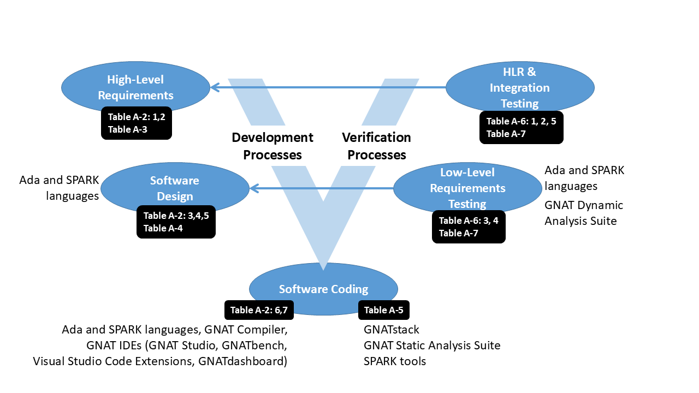

.. include:: ../../courses/global.txt

Introduction
============

This document explains how to use AdaCore's technologies |mdash| the
company's tools, run-time libraries, and associated services |mdash|
in conjunction with the safety-related standards for airborne
software: |do-178c| and and its technology supplements and tool
qualification considerations. It describes how AdaCore's technologies
fit into a project's software life cycle processes, and how they can
satisfy various objectives of the standards.  Many of the advantages
of AdaCore's products stem from the software engineering support found
in the Ada programming language, including features (such as
contract-based programming) introduced in Ada\ |nbsp|\ 2012
:cite:p:`ISO_IEC_2012`.  Other advantages draw directly from the
formally analyzable SPARK subset of Ada :cite:p:`AdaCore_Altran_2020`,
:cite:p:`Dross_2022`, :cite:p:`Chapman_et_al_2024`.  As a result, this
document identifies how Ada and SPARK contribute toward the
development of reliable software. AdaCore personnel have played key
roles in the design and implementation of both of these languages.

.. index:: V software life cycle

Although |do-178c| doesn't prescribe any specific software life cycle,
the development and verification processes that it encompasses can be
represented as a variation of the traditional
:wikipedia:`"V-model"<V-model_(software_development)>`. As shown in
:numref:`Airborn_SW_fig1`, AdaCore's products and the Ada and SPARK
languages contribute principally to the bottom portions of the "V"
|mdash| coding and integration and their verification. The Table
annotations in :numref:`Airborn_SW_fig1` refer to the tables in
|do-178c| and, when applicable, specific objectives in those tables.

.. _Airborn_SW_fig1:

   AdaCore Technologies and |do-178c| Life Cycle Processes

Complementing AdaCore's support for Ada and SPARK, the company offers
tools and technologies for C, C++ and Rust.  Although C lacks the
built-in checks as well as other functionality that Ada provides,
AdaCore's Ada and C toolchains have similar capabilities. And
mixed-language applications can take advantage of Ada's interface
checking that is performed during inter-module communication.

AdaCore's Ada and C compilers can help developers produce reliable
software, targeting embedded platforms with RTOSes as well as "bare
metal" configurations. These are available with long term support,
certifiable run-time libraries, and source-to-object traceability
analyses as required for |do-178c| Level A. Supplementing the
compilers are a comprehensive set of static and dynamic analysis
tools, including a code standard enforcer, a vulnerability and logic
error detector, test and coverage analyzers, and a fuzzing tool.

.. index:: Tool qualification

A number of these tools are qualifiable with respect to the |do-330|
standard (Tool Qualification Considerations).  The use of qualified
tools can save considerable effort during development and/or
verification since the output of the tools does not need to be
manually checked. Qualification material, at the applicable Tool
Qualification Level (TQL), is available for specific AdaCore tools.

Supplementing the core |do-178c| standard are three supplements that
address specific technologies:

.. index:: DO-331/ED-218: Model-Based Development and Verification

* *DO-331/ED-218: Model-Based Development and Verification*

  AdaCore's tools and technologies can be used in conjunction with
  model-based methods but do not relate directly to the issues
  addressed in |do-331|.

.. index:: DO-332/ED-217: Object-Oriented Technology and Related Techniques

* *DO-332/ED-217: Object-Oriented Technology and Related Techniques*

  The Ada and SPARK languages provide specific features that help meet
  the objectives of |do-332|, thus allowing developers to exploit
  Object Orientation (e.g., class hierarchies and inheritance for
  specifying data relationships) in a certified application.

.. index:: DO-333/ED-216: Formal Methods
.. index:: SPARK language

* *DO-333/ED-216: Formal Methods*

  The SPARK language and toolset directly support |do-333|, allowing
  the use of formal proofs to replace some low-level testing.

The technologies and associated options presented in this document are
known to be acceptable, and certification authorities have already
accepted most of them on actual projects. However, acceptance is
project dependent. An activity using a technique or method may be
considered as appropriate to satisfy one or several |do-178c|
objectives for one project (determined by the development standards,
the input complexity, the target computer and system environment) but
not necessarily on another project. The effort and amount of
justification to gain approval may also differ from one auditor to
another, depending of their background. Whenever a new tool, method,
or technique is introduced, it's important to open a discussion with
AdaCore and the designated authority to confirm its acceptability. The
level of detail in the process description provided in the project
plans and standard is a key factor in gaining acceptance.
