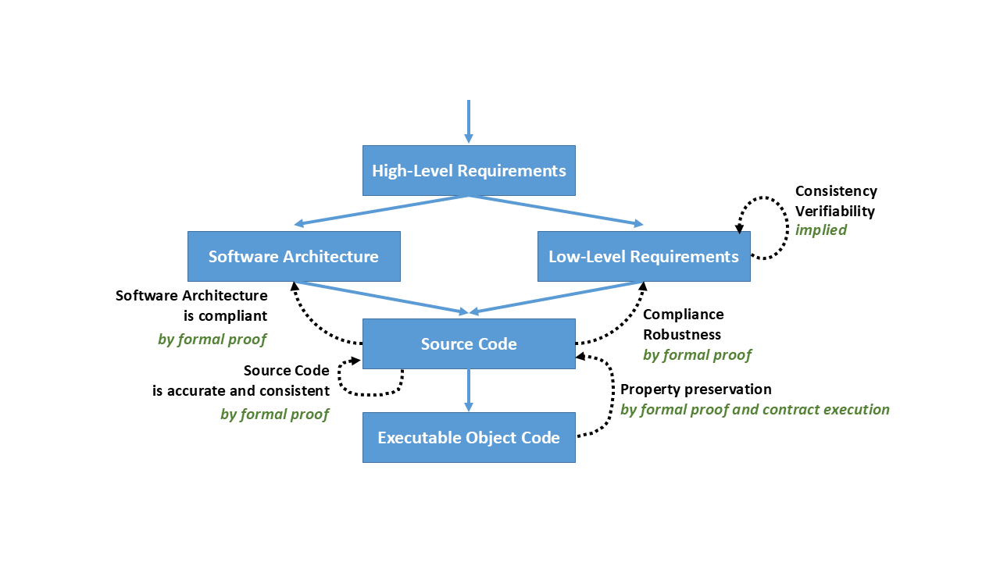

.. include:: ../../courses/global.txt

.. index:: DO-178C/ED-12C

The DO-178C/ED-12C Standards Suite
==================================

Overview
---------

"Every State has complete and exclusive sovereignty over the airspace
above its territory." This general principle was codified in Article 1
of the Convention on International Civil Aviation (the "Chicago
Convention") in 1944 [ICAO_1944]_.  To control the airspace,
harmonized regulations have been formulated to ensure that the
aircraft are airworthy.

A type certificate is issued by a certification authority to signify
the airworthiness of an aircraft manufacturing design. The certificate
reflects a determination made by the regulating body that the aircraft
is manufactured according to an approved design, and that the design
complies with airworthiness requirements. To meet those requirements
the aircraft and each subassembly must also be approved. Typically,
requirements established by a regulating body refer to "Minimum
Operating Performance Standards" (MOPS) and a set of recognized
"Acceptable Means of Compliance" such as |do-178| for software,
|do-160| for environmental conditions and test procedures, and
|do-254| for Complex Electronic Hardware.

*DO-178C/ED-12C - Software Considerations in Airborne Systems and
Equipment Certification* [RTCA_EUROCAE_2011]_ |mdash| was issued in
December 2011, developed jointly by RTCA, Inc., and EUROCAE. It is the
primary document by which certification authorities such as the FAA,
EASA, and Transport Canada approve all commercial software-based
aerospace systems.

The |do-178c| document suite comprises:

* The core document, which is a revision of the previous release
  (|do-178b|).  The changes are mostly clarifications, and also
  address the use of "Parameter Data Items" (e.g., Configuration
  tables)

.. index:: DO-278A/ED-109A: Software Integrity Assurance
           Considerations for CNS/ATM Systems

* |do-278a|, which is similar to |do-178c| and addresses ground-based
  software used in the domain of CNS/ATM (Communication Navigation
  Surveillance/Air Traffic Management)

.. index:: DO-248C/ED-94C: Supporting Information for DO-178C/ED-12C
           and DO-278A/ED-109A

* |do-248c| (Supporting Information for |do-178c| and |do-278a|),
  which explains the rationale behind the guidance provided in the
  core documents

.. index:: DO-331/ED-218: Model-Based Development and Verification
.. index:: DO-332/ED-217: Object-Oriented Technology and Related
           Techniques
.. index:: DO-333/ED-216: Formal Methods

* Three technology-specific supplements

  * |do-331|: Model-Based Development and Verification
  * |do-332|: Object Oriented Technology and Related Techniques
  * |do-333|: Formal Methods

 Each supplement adapts the core document guidance as appropriate for
 its respective technology. These supplements are not standalone
 documents but must be used in conjunction with |do-178c| or
 |do-278a|.

.. index:: DO-330/ED-215: Software Tool Qualification Considerations

* |do-330| (Software Tool Qualification Considerations), providing
  guidance for qualifying software tools. This standard is not
  specific to |do-178c| and may be applied to software certification
  in other application domains.

Details on how to use these standards in practice may be found in
[Rierson_2013]_.

.. index:: Design Assurance Level (DAL), Software level

One of the main principles of the |do-178c| document suite is to be
"objective oriented". The guidance in each document consists of a set
of objectives that relate to the various software life-cycle processes
(planning, development, verification, configuration management,
quality assurance, certification liaison). The objectives that must be
met for a particular software component depend on the software level
(also known as a *Design Assurance Level* or *DAL*) of the
component. The level in turn is based on the potential effect of an
anomaly in that software component on the continued safe operation of
the aircraft. Software levels range from `E` (the lowest) where there
is no effect, to `A` (the highest) where an anomaly can cause the loss
of the aircraft. A software component's level is established as part
of the system life-cycle processes.

To gain software approval for a system, the applicant has to
demonstrate that the objectives relevant to the software level for
each component have been met. To achieve this goal, the development
team specifies the various software life-cycle activities (based on
those recommended by |do-178c| and/or others), and its associated
methods, environment, and organization/management. In case the chosen
methods are addressed by one of the technology supplements, additional
or alternative objectives must also be satisfied. The technology
supplements may replace or add objectives and/or activities.

.. index:: DO-330/ED-215: Software Tool Qualification Considerations

Software Tool Qualification Considerations: DO-330/ED-215
-------------------------------------------------------------

A software tool needs to be qualified when a process is automated,
eliminated, or reduced, but its outputs are not verified.  The
systematic verification of the tool outputs is replaced by activities
performed on the tool itself: the "tool qualification".  The
qualification effort depends on the assurance level of the airborne
software and the possible effect that an error in the tool may have on
this software. The resulting combination, the Tool Qualification
Level, is a 5 level scale, from TQL-5 (the lowest level, applicable to
software tools that cannot insert an error in the resulting software,
but might fail to detect an error) to TQL-1 (the highest, applicable
to software tools that can insert an error in software at level A).

A tool is only qualified in the context of a specific project, for a
specific certification credit, expressed in term of objectives and
activities. Achieving qualification for a tool on a specific project
does of course greatly increase the likelihood of being able to
qualify the tool on another project. However, a different project may
have different processes or requirements, or develop software with
different environment constraints. As a result, the qualifiability of
a tool needs to be systematically assessed on a case-by-case basis.

Although many references are made in the literature about "qualified"
tools, strictly speaking this term should only be used in the context
of a specific project. Tools provided by tool vendors, independently
of any project, should be identified as "qualifiable" only. The tool
qualification document guidance |do-330| includes specific objectives
that can only be satisfied in the context of a given project
environment.

Throughout this document, the applicable tool qualification level is
identified together with the relevant objective or activity for which
credit may be sought. The qualification activities have been performed
with respect to |do-330| at the applicable Tool Qualification
Level. Tool qualification material is available to customers as a
supplement to AdaCore's GNAT Pro Assurance product.

.. index:: DO-331/ED-218: Model-Based Development and Verification

Model-Based Development and Verification Supplement: DO-331/ED-218
--------------------------------------------------------------------

Model-based development covers a wide range of techniques for
representing the software requirements and/or architecture, most often
through a graphical notation.  The source code itself is not
considered as a model. Well known examples include UML for software
architecture, SysSML for system representation, and Simulink\ |copy|
for control algorithms and related requirements. |do-331| presents the
objectives and activities associated with the use of such techniques.

The main added value of the supplement is its guidance on how to use
model simulation and obtain certification credit. AdaCore's tools and
technologies can be used in conjunction with model-based methods but
do not relate directly to the issues addressed in this supplement.

.. index:: DO-332/ED-217: Object-Oriented Technology and Related
           Techniques

Object-Oriented Technology and Related Techniques Supplement: DO-332/ED-217
------------------------------------------------------------------------------

Although |do-332| is often referred as the "object oriented
supplement", the "related techniques" mentioned in the title are
equally relevant and are addressed in detail. They may be used in
conjunction with Object-Oriented Technology (OOT) but are not
necessarily related to OO features. Such "related techniques" include
virtualization, genericity (also known as templates), exceptions,
overloading, and dynamic memory management.

Considering the breadth of features covered by |do-332|, at least some
of its guidance should be followed regardless of whether the actual
application is using object orientation. For example, type conversion
is probably present in most code bases regardless of which language is
being used.

The |do-332| supplement is much more code-centric than the others, and
only two objectives are added: one related to local type consistency
(dynamic dispatching) and another one related to dynamic memory. All
other guidance takes the form of additional activities for existing
|do-178c| objectives.

Of particular relevance is the supplement's *Vulnerability Analysis*
annex. Although not binding, it explains in detail what is behind
these additional activities. The following features in particular may
need to be addressed when Ada is used:

* Inheritance / local type consistency
* Parametric polymorphism (genericity)
* Overloading
* Type conversion
* Exception management
* Dynamic memory
* Component-based development

The Ada language, the precautions taken during the design and coding
processes, and the use of AdaCore tools combine to help address or
mitigate the vulnerabilities associated with these features.

.. index:: DO-333/ED-216: Formal Methods

Formal Methods Supplement: DO-333/ED-216
------------------------------------------

|do-333| provides guidance on the use of formal methods. A formal
method is defined as "a formal model combined with a formal
analysis". A formal model should be precise, unambiguous and have a
mathematically defined syntax and semantics. The formal analysis
should be sound; i.e., if it is supposed to determine whether the
formal model (for example the software source code in a language such
as SPARK) satisfies a given property, then the analysis should never
assert that the property holds when in fact it does not.

A formal method may be used to satisfy |do-178c| verification
objectives; formal analysis may therefore replace some reviews,
analyses and tests. Almost all verification objectives are potential
candidates for formal methods.

In |do-178c|, the purpose of testing is to verify the Executable
Object Code (EOC) based on the requirements. The main innovation of
DO-333 / ED-216 is to allow the use of formal methods to replace some
categories of tests. In fact, with the exception of software /
hardware integration tests showing that the EOC is compatible with the
target computer, the other objectives of EOC verification may be
satisfied by formal analysis. This is a significant added
value. However, employing formal analysis to replace tests is a new
concept in the avionics domain, with somewhat limited experience in
practice thus far (see [Moy_et_al_2013]_ for further information).  As
noted in [Moy_2017]_, a significant issue is how to demonstrate that
the compiler generates code that properly preserves the properties
that have been formally demonstrated for the source code. Running the
integration tests both with and without the contracts being executed,
and showing that the results are the same in both cases, is one way to
gain the necessary confidence that properties have been preserved in
the EOC.

Details from tool providers on the underlying models or mathematical
theories implemented in the tool are necessary to assess the maturity
of the method. Then substantiation and justification need to be
documented, typically in the Plan for Software Aspects of
Certification (PSAC), and provided to certification authorities at an
early stage for review.

.. index:: single: SPARK language; Eliminating / reducing testing

AdaCore provides the SPARK technology as a formal method that can
eliminate or reduce the testing based on low-level requirements.
Using SPARK will also get full or partial credit for other objectives,
such as requirements and code accuracy and consistency, verifiability,
etc. Its usage is consistent with the example provided in Appendix B
of |do-333|, "FM.B.1.5.1 Unit Proof", and a SPARK version of this
example is shown in :ref:`Airborn_SW_SPARK_Development_Cycle_Example`.
Certification credit for using formal proofs is summarized in
:numref:`Airborn_SW_fig2`:

.. _Airborn_SW_fig2:

  SPARK contributions to verification objectives
