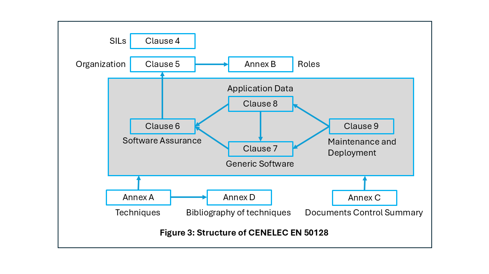

.. include:: ../../../global.txt

CENELEC EN 50128
================

Overview
--------

EN 50128 governs software used in railway control and protection applications,
i.e., systems that ensure the safe and efficient movement of trains.
Examples include:

* *Automatic Train Protection (ATP)*, which ensure automatic braking to avoid
  collisions or overspeed;

* *Interlocking Systems*, which prevent conflicting train movements through
  tracks, signals, and switches;

* *Train Control Management Systems (TCMS)*, which coordinate control of
  subsystems (doors, brakes, traction);

* *Level Crossing Protection*, which manages gates and warnings at road-rail
  intersections; and

* *Centralized Traffic Control (CTC)*, which oversee train routing and
  dispatch across large regions.

The goal of the standard is to provide confidence that that the software
functions reliably and safely relative to its SIL. To this end it
specifies requirements in areas including the following:

* Software development lifecycle processes;
* Verification and validation;
* Tools, techniques, and documentation;
* Risk mitigation measures; and
* Assessment of compliance with the standard.

More specifically, |en-50128| identifies the procedures and prerequisites
(organization, independence and competencies management, quality management,
V&V team, etc.) applicable to the development of programmable electronic
systems used in railway control and protection applications. The standard
therefore may apply to some software applications in the rail sector but not
necessarily to all.

|en-50128| is used in both safety-related and non-safety-related applications
and applies exclusively to software and its interaction with the whole system.
(In light of its role in the certification of non-safety-related software,
the standard introduces the Safety Integrity Level "Basic Integrity", which
pertains to software that is not safety related.)

Although |en-50128| is targeted to the rail industry, it is not intrinsically
domain specific. The standard is basically a specification of sound
software engineering practices for long-lived large-scale high-assurance
systems in general and could in principle be applied in other domains.

One of the distinctive points of |en-50128| is its requirement to justify the
implementation of the resources. For this reason, it is said to be a
"resources standard".

.. index:: single: EN 50128; Structure of the standard

Structure of the standard
-------------------------

:numref:`Railway_SW_fig3` illustrates the structure of |en-50128| (note that chapters in
CENELEC standards are referred to as clauses, and individual sections and
sub-sections within a chapter are sub-clauses).

.. _Railway_SW_fig3:

    Structure of CENELEC EN 50128

Clauses 1, 2, and 3 |mdash| *Scope*, *Normative references*, and
*Terms, definitions and abbreviations*, respectively |mdash|
provide context and basic information.

.. index:: single: EN 50128; Clause 4 (Objectives, conformance and software safety integrity levels)

Clause 4, *Objectives, conformance and software safety integrity levels*,
identifies the five Safety Integrity Levels and states the criterion for
conformance to the standard:

   *To conform to this European standard it shall be shown that each of the
   requirements has been satisfied to the software safety integrity
   level defined and therefore the objective of the sub-clause in question
   has been met.*

This clause also specifies the role of normative Annex A in the selection of
techniques and measures for satisfying the requirements,
and the means for verifying compliance (inspection of the required documents,
augmented when appropriate by other evidence such as auditing and the
witnessing of tests).

Clauses 5 through 9 form the core of the standard, with sub-clauses providing
the following content:

* *Objective*: the purpose of meeting the requirements specified in the
  sub-clause

* *Input documents* (if applicable)

* *Output documents* (if applicable)

* *Requirements*: Details on what the software supplier needs to do or
  provide. In some cases the requirements reference the tables in
  Annex\ |nbsp|\ A for specific techniques or measures to be used.

.. index:: single: EN 50128; Clause 5 (Software management and organization)

Clause 5, *Software management and organization*, covers three topics:

* Organization, roles and responsibilities (sub-clause 5.1);
* Personnel competence (sub-clause 5.2); and
* Lifecycle-related issues (sub-clause 5.3).

The standard does not dictate a specific lifecycle, but it cites the "V"
approach as a recommendation, from the software specification to the overall
software testing and integration, and also imposes some requirements.
For example, the chosen lifecycle model needs to account for potential
iterations between phases, and detailed documentation in the Software
Quality Assurance Plan as specified in sub-clause 6.5 has to be supplied.

.. index:: single: EN 50128; Clause 6 (Software assurance)

Clause 6, *Software assurance*, has the goal of achieving a software package
with a minimum level of error and involves a variety of activities
and technologies:

.. Kludges needed to stay within 80 character per line limit
.. in an indented construct:

.. |sphinx-hack-verification| replace:: "confirmation, through the provision \
   of objective evidence, that specified requirements have been fulfilled"

.. |sphinx-hack-validation| replace:: "confirmation, through the provision \
   of objective evidence, that the requirements for a specific intended use \
   or application have been fulfilled"

* Software testing (sub-clause 6.1);
* Software verification (sub-clause 6.2) |mdash| defined in sub-clause 3.1.48
  as |sphinx-hack-verification|;
* Software validation (sub-clause 6.3) |mdash| defined in sub-clause 3.1.46
  as |sphinx-hack-validation|;
* Software assessment (sub-clause 6.4);
* Software quality assurance (sub-clause 6.5);
* Modification and change control (sub-clause 6.6); and
* Support tools and languages (sub-clause 6.7) |mdash| see
  :ref:`Railway_SW_tool-qualification` below.

As shown in :cite:`Railway_SW_Boulanger_Schön_2007`, for software applications the
assessment process involves demonstrating that the software application
achieves its associated safety objectives.

|en-50128| makes a clear separation between the application software,
referred to as the *generic software* (Clause 7),
and the data or algorithms that are used to configure the generic software
(Clause 8).

.. index:: single: EN 50128; Clause 7 (Generic software development)

Clause 7, *Generic software development*, has the following sub-clauses:

* Lifecycle and documentation for generic software (sub-clause 7.1);
* Software requirements (sub-clause 7.2);
* Architecture and Design (sub-clause 7.3);
* Component design (sub-clause 7.4);
* Component implementation and testing (sub-clause 7.5);
* Integration (sub-clause 7.6); and
* Overall Software Testing / Final Validation (sub-class 7.7).

.. index:: single: EN 50128; Clause 8 (Development of application data or algorithms)

Clause 8, *Development of application data or algorithms: systems configured
by application data or algorithms*, ensures that the configuration parameters
are verified and validated with the same degree of assurance, based on the
relevant SIL, as is needed for the generic software that they configure.

.. index:: single: EN 50128; Clause 9 (Software deployment and maintenance)

An important part of the standard is Clause 9, *Software deployment and
maintenance*.
As stated in sub-clauses 9.1.1 and 9.2.1, the objectives of this clause
are, respectively:

   *To ensure that the software performs as required, preserving the
   required software integrity level when it is deployed in the final
   environment of the application.*

and

   *To ensure that the software performs as required, preserving the
   required software integrity level and dependability when making
   corrections, enhancements or adaptations to the software itself.*

.. index:: single: EN 50128; Annex A (Criteria for the Selection of Techniques and Measures)

Annex A (normative), *Criteria for the Selection of Techniques and Measures*,
contains a set of tables that correlate the artifacts and practices
(documentation, techniques, and measures) specified elsewhere in the
standard, with an indication of whether, and how strongly, they are
recommended based on the software's SIL:

*  **M**: Mandatory. Must be used
*  **HR**: Highly Recommended. If not used, need to explain rationale
   for using alternative technique
*  **R**: Recommended
*  **--**: No recommendation either for or against usage
*  **NR**: Not recommended. If used, need to explain rationale for decision

Annex A consists of two sub-clauses:

*  *Clauses tables (A.1)*; the table headings identify the
   sub-clause(s) containing the relevant requirements:

   - Table A.1 |ndash| Lifecycle Issues and Documentation (5.3)
   - Table A.2 |ndash| Software Requirements Specification (7.2)
   - Table A.3 |ndash| Software Architecture (7.3)
   - Table A.4 |ndash| Software Design and Implementation (7.4)
   - Table A.5 |ndash| Verification and Testing (6.2 and 7.3)
   - Table A.6 |ndash| Integration (7.6)
   - Table A.7 |ndash| Overall Software Testing (6.2 and 7.7)
   - Table A.8 |ndash| Software Analysis Techniques (6.3)
   - Table A.9 |ndash| Software Quality Assurance (6.5)
   - Table A.10 |ndash| Software Maintenance (9.2)
   - Table A.11 |ndash| Data Preparation Techniques (8.4)

*  *Detailed tables (A.2)*; these are lower-level tables
   that expand on certain entries in the Clauses tables:

   - Table A.12 |ndash| Coding Standards
   - Table A.13 |ndash| Dynamic Analysis and Testing
   - Table A.14 |ndash| Functional/Black Box Test
   - Table A.15 |ndash| Textual Programming Languages
   - Table A.16 |ndash| Diagrammatic Languages for Application Algorithms
   - Table A.17 |ndash| Modeling
   - Table A.18 |ndash| Performance Testing
   - Table A.19 |ndash| Static Analysis
   - Table A.20 |ndash| Components
   - Table A.21 |ndash| Test Coverage for Code
   - Table A.22 |ndash| Object Oriented Software Architecture
   - Table A.23 |ndash| Object Oriented Detailed Design

As an example, Table A.4 contains a row for the programming language(s)
selection:

.. csv-table::
   :widths: 30 15 15 10 10 10 10

   **Technique/Measure**, **Ref**, **Basic Integrity**, **SIL 1**, **SIL 2**, **SIL 3**, **SIL 4**
   "...", "...", "...", "...", "...", "...", "..."
   "10  Programming Language", "Table A.15", "R", "HR", "HR","HR","HR"
   "...", "...", "...", "...", "...", "...", "..."

Table A.15 contains a row for Ada:

.. csv-table::
   :widths: 30 15 15 10 10 10 10

   **Technique/Measure**, **Ref**, **Basic Integrity**, **SIL 1**, **SIL 2**, **SIL 3**, **SIL 4**
   "ADA", "D.54", "R", "HR", "HR","HR","HR"
   "...", "...", "...", "...", "...", "...", "..."

Sub-clause D.54 (*Suitable Programming languages*) notes the features that a
suitable language should have (e.g., run-time array bound checking), and
features that it should encourage (e.g., definition of variable sub-ranges).
On the other side, D.54 also lists features that should be avoided because
they complicate verification (e.g., implicit variable initialization).

The entries in Tables A.4 and A.15 show that Ada is a Highly Recommended
language at |sil1| through |sil4| and a Recommended language at the
Basic Integrity level.
Features that should be avoided can be detected and prevented by using
AdaCore's GNATcheck tool in the GNAT Static Analysis Suite;
see :ref:`Railway_SW_GNAT_Static_Analysis_Suite`.

.. index:: single: EN 50128; Annex B (Key software roles and responsibilities)

Annex B (normative), *Key software roles and responsibilities*, consists of
ten tables detailing the responsibilities and key competencies for the various
roles specified in the standard: Requirements Manager, Designer, Implementor,
Tester, Verifier, Integrator, Validator, Assessor, Project Manager, and
Configuration Manager.

.. index:: single: EN 50128; Annex C (Documents Control Summary)

Annex C (informative), *Documents Control Summary*, provides a table that
lists, for each project phase, its output documents and, for each
document, the responsible author and reviewer(s). The lifecycle phases
and their associated document count are:

* *Planning:* 5 documents
* *Software requirements:* 3 documents
* *Architecture and design:* 6 documents
* *Component design:* 3 documents
* *Component implementation and testing:* 3 documents
* *Integration:* 3 documents
* *Overall software testing / Final validation:* 4 documents
* *Systems configured by application data/algorithms:* 8 documents
* *Software deployment:* 5 documents
* *Software maintenance:* 4 documents
* *Software assessment:* 2 documents

.. index:: single: EN 50128; Annex D (Bibliography of techniques)

Annex D (informative), *Bibliography of techniques*, details the aim and
description for seventy-one specific software engineering practices.
These are applicable at various lifecycle phases; for example:

* Coding Standards and Style Guide (sub-clause D.15) and Language Subset
  (sub-clause D.35) at the design and implementation phase,

* Formal Methods and Formal Proof (sub-clauses D.28 and D.29) at the
  implementation and verification phases, and

* Equivalence Classes and Input Partition Testing (sub-clause D.18) at the
  testing phase.

.. index:: single: EN 50128; Annex ZZ

Annex ZZ (Informative), *Relationship between this European standard and the
essential requirements of EU Directive 2016/797/EU [2016 OJ L138] aimed to
be covered* was introduced in |en-50128|/A1. It contains a table
showing the relationship noted in the Annex title.

.. _Railway_SW_tool-qualification:

.. index:: Tool qualification

Tool qualification
------------------

An earlier edition of the standard, |en-50128|:2001, introduced a requirement
that the compilers employed for a project be purpose-certified, but did not
give a clear indication of what precisely was expected.
Clause 6.7 in the 2011 revision formalizes this concept, which will be
referred to here as "tool qualification", and provides details on what
needs to be performed and/or supplied.
(The standard does not use a specific term for this process, but the
"tool qualification" terminology from the airborne software standards
|do-178c| :cite:`Railway_SW_RTCA_EUROCAE_2011a` and |do-330| :cite:`Railway_SW_RTCA_EUROCAE_2011b`
is appropriate.)

.. index:: Tool classes

Tool classes
~~~~~~~~~~~~

Tool qualification is based on the recognition that different tools need
different levels of confidence in their reliability, based on how a
tool error affects the application software. This is formalized in the
concept of a "tool class". As stated in sub-clause 6.7.1:

   *The objective is to provide evidence that potential failures of tools
   do not adversely affect the integrated toolset output in a safety related
   manner that is undetected by technical and/or organisational measures
   outside the tool. To this end, software tools are categorised into three
   classes namely, T1, T2 & T3 respectively.*

.. index:: T1 tool class

* **T1** is reserved for tools that affect neither the verification of the
  software nor the final executable file.

.. index:: T2 tool class

* **T2** applies to tools where a fault could lead to an error in the results
  of the verification or validation. Examples include tools used for verifying
  compliance with a coding standard, generating quantified metrics, performing
  static analysis of the source code, managing and executing tests, etc.

.. index:: T3 tool class

* **T3** applies to tools where a fault could have an impact on (and, for
  example, introduce errors into) the final executable software.
  This class includes compilers, code generators, etc.

Sub-clause 6.7 of |en-50128| defines a set of recommendations for each tool
class; these affect the content of the tool qualification report.
The standard identifies twelve requirements (numbered from 6.7.4.1 to
6.7.4.12) concerning tool qualification.
Requirement 6.7.4.12 is a mapping from each tool class to the applicable
sub-clauses in the standard.
It is shown here in the table below, which augments the version in the
standard by also specifying the lifecycle phase that is relevant for each
sub-clause.
The steps shown indicate the requirements to be met and reflect the additional
effort needed as the tool level increases; for further information, please see
:cite:`Railway_SW_Boulanger_2015`, Chapter 9.

.. .. figure:: ../images/table1.png

+----------------+-------------------------------------+------------------------------+
| Tool class     | Applicable sub-clause(s)            | Lifecycle phase              |
+================+=====================================+==============================+
| T1             | 6.7.4.1                             | Tool identification          |
+----------------+-------------------------------------+------------------------------+
| T2             | 6.7.4.1                             | Tool identification          |
|                +-------------------------------------+------------------------------+
|                | 6.7.4.2                             | Tool justification           |
|                +-------------------------------------+------------------------------+
|                | 6.7.4.3                             | Tool specification/manual    |
|                +-------------------------------------+------------------------------+
|                | 6.7.4.10, 6.7.4.11                  | Tool version management      |
+----------------+-------------------------------------+------------------------------+
| T3             | 6.7.4.1                             | Tool identification          |
|                +-------------------------------------+------------------------------+
|                | 6.7.4.2                             | Tool justification           |
|                +-------------------------------------+------------------------------+
|                | 6.7.4.3                             | Tool specification/manual    |
|                +-------------------------------------+------------------------------+
|                | (6.7.4.4 and 6.7.4.5) or 6.7.4.6    | Tool conformity evidence     |
|                +-------------------------------------+------------------------------+
|                | (6.7.4.7 or 6.7.4.8) and 6.7.4.9    | Tool requirement fulfillment |
|                +-------------------------------------+------------------------------+
|                | 6.7.4.10,  6.7.4.11                 | Tool version management      |
+----------------+-------------------------------------+------------------------------+

.. index:: single: Tool qualification; AdaCore support

AdaCore tool qualification support
~~~~~~~~~~~~~~~~~~~~~~~~~~~~~~~~~~

As will be explained below, AdaCore supports |en-50128| compliance through
tools qualified for several purposes:

* Static and dynamic analysis;
* Code verification including formal proof; and
* Compilation with traceability and reproducibility guarantees.

These capabilities reduce certification risk while improving code quality and
lifecycle confidence.

AdaCore's qualification packages contain the information required by
|en-50128|, such as documentation, history, infrastructure, user references,
recommended usage, validation strategy, configuration management and change
tracking.

Furthermore, tools can be provided through a subscription service
known as "sustained branches" (see :ref:`Railway_SW_Sustained_Branches`).
In this mode, a specific version of the tools can be put into special
maintenance, where AdaCore can investigate known problems
and provide repairs or work-arounds for potential issues on these branches
without unrelated updates that may risk regressions.

AdaCore's decades-long experience in software certification for embedded and
safety-critical domains, including rail and avionics, ensures that customers
have access to:

* Qualification material for |en-50128| and/or |do-330| tool assessment;
* A formally verifiable language (SPARK) for high-integrity use cases; and
* Lifecycle support aligned with the needs of long-term platform deployments

.. only:: builder_html

    .. rubric:: Bibliography

.. footbibliography::
