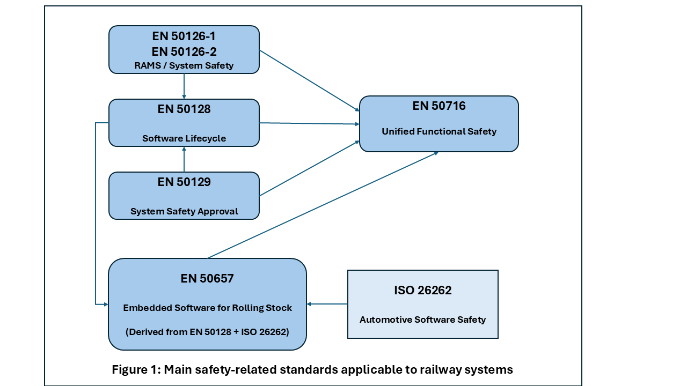
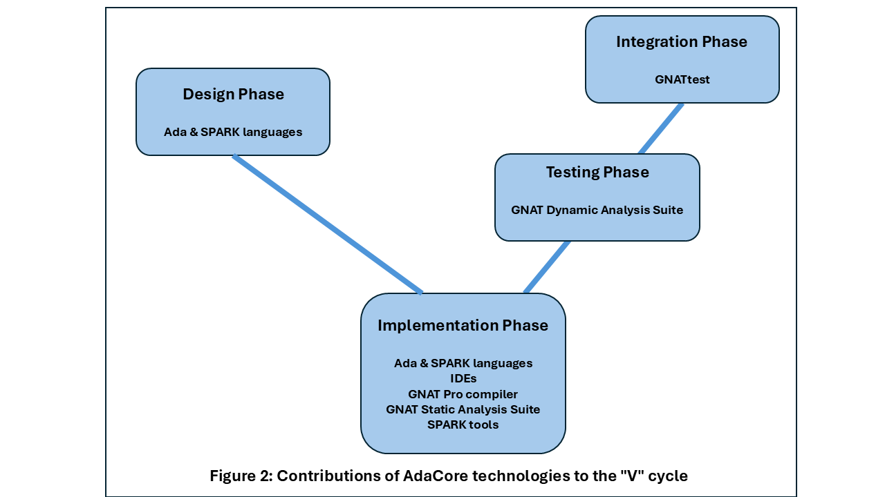

.. include:: ../../../global.txt

Introduction
============

CENELEC safety-related railway standards
----------------------------------------

.. index:: CENELEC

Railway projects are subject to a legal framework (laws, decrees, etc.)
and also a normative process based on certification standards.
In Europe, these standards are issued and maintained by CENELEC
(European Committee for Electrotechnical Standardization).
This document explains the usage of AdaCore's technologies in conjunction
with |en-50128|:2011 :cite:`Railway_SW_CENELEC_2011` |mdash|
*Railway applications - Communication, signalling and processing systems
- Software for railway control and protection systems* |mdash|
as modified by amendments
|en-50128|/A1 :cite:`Railway_SW_CENELEC_2020a` and |en-50128|/A2 :cite:`Railway_SW_CENELEC_2020b`.
(For ease of exposition, the 2011 edition of the standard, as modified
by the A1 and A2 amendments, will simply be referred to as |en-50128|.)

|EN-50128| is concerned with the safety-related aspects of a railway
system, down to the hardware and/or software elements used.
This document will cover where AdaCore's technologies fit best and how they
can best be applied to meet various requirements in this standard.

|en-50128| is based on fundamentals described in other CENELEC railway
standards:

.. index:: EN 50126

* |en-50126|-1 :cite:`Railway_SW_CENELEC_2017b`  |mdash|
  *Railway applications - The specification and demonstration of reliability,
  availability, maintainability and safety (RAMS) - Part 1: Generic RAMS
  process* (subsequently modified by |en-50126|-1/A1 :cite:`Railway_SW_CENELEC_2024`)

* |en-50126|-2 :cite:`Railway_SW_CENELEC_2017c`  |mdash|
  *Railway applications - The specification and demonstration of reliability,
  availability, maintainability and safety (RAMS): Part 2: systems approach
  to safety*

.. index:: EN 50129

* |en-50129| :cite:`Railway_SW_CENELEC_2018` |mdash|
  *Railway applications - Communication, signalling and processing systems -
  Safety related electronic systems for signalling*

As noted in |en-50128|, page 7:

   *EN 50126-1 addresses system issues on the widest scale, while EN 50129
   addresses the approval process for individual systems which can exist
   within the overall railway control and protection system.
   ... [EN 50128] concentrates on the methods which need to be used
   in order to provide software which meets the demands of safety integrity
   which are placed upon it by these wider considerations.*

In addition to EN 50126 and |en-50129|, several other CENELEC standards
relate to software's role in the safety of a railway system:

.. index:: EN 50657

* |en-50657|:2017 :cite:`Railway_SW_CENELEC_2017a` as modified by amendment
  |en-50657|/A1 :cite:`Railway_SW_CENELEC_2023a` |mdash|
  *Railways applications - Rolling stock applications - Software on Board
  Rolling Stock*

  This standard extends the principles of |en-50128| into the rolling stock
  domain, focusing on onboard systems such as braking, door control, and
  driver interfaces.

  It retains RAMS goals but tailors them for embedded systems in motion,
  where environmental and operational variables are more dynamic.

.. index:: EN 50716

* |en-50716|:2023 :cite:`Railway_SW_CENELEC_2023b` |mdash|
  *Railway Applications - Requirements for software development*

  This standard is a successor to |en-50128| and |en-50657|,
  providing better alignment with |en-50126-1| and |en-50126-2|.
  As of 2025 it is at the early adoption stage but is intended to
  supersede both |en-50128| and |en-50657|.

:numref:`Railway_SW_fig1` depicts the relationships among the various standards.

.. _Railway_SW_fig1:

  Relationships among the various standards

.. index:: Safety Integrity Level (SIL)

Safety Integrity Levels
-----------------------

.. index:: Safety Integrity Level (SIL)

A key concept in |en-50128| is the *Safety Integrity Level*
(SIL) of a software component, which reflects the risk of a hazard occurring
if the software fails. If there is no impact on safety, the level is referred
to as "Basic Integrity" (earlier known as |sil0|).
Otherwise the level has a value between 1 and 4, where 4 is the
most critical; i.e., with the highest risk of a hazard in case of software
failure.

|en-50128| defines the techniques/measures that need to be used
at various software life cycle stages, based on the applicable SIL.

AdaCore technologies for railway software
-----------------------------------------

.. index:: V software life cycle

AdaCore's technologies revolve around programming activities, as well as the
closely related design and verification activities. This is the bottom of the
"V" cycle as defined in |en-50128|, sub-clause 5.3, Figure 4
(see :numref:`Railway_SW_fig2` below).
The company's tools exploit the features of the Ada language (highly
recommended by table A.15) and its formally verifiable SPARK subset.
In particular, the 2012 version of the Ada standard includes some significant
capabilities in terms of specification and verification.

AdaCore's technologies bring two main benefits to the software life cycle
processes defined by the CENELEC railway standards.

* *Expressing software interface specifications and software component
  specifications directly in the source code.*

  Interfaces can be precisely expressed through standard syntax for features
  such as strong typing, parameter constraints, and subprogram contracts.
  These help to clarify interface documentation, to enforce program
  constraints and invariants, and to provide an extensive foundation for
  software component and integration verification.

* *Reducing the verification costs.*

  Bringing additional specification at the language level allows verification
  activities to run earlier in the software life cycle, during the software
  component implementation itself. Tools provided by AdaCore support this
  effort and are designed to be equally usable by both the development team
  and the verification team. Allowing developers to use verification tools
  greatly reduces the number of defects found at the verification stage and
  thus reduces costs related to change requests identified in the ascending
  stages of the cycle.

AdaCore's technologies can be used at all Safety Integrity Levels, from
Basic Integrity to |sil4|. At lower levels, the full Ada language is suitable,
independent of platform. At higher levels, specific subsets will be needed,
for example the :index:`Ravenscar Profile` (:cite:`Railway_SW_Burns_et_al_2004`,
:cite:`Railway_SW_McCormick_Chapin_2015`) for concurrency support with analyzable
semantics and a reduced footprint, or the :index:`Light Profile`
:cite:`Railway_SW_AdaCore_Web_UG_Cross` for a subset with no run-time library
requirements. At the highest level (|sil4|) the SPARK language
(:cite:`Railway_SW_McCormick_Chapin_2015`, :cite:`Railway_SW_AdaCore_Altran_2020`) and its
verification toolsuite enable mathematical proof of properties including
correct information flow, absence of run-time exceptions, and, for the most
critical code, correctness of the implementation against a formally
defined specification.

The following technologies will be presented:

.. index:: Ada language

* *Ada*, a compilable programming language supporting imperative,
  object-oriented, and functional programming styles and offering strong
  specification and verification features. Unless otherwise indicated,
  "Ada" denotes the 2012 version of the Ada language standard.

.. index:: SPARK technology

* *SPARK*, an Ada language subset and toolset supporting formal verification
  of program properties such as Absence of Run-Time Errors

.. index:: GNAT Pro Assurance

* *GNAT Pro Assurance*, a specialized edition of AdaCore's GNAT Pro
  language development environments that is oriented towards projects with
  long maintenance cycles or certification requirements

.. index:: GNAT Static Analysis Suite (GNAT SAS)
.. index:: single: GNAT Static Analysis Suite (GNAT SAS); Defects and vulnerability analysis
.. index:: GNATmetric
.. index:: single: GNAT Static Analysis Suite (GNAT SAS); GNATmetric
.. index:: GNATcheck
.. index:: single: GNAT Static Analysis Suite (GNAT SAS); GNATcheck

* The *GNAT Static Analysis Suite* ("GNAT SAS"), comprising several tools:

  - A "bug finder" engine that identifies potential defects and
    vulnerabilities in Ada code
  - GNATmetric |mdash| a metric computation tool
  - GNATcheck |mdash| a coding standard checker

.. index:: GNAT Dynamic Analysis Suite (GNAT DAS)
.. index:: GNATtest
.. index:: single: GNAT Dynamic Analysis Suite (GNAT DAS); GNATtest
.. index:: GNATcoverage
.. index:: single: GNAT Dynamic Analysis Suite (GNAT DAS); GNATemulator
.. index:: GNATemulator
.. index:: single: GNAT Dynamic Analysis Suite (GNAT DAS); GNATcoverage
.. index:: GNATfuzz
.. index:: single: GNAT Dynamic Analysis Suite (GNAT DAS); GNATfuzz
.. index:: TGen
.. index:: single: GNAT Dynamic Analysis Suite (GNAT DAS); TGen

* The *GNAT Dynamic Analysis Suite* ("GNAT DAS"), comprising several tools:

  - GNATtest |mdash| a unit testing framework generator
  - GNATemulator |mdash| a processor emulator
  - GNATcoverage |mdash| a structural code coverage analyzer
  - GNATfuzz |mdash| a fuzzing tool that helps uncover potential faults
  - TGen |mdash| an experimental run-time library for automating test case
    generation

.. index:: GNAT Pro for Rust

* *GNAT Pro for Rust*, a professionally supported complete development
  environment for the Rust programming language

.. index:: Integrated Development Environments (IDEs)
.. index:: GNAT Studio IDE
.. index:: single: Integrated Development Environments (IDEs); GNAT Studio
.. index:: VS Code support
.. index:: single: Integrated Development Environments (IDEs); VS Code support
.. index:: GNATbench IDE
.. index:: Eclipse IDE
.. index:: single: Integrated Development Environments (IDEs); GNATbench
.. index:: GNATdashboard IDE
.. index:: single: Integrated Development Environments (IDEs); GNATdashboard

* Several *Integrated Development Environments* (IDEs):

  - GNAT Studio |mdash| a robust, flexible, and extensible IDE
  - VS Code support |mdash| extensions for Ada and SPARK
  - GNATbench |mdash| an Ada-knowlegeable Eclipse plug-in
  - GNATdashboard |mdash| a metric integration and management platform

.. _Railway_SW_fig2:

  Contributions of AdaCore technology to the "V" Cycle
