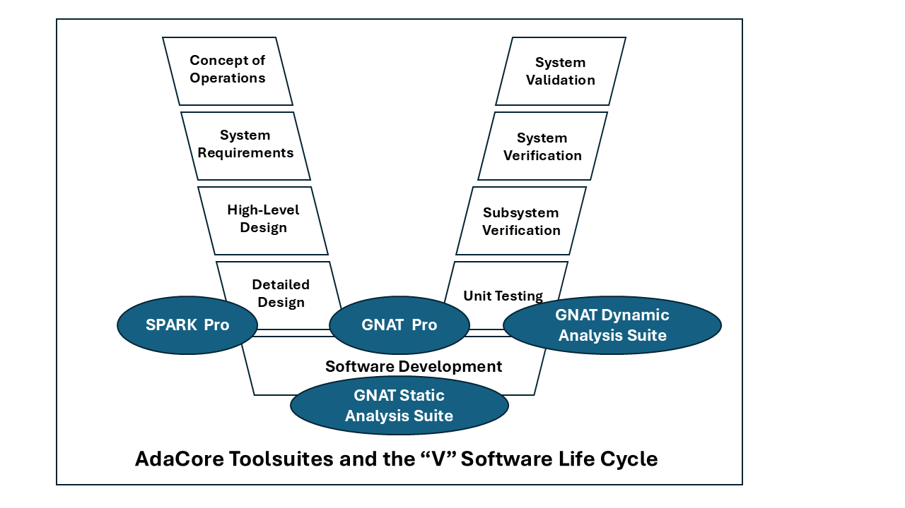

.. include:: ../../../global.txt

.. _Space_Systems_SW_Tools_for_Space_Software_Development:

Tools for Space Software Development
====================================

This chapter explains how suppliers of space software can benefit from
AdaCore's products. The advantages stem in general from reduced life cycle
costs for developing and verifying high-assurance software. More
specifically, in connection with space software qualification, several
tools can help to show that an application complies with the requirements
in |E-ST-40C| and |Q-ST-80C|.

.. index:: Software life cycle, "V" diagram (software life cycle)

AdaCore Tools and the Software Life Cycle
-----------------------------------------

The software life cycle is often depicted as a "V" diagram, and the figure below
shows how AdaCore's major products fit into the various stages. Although the
stages are rarely performed as a single sequential process |mdash| the phases
typically involve feedback / iteration, and requirements often evolve as a
project unfolds |mdash| the "V" chart is useful in characterizing the various
kinds of activities that occur.

As can be seen in the figure, AdaCore's toolsuites apply towards the bottom
of the "V". In summary:

.. index:: single: SPARK Pro; Software life cycle
.. index:: single: Software life cycle; SPARK Pro

* The SPARK Pro static analysis toolsuite (see
  :ref:`Space_Systems_SW_Static_Verification_SPARK_Pro`) applies
  during Detailed Design and Software Development. It includes a proof
  tool that verifies properties ranging from correct information flows
  to functional correctness.

.. index:: single: GNAT Pro for Ada; Software life cycle
.. index:: single: Software life cycle; GNAT Pro

* The GNAT Pro development environment (see
  :ref:`Space_Systems_SW_GNAT_Pro_Development_Environment`) applies
  during Detailed Design, Software Development, and Unit Testing. It
  consists of gcc-based program build tools, an integrated and
  tailorable graphical user interface, accompanying tools, and a
  variety of supplemental libraries (including some for which
  qualification material is available for |E-ST-40C| and |Q-ST-80C|.)

.. index:: single: GNAT Static Analysis Suite (GNAT SAS); Software life cycle
.. index:: single: Software life cycle; GNAT Static Analysis Suite (GNAT SAS)

* The GNAT Static Analysis Suite (see
  :ref:`Space_Systems_SW_Static_Verification_GNAT_Static_Analysis_Suite_GNAT_SAS`)
  applies during Software Development. It contains a variety of tools
  for Ada, including a vulnerability detector that can be used
  retrospectively to detect issues in existing codebases and/or during
  new projects to prevent errors from being introduced.

.. index:: single: GNAT Dynamic Analysis Suite (GNAT DAS); Software life cycle
.. index:: single: Software life cycle; GNAT Dynamic Analysis Suite (GNAT DAS)

* The GNAT Dynamic Analysis Suite (see
  :ref:`Space_Systems_SW_GNAT_Dynamic_Analysis_Suite_GNAT_DAS`)
  applies during Software Development and Unit Testing. One of these
  tools, GNATcoverage, supports code coverage and reporting at various
  levels of granularity for both Ada and C. It can be used during unit
  and integration testing.

The following sections describe the tools in more detail and show how they can
assist in developing and verifying space system software.

.. index:: single: SPARK Pro; Static verification

.. _Space_Systems_SW_Static_Verification_SPARK_Pro:

Static Verification: SPARK Pro
------------------------------

SPARK Pro is an advanced static analysis toolsuite for the SPARK subset of
Ada, bringing mathematics-based confidence to the verification of critical
code. Built around the GNATprove formal analysis and proof tool, SPARK Pro
combines speed, flexibility, depth and soundness, while minimizing the
generation of "false alarms". It can be used for new high-assurance code
(including enhancements to or hardening of existing codebases at lower
assurance levels, written in full Ada or other languages such as C) or
projects where the existing high-assurance coding standard is sufficiently
close to SPARK to ease transition.

Powerful Static Verification
~~~~~~~~~~~~~~~~~~~~~~~~~~~~

The SPARK language supports a wide range of static verification techniques.
At one end of the spectrum is basic data- and control-flow analysis; i.e.,
exhaustive detection of errors such as attempted reads of uninitialized
variables, and ineffective assignments (where a variable is assigned a
value that is never read). For more critical applications, dependency
contracts can constrain the information flow allowed in an application.
Violations of these contracts |mdash| potentially representing violations
of safety or security policies |mdash| can then be detected even before
the code is compiled.

In addition, SPARK supports mathematical proof and can thus provide high
confidence that the software meets a range of assurance requirements:
from the absence of run-time exceptions, to the enforcement of safety or
security properties, to compliance with a formal specification of the
program's required behavior.

As described earlier (see
:ref:`Space_Systems_SW_Levels_of_Adoption_of_Formal_Methods`), the
SPARK technology can be introduced incrementally into a project, based
on the assurance requirements. Each level, from Bronze to Platinum,
comes with associated benefits and costs.

.. index:: single: SPARK Pro; Minimal run-time footprint

Minimal Run-Time Footprint
~~~~~~~~~~~~~~~~~~~~~~~~~~

Developers of systems with security requirements are generally advised to
"minimize the trusted computing base", making it as small as possible so that
high-assurance verification is feasible. However, adhering to this principle
may be difficult if a Commercial Off-the-Shelf (COTS) library or operating
system is used: how are these to be evaluated or verified without the close
(and probably expensive) cooperation of the COTS vendor?

For the most critical embedded systems, SPARK supports the so-called
"Bare-Metal" development style, where SPARK code is running directly on a
target processor with little or no COTS libraries or operating system at all.
SPARK is also designed to be compatible with GNAT Pro's Light run-time
library. In a Bare-Metal / light run-time development, every byte of object
code can be traced to the application’s source code and accounted for.
This can be particularly useful for systems that must undergo evaluation by
a national technical authority or regulator.

SPARK code can also run with a specialized run-time library on top of a
real-time operating system (RTOS), or with a full Ada run-time library and
a commercial desktop operating system. The choice is left to the system
designer, not imposed by the language.

.. index:: single: SPARK Pro; CWE compatibility
.. index:: single: Common Weakness Enumeration (CWE) compatibility; SPARK Pro
.. index:: MITRE Corporation

CWE Compatibility
~~~~~~~~~~~~~~~~~

SPARK Pro detects a number of dangerous software errors in The MITRE
Corporation's Common Weakness Enumeration (CWE), and the tool has been
certified by the MITRE Corporation as a "CWE-Compatible" product
:footcite:p:`Space_SW_MITRE_Web`.

The table below lists the CWE weaknesses detected by SPARK Pro:

.. csv-table:: SPARK Pro and the CWE
   :file: table-spark-cwe.csv
   :widths: 20, 70
   :header-rows: 1

.. index:: single: SPARK Pro; ECSS standards support

SPARK Pro and the ECSS Standards
~~~~~~~~~~~~~~~~~~~~~~~~~~~~~~~~

SPARK Pro can help a space software supplier in various ways. At a general
level, the technology supports the development of analyzable and portable
code:

* The tool enforces a number of Ada restrictions that are appropriate for
  high-assurance software. For example, the use of tasking constructs outside
  the Ravenscar subset will be flagged.

* The full Ada language has several implementation dependencies that can
  result in the same source program yielding different results when compiled
  by different compilers. For example, the evaluation order in expressions is
  not specified, and different orderings may produce different values if one
  of the terms has a side effect. (A detailed discussion of this issue and its
  mitigation may be found in :footcite:p:`Space_SW_Brosgol_2021`.)
  Such implementation dependencies are either prohibited in SPARK and thus
  detected by SPARK Pro, or else they do not affect the computed result.
  In either case the use of SPARK Pro eases the effort in porting the code
  from one environment to another.

More specifically, using the SPARK Pro technology can help the
supplier meet |E-ST-40C| and |Q-ST-80C| requirements in a number of
areas. These comprise the ones mentioned earlier (see
:ref:`Space_Systems_SW_SPARK_and_the_ECSS_Standards`) that relate to
the SPARK language, together with the following:

* |E-ST-40C|

   * §5.4 Software requirements and architecture engineering process

      * §5.4.3 Software architecture design

   * §5.5 Software design and implementation engineering process

     * §5.5.2 Design of software items

   * §5.6 Software validation process

      * §5.6.3 Validation activities with respect to the technical
        specification
      * §5.6.4 Validation activities with respect to the requirements
        baseline

   * §5.8 Software verification process

      * §5.8.3 Verification activities

   * §5.10 Software maintenance process

      * §5.10.4 Modification implementation

   * §5.11 Software security process

      * §5.11.2 Process implementation

      * §5.11.3 Software security analysis

      * §5.11.5 Security activities in the software life cycle

  * Annex U - Software code verification

* ECSS-Q-ST-80C

   * §5.6 Tools and supporting environment

      * §5.6.1 Methods and tools

      * §5.6.2 Development environment selection

   * §6.2 Requirements applicable to all software engineering processes

      * §6.2.3 Handling of critical software

      * §6.2.9 Software security

      * §6.2.10 Handling of security sensitive software

   * §6.3 Requirements applicable to individual software engineering processes or activities

     * §6.3.4 Coding

   * §7.1 Product quality objectives and metrication

      * §7.1.3 Assurance activities for product quality requirements

   * §7.2 Product quality requirements

      * §7.2.3 Test and validation documentation

Details are provided in chapters
:ref:`Space_Systems_SW_Compliance_with_ECSS-E-ST-40C` and
:ref:`Space_Systems_SW_Compliance_with_ECSS-Q-ST-80C`.

.. _Space_Systems_SW_GNAT_Pro_Development_Environment:

GNAT Pro Development Environment
--------------------------------

.. index:: GNAT Pro for C, GNAT Pro for C++, GNAT Pro for Rust

This section summarizes the main features of the two editions of AdaCore's
|gnatpro| language toolsuite, *Enterprise* and *Assurance*.
These editions correspond to different levels of customer requirements and
are available for Ada, C, C++, and Rust.

.. index:: single: GNAT Pro for Ada; Summary

Based on the GNU GCC technology, |gnatpro| for Ada supports the |ada-83|,
|ada-95|, |ada-2005|, and |ada-2012| standards, as well as selected features
of |ada-2022|. It includes:

* several Integrated Development Environments
  (See :ref:`Space_Systems_SW_Integrated_Development_Environments_IDEs`);
* a comprehensive toolsuite including a stack analysis tool
  (see :ref:`Space_Systems_SW_GNATstack`) and a visual debugger;
* a library that enables customers to develop their own
  source analysis tools for project-specific needs
  (see :ref:`Space_Systems_SW_Libadalang`); and
* other useful libraries and bindings.

For details on the tools and libraries supplied with |gnatpro| for
Ada, see :footcite:p:`Space_SW_AdaCore_Web_UG_Native` and
:footcite:p:`Space_SW_AdaCore_Web_UG_Cross`.

Other |gnatpro| products handle multiple versions of C (from C89
through C18), C++ (from C++98 through C++17), and Rust.

.. index:: GNAT Pro Enterprise

.. _Space_Systems_SW_GNAT_Pro_Enterprise:

GNAT Pro Enterprise
~~~~~~~~~~~~~~~~~~~

*GNAT Pro Enterprise* is a development environment for producing critical
software systems where reliability, efficiency, and maintainability are
essential.
Several features of |gnatpro| for Ada are noteworthy:

.. rubric:: Run-Time Library Options

The product allows a variety of choices for the run-time
library, based on the target platform. In addition to the Standard run-time,
which is available for platforms that can support the full language
capabilities, the product on some bare-metal or RTOS targets also includes
restricted libraries that reduce the footprint and/or help simplify safety
certification:

.. index:: single: GNAT Pro Enterprise; Light run-time library
.. index:: Light run-time library

* The *Light Run-Time* library offers a minimal application footprint while
  retaining compatibility with the SPARK subset and verification tools.
  It supports a non-tasking Ada subset suitable for certification /
  qualification and/or storage-constrained embedded applications.
  It supersedes the ZFP (Zero FootPrint) and Cert run-time libraries from
  previous |gnatpro| releases.

.. index:: single: GNAT Pro Enterprise; Light-tasking run-time library
.. index:: Light-tasking run-time library
.. index:: Ravenscar profile
.. index:: Jorvik profile

* The *Light-Tasking Run-Time* library augments the Light run-time library
  with support for the Ravenscar and Jorvik tasking profiles. It supersedes the
  Ravenscar-Cert and Ravenscar-SFP libraries from previous |gnatpro| releases.

.. index:: single: GNAT Pro Enterprise; Embedded run-time library
.. index:: Embedded run-time library

* The *Embedded Run-Time* library provides a subset of the Standard
  Ada run-time library suitable for target platforms lacking file I/O and
  networking support. It supersedes the Ravenscar-Full library from previous
  |gnatpro| releases.

Although limited in terms of dynamic Ada semantics, these predefined libraries
fully support static Ada constructs such as private types, generic templates,
and child units. Some dynamic semantics are also supported. For example,
tagged types (at library level) and other Object-Oriented Programming features
are supported, as is dynamic dispatching.
The general use of dynamic dispatching at the application level can be
prevented through pragma :ada:`Restrictions`.

Details on these libraries may be found in the "Predefined GNAT Pro
Run-Times" chapter of :footcite:p:`Space_SW_AdaCore_Web_UG_Cross`.

.. index:: single: Run-time libraries; Qualification at criticality category B
.. index:: single: Run-time libraries; Configurability

Adapted versions of the earlier ZFP and Ravenscar-Cert libraries have been
qualified under |E-ST-40C| and |Q-ST-80C| at criticality category B.

.. rubric:: Run-Time Library Configurability

A traditional problem with predefined profiles is their inflexibility:
if a feature outside a given profile is needed, then it is the developer's
responsibility to address the certification issues deriving from its use.
|gnatpro| for Ada accommodates this need by allowing the developer to define
a profile for the specific set of features that are used. Typically this will
be for features with run-time libraries that require associated certification
materials. Thus the program will have a tailored run-time library supporting
only those features that have been specified.

More generally, the configurable run-time capability allows specifying support
for Ada's dynamic features in an à la carte fashion ranging from none
at all to full Ada.
The units included in the executable may be either a subset of
the standard libraries provided with |gnatpro|, or specially tailored to the
application. This latter capability is useful, for example, if one of the
predefined profiles implements almost all the dynamic functionality needed
in an existing system that has to meet new safety-critical requirements,
and where the costs of adapting the application without the additional
run-time support are considered prohibitive.

.. index:: single: GNAT Pro for Ada; Enhanced data validity checking

.. rubric:: Enhanced Data Validity Checking

Improper or missing data validity checking is a notorious source of security
vulnerabilities in software systems. Ada has always offered range checks for
scalar subtypes, but |gnatpro| goes further, offering enhanced validity
checking that can protect a program against malicious or accidental memory
corruption, failed I/O devices, and so on. This feature is particularly useful
in combination with automatic Fuzz testing, since it offers strong defense
for invalid data at the software boundary of a system.

.. index:: GNAT Pro Assurance

GNAT Pro Assurance
~~~~~~~~~~~~~~~~~~

*GNAT Pro Assurance* extends GNAT Pro Enterprise with specialized support,
including bug fixes and "known problems" analyses, on a specific version of
the toolchain. This product edition is especially suitable for applications
with long-lived maintenance cycles or assurance requirements, since critical
updates to the compiler or other product components may become necessary
years after the initial release.

.. index:: single: GNAT Pro Assurance; Sustained branches
.. index:: Sustained branches

.. _Space_Systems_SW_Sustained_Branches:

Sustained Branches
^^^^^^^^^^^^^^^^^^

Unique to GNAT Pro Assurance is a service known as a "sustained branch":
customized support and maintenance for a specific version of the product.
A project on a sustained branch can monitor relevant known problems,
analyze their impact and, if needed, update to a newer version of the
product on the same development branch (i.e., not incorporating changes
introduced in later versions of the product).

Sustained branches are a practical solution to the problem of ensuring
toolchain stability while allowing flexibility in case an upgrade is
needed to correct a critical problem.

.. index:: single: GNAT Pro Assurance; Source to object traceability

Source to Object Traceability
^^^^^^^^^^^^^^^^^^^^^^^^^^^^^

Source-to-object traceability is required in standards such as |do-178c|,
and a |gnatpro| compiler option can limit the use of language constructs
that generate object code that is not directly traceable to the source
code. As an add-on service, AdaCore can perform an analysis that
demonstrates this traceability and justifies any remaining cases of
non-traceable code.

Compliance with the ECSS Standards
^^^^^^^^^^^^^^^^^^^^^^^^^^^^^^^^^^

Supplementing the support provided by GNAT Pro for Ada (see
:ref:`Space_Systems_SW_GNAT_Pro_and_the_ECSS_Standards`), GNAT Pro
Assurance helps compliance with the following requirements from
|E-ST-40C| and |Q-ST-80C|:

* |E-ST-40C|

  * §5.9 Software operation process

    * §5.9.2 Process implementation
    * §5.9.4 Software operation support
    * §5.9.5 User support

* |Q-ST-80C|

  * §6.2 Requirements applicable to all software engineering processes

    * §6.2.6 Verification

  * §6.3 Requirements applicable to individual software engineering processes or activities

    * §6.3.9 Maintenance

.. index:: single: GNAT Pro for Ada; Libadalang
.. index:: Libadalang

.. _Space_Systems_SW_Libadalang:

Libadalang
~~~~~~~~~~

Libadalang is a library included with GNAT Pro that gives applications access
to the complete syntactic and semantic structure of an Ada compilation unit.
This library is typically used by tools that need to perform some sort of
static analysis on an Ada program.

AdaCore can assist customers in developing libadalang-based tools to meet
their specific needs, as well as develop such tools upon request.

Typical libadalang applications include:

* Static analysis (property verification)
* Code instrumentation
* Design and document generation tools
* Metric testing or timing tools
* Dependency tree analysis tools
* Type dictionary generators
* Coding standard enforcement tools
* Language translators (e.g., to CORBA IDL)
* Quality assessment tools
* Source browsers and formatters
* Syntax directed editors

.. index:: GNATstack
.. index:: single: GNAT Pro for Ada; GNATstack

.. _Space_Systems_SW_GNATstack:

GNATstack
~~~~~~~~~

GNATstack is a static analysis tool included with |gnatpro| that enables an
Ada/C software developer to accurately predict the maximum size of the memory
stack required for program execution.

GNATstack statically predicts the maximum stack space required by each task
in an application. The computed bounds can be used to ensure that sufficient
space is reserved, thus guaranteeing safe execution with respect to stack
usage. The tool uses a conservative analysis to deal with complexities such
as subprogram recursion, while avoiding unnecessarily pessimistic estimates.

This static stack analysis tool exploits data generated by the compiler to
compute worst-case stack requirements. It performs per-subprogram stack usage
computation combined with control flow analysis.

GNATstack can analyze object-oriented applications, automatically determining
maximum stack usage on code that uses dynamic dispatching in Ada.
A dispatching call challenges static analysis because the identity of the
subprogram being invoked is not known until run time. GNATstack solves this
problem by statically determining the subset of potential targets (primitive
operations) for every dispatching call. This significantly reduces the
analysis effort and yields precise stack usage bounds on complex Ada code.

GNATstack's analysis is based on information known at compile time. When the
tool indicates that the result is accurate, the computed bound can never be
exceeded.

On the other hand, there may be cases in which the results will not be
accurate (the tool will report such situations) because of some missing
information (such as the maximum depth of subprogram recursion, indirect
calls, etc.). The user can assist the tool by specifying missing call graph
and stack usage information.

GNATstack's main output is the worst-case stack usage for every entry point,
together with the paths that result in these stack sizes.
The list of entry points can be automatically computed (all the tasks,
including the environment task) or can be specified by the user (a list of
entry points or all the subprograms matching a given regular expression).

GNATstack can also detect and display a list of potential problems when
computing stack requirements:

* Indirect (including dispatching) calls. The tool will indicate the number
  of indirect calls made from any subprogram.
* External calls. The tool displays all the subprograms that are reachable
  from any entry point for which there is no stack or call graph information.
* Unbounded frames. The tool displays all the subprograms that are reachable
  from any entry point with an unbounded stack requirement.
  The required stack size depends on the arguments passed to the subprogram.
  For example:

  .. code-block:: ada

      procedure P(N : Integer) is
         S : String (1..N);
      begin
         ...
      end P;

* Cycles. The tool can detect all the cycles (i.e., potential recursion) in
  the call graph.

GNATstack allows the user to supply a text file with the missing information,
such as the potential targets for indirect calls, the stack requirements for
external calls, and the maximal size for unbounded frames.

Compliance with the ECSS Standards
^^^^^^^^^^^^^^^^^^^^^^^^^^^^^^^^^^

The GNATstack tool can help meet several requirements in |E-ST-40C|
and |Q-ST-80C|; details are provided in chapters
:ref:`Space_Systems_SW_Compliance_with_ECSS-E-ST-40C` and
:ref:`Space_Systems_SW_Compliance_with_ECSS-Q-ST-80C`.  In summary,
these are the relevant sections of the two standards:

* ECSS-E-ST-40C

  * §5.8 Software verification process

    * §5.8.3 Verification activities

      * §5.8.3.5f Verification of code / source code robustness

  * Annex U - Software code verification

    * Verification check 12 (memory leaks)

* ECSS-Q-ST-80C

   * §5.6 Tools and supporting environment

     * §5.6.2 Development environment selection

.. index:: GNAT Pro for Rust
.. index:: Rust language support

GNAT Pro for Rust
~~~~~~~~~~~~~~~~~

The Rust language was designed for software that needs to meet stringent
requirements for both assurance and performance: Rust is a memory-safe
systems-programming language with software integrity guarantees (in both
concurrent and sequential code) enforced by compile-time checks. The language
is seeing growing use in domains such as automotive systems and is a viable
choice for other high-assurance software.

AdaCore's GNAT Pro for Rust is a complete development environment for
the Rust programming language, supporting both native builds and cross
compilation to embedded targets. The product is not a fork of the Rust
programming language or the Rust tools. Instead, GNAT Pro for Rust is
a professionally supported build of a selected version of rustc and
other core Rust development tools that offers stability for
professional and high-integrity Rust projects.  Critical fixes to GNAT
Pro for Rust are upstreamed to the Rust community, and critical fixes
made by the community to upstream Rust tools are backported as needed
to the GNAT Pro for Rust code base.  Additionally, the Assurance
edition of GNAT Pro for Rust includes the "sustained branch" service
(see :ref:`Space_Systems_SW_Sustained_Branches`) that strikes the
balance between tool stability and project flexibility.

.. index:: Integrated Development Environments (IDEs)

.. _Space_Systems_SW_Integrated_Development_Environments_IDEs:

Integrated Development Environments (IDEs)
~~~~~~~~~~~~~~~~~~~~~~~~~~~~~~~~~~~~~~~~~~

.. index:: single: Integrated Development Environments (IDEs); GNAT Studio
.. index:: GNAT Studio IDE

GNAT Pro includes several graphical IDEs for invoking the build tools
and accompanying utilities and monitoring their outputs.

GNAT Studio
^^^^^^^^^^^

GNAT Studio is a powerful and simple-to-use IDE that streamlines software
development from the initial coding stage through testing, debugging, system
integration, and maintenance. It is designed to allow programmers to get the
most out of GNAT Pro technology.

.. rubric:: Functionality

GNAT Studio's extensive navigation and analysis tools can generate a variety
of useful information including call graphs, source dependencies,
project organization, and complexity metrics, giving a thorough understanding
of a program at multiple levels. The IDE allows interfacing with third-party
version control systems, easing both development and maintenance.

.. rubric:: Robustness, Flexibility and Extensibility

Especially suited for large, complex systems, GNAT Studio can import existing
projects from other Ada implementations while adhering to their
file naming conventions and retaining the existing directory organization.
Through the multi-language capabilities of GNAT Studio, components
written in C and C++ can also be handled. The IDE is highly extensible;
additional tools can be plugged in through a simple scripting
approach. It is also tailorable, allowing various aspects of the program's
appearance to be customized in the editor.

.. rubric:: Ease of Learning and Use

GNAT Studio is intuitive to new users thanks to its menu-driven interface
with extensive online help (including documentation on all the
menu selections) and "tool tips". The Project Wizard makes it simple to get
started, supplying default values for almost all of the project properties.
For experienced users, it offers the necessary level of control for
advanced purposes; e.g., the ability to run command scripts. Anything that
can be done on the command line is achievable through the menu interface.

.. rubric:: Support for Remote Programming

Integrated into GNAT Studio, Remote Programming provides a secure and
efficient way for programmers to access any number of remote servers
on a wide variety of platforms while taking advantage of the power and
familiarity of their local PC workstations.

.. index:: single: Integrated Development Environments (IDEs); VS Code support
.. index:: VS Code support

VS Code Extensions for Ada and SPARK
^^^^^^^^^^^^^^^^^^^^^^^^^^^^^^^^^^^^

AdaCore's extensions to Visual Studio Code (VS Code) enable Ada and SPARK
development with a lightweight editor, as an alternative to the full
GNAT Studio IDE. Functionality includes:

* Syntax highlighting for Ada and SPARK files
* Code navigation
* Error diagnostics (errors reported in the Problems pane)
* Build integration (execution of GNAT-based toolchains from within VS Code)
* Display of SPARK proof results (green/red annotations from GNATprove)
* Basic IntelliSense (completion and hover information for known symbols)

.. index:: single: Integrated Development Environments (IDEs); GNATbench
.. index:: single: Integrated Development Environments (IDEs); Workbench
.. index:: single: Integrated Development Environments (IDEs); Eclipse
.. index:: Workbench IDE (Wind River)
.. index:: Eclipse IDE
.. index:: GNATbench IDE

Eclipse Support |ndash| GNATbench
^^^^^^^^^^^^^^^^^^^^^^^^^^^^^^^^^

GNATbench is an Ada development plug-in for Eclipse and Wind River's Workbench
environment. The Workbench integration supports Ada development on a variety
of VxWorks real-time operating systems. The Eclipse version is primarily
for native applications, with some support for cross development. In both
cases the Ada tools are tightly integrated.

.. index:: single: Integrated Development Environments (IDEs); GNATdashboard
.. index:: GNATdashboard IDE

.. _Space_Systems_SW_GNATdashboard:

GNATdashboard
^^^^^^^^^^^^^

GNATdashboard serves as a one-stop control panel for monitoring and improving
the quality of Ada software. It integrates and aggregates the results of
AdaCore's various static and dynamic analysis tools (GNATmetric, GNATcheck,
GNATcoverage, SPARK Pro, among others) within a common interface, helping
quality assurance managers and project leaders understand or reduce
their software's technical debt, and eliminating the need for manual input.

GNATdashboard fits naturally into a continuous integration environment,
providing users with metrics on code complexity, code coverage,
conformance to coding standards, and more.

.. index:: single: GNAT Pro for Ada; ECSS standards support

.. _Space_Systems_SW_GNAT_Pro_and_the_ECSS_Standards:

GNAT Pro and the ECSS Standards
~~~~~~~~~~~~~~~~~~~~~~~~~~~~~~~

GNAT Pro can help meet a number of requirements in |E-ST-40C| and
|Q-ST-80C|; details are provided in chapters
:ref:`Space_Systems_SW_Compliance_with_ECSS-E-ST-40C` and
:ref:`Space_Systems_SW_Compliance_with_ECSS-Q-ST-80C`.  In summary,
these are the relevant sections of the two standards:

* |E-ST-40C|

   * §5.4 Software requirements and architecture engineering process

      * §5.4.3 Software architecture design

   * §5.5 Software design and implementation engineering process

      * §5.5.2 Design of software items
      * §5.5.3 Coding and testing
      * §5.5.4 Integration

   * §5.7 Software delivery and acceptance process

      * §5.7.3 Software acceptance

   * §5.8 Software verification process

      * §5.8.3 Verification activities

   * §5.9 Software operation process

      * §5.9.2 Process implementation

   * §5.10 Software maintenance process

      * §5.10.2 Process implementation
      * §5.10.4 Modification implementation

   * §5.11 Software security process

      * §5.11.2 Process implementation

      * §5.11.3 Software security analysis

      * §5.11.5 Security analysis in the software lifecycle

      * Annex U - Source code verification

         * Verification check 12 (memory leaks)

* |Q-ST-80C|

   * §5.2 Software product assurance programme management

      * §5.2.7 Quality requirements and quality models

   * §5.6 Tools and supporting environments

      * §5.6.1 Methods and tools
      * §5.6.2 Development environment selection

   * §6.2 Requirements applicable to all software engineering processes

      * §6.2.3 Handling of critical software
      * §6.2.6 Verification
      * §6.2.9 Software security

   * §6.3 Requirements applicable to individual processes or activities

      * §6.3.4 Coding
      * §6.3.9 Maintenance

   * §7.1 Product quality objectives and metrication

      * §7.1.3 Assurance objectives for product quality requirements
      * §7.1.5 Basic metrics

AdaCore's ZFP (Zero Footprint) minimal run-time library (superseded by
the Light run-time in current |gnatpro| releases) on LEON2 ELF has
been qualified at criticality category B, and the Ravenscar SFP (Small
Footprint) QUAL run-time library (superseded by the Light-Tasking
run-time) on LEON2 and LEON3 boards have been qualified at criticality
category B (see :footcite:p:`Space_SW_AdaCore_Web_2019b`).

.. index:: GNAT Static Analysis Suite (GNAT SAS)

.. _Space_Systems_SW_Static_Verification_GNAT_Static_Analysis_Suite_GNAT_SAS:

Static Verification: GNAT Static Analysis Suite (GNAT SAS)
----------------------------------------------------------

GNAT SAS is a set of Ada static analysis tools that complement |gnatpro|
for Ada. These tools can save time and effort in general during software
development and verification, and they are useful in particular in
supporting compliance with ECSS standards.

.. index:: single: GNAT Static Analysis Suite (GNAT SAS); Defects and Vulnerability Analyzer

.. _Space_Systems_SW_Defects_and_Vulnerability_Analyzer:

Defects and Vulnerability Analyzer
~~~~~~~~~~~~~~~~~~~~~~~~~~~~~~~~~~

One of the main tools in GNAT SAS is an Ada source code analyzer that detects
run-time and logic errors that can cause safety or security vulnerabilities
in a codebase.
This tool inspects the code for potential bugs before program execution,
serving as an automated peer reviewer.
It can be used on existing codebases, thereby
helping vulnerability analysis during a security assessment or system
modernization, and when performing impact analysis during updates.
It can also be used on new projects, helping to find errors
early in the development life-cycle when they are
least costly to repair. Using control-flow,
data-flow, and other advanced static analysis techniques, this analysis tool
detects errors that would otherwise only be found through labor-intensive
debugging.

The defects and vulnerability analyzer can be used from within the |gnatpro|
development environment,
or as part of a continuous integration regime. As a stand-alone tool,
it can also be used with projects that do not use |gnatpro| for
compilation.

.. index:: single: Defects and Vulnerability Analyzer; CWE compatibility
.. index:: single: Common Weakness Enumeration (CWE) compatibility; Defects and Vulnerability Analyzer

CWE Compatibility
^^^^^^^^^^^^^^^^^

The tool can detect a number of "Dangerous Software Errors" in the
MITRE Corporation's Common Weakness Enumeration, and the tool has been
certified (under its previous name, CodePeer) by The MITRE Corporation
as a "CWE-Compatible" product :footcite:p:`Space_SW_MITRE_Web`.

Here are the weaknesses that are detected:

.. csv-table:: Defects and Vulnerability Analyzer and the CWE
   :header-rows: 1
   :widths: 20, 70
   :file: table-dva-cwe.csv

.. index:: single: Defects and Vulnerability Analyzer; ECSS standards support

Compliance with the ECSS Standards
^^^^^^^^^^^^^^^^^^^^^^^^^^^^^^^^^^

The defects and vulnerability analyzer can help meet a number of
requirements in |E-ST-40C| and |Q-ST-80C|; details are provided in
chapters :ref:`Space_Systems_SW_Compliance_with_ECSS-E-ST-40C` and
:ref:`Space_Systems_SW_Compliance_with_ECSS-Q-ST-80C`.  In summary,
these are the relevant sections of the two standards:

* ECSS-E-ST-40C

   * §5.5 Software design and implementation engineering process

      * §5.5.2 Design of software items

   * §5.6 Software validation process

      * §5.6.3 Validation activities with respect to the technical specification
      * §5.6.4 Validation activities with respect to the requirements baseline

   * §5.8 Software verification process

      * §5.8.3 Verification activities

   * §5.10 Software maintenance process

      * §5.10.4 Modification implementation

   * §5.11 Software security process

      * §5.11.2 Process implementation
      * §5.11.3 Software security analysis
      * §5.11.5 Software analysis in the software life cycle

   * Annex U - Software code verification

* ECSS-Q-ST-80C

   * §5.6. Tools and supporting environment

      * §5.6.1 Methods and tools
      * §5.6.2 Development environment selection

   * §6.2 Requirements applicable to all software engineering processes

      * §6.2.3 Handling of critical software
      * §6.2.6 Verification
      * §6.2.9 Software security

   * §7.1 Product quality objectives and metrication

      * §7.1.3 Assurance activities for product quality requirements

.. index:: single: GNAT Static Analysis Suite (GNAT SAS); GNATmetric
.. index:: GNATmetric

.. _Space_Systems_SW_GNATmetric:

GNATmetric
~~~~~~~~~~

GNATmetric is a static analysis tool that calculates a set of commonly used
industry metrics, thus allowing developers to estimate code complexity and
better understand the structure of the source program. This information also
facilitates satisfying the requirements of certain software development
frameworks and is useful in conjunction with GNATcheck (for example, in
reporting and limiting the maximum subprogram nesting depth).

Compliance with the ECSS Standards
^^^^^^^^^^^^^^^^^^^^^^^^^^^^^^^^^^

The GNATmetric tool can help meet a number of requirements in
|E-ST-40C| and |Q-ST-80C|; details are provided in chapters
:ref:`Space_Systems_SW_Compliance_with_ECSS-E-ST-40C` and
:ref:`Space_Systems_SW_Compliance_with_ECSS-Q-ST-80C`.  Here is a
summary:

* ECSS-E-ST-40C

   * §5.10 Software maintenance process

      * §5.10.4 Modification implementation

* ECSS-Q-ST-80C

   * §5.2 Software product assurance programme management

     * §5.2.7 Quality requirements and quality models

   * §6.3 Requirements applicable to individual software engineering processes or activities

     * §6.3.4 Coding

   * §7.1 Product quality objectives and metrication

     * §7.1.3 Assurance activities for product quality requirements

     * §7.1.5 Basic metrics

.. index:: GNATcheck
.. index:: single: GNAT Static Analysis Suite (GNAT SAS); GNATcheck

.. _Space_Systems_SW_GNATcheck:

GNATcheck
~~~~~~~~~

GNATcheck is a coding standard verification tool that is extensible and
rule-based. It allows developers to completely define a project-specific
coding standard as a set of rules, for example a subset of permitted
language features and/or code formatting and style conventions.
It verifies a program's conformance with the resulting rules and thereby
facilitates demonstration of a system's compliance with a certification
standard's requirements on language subsetting.

GNATcheck provides:

* An integrated "Ada Restrictions" mechanism for banning specific features
  from an application. This can be used to restrict features
  such as tasking, exceptions, dynamic allocation, fixed- or floating point,
  input/output, and unchecked conversions.

* Restrictions specific to GNAT Pro, such as banning features that result
  in the generation of implicit loops or conditionals
  in the object code, or in the generation of elaboration code.

* Additional Ada semantic rules resulting from customer input, such as
  ordering of parameters, normalized naming of entities, and
  subprograms with multiple returns.

* An easy-to-use interface for creating and using a complete coding standard.

* Generation of project-wide reports, including evidence of the level of
  compliance with a given coding standard.

* Over 30 compile-time warnings from GNAT Pro that detect typical error
  situations, such as local variables being used before being
  initialized, incorrect assumptions about array lower bounds, certain cases
  of infinite recursion, incorrect data alignment, and accidental hiding of
  names.

* Style checks that allow developers to control indentation, casing,
  comment style, and nesting level.

AdaCore's :index:`GNATformat` tool
:footcite:p:`Space_SW_AdaCore_Web_GNATformat`, which formats Ada
source code according to the GNAT coding style
:footcite:p:`Space_SW_AdaCore_Coding_Style`, can help avoid having
code that violates GNATcheck rules. GNATformat is included in the GNAT
Pro for Ada toolchain.

GNATcheck comes with a query language (LKQL, for Language Kit Query Language)
that lets developers define their own checks for any in-house rules that need
to be followed.
GNATcheck can thus be customized to meet an organization's specific
requirements, processes and procedures.

Compliance with the ECSS Standards
^^^^^^^^^^^^^^^^^^^^^^^^^^^^^^^^^^

The GNATcheck tool can help meet a number of requirements in
|E-ST-40C| and |Q-ST-80C|; details are provided in chapters
:ref:`Space_Systems_SW_Compliance_with_ECSS-E-ST-40C` and
:ref:`Space_Systems_SW_Compliance_with_ECSS-Q-ST-80C`.  In summary,
these are the relevant sections of the two standards:

* ECSS-E-ST-40C

  * §5.8 Software verification process

    * §5.8.3 Verification activities

      * §5.8.3.4 Verification of the software detailed design

   * §5.10 Software maintenance process

      * §5.10.4 Modification implementation

   * §5.11 Software security process

      * §5.11.2 Process implementation
      * §5.11.3 Software security analysis
      * §5.11.5 Software analysis in the software life cycle

  * Annex U - Software code verification

     * Verification check 3 (infinite loops)
     * Verification check 4 (misuse of arithmetic and logical operators)

* ECSS-Q-ST-80C

   * §5.6 Tools and supporting environment

     * §5.6.2 Development environment selection

   * §6.2 Requirements applicable to all software engineering processes

     * §6.2.3 Handling of critical software

   * §6.3 Requirements applicable to individual software engineering processes or activities

     * §6.3.4 Coding

   * §7.1 Product quality objectives and metrication

      * §7.1.3 Assurance activities for product quality requirements

.. index:: GNAT Dynamic Analysis Suite (GNAT DAS)

.. _Space_Systems_SW_GNAT_Dynamic_Analysis_Suite_GNAT_DAS:

GNAT Dynamic Analysis Suite (GNAT DAS)
--------------------------------------

.. index:: GNATtest
.. index:: single: GNAT Dynamic Analysis Suite (GNAT DAS); GNATtest

.. _Space_Systems_SW_GNATtest:

GNATtest
~~~~~~~~

The GNATtest tool helps create and maintain a complete unit testing
infrastructure for complex projects. It captures
the simple idea that each public subprogram (these are known as
"visible" subprograms in Ada) should have at least one corresponding
unit test. GNATtest takes a project file as input, and produces two outputs:

* The complete harnessing code for executing all the unit tests under
  consideration. This code is generated completely automatically.

* A set of separate test stubs for each subprogram to be tested.
  These test stubs are to be completed by the user.

.. index:: Liskov Substitution Principle (LSP)

GNATtest handles Ada's Object-Oriented Programming features and can be used
to help verify tagged type substitutability (the Liskov Substitution
Principle) that can be used to demonstrate consistency of class hierarchies.

Testing a private subprogram is outside the scope of GNATtest but can
be implemented by defining the relevant testing code in a private
child of the package that declares the private subprogram.
Additionally, hybrid verification can help (see
:ref:`Space_Systems_SW_Hybrid_Verification`): augmenting testing with
the use of SPARK to formally prove relevant properties of the private
subprogram.

.. index:: GNATemulator
.. index:: single: GNAT Dynamic Analysis Suite (GNAT DAS); GNATemulator

GNATemulator
~~~~~~~~~~~~

GNATemulator is an efficient and flexible tool that provides integrated,
lightweight target emulation.

Based on the :index:`QEMU` technology, a generic and open-source machine
emulator and virtualizer, GNATemulator allows software developers to
compile code directly for their target architecture and run it on their
host platform, through an approach that translates from the
target object code to native instructions on the host. This avoids the
inconvenience and cost of managing an actual board, while offering an
efficient testing environment compatible with the final hardware.

There are two basic types of emulators. The first can serve as a surrogate
for the final hardware during development for a wide range of verification
activities, particularly those that require time accuracy. However, they
tend to be extremely costly, and are often very slow. The second, which
includes GNATemulator, does not attempt to be a complete time-accurate
target board simulator, and thus it cannot be used for all aspects of
testing. But it does provide a very efficient and cost-effective way to
execute the target code very early in the development and verification
processes. GNATemulator thus offers a practical compromise between a native
environment that lacks target emulation capability, and a cross configuration
where the final target hardware might not be available soon enough or in
sufficient quantity.

.. index:: GNATcoverage
.. index:: single: GNAT Dynamic Analysis Suite (GNAT DAS); GNATcoverage

.. _Space_Systems_SW_GNATcoverage:

GNATcoverage
~~~~~~~~~~~~

GNATcoverage is a code coverage analysis tool. Its results are computed from
trace files that show which program constructs have been exercised by a given
test campaign. With source code instrumentation, the tool produces these files
by executing an alternative version of the program, built from source code
instrumented to populate coverage-related data structures.
Through an option to GNATcoverage, the user can specify the granularity of
the analysis: statement coverage, decision coverage, or Modified Condition /
Decision Coverage (MC/DC).

Source-based instrumentation brings several major benefits: efficiency of tool
execution (much faster than alternative coverage strategies using binary
traces and target emulation, especially on native platforms), compact-size
source trace files independent of execution duration, and support for coverage
of shared libraries.

.. index:: single: GNAT Dynamic Analysis Suite (GNAT DAS); GNATfuzz
.. index:: GNATfuzz
.. index:: Fuzz testing

.. _Space_Systems_SW_GNATfuzz:

GNATfuzz
~~~~~~~~

GNATfuzz is a fuzzing tool; i.e., a tool that automatically
and repeatedly executes tests and generates new test cases at a very high
frequency to detect faulty behavior of the system under test. Such anomalous
behavior is captured by monitoring the system for triggered exceptions,
failing built-in assertions, and signals such as SIGSEGV.

Fuzz testing has proven to be an effective mechanism for finding corner-case
vulnerabilities that traditional human-driven verification mechanisms,
such as unit and integration testing, can miss.
Since such vulnerabilities can often lead to malicious exploitations,
fuzzing technology can help meet security verification
requirements.

However, fuzz-testing campaigns are complex and time-consuming to construct,
execute and monitor. GNATfuzz simplifies the process by analyzing a code base
and identifying subprograms that can act as fuzz-test entry points. GNATfuzz
then automates the creation of test harnesses suitable for fuzzing.
In addition, GNATfuzz will automate the building, executing and analyzing
of fuzz-testing campaigns.

GNATfuzz can serve a useful role as part of the software development
and verification life cycle processes. For example, by detecting
anomalous behavior such as data corruption due to
task or interrupt conflicts, GNATfuzz can help prevent defects from being
introduced into the source code.

.. index:: TGen library
.. index:: single: GNAT Dynamic Analysis Suite (GNAT DAS); TGen library

TGen
~~~~

TGen is an experimental run-time library / marshalling technology that
can be used by :index:`Space_Systems_SW_GNATtest` and/or
:index:`Space_Systems_SW_GNATfuzz` to automate the production of test
cases for Ada code. It performs type-specific low-level processing to
generate test vectors for subprogram parameters, such as uniform value
distribution for scalar types and analogous strategies for
unconstrained arrays and record discriminants. A command-line argument
specifies the number of test values to be generated, and these can
then be used as input to test cases created by GNATtest.

TGen can also be used with GNATfuzz, to help start a fuzz-testing campaign
when the user supplies an initial set of test cases where some may contain
invalid data. GNATfuzz will utilize coverage-driven fuzzer mutations coupled
with TGen to convert invalid test cases into valid ones. TGen represents test
data values compactly, removing a large amount of memory padding that would
otherwise be present for alignment of data components. With its
space-efficient representation, TGen significantly increases the probability
of a successful mutation that results in a new valid test case.

.. index:: single: GNAT Dynamic Analysis Suite (GNAT DAS); ECSS standards support

GNAT Dynamic Analysis Suite and the ECSS Standards
~~~~~~~~~~~~~~~~~~~~~~~~~~~~~~~~~~~~~~~~~~~~~~~~~~

The GNAT Dynamic Analysis Suite can help meet a number of requirements
in |E-ST-40C| and |Q-ST-80C|; details are provided in chapters
:ref:`Space_Systems_SW_Compliance_with_ECSS-E-ST-40C` and
:ref:`Space_Systems_SW_Compliance_with_ECSS-Q-ST-80C`.  In summary,
these are the relevant sections of the two standards:

* ECSS-E-ST-40C

   * §5.5 Software design and implementation engineering process

      * §5.5.3 Coding and testing
      * §5.5.4 Integration

   * §5.6 Software validation process

      * §5.6.3 Validation activities with respect to the technical
        specification
      * §5.6.4 Validation activities with respect to the requirements
        baseline

   * §5.8 Software verification process

      * §5.8.3 Verification activities

   * §5.10 Software maintenance process

      * §5.10.4 Modification implementation

   * §5.11 Software security process

      * §5.11.2 Process implementation
      * §5.11.3 Software security analysis
      * §5.11.5 Security analysis in the software lifecycle

* ECSS-Q-ST-80C

   * §5.6 Tools and supporting environment

      * §5.6.1 Methods and tools
      * §5.6.2 Development environment selection

   * §6.2 Requirements applicable to all software engineering processes

      * §6.2.3 Handling of critical software
      * §6.2.9 Software security

   * §6.3 Requirements applicable to individual software engineering processes
     or activities

      * §6.3.5 Testing and validation

   * §7.1 Product quality objectives and metrication

      * §7.1.3 Assurance activities for product quality requirements
      * §7.1.5 Basic metrics

   * §7.2 Product quality requirements

      * §7.2.3 Test and validation documents

.. index:: single: AdaCore; Support and expertise

Support and Expertise
---------------------

Every AdaCore product subscription comes with front-line support provided
directly by the product developers themselves, who have deep expertise in
the Ada language, domain-specific software certification / qualification
standards, compilation technologies, embedded system technology, and static
and dynamic verification. AdaCore's development engineers have extensive
experience supporting customers in critical areas including space, commercial
and military avionics, air traffic management/control, railway, and
automotive. Customers' questions (requests for guidance on feature usage,
suggestions for technology enhancements, or defect reports) are handled
efficiently and effectively.

.. index:: single: AdaCore; Training and consulting services

Beyond this bundled support, AdaCore also provides Ada language and tool
training, on-site consulting on topics such as how to best deploy the
technology, and mentoring assistance on start-up issues. On-demand tool
development or ports to new platforms are also available.

.. only:: builder_html

    .. rubric:: Bibliography

.. footbibliography::
