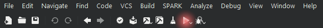

GNAT Studio
===========

.. include:: ../../../global.txt

This chapter presents an introduction to the GNAT Studio, which provides an IDE
to develop applications in Ada. For a detailed overview, please refer to the
`GNAT Studio tutorial <https://docs.adacore.com/live/wave/gps/html/gps_tutorial/index.html>`_.
Also, you can refer to the
`GNAT Studio product page <https://www.adacore.com/gnatpro/toolsuite/gps>`_ for
some introductory videos.

In this chapter, all indications using "|srarr|" refer to options from the
GNAT Studio menu that you can click in order to execute commands.

Start-up
--------

The first step is to start-up the GNAT Studio. The actual step
depends on your platform.

Windows
~~~~~~~

- You may find an icon (shortcut to :program:`GNAT Studio`) on your desktop.

- Otherwise, start :program:`GNAT Studio` by typing ``gnatstudio`` on the
  command prompt.

Linux
~~~~~

- Start :program:`GNAT Studio` by typing ``gnatstudio`` on a shell.

Creating projects
-----------------

After starting-up :program:`GNAT Studio`, you can create a project. These are
the steps:

- Click on ``Create new project`` in the welcome window

    - Alternatively, if the *wizard* (which let's you customize new
      projects) isn't already opened, click on ``File`` |srarr|
      ``New Project...`` to open it.

    - After clicking on ``Create new project``, you should see a window with
      this title: ``Create Project from Template``.

- Select one of the options from the list and click on ``Next``.

    - The simplest one is ``Basic > Simple Ada Project``, which creates a
      project containing a main application.

- Select the project location and basic settings, and click on ``Apply``.

    - If you selected "Simple Ada Project" in the previous step, you may
      now select the name of the project and of the main file.

    - Note that you can select any name for the main file.

You should now have a working project file.

Building
--------

As soon as you've created a project file, you can use it to build an
application. These are the required steps:

- Click on ``Build`` |srarr| ``Project`` |srarr| ``Build All``

    - You can also click on this icon:

.. image:: gnat_windows_build_opt.png

- Alternatively, you can click on
  ``Build`` |srarr| ``Project`` |srarr| ``Build & Run`` |srarr|
  ``<name of your main application>``

    - You can also click on this icon:

- You can also use the keyboard for building and running the main
  application:

    - Press ``F4`` to open a window that allows you to build the main
      application and click on ``Execute``.

    - Then, press ``Shift + F2`` to open a window that allows you to run
      the application, and click on ``Execute``.

Debugging
---------

Debug information
~~~~~~~~~~~~~~~~~

Before you can debug a project, you need to make sure that debugging
symbols have been included in the binary build. You can do this by
manually adding a debug version into your project, as described in the
previous chapter (see :doc:`./gprbuild`).

Alternatively, you can change the project properties directly in
:program:`GNAT Studio`. In order to do that, click on ``Edit`` |srarr|
``Project Properties...``, which opens the following window:

.. image:: gnat_windows_project_debug_opt.png

Click on ``Build`` |srarr| ``Switches`` |srarr| ``Ada`` on this window,
and make sure that the ``Debug Information`` option is selected.

Improving main application
~~~~~~~~~~~~~~~~~~~~~~~~~~

If you selected "Simple Ada Project" while creating your project in the
beginning, you probably still have a very simple main application that
doesn't do anything useful. Therefore, in order to make the debugging
activity more interesting, please enter some statements to your
application. For example:

.. code-block:: ada

    with Ada.Text_IO; use Ada.Text_IO;

    procedure Main is
    begin
       Put_Line ("Hello World!");
       Put_Line ("Hello again!");
    end Main;

Debugging the application
~~~~~~~~~~~~~~~~~~~~~~~~~

You can now build and debug the application by clicking on
``Build`` |srarr| ``Project`` |srarr| ``Build & Debug`` |srarr|
``<name of your main application>``.

You can then click on ``Debug`` |srarr| ``Run...`` to open a window that
allows you to start the application. Alternatively, you can press
``Shift + F9``. As soon as the application has started, you can press
``F5`` to step through the application or press ``F6`` to execute until
the next line. Both commands are available in the menu by clicking on
``Debug`` |srarr| ``Step`` or ``Debug`` |srarr| ``Next``.

When you've finished debugging your application, you need to terminate
the debugger. To do this, you can click on ``Debug`` |srarr|
``Terminate``.

Formal verification
-------------------

In order to see how SPARK can detect issues, let's creating a simple
application that accumulates values in a variable :ada:`A`:

.. code-block:: ada

    procedure Main
      with SPARK_Mode is

       procedure Acc (A : in out Natural;
                      V :        Natural) is
       begin
          A := A + V;
       end Acc;

       A : Natural := 0;
    begin
       Acc (A, Natural'Last);
       Acc (A, 1);
    end Main;

You can now click on ``SPARK`` |srarr| ``Prove All``, which opens a
window with various options. For example, on this window, you can select
the proof level |mdash| varying between 0 and 4 |mdash| on the
``Proof level`` list. Next, click on ``Execute``. After the prover has
completed its analysis, you'll see a list of issues found in the source
code of your application.

For the example above, the prover complains about an overflow check that
might fail. This is due to the fact that, in the :ada:`Acc` procedure,
we're not dealing with the possibility that the result of the addition
might be out of range. In order to fix this, we could define a new
saturating addition :ada:`Sat_Add` that makes use of a custom type
:ada:`T` with an extended range. For example:

.. code-block:: ada

    procedure Main
      with SPARK_Mode is

       function Sat_Add (A : Natural;
                         V : Natural) return Natural
       is
          type T is range Natural'First .. Natural'Last * 2;

          A2     : T          := T (A);
          V2     : constant T := T (V);
          A_Last : constant T := T (Natural'Last);
       begin
          A2 := A2 + V2;

          --  Saturate result if needed
          if A2 > A_Last then
             A2 := A_Last;
          end if;

          return Natural (A2);
       end Sat_Add;

       procedure Acc (A : in out Natural;
                      V :        Natural) is
       begin
          A := Sat_Add (A, V);
       end Acc;

       A : Natural := 0;
    begin
       Acc (A, Natural'Last);
       Acc (A, 1);
    end Main;

Now, when running the prover again with the modified code, no issues are
found.
