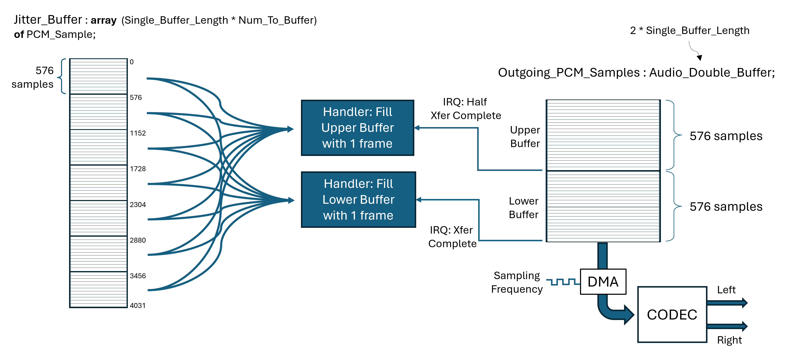
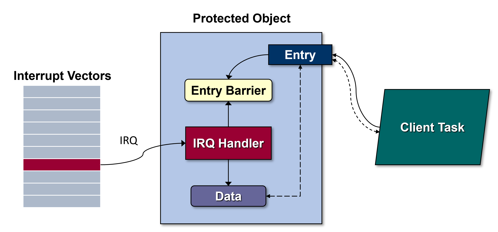
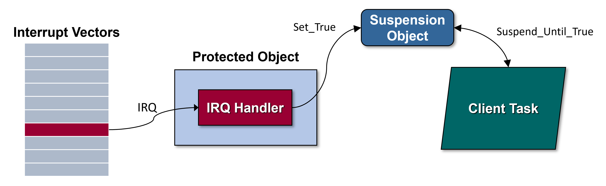

Interrupt Handling
==================

.. include:: ../../global.txt

Motivation
----------

Recall that, in Ada, protected procedures are the standard interrupt-handling
mechanism. The canonical interrupt handling and management model is defined in
the
:arm:`Systems Programming Annex, section C.3 of the Reference Manual <C-3>`.
We assume that this optional annex is supported, and indeed effectively all
compilers do support it.  Likewise, we assume that the
:arm:`Real-Time Annex, annex D <D>`, is supported (which would require
:arm:`Annex C <C>` to be supported anyway). Finally, we assume that either the
Ravenscar or the Jorvik usage profile is applied. These two profiles define
configurations of the two annexes that are appropriate for typical embedded
systems that handle interrupts.

The definition of a canonical model mitigates differences imposed by the
target, but some remain. For example, the number of different priority values,
including interrupt priorities, differs with the targets involved. The model
supports blocking of those interrupts at a lower priority than the currently
executing interrupt handler, but the hardware might not support that behavior,
although many do. None of these variations affect the expression of the idioms
themselves.

The response to interrupts is often arranged in logical levels. The first level
is the protected procedure handler itself. In some cases, everything required
to handle the interrupt is performed there. However, some applications require
more extensive, asynchronous processing of the data produced by the first level
interrupt handler. In this case a second-level response can be defined,
consisting of a task triggered by the first level. For example, the interrupt
handler could respond to the first arrival of a character on a
:wikipedia:`USART <Universal_synchronous_and_asynchronous_receiver-transmitter>`,
poll for the remainder (or not), and then notify a task to perform analysis of
the entire string received.

But even if no second-level interrupt processing is required, the interrupt
handler may be required to notify the application that the event has occurred.
Because interrupts are asynchronous, and logically concurrent with the
application code, the association of an application task to a given
interrupt-driven event is convenient and common.

Hence a task is often involved. How the handler procedure notifies the task
leads to a couple of different idiom solutions.  In both cases notification
amounts to releasing the previously suspended task for further execution.

In the Solution section below, we show how to express these three idioms: one
for using protected procedures alone, and two in which a protected procedure
handler notifies a task.

Solution
--------

First Level Handler Alone
~~~~~~~~~~~~~~~~~~~~~~~~~

In this solution the interrupt handler protected procedure does everything
necessary and does not require a second-level handler.

An interrupt handler that simply copies data from one location to another is a
good example of a necessary and sufficient first-level handler. The enclosing
application assumes the copying is occurring as required and needs no explicit
notification. If the copying isn't happening the failure will be obvious.

So, given that, why discuss such a scenario? Two reasons: to show how it is
done in general, and especially, to show how double-buffering can be
implemented very elegantly with interrupts.

For a concrete example, consider an audio streaming device that takes PCM
samples from Ethernet via incoming UDP packets and transfers them to an
:wikipedia:`audio CODEC device <Audio_codec>` on the target board. The CODEC
output is physically connected to a high-quality amplifier and speakers. No
upper-level application thread requires notification of the copying: if the
transfer is working the audio output occurs, otherwise it does not.

In our solution the CODEC device is *fed* from a buffer named
:ada:`Outgoing_PCM_Samples`. The buffer must always have new samples available
when the CODEC is ready for them, because delays or breaks would introduce
audible artifacts. The timing is determined by the sampling rate used by the
audio source, prior to transmission. To match that rate and to provide it
efficiently, we use DMA to transfer the data from the buffer to the CODEC. In
addition, :ada:`Outgoing_PCM_Samples` is double-buffered to help ensure the
samples are always available upon demand.

However, the incoming UDP packets don't arrive at exact intervals. Because of
this *jitter* in the arrival times, we cannot directly insert the PCM samples
from these incoming packets into the :ada:`Outgoing_PCM_Samples` buffer. The
delays would be audible. Therefore, we use a *jitter buffer* to deal with the
arrival time variations. This jitter buffer holds the PCM samples as they
arrive in the UDP packets, in sufficient amounts to de-couple the arrival time
jitter from the outgoing data. A jitter buffer can do much more than this, such
as correcting the order of arriving packets, but in this specific case the
additional functionality is not required.

We use two DMA interrupts to copy data from the jitter buffer to the
:ada:`Outgoing_PCM_Samples` buffer. The rationale for using two interrupts,
rather than one, is given momentarily. The figure below illustrates the overall
approach, with the jitter buffer on the left, the two interrupt handlers in the
middle, and the :ada:`Outgoing_PCM_Samples` buffer on the right.

Each UDP packet contains 576 PCM samples, used as the *single buffer length*
for the double-buffered :ada:`Outgoing_PCM_Samples` and the
:ada:`Jitter_Buffer`.

The advantage of double-buffering is that the producer can be filling one
buffer while the consumer is removing data from the other. These directions
switch when the current output buffer becomes empty. The result is a fast,
continuous output stream. Many audio and video devices use double-buffering for
that reason.

To express double-buffering you could use two physically distinct array
objects, switching between them when the DMA controller signals that the
current outgoing buffer is empty. That would require keeping track of which
buffer is being filled and which is being emptied. There is an elegant, simpler
alternative that uses two different DMA interrupts instead of one. (The DMA
device must support this approach directly.)

In this alternative, there is one physical array (:ada:`Outgoing_PCM_Samples`),
containing twice the number of components as a single physical buffer would
contain.  We can then use the two interrupts to treat the one physical array as
two logical buffers.

The two DMA interrupts are triggered as the DMA transfer consumes the content
within this single array. One interrupt is triggered when the transfer reaches
the physical half-way point in the array. The other interrupt is triggered when
the transfer reaches the physical end of the array. Therefore, because the
array is twice the size of a single buffer, each interrupt corresponds to one
of the two logical buffers becoming empty.

Furthermore, the DMA device generating these interrupts is configured so that
it does not stop. After triggering the *half transfer complete* interrupt the
DMA continues reading, now from the second logical buffer. After triggering the
*transfer complete* interrupt the DMA device starts over at the beginning of
the array, reading from the first logical buffer again.

Therefore, we have two distinct interrupt handlers, one for each of the two
interrupts. When the *half transfer complete* handler is invoked, the upper
logical buffer is now empty, so the handler for that half fills it. Likewise,
the *transfer complete* interrupt handler fills the lower logical buffer at the
bottom half of the array. There's no need to keep track of which buffer is
being filled or emptied. It's all being emptied, and the handlers always fill
the same upper or lower halves of the array. As long as each handler completes
filling their half before the DMA transfer begins reading it, all is well.

Here's the declaration of the protected object containing the DMA interrupt
handling code.

.. code-block:: ada

    protected DMA_Interrupt_Controller with
      Interrupt_Priority => DMA_Interrupt_Priority
    is
    private
       procedure DMA_IRQ_Handler with
          Attach_Handler => STM32.Board.Audio_Out_DMA_Interrupt;
    end DMA_Interrupt_Controller;

A few points are worth highlighting.

First, :ada:`DMA_Interrupt_Priority` is an application-defined constant. The
actual value isn't important to this discussion. The handler procedure is
attached to an interrupt that is specific to the target board, so it is defined
in the package :ada:`STM32.Board` in the Ada Drivers Library. Each target board
supported by the library has such a package, always with the same package name.
This particular STM32 board has dedicated audio DMA support, along with the
CODEC.

Second, there's nothing declared in the visible part of the PO. More to the
point, everything is declared in the optional private part. That placement is a
matter of style, but it's good style. No software client should ever call the
protected procedure |mdash| only the hardware should call it, via the runtime
library |mdash| so we make it impossible for any client to call it
accidentally. That placement also informs the reader of our intent.

Third, we said there are two interrupts, but only one interrupt handler
procedure is declared and attached. There's nothing inherently wrong with one
routine handling multiple interrupts, although conceptually it is not ideal. In
this case it is necessary because on this target both device interrupts arrive
at the MCU on one external interrupt line. Therefore, the one protected
procedure handler handles both device interrupts, querying the DMA status flags
to see which interrupt is active. This approach is shown below. Note that there
must be an enclosing package, with multiple context clauses, but we do not show
them so that we can focus on the interrupt handler itself.

.. code-block:: ada

    protected body DMA_Interrupt_Controller is

       procedure DMA_IRQ_Handler is
          use STM32.Board; -- for the audio DMA
       begin
          if Status (Audio_DMA, Audio_DMA_Out_Stream, DMA.Half_Transfer_Complete_Indicated) then
             --  The middle of the double-buffer array has been reached by the
             --  DMA transfer, therefore the "upper half buffer" is empty.
             Fill_Logical_Buffer (Outgoing_PCM_Samples, Starting_Index => Upper_Buffer_Start);
             Clear_Status (Audio_DMA, Audio_DMA_Out_Stream, DMA.Half_Transfer_Complete_Indicated);
          end if;

          if Status (Audio_DMA, Audio_DMA_Out_Stream, DMA.Transfer_Complete_Indicated) then
             --  The bottom of the double-buffer array has been reached by the
             --  DMA transfer, therefore the "lower half buffer" is empty.
             Fill_Logical_Buffer (Outgoing_PCM_Samples, Starting_Index => Lower_Buffer_Start);
             Clear_Status (Audio_DMA, Audio_DMA_Out_Stream, DMA.Transfer_Complete_Indicated);
          end if;
       end DMA_IRQ_Handler;

    end DMA_Interrupt_Controller;

In both cases :ada:`Fill_Logical_Buffer` is called to insert samples from the
jitter buffer into one of the logical buffers. The difference is the value
passed to the formal parameter :ada:`Starting_Index`. This is the array index
at which filling should begin within :ada:`Outgoing_PCM_Samples`.
:ada:`Upper_Buffer_Start` corresponds to :ada:`Outgoing_PCM_Samples'First`, and
:ada:`Lower_Buffer_Start` is
:ada:`Outgoing_PCM_Samples'First + Single_Buffer_Length`.

That's all the software has to do. Offloading work to the hardware, in this
case the DMA controller, is always a good idea, but that's especially true for
less powerful targets, e.g., microcontrollers. Note that the availability of
the *half transfer complete* interrupt varies across different DMA devices.

The implementation of :ada:`Fill_Logical_Buffer` is straightforward and need
not be shown. However, the procedure declares a local variable named
:ada:`Incoming_PCM_Samples` that has ramifications worth noting. In particular,
the representation may require altering and rebuilding the underlying Ada
run-time library.

The object :ada:`Incoming_PCM_Samples` is declared within
:ada:`Fill_Logical_Buffer` like so:

.. code-block:: ada

    Incoming_PCM_Samples : Jitter_Buffer.Sample_Buffer_Slice;

The alteration might be required because :ada:`Fill_Logical_Buffer` executes
entirely in the interrupt handler procedure's context. Hence the storage used
by the procedure's execution comes from the interrupt handler stack. Interrupt
handlers typically do relatively little, and, as a result, a relatively small
stack allocation is typically defined for them. The storage for
:ada:`Incoming_PCM_Samples` might exceed that allocation.

Specifically, we said that :ada:`Fill_Logical_Buffer` fills an entire half of
the double-buffer, i.e., it works in terms of :ada:`Single_Buffer_Length`. If
:ada:`Sample_Buffer_Slice` is an actual array, the required storage might be
considerable.

The interrupt stack allocation is set by the run-time library source code in
GNAT, as is common. You could increase the allocation and rebuild the run-time.

On the other hand, :ada:`Sample_Buffer_Slice` need not be an actual array. It
could be a record type containing a (read-only) pointer to the jitter buffer
array and an index indicating where in that array the *slice* to be transferred
begins. That representation would obviously require much less stack space,
obviating the run-time library change and rebuild. Moreover, that
representation would allow :ada:`Fill_Logical_Buffer` to copy directly from the
jitter buffer into the final destination, i.e., :ada:`Outgoing_PCM_Samples`.
If :ada:`Incoming_PCM_Samples` is an array, we'd have to copy from the jitter
buffer into :ada:`Incoming_PCM_Samples`, and then again from there to
:ada:`Outgoing_PCM_Samples`. That's an extra copy operation we can avoid.

A related issue, perhaps requiring a run-time change, is the
*secondary stack* allocation for interrupt handlers. The secondary stack is a
common approach to implementing calls to functions that return values of
unconstrained subtypes (usually, unconstrained array types, such as
:ada:`String`). Because the result size is not known at the point of the call,
using the primary call stack for holding the returned value is messy. The
function's returned value would follow the stack space used for the call
itself. But on return, only the call space is popped, leaving a *hole* in the
stack because the value returned from the function remains on the stack.
Therefore, another separate stack is commonly used for these functions. (GNAT
does so.) The interrupt handler code could exhaust this allocation as well.
The allocation amount is also specified in the run-time library source code.
But, as with the situation above, the source code can be changed, in this case
to avoid calling functions with unconstrained result types. The trade-off is
whether that change is more costly than changing and rebuilding the run-time,
as well as maintaining the change.

Task Notification Introduction
~~~~~~~~~~~~~~~~~~~~~~~~~~~~~~

The first idiom solution did not require notifying a task, but these next idiom
solutions will do so. As we mentioned earlier, how the interrupt handler
achieves this notification leads to two distinct idioms. Ultimately the
difference between them is whether or not the interrupt handler must
communicate with the task. In both cases the handler synchronizes with the task
because of the notification required.

Task Notification With Communication
~~~~~~~~~~~~~~~~~~~~~~~~~~~~~~~~~~~~

In this solution the interrupt handler releases a task but also communicates
with it when doing so. Therefore, a protected entry is used, and the entry
parameters are the communication medium.  The approach is depicted in the
figure below:

The interrupt handler stores data within the PO and only enables the entry
barrier when ready to either produce it or consume it via the entry parameters.
The dashed lines in the figure represent this data flow.

By coincidence, this is the notification approach used in the idiom entry
:ref:`Providing Component Access to Enclosing Record Objects <Ada_Idioms_Component_Access_To_Enclosing_Record_Objects>`.
In that solution, client tasks call two entries to :ada:`Put` and :ada:`Get`
single characters, so the data stored in the PO consists of those characters.
We did not mention it there because we were focused on that other idiom, i.e.,
how to give visibility within a PO/task component to an enclosing record
object.

Be sure to understand the code for the other idiom before exploring this one.
We will repeat elided parts of the code and only discuss the parts relevant
for this current idiom. Because we are focused now on the interrupt handling
task notification, here is the full interrupt handler PO type declaration
|mdash| :ada:`IO_Manager` |mdash| within the elided package declaration:

.. code-block:: ada

    package Serial_IO.Interrupt_Driven is

       type Serial_Port ... is new Serial_IO.Device with private;

       overriding
       procedure Put (This : in out Serial_Port;  Data : HAL.UInt8) with Inline;

       overriding
       procedure Get (This : in out Serial_Port;  Data : out HAL.UInt8) with Inline;

    private

       protected type IO_Manager
         (IRQ          : Interrupt_ID;
          IRQ_Priority : Interrupt_Priority;
          Port         : not null access Serial_Port)
       with
          Interrupt_Priority => IRQ_Priority
       is

          entry Put (Datum : HAL.UInt8);

          entry Get (Datum : out HAL.UInt8);

       private

          Outgoing : HAL.UInt8;
          Incoming : HAL.UInt8;

          Incoming_Data_Available : Boolean := False;
          Transmission_Pending    : Boolean := False;

          procedure IRQ_Handler with Attach_Handler => IRQ;

        end IO_Manager;

       ...

    end Serial_IO.Interrupt_Driven;

A protected object of type :ada:`IO_Manager` is given a discriminant value that
designates the enclosing :ada:`Serial_Port` object because that
:ada:`Serial_Port` has the USART device required to do the actual I/O. The
other two discriminants are required for configuring the interrupt handler and
attaching it to the interrupt hardware.

The two octets :ada:`Outgoing` and :ada:`Incoming` are the values sent and
received via the interrupt handler's manipulation of the USART. (A USART
doesn't receive characters, as such, and we're ignoring the fact that it may
work with a 9-bit value instead.)

The two Boolean components :ada:`Incoming_Data_Available` and
:ada:`Transmission_Pending` are used for the two barrier expressions. Their
purpose is explained below.

The bodies of visible procedures :ada:`Put` and :ada:`Get` (shown below) call
through to the interrupt manager's protected entries, also named :ada:`Put` and
:ada:`Get`. Those entries block the callers until the interrupt manager is
ready for them, via the entry barriers controlled by the interrupt handler.

.. code-block:: ada

   with STM32.Device; use STM32.Device;

   package body Serial_IO.Interrupt_Driven is

      ---------
      -- Put --
      ---------

      overriding
      procedure Put (This : in out Serial_Port;  Data : HAL.UInt8) is
      begin
         This.Controller.Put (Data);
      end Put;

      ---------
      -- Get --
      ---------

      overriding
      procedure Get (This : in out Serial_Port;  Data : out HAL.UInt8) is
      begin
         This.Transceiver.Enable_Interrupts (Received_Data_Not_Empty);
         This.Controller.Get (Data);
      end Get;

      ----------------
      -- IO_Manager --
      ----------------

      protected body IO_Manager is

         -----------------
         -- IRQ_Handler --
         -----------------

         procedure IRQ_Handler is
         begin
            --  check for data arrival
            if Port.Transceiver.Status (Read_Data_Register_Not_Empty) and then
               Port.Transceiver.Interrupt_Enabled (Received_Data_Not_Empty)
            then  -- handle reception
               Get (Serial_IO.Device (Port.all), Incoming);  -- call the Serial_IO.Device version!
               Await_Reception_Complete : loop
                  exit when not Port.Transceiver.Status (Read_Data_Register_Not_Empty);
               end loop Await_Reception_Complete;
               Port.Transceiver.Disable_Interrupts (Received_Data_Not_Empty);
               Port.Transceiver.Clear_Status (Read_Data_Register_Not_Empty);
               Incoming_Data_Available := True;
            end if;

            --  check for transmission ready
            if Port.Transceiver.Status (Transmission_Complete_Indicated) and then
               Port.Transceiver.Interrupt_Enabled (Transmission_Complete)
            then  -- handle transmission
               Put (Serial_IO.Device (Port.all), Outgoing);  -- call the Serial_IO.Device version!
               Port.Transceiver.Disable_Interrupts (Transmission_Complete);
               Port.Transceiver.Clear_Status (Transmission_Complete_Indicated);
               Transmission_Pending := False;
            end if;
         end IRQ_Handler;

         ---------
         -- Put --
         ---------

         entry Put (Datum : HAL.UInt8) when not Transmission_Pending is
         begin
            Transmission_Pending := True;
            Outgoing := Datum;
            Port.Transceiver.Enable_Interrupts (Transmission_Complete);
         end Put;

         ---------
         -- Get --
         ---------

         entry Get (Datum : out HAL.UInt8) when Incoming_Data_Available is
         begin
            Datum := Incoming;
            Incoming_Data_Available := False;
         end Get;

      end IO_Manager;

   end Serial_IO.Interrupt_Driven;

Note how :ada:`IRQ_Handler` checks for which interrupt is active, possibly
both, does whatever is necessary for that to be handled, and then sets the
entry barriers accordingly. The barrier expression :ada:`Transmission_Pending`
blocks :ada:`Put` callers until the current transmission, if any, completes.
The barrier :ada:`Incoming_Data_Available` blocks :ada:`Get` callers until a
character has been received and can be provided to the caller. The entry bodies
copy the entry formal parameters to/from the internally stored characters and
likewise set the entry barriers.

Note too how the body of procedure :ada:`Get` first enables the
*received data available* interrupt before calling the entry. The body of the
entry :ada:`Put` does something similar. They both work in concert with the
handler procedure to manage the interrupts as required.

Using protected entries is ideal for this case because, after all, that is
exactly what they are designed to do. Note that declaring multiple protected
entries in a single protected type/object requires the Jorvik usage profile to
be applied.

Task Notification Without Communication
~~~~~~~~~~~~~~~~~~~~~~~~~~~~~~~~~~~~~~~

In this solution, the interrupt handler procedure is not required to
communicate with the task. It only needs to synchronize with it, to release it.

Therefore, we can use a :ada:`Suspension_Object`: a language-defined,
thread-safe *binary flag* type defined in package
:ada:`Ada.Synchronous_Task_Control`. Objects of this type have two values:
:ada:`True` and :ada:`False`, with :ada:`False` as the default initial value.
There are two primary primitive operations: procedures
:ada:`Suspend_Until_True` and :ada:`Set_True`. Procedure :ada:`Set_True` does
just what you think it does. Procedure :ada:`Suspend_Until_True` suspends the
caller (task) until the value of the specified argument becomes :ada:`True`,
at which point the suspended task is allowed to continue execution. (Of course,
if it was already :ada:`True` when :ada:`Suspend_Until_True` was called, the
caller returns without suspending.)  Critically, procedure
:ada:`Suspend_Until_True` also sets the argument back to :ada:`False` before
returning. As a result, those are the only two routines you're likely to need,
although there are others.

The interrupt handler procedure in this idiom solution simply calls
:ada:`Set_True` for a :ada:`Suspension_Object` (an object of that type) visible
to both the handler and the task. This arrangement is illustrated by the
following figure:

The language requires the run-time library implementation to allow calls to
:ada:`Set_False` and :ada:`Set_True` during any protected action, even one that
has its ceiling priority in the :ada:`Interrupt_Priority` range, so this
approach will work for interrupt handlers as well as tasks.

For our example we implement a facility for sending and receiving *messages*
over a serial port, using interrupts. The design is similar to the solution we
just explored, and thus to the
:ref:`Providing Component Access to Enclosing Record Objects <Ada_Idioms_Component_Access_To_Enclosing_Record_Objects>`
idiom. In that solution, however, only single characters were sent and
received, whereas messages will consist of one or more characters. Although
there are differences, we assume that you are familiar enough with that idiom's
solution that we don't need to go into all the details of the serial I/O, the
USART, or the interrupt handler within a PO. We'll focus instead of the
differences due to this idiom.

In this version we want to notify a task when an entire message has been sent
or received, not just a single character. We'll define a message as a
:ada:`String` that has a message-specified logical terminator character, e.g.,
the `nul` character. Transmission will cease when the terminator character
is encountered when sending a message object. Similarly, a message is
considered complete when the terminator character is received. (The terminator
is not stored in message content.)

In a sense the interrupt handler is again communicating with tasks, but not
directly, so entry parameters aren't applicable. Therefore, a
:ada:`Suspension_Object` component is appropriate. But instead of one
:ada:`Suspension_Object` variable, each :ada:`Message` object will contain two:
one for notification of new content receipt, and one for notification of
successful content transmission.

For the sake of the Separation of Concerns principle, the type :ada:`Message`
should be an ADT of its own, in a dedicated package:

.. code-block:: ada

    with Serial_IO;                     use Serial_IO;
    with Ada.Synchronous_Task_Control;  use Ada.Synchronous_Task_Control;

    package Message_Buffers is

       type Message (Physical_Size : Positive) is tagged limited private;

       function Content (This : Message) return String;
       function Length (This : Message) return Natural;
       procedure Set (This : in out Message;  To : String) with
         Pre  => To'Length <= This.Physical_Size,
         Post => Length (This) = To'Length and Content (This) = To;
       ...
       function Terminator (This : Message) return Character;
       procedure Await_Transmission_Complete (This : in out Message);
       procedure Await_Reception_Complete (This : in out Message);
       procedure Signal_Transmission_Complete (This : in out Message);
       procedure Signal_Reception_Complete (This : in out Message);

    private

       type Message (Physical_Size : Positive) is tagged limited record
          Content               : String (1 .. Physical_Size);
          Length                : Natural := 0;
          Reception_Complete    : Suspension_Object;
          Transmission_Complete : Suspension_Object;
          Terminator            : Character := ASCII.NUL;
       end record;

    end Message_Buffers;

In essence, a :ada:`Message` object is just the usual
*variable length string* abstraction with a known terminator and ways to
suspend and resume clients using them. Note the two
:ada:`Suspension_Object` components.

In this example the tasks to be notified are application tasks rather than
second-level interrupt handlers. Client tasks can suspend themselves to await
either transmission completion or reception completion. The :ada:`Message`
procedures simply call the appropriate routines for the parameter's
:ada:`Suspension_Object` components:

.. code-block:: ada

    procedure Await_Transmission_Complete (This : in out Message) is
    begin
       Suspend_Until_True (This.Transmission_Complete);
    end Await_Transmission_Complete;

and likewise:

.. code-block:: ada

    procedure Await_Reception_Complete (This : in out Message) is
    begin
       Suspend_Until_True (This.Reception_Complete);
    end Await_Reception_Complete;

The client task could look like the following, in this case the main program's
environment task:

.. code-block:: ada

    procedure Demo_Serial_Port_Nonblocking is

       Incoming : aliased Message (Physical_Size => 1024);  -- arbitrary size
       Outgoing : aliased Message (Physical_Size => 1024);  -- arbitrary size

       procedure Send (This : String) is
       begin
          Set (Outgoing, To => This);
          Start_Sending (COM, Outgoing'Unchecked_Access);
          Outgoing.Await_Transmission_Complete;
       end Send;

    begin
       Initialize_Hardware (COM);
       Configure (COM, Baud_Rate => 115_200);

       Incoming.Set_Terminator (ASCII.CR);
       Send ("Enter text, terminated by CR.");
       loop
          Start_Receiving (COM, Incoming'Unchecked_Access);
          Incoming.Await_Reception_Complete;
          Send ("Received : " & Incoming.Content);
       end loop;
    end Demo_Serial_Port_Nonblocking;

We don't show all the context clauses, for brevity, but one of the packages
declares :ada:`COM` as the serial port. This demo doesn't exploit the
nonblocking aspect because it does not perform any other actions before
suspending itself after initiating sending and receiving. But it could do so,
while the I/O is happening, only later suspending to await completion of the
requested operation.

The interrupt handler procedure can signal both transmission and reception
completion using the two other procedures:

.. code-block:: ada

    procedure Signal_Transmission_Complete (This : in out Message) is
    begin
       Set_True (This.Transmission_Complete);
    end Signal_Transmission_Complete;

    procedure Signal_Reception_Complete (This : in out Message) is
    begin
       Set_True (This.Reception_Complete);
    end Signal_Reception_Complete;

In this version of the Serial IO facility, the interrupt handler's enclosing
protected type is the type :ada:`Serial_Port` itself, rather than a PO
enclosed by a record type:

.. code-block:: ada

    protected type Serial_Port
      (Device       : not null access Peripheral_Descriptor;
       IRQ          : Interrupt_ID;
       IRQ_Priority : Interrupt_Priority)
    with
        Interrupt_Priority => IRQ_Priority
    is

       procedure Start_Sending (Msg : not null access Message);
       procedure Start_Receiving (Msg : not null access Message);

    private

       Next_Out     : Positive;
       Outgoing_Msg : access Message;
       Incoming_Msg : access Message;

       procedure Handle_Transmission with Inline;
       procedure Handle_Reception    with Inline;
       procedure ISR with Attach_Handler => IRQ;

    end Serial_Port;

Procedure :ada:`ISR` (*Interrupt Service Routine*) is the handler.

The two visible protected procedures, :ada:`Start_Sending` and
:ada:`Start_Receiving`, are given non-null arguments when called (indirectly)
by client tasks. Each argument is an access value designating a
:ada:`Message` object declared by clients. The pointers are copied into the
internal components, i.e., :ada:`Outgoing_Msg` and :ada:`Incoming_Msg`, for
use by the interrupt handler procedure.

As with the earlier idiom above, there are multiple device interrupts, but they
are all delivered on one external interrupt line. The handler procedure checks
the status flags to see which interrupts are active and calls dedicated
internal procedures accordingly. We don't need to see this infrastructure code
again, so we can focus instead on one, the internal :ada:`Handle_Reception`
procedure. The routine for transmitting is similar.

.. code-block:: ada

    procedure Handle_Reception is
       Received_Char : constant Character := Character'Val (Current_Input (Device.Transceiver.all));
    begin
       if Received_Char /= Incoming_Msg.Terminator then
          Incoming_Msg.Append (Received_Char);
       end if;
       if Received_Char = Incoming_Msg.Terminator or else
          Incoming_Msg.Length = Incoming_Msg.Physical_Size
       then -- reception complete
          loop
             --  wait for device to clear the status
             exit when not Status (Device.Transceiver.all, Read_Data_Register_Not_Empty);
          end loop;
          Disable_Interrupts (Device.Transceiver.all, Source => Received_Data_Not_Empty);
          Incoming_Msg.Signal_Reception_Complete;
          Incoming_Msg := null;
       end if;
    end Handle_Reception;

Note the call to :ada:`Signal_Reception_Complete` for the current Message
object being received, designated by :ada:`Incoming_Msg`.

The alternative to a :ada:`Suspension_Object` is a parameterless protected
entry that a task calls to suspend itself. That certainly works in general,
but we would need two entries, hence Jorvik. But also, the
:ada:`Suspension_Object` approach can have a little better performance because
it does not have the functionality that a protected entry has.

Note that type :ada:`Suspension_Object` might very well be implemented as a
protected type. On a uniprocessor target, protected object mutual exclusion can
be implemented via priorities, so it won't make much difference. (GNAT's
bare-board run-times use that mutual exclusion implementation approach, as well
as the PO implementation of type :ada:`Suspension_Object`.)

Pros
----

In all three idioms, the solution is directly expressed, meets the
requirements, and hides the implementation details. The implementations are
efficient relative to their requirements, the only reasonable metric. In
particular, :ada:`Suspension_Objects` are expected to be faster than protected
entries, but only support synchronization, and only with one caller at a time
|mdash| there's no queue. Nor do they support communication. Protected entries
have no such restrictions and are reasonably efficient given their considerable
additional capabilities.

Cons
----

None.

Relationship With Other Idioms
------------------------------

The idiom showing how to connect a PO or task to an enclosing record object was
illustrated by an interrupt handler PO, but that idiom is not necessary.
Indeed, we used a protected type directly in the last solution.

What About Priorities?
----------------------

The idiom expressions do not determine the actual priorities assigned to the
protected objects containing the handler procedures, nor those of the notified
tasks.

The language standard requires the priorities for interrupt handler POs to be
in the range defined by the subtype :ada:`System.Interrupt_Priority`. Under
the Ravenscar and Jorvik profiles they must also satisfy the Ceiling Priority
Protocol requirements.

The target's interrupt hardware may dictate the specific handler priorities, or
at least their floor values. You may be able to control those hardware
priorities via the target board startup code.

But usually we have some freedom to choose, so what priorities should be
assigned?

Often the values are arbitrary. However, a more rigorous approach may be
required. A good guideline is that if you need to do a timing (schedulability)
analysis for the application tasks' deadlines, you need to do it for the
interrupt handlers' deadlines too. The same analyses can be used, i.e.,
response-time analysis, and the same priority assignment schemes, i.e., a
shorter period gets a higher priority. (The interrupt *period* is the minimum
interval between the interrupt occurrences.)

In addition, ensuring interrupt handler deadlines are met is part of ensuring
the tasks meet their deadlines. That's because the interrupt handlers release
the associated sporadic (event-driven) tasks for execution. A sporadic task
triggered by a device (say) usually will have a deadline no greater than the
next occurrence of the sensor-generated interrupt, that is, the interrupt
period. The priority of the task will be set according to that period.

Notes
-----

    #. The *traditional* expression for an interrupt handler, i.e., a
       procedure, is allowed by the language as a vendor-defined extension.
       However, there will likely be language-oriented restrictions applied to
       those procedures, due to the context. That's true of other languages as
       well.

    #. You shouldn't assign interrupt handler (PO) priorities by semantic
       importance, just as you shouldn't do so for task priorities. More
       *important* interrupt handlers shouldn't necessarily be assigned more
       urgent priorities.

Bibliography
------------

.. todo::

    Ravenscar Guide??? Surely there is some document that first introduced
    these idioms...
