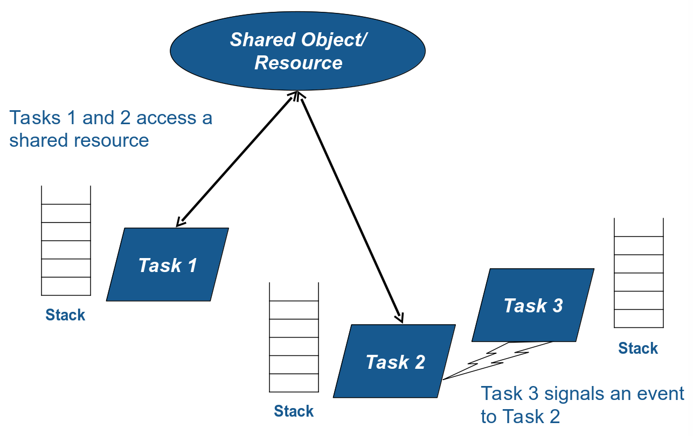
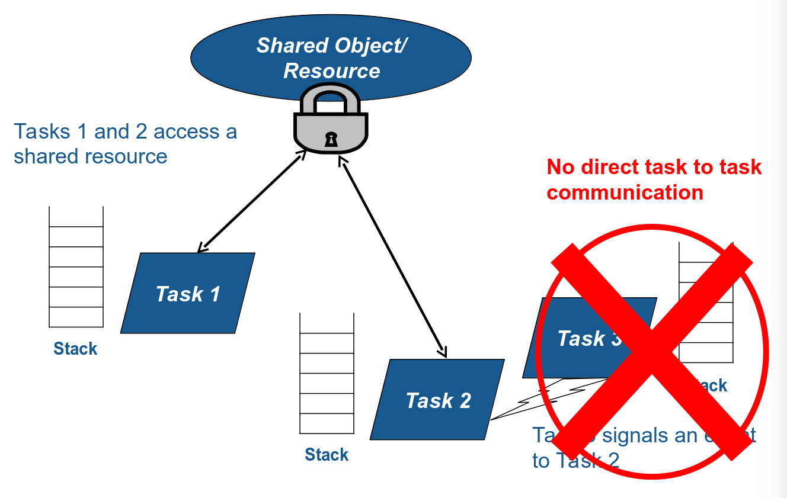

Concurrency
=====================================================================

.. include:: ../../../global.txt

Concurrency ≠ Parallelism
---------------------------------------------------------------------

- Concurrency allows to create a well structured program

- Parallelism allows to create a high performance program

- Multiple cores/processors are...

    - possible for concurrent programs

    - essential to parallelism

- What about Ada and SPARK?

    - GNAT runtimes for concurrency available on single core & multicore
      (for SMP platforms)

    - parallel features scheduled for inclusion in Ada and SPARK 202x

Concurrent Program Structure in Ada
---------------------------------------------------------------------

The problems with concurrency
---------------------------------------------------------------------

- Control and data flow become much more complex

    - possibly nondeterministic even

    - actual behavior is one of many possible interleavings of tasks

- Data may be corrupted by concurrent accesses

    - so called data races or race conditions

- Control may block indefinitely, or loop indefinitely

    - so called deadlocks and livelocks

- Scheduling and memory usage are harder to compute

Ravenscar – the Ada solution to concurrency problems
---------------------------------------------------------------------

- Ravenscar profile restricts concurrency in Ada

    - ensures deterministic behavior at every point in time

    - recommends use of protected objects to avoid data races

    - prevents deadlocks with Priority Ceiling Protocol

    - allows use of scheduling analysis techniques (RMA, RTA)

    - facilitates computation of memory usage with static tasks

- GNAT Extended Ravenscar profile lifts some restrictions

    - still same benefits as Ravenscar profile

    - removes painful restrictions for some applications

Concurrent Program Structure in Ravenscar
---------------------------------------------------------------------

Ravenscar – the SPARK solution to concurrency problems
---------------------------------------------------------------------

- Ravenscar and Extended_Ravenscar profiles supported in SPARK

- Data races prevented by flow analysis

    - ensures no problematic concurrent access to unprotected data

    - flow analysis also ensures non-termination of tasks

- Run-time errors prevented by proof

    - includes violations of the Priority Ceiling Protocol

Concurrency – A trivial example
---------------------------------------------------------------------

.. code:: ada no_button project=Courses.Advanced_SPARK.Concurrency.Trivial_Task

    package Show_Trivial_Task is

       type Task_Id is new Integer;

       task type T (Id : Task_Id);

       T1 : T (0);
       T2 : T (1);
    end Show_Trivial_Task;

    package body Show_Trivial_Task is
       task body T is
          Current_Task : Task_Id := Id;
       begin
          loop
             delay 1.0;
          end loop;
       end T;
    end Show_Trivial_Task;

- Id can be written by ``T1`` and ``T2`` at the same time

Setup for using concurrency in SPARK
---------------------------------------------------------------------

- Any unit using concurrency features (tasks, protected objects, etc.)
  must set the profile

.. code-block:: ada

    pragma Profile (Ravenscar);
    --  or
    pragma Profile (GNAT_Extended_Ravenscar);

- ... plus an additional pragma

    - that ensures tasks start after the end of elaboration

.. code-block:: ada

    pragma Partition_Elaboration_Policy (Sequential);

- ... which are checked by GNAT partition-wide

    - pragmas needed for verification even it not for compilation

Tasks in Ravenscar
---------------------------------------------------------------------

- A task can be either a singleton object or a type

    - no declarations of entries for rendez-vous

.. code-block:: ada

    task T;
    task type TT;

- ... completed by a body

    - infinite loop to prevent termination

.. code-block:: ada

    task body T is
    begin
       loop
          ...
       end loop;
    end T;

- Tasks are declared at library-level

- ... as standalone objects or inside records/arrays

.. code-block:: ada

    type TA is array (1 .. 3) of TT;
    type TR is record
       A, B : TT;
    end record;

Communication Between Tasks in Ravenscar
---------------------------------------------------------------------

- Tasks can communicate through protected objects

- A protected object is either a singleton object or a type

    - all PO private data initialized by default in SPARK

.. code:: ada compile_button project=Courses.Advanced_SPARK.Concurrency.Protected_Object

    package Show_Protected_Object is

       protected P is
          procedure Set (V : Natural);
          function Get return Natural;
       private
          The_Data : Natural := 0;
       end P;

    end Show_Protected_Object;

    package body Show_Protected_Object is

       protected body P is
          procedure Set (V : Natural) is
          begin
             The_Data := V;
          end Set;
          function Get return Natural is
            (The_Data);
       end P;

    end Show_Protected_Object;

Protected Objects in Ravenscar
---------------------------------------------------------------------

- Protected objects are  declared at library-level

- ... as standalone objects or inside records/arrays

    - The record type needs to be volatile, as a non-volatile type cannot
      contain a volatile component. The array type is implicitly volatile
      when its component type is volatile.

.. code:: ada compile_button project=Courses.Advanced_SPARK.Concurrency.Protected_Object_Ravenscar

    package Show_Protected_Object_Ravenscar is

       protected type PT is
          procedure Set (V : Natural);
          function Get return Natural;
       private
          The_Data : Natural := 0;
       end PT;

       P : PT;

       type PAT is array (1 .. 3) of PT;
       PA : PAT;

       type PRT is record
          A, B : PT;
       end record with Volatile;
       PR : PRT;

    end Show_Protected_Object_Ravenscar;

    package body Show_Protected_Object_Ravenscar is

       protected body PT is
          procedure Set (V : Natural) is
          begin
             The_Data := V;
          end Set;
          function Get return Natural is
            (The_Data);
       end PT;

    end Show_Protected_Object_Ravenscar;

Protected Communication with Procedures & Functions
---------------------------------------------------------------------

- CREW enforced (Concurrent-Read-Exclusive-Write)

    - procedures have exclusive read-write access to PO

    - functions have shared read-only access to PO

- Actual mechanism depends on target platform

    - scheduler enforces policy on single core

    - locks used on multicore (using CAS instructions)

    - lock-free transactions used for simple PO (again using CAS)

- Mechanism is transparent to user

    - user code simply calls procedures/functions

    - task may be queued until PO is released by another task

Blocking Communication with Entries
---------------------------------------------------------------------

- Only protected objects have entries in Ravenscar

- Entry = procedure with :ada:`entry` guard condition

    - second level of queues, one for each entry, on a given PO

    - task may be queued until guard is True and PO is released

    - at most one entry in Ravenscar

    - guard is a :ada:`Boolean` component of PO in Ravenscar

.. code:: ada compile_button project=Courses.Advanced_SPARK.Concurrency.Blocking_Communication

    package Show_Blocking_Communication is

       protected type PT is
          entry Reset;
       private
          Is_Not_Null : Boolean := False;
          The_Data    : Integer := 1000;
       end PT;

    end Show_Blocking_Communication;

    package body Show_Blocking_Communication is

       protected body PT is
          entry Reset when Is_Not_Null is
          begin
             The_Data := 0;
          end Reset;
       end PT;

    end Show_Blocking_Communication;

Relaxed Constraints on Entries with Extended Ravenscar
---------------------------------------------------------------------

- Proof limitations with Ravenscar

    - not possible to relate guard to other components with invariant

- GNAT Extended Ravenscar profile lifts these constraints

    - and allows multiple tasks to call the same entry

.. code:: ada compile_button project=Courses.Advanced_SPARK.Concurrency.Relaxed_Constraints_On_Entries

    package Show_Relaxed_Constraints_On_Entries is

       protected type Mailbox is
          entry Publish;
          entry Retrieve;
       private
          Num_Messages : Natural := 0;
       end Mailbox;

    end Show_Relaxed_Constraints_On_Entries;

    package body Show_Relaxed_Constraints_On_Entries is

       Max : constant := 100;

       protected body Mailbox is
          entry Publish when Num_Messages < Max is
          begin
             Num_Messages := Num_Messages + 1;
          end Publish;

          entry Retrieve when Num_Messages > 0 is
          begin
             Num_Messages := Num_Messages - 1;
          end Retrieve;
       end Mailbox;

    end Show_Relaxed_Constraints_On_Entries;

Interrupt Handlers in Ravenscar
---------------------------------------------------------------------

- Interrupt handlers are parameterless procedures of PO

    - with aspect :ada:`Attach_Handler` specifying the corresponding
      signal

    - with aspect :ada:`Interrupt_Priority` on the PO specifying the
      priority

.. code:: ada no_button project=Courses.Advanced_SPARK.Concurrency.Interrupt_Handlers

    with System; use System;
    with Ada.Interrupts.Names; use Ada.Interrupts.Names;

    package Show_Interrupt_Handlers is

        protected P with
          Interrupt_Priority =>
            System.Interrupt_Priority'First
        is
           procedure Signal with
             Attach_Handler => SIGHUP;
        end P;

    end Show_Interrupt_Handlers;

- Priority of the PO should be in :ada:`System.Interrupt_Priority`

    - default is OK – in the range of :ada:`System.Interrupt_Priority`

    - checked by proof (default or value of :ada:`Priority` or
      :ada:`Interrupt_Priority`)

Other Communications Between Tasks in SPARK
---------------------------------------------------------------------

- Tasks must communicate through synchronized objects

    - atomic objects

    - protected objects

    - suspension objects (standard :ada:`Boolean` protected objects)

- Constants are considered as synchronized

    - this includes variables constant after elaboration (specified with
      aspect :ada:`Constant_After_Elaboration`)

- Single task or PO can access an unsynchronized object

    - exclusive relation between object and task/PO must be specified with
      aspect :ada:`Part_Of`

Data and Flow Dependencies of Tasks
---------------------------------------------------------------------

- Input/output relation can be specified for a task

    - as task never terminates, output is understood while task runs

    - task itself is both an input and an output

    - implicit :ada:`In_Out => T`

    - explicit dependency

.. code:: ada no_button project=Courses.Advanced_SPARK.Concurrency.Data_And_Flow_Dependencies

    package Show_Data_And_Flow_Dependencies is

       X, Y, Z : Integer;

       task T with
         Global => (Input  => X,
                    Output => Y,
                    In_Out => Z),
         Depends => (T    => T,
                     Z    => X,
                     Y    => X,
                     null => Z);
    end Show_Data_And_Flow_Dependencies;

State Abstraction over Synchronized Variables
---------------------------------------------------------------------

- Synchronized objects can be abstracted in synchronized abstract state
  with aspect :ada:`Synchronous`

.. code:: ada compile_button project=Courses.Advanced_SPARK.Concurrency.State_Abstraction

    package Show_State_Abstraction with
      Abstract_State => (State with Synchronous, External)
    is

       protected type Protected_Type is
          procedure Reset;
       private
          Data : Natural := 0;
       end Protected_Type;

       task type Task_Type;

    end Show_State_Abstraction;

    package body Show_State_Abstraction with
      Refined_State => (State => (A, P, T))
    is
       A : Integer with Atomic, Async_Readers, Async_Writers;
       P : Protected_Type;
       T : Task_Type;

       protected body Protected_Type is
          procedure Reset is
          begin
             Data := 0;
          end Reset;
       end Protected_Type;

       task body Task_Type is
       begin
          P.Reset;
          A := 0;
       end Task_Type;

    end Show_State_Abstraction;

- Synchronized state is a form of external state

    - :ada:`Synchronous` same as
      :ada:`External => (Async_Readers, Async_Writers)`

    - tasks are not volatile and can be part of regular abstract state

Synchronized Abstract State in the Standard Library
---------------------------------------------------------------------

- Standard library maintains synchronized state

    - the tasking runtime maintains state about running tasks

    - the real-time runtime maintains state about current time

.. code-block:: ada

    package Ada.Task_Identification with
      SPARK_Mode,
      Abstract_State =>
        (Tasking_State with Synchronous,
           External => (Async_Readers, Async_Writers)),
      Initializes    => Tasking_State

    package Ada.Real_Time with
      SPARK_Mode,
      Abstract_State =>
        (Clock_Time with Synchronous,
           External => (Async_Readers, Async_Writers)),
      Initializes    => Clock_Time

- API of these units refer to :ada:`Tasking_State` and :ada:`Clock_Time`

Code Examples / Pitfalls
---------------------------------------------------------------------

Example #1
~~~~~~~~~~

.. code:: ada run_button project=Courses.Advanced_SPARK.Concurrency.Example_01

    procedure Rendezvous is
       task T1 is
          entry Start;
       end T1;

       task body T1 is
       begin
          accept Start;
       end T1;

    begin
       T1.Start;
    end Rendezvous;

This code is not correct. Task rendezvous is not allowed; violation of
restriction :ada:`Max_Task_Entries = 0`. A local task is not allowed;
violation of restriction :ada:`No_Task_Hierarchy`

Example #2
~~~~~~~~~~

.. code:: ada compile_button project=Courses.Advanced_SPARK.Concurrency.Example_02

    package Example_02 is

       protected P is
          entry Reset;
       end P;

    private
       Data : Boolean := False;
    end Example_02;

    package body Example_02 is

       protected body P is
          entry Reset when Data is
          begin
             null;
          end Reset;
       end P;

    end Example_02;

This code is not correct. Global data in entry guard is not allowed.
Violation of restriction :ada:`Simple_Barriers` (for Ravenscar) or
:ada:`Pure_Barriers` (for Extended Ravenscar)

Example #3
~~~~~~~~~~

.. code:: ada compile_button project=Courses.Advanced_SPARK.Concurrency.Example_03

    package Example_03 is

       protected P is
          procedure Set (Value : Integer);
       end P;

    private
       task type TT;

       T1, T2 : TT;

    end Example_03;

    package body Example_03 is

       Data : Integer := 0;

       protected body P is
          procedure Set (Value : Integer) is
          begin
             Data := Value;
          end Set;
       end P;

       task body TT is
          Local : Integer := 0;
       begin
          loop
             Local := (Local + 1) mod 100;
             P.Set (Local);
          end loop;
       end TT;

    end Example_03;

This code is not correct. Global unprotected data accessed in protected
object shared between tasks

Example #4
~~~~~~~~~~

.. code:: ada compile_button project=Courses.Advanced_SPARK.Concurrency.Example_04

    package Example_04 is

       protected P is
          procedure Set (Value : Integer);
       end P;

    private
       Data : Integer := 0 with Part_Of => P;

       task type TT;

       T1, T2 : TT;

    end Example_04;

    package body Example_04 is

       protected body P is
          procedure Set (Value : Integer) is
          begin
             Data := Value;
          end Set;
       end P;

       task body TT is
          Local : Integer := 0;
       begin
          loop
             Local := (Local + 1) mod 100;
             P.Set (Local);
          end loop;
       end TT;

    end Example_04;

This code is correct. ``Data`` is part of the protected object state. The
only accesses to ``Data`` are through ``P``.

Example #5
~~~~~~~~~~

.. code:: ada compile_button project=Courses.Advanced_SPARK.Concurrency.Example_05

    package Example_05 is

       protected P1 with Priority => 3 is
          procedure Set (Value : Integer);
       private
          Data : Integer := 0;
       end P1;

       protected P2 with Priority => 2 is
          procedure Set (Value : Integer);
       end P2;

    private
       task type TT with Priority => 1;

       T1, T2 : TT;

    end Example_05;

    package body Example_05 is

       protected body P1 is
          procedure Set (Value : Integer) is
          begin
             Data := Value;
          end Set;
       end P1;

       protected body P2 is
          procedure Set (Value : Integer) is
          begin
             P1.Set (Value);
          end Set;
       end P2;

       task body TT is
          Local : constant Integer := 0;
       begin
          loop
             P2.Set (Local);
          end loop;
       end TT;

    end Example_05;

This code is correct. :ada:`Ceiling_Priority` policy is respected. Task
never accesses a protected object with lower priority than its active
priority. Note that PO can call procedure or function from another PO, but
not an entry (possibly blocking).

Example #6
~~~~~~~~~~

.. code:: ada compile_button project=Courses.Advanced_SPARK.Concurrency.Example_06

    package Example_06 is

       protected type Mailbox is
          entry Publish;
          entry Retrieve;
       private
          Not_Empty    : Boolean := True;
          Not_Full     : Boolean := False;
          Num_Messages : Natural := 0;
       end Mailbox;

    end Example_06;

    package body Example_06 is

       Max : constant := 100;

       protected body Mailbox is
          entry Publish when Not_Full is
          begin
             Num_Messages := Num_Messages + 1;
             Not_Empty := True;
             if Num_Messages = Max then
                Not_Full := False;
             end if;
          end Publish;

          entry Retrieve when Not_Empty is
          begin
             Num_Messages := Num_Messages - 1;
             Not_Full := True;
             if Num_Messages = 0 then
                Not_Empty := False;
             end if;
          end Retrieve;
       end Mailbox;

    end Example_06;

This code is not correct. Integer range cannot be proved correct.

Example #7
~~~~~~~~~~

.. code:: ada compile_button project=Courses.Advanced_SPARK.Concurrency.Example_07

    package Example_07 is

       protected type Mailbox is
          entry Publish;
          entry Retrieve;
       private
          Num_Messages : Natural := 0;
       end Mailbox;

    end Example_07;

    package body Example_07 is

       Max : constant := 100;

       protected body Mailbox is
          entry Publish when Num_Messages < Max is
          begin
             Num_Messages := Num_Messages + 1;
          end Publish;

          entry Retrieve when Num_Messages > 0 is
          begin
             Num_Messages := Num_Messages - 1;
          end Retrieve;
       end Mailbox;

    end Example_07;

This code is correct. Precise range obtained from entry guards allows to
prove checks.

Example #8
~~~~~~~~~~

.. code:: ada compile_button project=Courses.Advanced_SPARK.Concurrency.Example_08

    package Example_08 is

       Max : constant := 100;

       type Content is record
          Not_Empty    : Boolean := False;
          Not_Full     : Boolean := True;
          Num_Messages : Natural := 0;
       end record with Predicate =>
         Num_Messages in 0 .. Max
         and Not_Empty = (Num_Messages > 0)
         and Not_Full = (Num_Messages < Max);

       protected type Mailbox is
          entry Publish;
          entry Retrieve;
       private
          C : Content;
       end Mailbox;

    end Example_08;

    package body Example_08 is

       protected body Mailbox is
          entry Publish when C.Not_Full is
             Not_Full     : Boolean := C.Not_Full;
             Num_Messages : Natural := C.Num_Messages;
          begin
             Num_Messages := Num_Messages + 1;
             if Num_Messages = Max then
                Not_Full := False;
             end if;
             C := (True, Not_Full, Num_Messages);
          end Publish;

          entry Retrieve when C.Not_Empty is
             Not_Empty    : Boolean := C.Not_Empty;
             Num_Messages : Natural := C.Num_Messages;
          begin
             Num_Messages := Num_Messages - 1;
             if Num_Messages = 0 then
                Not_Empty := False;
             end if;
             C := (Not_Empty, True, Num_Messages);
          end Retrieve;
       end Mailbox;

    end Example_08;

This code is correct. Precise range obtained from predicate allows to
prove checks. Predicate is preserved.

Example #9
~~~~~~~~~~

.. code:: ada compile_button project=Courses.Advanced_SPARK.Concurrency.Example_09

    --% src_file: Example_09.ads
    --% cflags: -gnaty
    --% make_flags: -gnaty -gnata

    package Example_09 is

       package Service with
         Abstract_State => (State with External)
       is
          procedure Extract (Data : out Integer) with
            Global => (In_Out => State);
       end Service;

    private
       task type T;
       T1, T2 : T;

    end Example_09;

    package body Example_09 is

       package body Service with
         Refined_State => (State => Extracted)
       is
          Local_Data : constant Integer := 100;
          Extracted  : Boolean := False;

          procedure Extract (Data : out Integer) is
          begin
             if not Extracted then
                Data := Local_Data;
                Extracted := True;
             else
                Data := Integer'First;
             end if;
          end Extract;
       end Service;

       task body T is
          X : Integer;
       begin
          loop
             Service.Extract (X);
          end loop;
       end T;

    end Example_09;

This code is not correct. Unsynchronized state cannot be accessed from
multiple tasks or protected objects.

Example #10
~~~~~~~~~~~

.. code:: ada compile_button project=Courses.Advanced_SPARK.Concurrency.Example_10

    package Example_10 is

       package Service with
         Abstract_State => (State with Synchronous, External)
       is
          procedure Extract (Data : out Integer) with
            Global => (In_Out => State);
       private
          protected type Service_Extracted is
             procedure Set;
             function Get return Boolean;
          private
             Extracted : Boolean := False;
          end Service_Extracted;
       end Service;

    private
       task type T;
       T1, T2 : T;

    end Example_10;

    package body Example_10 is

       package body Service with
         Refined_State => (State => Extracted)
       is
          Local_Data : constant Integer := 100;

          Extracted : Service_Extracted;

          protected body Service_Extracted is
             procedure Set is
             begin
                Extracted := True;
             end Set;

            function Get return Boolean is
               (Extracted);
          end Service_Extracted;

          procedure Extract (Data : out Integer) is
             Is_Extracted : constant Boolean := Extracted.Get;
          begin
             if not Is_Extracted then
                Data := Local_Data;
                Extracted.Set;
             else
                Data := Integer'First;
             end if;
          end Extract;
       end Service;

       task body T is
          X : Integer;
       begin
          loop
             Service.Extract (X);
          end loop;
       end T;

    end Example_10;

This code is correct. Abstract state is synchronized, hence can be
accessed from multiple tasks and protected objects.
