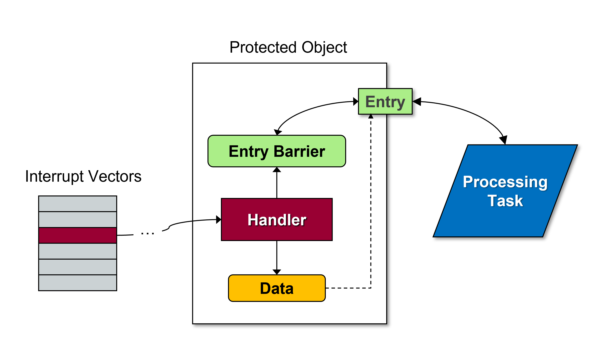
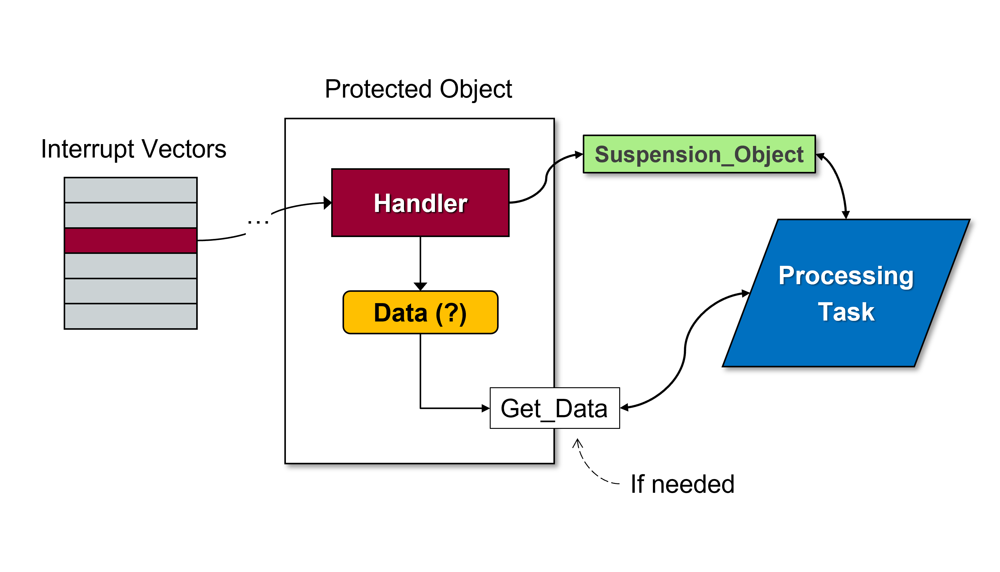

Handling Interrupts
===================

.. include:: ../../global.txt

Background
----------

Embedded systems developers offload functionality from the application
processor onto external devices whenever possible. These external
devices may be on the same "chip" as the central processor (e.g., within
a System-on-Chip) or they may just be on the same board, but the point
here is that they are not the processor executing the application.
Offloading work to these other devices enables us to get more
functionality implemented in a target platform that is usually very
limited in resources. If the processor has to implement everything we
might miss deadlines or perhaps not fit into the available code space.
And, of course, some specialized functionality may simply require an external
device, such as a sensor.

For a simple example, a motor encoder is a device attached to a motor
shaft that can be used to count the number of full or partial rotations
that the shaft has completed. When the shaft is rotating quickly, the
application would need to interact with the encoder frequently to get an
up-to-date count, representing a non-trivial load on the application
processor. There are ways to reduce that load, which we discuss shortly,
but by far the simplest and most efficient approach is to do it all in
hardware: use a timer device driven directly by the encoder. The timer
is connected to the encoder such that the encoder signals act like an
external clock driving the timer's internal counter. All the application
processor must do to get the encoder count is query the timer's counter.
The timer is almost certainly memory-mapped, so querying the timer
amounts to a memory access.

In some cases, we even offload communication with these external devices
onto other external devices. For example, the :wikipedia:`I2C <I%C2%B2C>`
(Inter-Integrated Circuit) protocol is a popular two-wire serial protocol for
communicating between low-level hardware devices. Individual bits of the
data are sent by driving the data line high and low in time with the
clock signal on the other line. The protocol has been around for a long
time and many embedded devices use it to communicate. We could have the
application drive the data line for each individual bit in the protocol.
Known as "bit-banging," that would be a significant load on the
processor when the overall traffic volume is non-trivial. Fortunately,
there are dedicated devices |mdash| I2C transceivers |mdash| that will
implement the protocol for us. To send application data to another
device using the I2C protocol, we just give the transceiver the data and
destination address. The rest is done in the transceiver hardware.
Receiving data is of course also possible. I2C transceivers are
ubiquitous because the protocol is so common among device
implementations. A
:wikipedia:`USART <Universal_synchronous_and_asynchronous_receiver-transmitter>`
/ :wikipedia:`UART <Universal_asynchronous_receiver-transmitter>`
is a similar example.

Having offloaded some of the work, the application must have some way to
interact with the device in order to know what is happening. Maybe the
application has requested the external device perform some service
|mdash| an analog-to-digital conversion, say |mdash| and must know when
that function has completed. Maybe a communications device is receiving
incoming data for the application to process. Or maybe that
communications device has completed sending outgoing data and is ready
for more to send.

Ultimately, interaction with the external device will be either
synchronous or asynchronous, and has system-level design implications.

For synchronous interaction, the application periodically queries the
device, typically a status flag or function on the device. Known as "polling,"
this approach is simple to implement but wastes cycles when the external
device has not yet completed the request. After all, the point of
offloading the work is to allow the application processor to execute
other functionality. Polling negates that benefit. On the other hand, if
the expected time to completion is extremely short, polling can be
sufficiently efficient to make sense.

Usually, there's enough time involved so that polling is undesirable. The
external environment takes time to respond and change state. Maybe a
sensor has been designed to wait passively for something to happen in
the external world, and only on the infrequent occurrence of that event
should the application be notified. Perhaps a switch is to be toggled in
certain circumstances, or an intruder detected. In this case, nothing
happens for extended intervals.

As a consequence of all this, there's a very good chance that the
internal processor should not poll these external devices.

Before we discuss the asynchronous alternative, there's another issue to
consider. However the notification from the external device is
implemented, a very quick response from the internal processor may be
required. Think back to that serial port with a USART again. The USART
is responsible for composing the arriving characters (or bytes) from
their individual incoming bits on the receiving line. When all the bits
for a single character have arrived, what happens next depends on the
software design. In the simplest case, the internal processor copies the
single character from the USART to an internal buffer and then goes back
to doing something else while the next full character arrives in the
USART. The response to the USART must be fairly quick because the next
incoming character's bits are arriving. The internal processor must get
the current character before it is overwritten by the next arriving
character, otherwise we'll lose data. So we can say that the response to
the notification from the external device must often be very quick.

Now, ideally in the USART case, we would further offload the work from
the internal processor. Instead of having the processor copy each
arriving character from the USART into an application buffer, we would
have another external hardware device |mdash| a
:wikipedia:`direct memory access (DMA) <Direct_memory_access>`
device |mdash| copy each arriving character from the USART to the
buffer. A DMA device copies data from one location to another, in this
case from the address of the USART's one-character memory-mapped
register to the address of the application buffer in memory. The copy is
performed by the DMA hardware so it is extremely fast and costs the main
processor no cycles. But even with this approach, we need to notify the
application that a complete message is ready for processing. We might
need to do that quickly so that enough time remains for the application
to process the message content prior to the arrival of the next message.

Therefore, the general requirement is for an external device to be able
to asynchronously notify the internal processor, and for the
notification to be implemented in such a way that the beginning of the
response can be sufficiently and predictably quick.

Fortunately, computers already have such a mechanism: interrupts. The
details vary considerably with the hardware architecture, but the
overall idea is independent of the
:wikipedia:`ISA <Instruction_set_architecture>`: an
external event can trigger a
response from the processor by becoming "active." The current state of
the application is temporarily stored, and then an interrupt response
routine, known as an "interrupt handler" is executed. Upon completion of
the handler, the original state of the application is restored and the
application continues execution. The time between the interrupt becoming
active and the start of the responding handler execution is known as the
"interrupt latency."

Hardware interrupts typically have priorities assigned, depending on the
hardware. These priorities are applied when multiple interrupts are
triggered at the same time, to define the order in which the interrupts
are presented and the handlers invoked. The canonical model is that only
higher-priority interrupts can preempt handlers executing in response to
interrupts with lower or equal priority.

Ada defines a model for hardware interrupts and interrupt handling that
closely adheres to the conceptual model described above. If you have
experience with interrupt handling, you will recognize them in the Ada
model. One very important point to make about the Ada facilities is that
they are highly portable, so they don't require extensive changes when
moving to an new target computer. Part of that portability is due to the
language-defined model.

Before we go into the Ada facility details, there's a final point.
Sometimes we *do* want the application to wait for the external device.
When would that be the case? To answer that, we need to introduce another
term. The act of saving and restoring the state of the interrupted
application software is known as "interrupt context switching." If the
time for the device to complete the application request is approximately
that of the context switching, the application might as well wait for
the device after issuing the request.

Another reason to consider polling is that the architectural complexity
of interrupt handling is greater than that of polling. If your system
has some number of devices to control and polling them would be fast
enough for the application to meet requirements, it is simpler to do so.
But that will likely only work for a few devices, or at least a few that
have short response time requirements.

The application code can wait for the device by simply entering a loop,
exiting only when some external device status flag indicates completion
of the function. The loop itself, in its simplest form, would contain
only the test for exiting. As mentioned earlier, polling in a tight loop
like this only makes sense for very fast device interactions. That's not
the usual situation though, so polling should not be your default design
assumption. Besides, active polling consumes power. On an embedded
platform, conserving power is often important.

That loop polling the device will never exit if the device can fail to
signal completion. Or maybe it might take too long in some odd case. If you
don't want to be potentially stuck in the loop indefinitely, chewing up cycles
and power, you can add an upper bound on the number of attempts, i.e.,
loop iterations. For example:

.. code-block:: ada

   procedure Await_Data_Ready (This : in out Three_Axis_Gyroscope) is
      Max_Status_Attempts : constant := 10_000;
      --  This upper bound is arbitrary but must be sufficient for the
      --  slower gyro data rate options and higher clock rates.  It need
      --  not be as small as possible, the point is not to hang forever.
   begin
      Polling: for K in 1 .. Max_Status_Attempts loop
         if Data_Status (This).ZYX_Available then
            return;
         end if;
      end loop Polling;
      raise Gyro_Failure;
   end Await_Data_Ready;

In the above, :ada:`Data_Status` is a function that returns a record
object containing Boolean flags. The if-statement queries one of those
flags. Thus the loop either detects the desired device status or raises
an exception after the maximum number of attempts have been made. In
this version, the maximum is a known upper bound so a local constant will
suffice. The maximum could be passed as a parameter instead, or declared in a global "configuration" package containing such constants.

Presumably, the upper bound on the attempts is either specified by the
device documentation or empirically determined. Sometimes, however, the
documentation will instead specify a maximum possible response time, for
instance 30 milliseconds. Any time beyond that maximum indicates a
device failure.

In the code above, the number of iterations indirectly defines the
amount of elapsed time the caller waits. That time varies with the
target's system clock and the generated instructions' required clock
cycles, hence the approach is not portable. Alternatively, we can work in
terms of actual time, which will be portable across all targets with a
sufficiently precise clock.

You can use the facilities in package :ada:`Ada.Real_Time` to work with
time values. That package defines a type :ada:`Time_Span` representing
time intervals, useful for expressing relative values such as elapsed
time. There is also type :ada:`Time` representing an absolute value on
the timeline. A function :ada:`Clock` returns a value of type
:ada:`Time` representing "now," along with overloaded addition and
subtraction operators taking :ada:`Time` and :ada:`Time_Span`
parameters. The package also provides operators for comparing
:ada:`Time` values. (The value returned by :ada:`Clock` is monotonically
increasing so you don't need to handle time zone jumps and other such
things, unlike the function provided by :ada:`Ada.Calendar`.)

If the timeout is not context-specific then we'd use a constant as we
did above, otherwise we'd allow the caller to specify the timeout. For
example, here's a polling routine included with the DMA device driver
we've mentioned a few times now. Some device-specific parts have been
removed to keep the example simple. The appropriate timeout varies, so it
is a parameter to the call:

.. code-block:: ada

   procedure Poll_For_Completion
     (This    : in out DMA_Controller;
      Stream  : DMA_Stream_Selector;
      Timeout : Time_Span;
      Result  : out DMA_Error_Code)
   is
      Deadline : constant Time := Clock + Timeout;
   begin
      Result := DMA_No_Error;  -- initially
      Polling : loop
         exit Polling when Status (This, Stream, Transfer_Complete_Indicated);
         if Clock >= Deadline then
            Result := DMA_Timeout_Error;
            return;
         end if;
      end loop Polling;
      Clear_Status (This, Stream, Transfer_Complete_Indicated);
   end Poll_For_Completion;

In this approach, we compute the deadline as a point on the timeline by
adding the value returned from the :ada:`Clock` function (i.e., "now")
to the time interval specified by the parameter. Then, within the loop,
we compare the value of the :ada:`Clock` to that deadline.

Finally, with another design approach we can reduce the
processor cycles "wasted" when the polled device is not yet ready.
Specifically, in the polling loop, when the device has not yet completed the
requested function, we can temporarily relinquish the processor so that other
tasks within the application can execute. That isn't perfect because we're
still checking the device status even though we cannot exit the loop.
And it requires other tasks to exist in your design, although that's
probably a good idea for other reasons (e.g., logical threads having
different, non-harmonic periods). This approach would look like this (an
incomplete example):

.. code-block:: ada

   procedure Poll_With_Delay is
      Next_Release : Time;
      Period       : constant Time_Span := Milliseconds (30); -- let's say
   begin
      Next_Release := Clock;
      loop
         exit when Status (...);
         Next_Release := Next_Release + Period;
         delay until Next_Release;
      end loop;
   end Poll_With_Delay;

The code above will check the status of some device every 30
milliseconds (an arbitrary period just for illustration) until the
:ada:`Status` function result allows the loop to exit. If the device
"hangs" the loop is never exited, but as you saw there are ways to
address that possibility. When the code does not exit the loop, the next
point on the timeline is computed and the task executing the code then
suspends, allowing the other tasks in the application to execute.
Eventually, the next release point is reached and so the task becomes
ready to execute again (and will, subject to priorities).

But how long should the polling task suspend when awaiting the device?
We need to suspend long enough for the other tasks to get something
done, but not so long that the device isn't handled fast enough. Finding
the right balance is often not simple, and is further complicated by the
"task switching" time. That's the time it takes to switch the execution
context from one task to another, in this case in response to the "delay
until" statement suspending the polling task. And it must be considered
in both directions: when the delay expires we'll eventually switch back
to the polling task.

As you can see, polling is easily expressed but has potentially
significant drawbacks and architectural ramifications so it should be
avoided as a default approach.

Now let's explore the Ada interrupt facilities.

Language-Defined Interrupt Model
--------------------------------

The Ada language standard defines a model for hardware interrupts, as
well as language-defined mechanisms for handling interrupts consistent
with that model. The model is defined in Annex C, the "Systems
Programming" annex, section 3 "Interrupt Support." The following is the
text of that section with only a few simplifications and elisions.

* Interrupts are said to occur. An occurrence of an interrupt is separable
  into generation and delivery.

  - Generation of an interrupt is the event in
    the underlying hardware or system that makes the interrupt available to
    the program.

  - Delivery is the action that invokes part of the program as
    response to the interrupt occurrence.

* Between generation and delivery, the interrupt occurrence is pending.

* Some or all interrupts may be blocked. When an interrupt is blocked, all
  occurrences of that interrupt are prevented from being delivered.

* Certain interrupts are reserved. A reserved interrupt is either an
  interrupt for which user-defined handlers are not supported, or one
  which already has an attached handler by some other
  RTL-defined means. The set of reserved interrupts is
  determined by the hardware and run-time library (RTL).

* Program units can be connected to non-reserved interrupts. While
  connected, the program unit is said to be attached to that interrupt.
  The execution of that program unit, the interrupt handler, is invoked
  upon delivery of the interrupt occurrence.

* While a handler is attached to an interrupt, it is called once for each
  delivered occurrence of that interrupt.

* The corresponding interrupt is blocked while the handler executes. While
  an interrupt is blocked, all occurrences of that interrupt are prevented
  from being delivered. Whether such occurrences remain pending or are
  lost is determined by the hardware and the RTL.

* Each interrupt has a default treatment which determines the system's
  response to an occurrence of that interrupt when no user-defined handler
  is attached. The set of possible default treatments is defined by the RTL.

* An exception propagated from a handler that is invoked by an interrupt
  has no effect. In particular, it is not propagated out of the handler,
  in the same way that exceptions do not propagate outside of task bodies.

* If the :ada:`Ceiling_Locking` policy is in effect, the interrupt handler
  executes with the active priority that is the ceiling priority of the
  corresponding protected object. ("Protected object" is abbreviated as
  "PO" for convenience).

* If the hardware or the underlying system holds pending interrupt
  occurrences, the RTL must provide for later delivery of
  these occurrences to the program.

(The above is not everything in the model but we can ignore the rest in
this introduction.)

Because interrupt occurrences are generated by the hardware and
delivered by the underlying system software (run-time library or
real-time operating system), the application code is mainly responsible
for responding to occurrences. Of course, the application must first
configure the relevant external devices so that they generate the
expected interrupts.

The actual response is application-specific but is also
hardware-specific. The latter often (but not always) requires clearing
the interrupt status within the generating device so that the same
occurrence is not delivered again.

Furthermore, the standard model requires the underlying software to
block further occurrences while the handler executes, and only allow
preemption by higher-priory interrupt occurrences (if any). The
application handlers are not responsible for these semantics either. As
you will see, the choice of program unit used for expressing handlers
makes this all very convenient for the developer.

As a consequence, in terms of the response, the application developer
must write the specific handlers and attach those handlers to the
corresponding interrupts. Attaching the handlers is implemented in the
underlying system software, and it is this same underlying software that
delivers the occurrences.

We will now explore the Ada facilities in detail. At the end of this
chapter we will explore some common idioms using these mechanisms,
especially with regard to the handlers' interaction with the rest of the
application.

Interrupt Handlers
------------------

Interrupt handling is, by definition, asynchronous: some event occurs
that causes the processor to suspend the application, respond to the
event, and then resume application execution.

Because these events are asynchronous, the actions performed by the
interrupt handler and the application are subject to the same sorts of
race conditions as multiple tasks acting on shared data.

For example, a "reader" task may be in the act of reading (copying) the
value of some shared variable, only to be preempted by a "writer" task
that updates the value of the variable. In that case, when the "reader"
task resumes execution, it will finish the read operation but will, as a
result, have a value that is partly from the old value and partly from
the new value. The effect is unpredictable. An interrupt handler can
have the same effect on shared data as the preempting "writer" task that
interrupts the "reader" task. This problem is possible for shared data
of any type that is not atomically read or written. You can think of
large record objects if that helps, but it even applies to some scalars.

That scenario applies even if no explicit tasks are declared in the
application. That's because an implicit "environment task" is executing
the main subprogram. In that case, the main subprogram is the entire
application, but more typically some non-null application code is
actively executing in one or more tasks.

But it's not just a matter of tasks. We said that interrupts usually have
priorities. Typically that means a higher-priority interrupt will preempt
the execution of the handler for a lower-priority interrupt. It's the same
issue.

Furthermore, the fact that an interrupt has occurred needs to be
communicated to the application, for example to say that updated data
are available, perhaps a sensor reading or characters from a serial
port. As we said above, we usually don't want to poll for that fact, so
the application must be able to suspend until the event has occurred.
Often we'll have a dedicated task within the application that suspends,
rather than the entire application, but that's an application detail.

Ada's protected objects address all these asynchronous issues. Shared data
declared within a protected object can be accessed only via protected
procedures or protected entries, both of which execute with mutually
exclusive access. Hence no race conditions are possible.

Here is an extremely simple, but realistic, example of a PO. This is not
an interrupt handler example |mdash| we'll get to that |mdash| but it
does show a shared variable and a protected procedure that executes with
mutually exclusive access no matter how many tasks concurrently call it.
The PO provides unique serial numbers.

.. code-block:: ada

   protected Serial_Number is
      procedure Get_Next (Number : out Positive);
   private
      Value : Positive := 1;
   end Serial_Number;

   protected body Serial_Number is

      procedure Get_Next (Number : out Positive) is
      begin
         Number := Value;
         Value := Value + 1;
      end Get_Next;

   end Serial_Number;

Imagine there are multiple assembly lines creating devices of various
sorts. Each device gets a unique serial number. These assembly lines run
concurrently, so the calls to :ada:`Get_Next` occur concurrently. Without
mutually exclusive access to the :ada:`Value` variable, multiple devices
could get the same serial number.

Protected entries can suspend a caller until some condition is true; in
this case, the fact that an interrupt has occurred and been handled. (As
we will see, a protected entry is not the only way to synchronize with an
accessing task, but it is the most robust and general.)

Here's an example of a PO with a protected entry:

.. code-block:: ada

   protected type Persistent_Signal is
      entry Wait;
      procedure Send;
   private
      Signal_Arrived : Boolean := False;
   end Persistent_Signal;

   protected body Persistent_Signal is

      entry Wait when Signal_Arrived is
      begin
         Signal_Arrived := False;
      end Wait;

      procedure Send is
      begin
         Signal_Arrived := True;
      end Send;

   end Persistent_Signal;

This is a PO providing a "Persistent Signal" abstraction. It allows a
task to wait for a "signal" from another task. The signal is not lost if
the receiving task is not already waiting, hence the term "persistent."
Specifically, if :ada:`Signal_Arrived` is :ada:`False`, a caller to :ada:`Wait`
will be suspended until :ada:`Signal_Arrived` becomes :ada:`True`. A caller to
:ada:`Send` sets :ada:`Signal_Arrived` to :ada:`True`. If a caller to
:ada:`Wait` was already present, suspended, it will be allowed to
continue execution. If no caller was waiting, eventually some caller
will arrive, find :ada:`Signal_Arrived` :ada:`True`, and will be allowed to
continue. In either case, the :ada:`Signal_Arrived` flag will be set back
to :ada:`False` before the :ada:`Wait` caller is released. Protected objects
can have a priority assigned, similar to tasks, so they are integrated
into the global priority semantics including interrupt priorities.

Therefore, in Ada an interrupt handler is a protected procedure declared
within some protected object (PO). A given PO may handle more than one
interrupt, and if so, may use one or more protected procedures to do so.

Interrupts can be attached to a protected procedure handler using a
mechanism we'll discuss shortly. When the corresponding interrupt
occurs, the attached handler is invoked. Any exceptions propagated by
the handler's execution are ignored and do not go past the procedure.

While the protected procedure handler executes, the corresponding
interrupt is blocked. As a consequence, another occurrence of that same
interrupt will not preempt the handler's execution. However, if the
hardware does not allow interrupts to be blocked, no blocking occurs and
a subsequent occurrence would preempt the current execution of the
handler. In that case, your handlers must be written with that
possibility in mind. Most targets do block interrupts so we will
assume that behavior in the following descriptions.

The standard mutually exclusive access provided to the execution of
protected procedures and entries is enforced whether the "call"
originates in hardware, via an interrupt, or in the application
software, via some task. While any protected action in the PO executes,
the corresponding interrupt is blocked, such that another occurrence
will not preempt the execution of that actions' procedure or entry body
execution in the PO.

On some processors blocked interrupts are lost, they do not persist.
However, if the hardware can deliver an interrupt that had been blocked,
the Systems Programming Annex requires the handler to be invoked again
later, subject to the PO semantics described above.

The default treatment for a given interrupt depends on the RTL implementation.
The default may be to jump immediately to system-defined handler that
merely loops forever, thereby "hanging" the system and preventing any
further execution of the application. On a bare-board target that would
be a very common approach. Alternatively the default could be to ignore
the interrupt entirely.

As mentioned earlier, some interrupts may be reserved, meaning that the
application cannot install a replacement handler. For instance, most
bare-board systems include a clock that is driven by a dedicated
interrupt. The application cannot (or at least should not) override the
interrupt handler for that interrupt. The determination of which
interrupts are reserved is RTL-defined. Attempting to attach
a user-defined handler for a reserved interrupt raises :ada:`Program_Error`,
and the existing treatment is unchanged.

Interrupt Management
--------------------

Ada defines a standard package that provides a primary type for
identifying individual interrupts, as well as subprograms that take a
parameter of that type in order to manage the system's interrupts and
handlers. The package is named :ada:`Ada.Interrupts`, appropriately.

The primary type in that package is named :ada:`Interrupt_Id` and is an
compiler-defined discrete type, meaning that it is either an
integer type (signed or not) or an enumeration type. That representation
is guaranteed so you can be sure that :ada:`Interrupt_Id` can be used,
for example, as the index for an array type.

Package :ada:`Ada.Interrupts` provides functions to query whether a
given interrupt is reserved, or if an interrupt has a handler attached.
Procedures are defined to allow the application to attach and detach
handlers, among other things. These procedures allow the application to
dynamically manage interrupts. For example, when a new external device is
added, perhaps as a "hot spare" replacing a damaged device, or when a
new external device is simply connected to the target, the application
can arrange to handle the new interrupts without having to recompile the
application or restart application execution.

However, typically you will not use these procedures or functions to
manage interrupts. In part that's because the architecture is usually
static, i.e., the handlers are set up once and then never changed. In
that case you won't need to query whether a given exception is reserved
at run-time, or to check whether a handler is attached. You'd know that
already, as part of the system architecture choices. For the same
reasons, another mechanism for attaching handlers is more commonly used,
and will be explained in that section. The package's type
:ada:`Interrupt_Id`, however, will be used extensively.

A child package :ada:`Ada.Interrupts.Names` defines a target-dependent
set of constants providing meaningful names for the :ada:`Interrupt_Id` values
the target supports. Both the number of constants and their names are
defined by the compiler, reflecting the variations in hardware
available. This package and the enclosed constants are used all the
time. For the sake of illustration, here is part of the package
declaration for a Cortex M4F microcontroller supported by GNAT:

.. code-block:: ada

   package Ada.Interrupts.Names is
      Sys_Tick_Interrupt     : constant Interrupt_ID := 1;
      ...
      EXTI0_Interrupt        : constant Interrupt_ID := 8;
      ....
      DMA1_Stream0_Interrupt : constant Interrupt_ID := 13;
      ...
      HASH_RNG_Interrupt     : constant Interrupt_ID := 80;
      ...
   end Ada.Interrupts.Names;

Notice :ada:`HASH_RNG_Interrupt`, the name for :ada:`Interrupt_Id` value
80 on this target. That is the interrupt that the on-chip random number
generator hardware uses to signal that a new value is available. We will
use this interrupt in an example at the end of this chapter.

The representation chosen by the compiler for :ada:`Interrupt_Id`
is very likely an integer, as in the above package, so the child package
provides readable names for the numeric values. If :ada:`Interrupt_Id`
is represented as an enumeration type the enumeral values are probably
sufficiently readable, but the child package must be provided by the
vendor nonetheless.

Associating Handlers With Interrupts
------------------------------------

As we mentioned above, the Ada standard provides two ways to attach
handlers to interrupts. One is procedural, described earlier. The other
mechanism is automatic, achieved during elaboration of the protected
object enclosing the handler procedure. The behavior is not unlike the
activation of tasks: declared tasks are activated automatically as a
result of their elaboration, whereas dynamically allocated tasks are
activated as a result of their allocations.

We will focus exclusively on the automatic, elaboration-driven
attachment model because that is the more common usage, and as a result,
that is what GNAT supports on bare-board targets. It is also the
mechanism that the standard Ravenscar and Jorvik profiles require. Our examples
are consistent with those targets.

In the elaboration-based attachment model, we specify the interrupt to
be attached to a given protected procedure within a protected object.
This interrupt specification occurs within the enclosing protected
object declaration. (Details in a moment.) When the enclosing PO is
elaborated, the run-time library installs that procedure as the handler
for that interrupt. A given PO may contain one or more interrupt handler
procedures, as well as any other protected subprograms and entries.

In particular, we can associate an interrupt with a protected procedure
by applying the aspect :ada:`Attach_Handler` to that procedure as part
of its declaration, with the :ada:`Interrupt_Id` value as the aspect
parameter. The association can also be achieved via a pragma with the
same name as the aspect. Strictly speaking, the pragma
:ada:`Attach_Handler` is obsolescent, but that just means that there is
a newer way to make the association (i.e., the aspect). The pragma is
not illegal and will remain supported. Because the pragma existed in a
version of Ada prior to aspects you will see a lot of existing code
using the pragma. You should become familiar with it. There's no
language-driven reason to change the source code to use the aspect. New
code should arguably use the aspect, but there's no technical reason to
prefer one over the other.

Here is an example of a protected object with one protected procedure
interrupt handler. It uses the :ada:`Attach_Handler` aspect to tie a
random number generator interrupt to the
:ada:`RNG_Controller.Interrupt_Handler` procedure:

.. code-block:: ada

   protected RNG_Controller is
      ...
      entry Get_Random (Value : out UInt32);
   private

      Last_Sample    : UInt32 := 0;
      Buffer         : Ring_Buffer;
      Data_Available : Boolean := False;

      procedure Interrupt_Handler with
         Attach_Handler => Ada.Interrupts.Names.HASH_RNG_Interrupt;

   end RNG_Controller;

That's all that the developer must do to install the handler. The
compiler and run-time library do the rest, automatically.

The local variables are declared in the private part, as required by the
language, because they are shared data meant to be protected from race
conditions. Therefore, the only compile-time access possible is via visible
subprograms and entries declare in the visible part. Those subprograms
and entries execute with mutually exclusive access so no race conditions
are possible, as guaranteed by the language.

Note that procedure :ada:`Interrupt_Handler` is declared in the private
part of :ada:`RNG_Controller`, rather than the visible part. That
location is purely a matter of choice (unlike the variables), but there
is a good reason to hide it: application software can call an interrupt
handler procedure too. If you don't ever intend for that to happen, have
the compiler enforce your intent. An alert code reader will then recognize that
clients cannot call that procedure. If, on the other hand, the handler is
declared in the visible part, the reader must examine more of the code to
determine whether there are any callers in the application code. Granted, a
software call to an interrupt handler is rare, but not illegal, so you
should state your intent in the code in an enforceable manner.

Be aware that the Ada compiler is allowed to place restrictions on
protected procedure handlers. The compiler can restrict the content of
the procedure body, for example, or it might forbid calls to the handler
from the application software. The rationale is to allow direct
invocation by the hardware, to minimize interrupt latency to the extent
possible.

For completeness, here's the same :ada:`RNG_Controller` protected object
using the pragma instead of the aspect to attach the interrupt to the
handler procedure:

.. code-block:: ada

   protected RNG_Controller is
      ...
      entry Get_Random (Value : out UInt32);
   private

      Last_Sample    : UInt32 := 0;
      Buffer         : Ring_Buffer;
      Data_Available : Boolean := False;

      procedure Interrupt_Handler;
      pragma Attach_Handler (Interrupt_Handler,
                             Ada.Interrupts.Names.HASH_RNG_Interrupt;

   end RNG_Controller;

As you can see, there isn't much difference. The aspect is somewhat more
succinct. (The choice of where to declare the procedure remains the
same.)

In this attachment model, protected declarations containing interrupt
handlers must be declared at the library level. That means they must be
declared in library packages. (Protected objects cannot
be library units themselves, just as tasks cannot. They must be declared
within some other unit.) Here is the full declaration for the
:ada:`RNG_Controller` PO declared within a package |mdash| in this case
within a package body:

.. code-block:: ada

   with Ada.Interrupts.Names;
   with Bounded_Ring_Buffers;

   package body STM32.RNG.Interrupts is

      package UInt32_Buffers is new Bounded_Ring_Buffers (Content => UInt32);
      use UInt32_Buffers;

      protected RNG_Controller is
         ...
         entry Get_Random (Value : out UInt32);
      private

         Last_Sample    : UInt32 := 0;
         Samples        : Ring_Buffer (Upper_Bound => 9);  -- arbitrary
         Data_Available : Boolean := False;

         procedure Interrupt_Handler with
           Attach_Handler => Ada.Interrupts.Names.HASH_RNG_Interrupt;

      end RNG_Controller;

      ...

   end STM32.RNG.Interrupts;

But note that we're talking about protected declarations, a technical
term that encompasses not only protected types but also
anonymously-typed protected objects. In the :ada:`RNG_Controller`
example, the PO does not have an explicit type declared; it is
anonymously-typed. (Task objects can also be anonymously-typed.) You
don't have to use a two-step process of first declaring the type and
then an object of the type. If you only need one, no explicit type is
required.

Although interrupt handler protected types must be declared at library
level, the Ada model allows you to have an object of the type declared
elsewhere, not necessarily at library level. However, note that the
Ravenscar and Jorvik profiles require protected interrupt handler
objects |mdash| anonymously-typed or not |mdash| to be declared at the
library level too, for the sake of analysis. The profiles also require
the elaboration-based attachment mechanism we have shown. For the sake
of the widest applicability, and because with GNAT the most likely use-case
involves either Ravenscar or Jorvik, we are following those restrictions
in our examples.

Interrupt Priorities
--------------------

Many (but not all) processors assign priorities to interrupts, with
blocking and preemption among priorities of different levels, much like
preemptive priority-based task semantics. Consequently, the priority
semantics for interrupt handlers are as if a hardware "task," executing
at an interrupt level priority, calls the protected procedure handler.

Interrupt handlers in Ada are protected procedures, which do not have
priorities individually, but the enclosing protected object can be
assigned a priority that will apply to the handler(s) when executing.

Therefore, protected objects can have priorities assigned using values
of subtype :ada:`System.Interrupt_Priority`, which are high enough to
require the blocking of one or more interrupts. The specific values
among the priority subtypes are not standardized but the intent is that
interrupt priorities are higher (more urgent) than non-interrupt
priorities, as if they are declared like so in package :ada:`System`:

.. code-block:: ada

   subtype Any_Priority is Integer range compiler-defined;

   subtype Priority is Any_Priority
      range Any_Priority'First .. compiler-defined;

   subtype Interrupt_Priority is Any_Priority
      range Priority'Last + 1 .. Any_Priority'Last;

For example, here are the subtype declarations in the GNAT
compiler for an Arm Cortex M4 target:

.. code-block:: ada

   subtype Any_Priority       is Integer      range 0 .. 255;
   subtype Priority           is Any_Priority range Any_Priority'First .. 240;
   subtype Interrupt_Priority is Any_Priority range 
      Priority'Last + 1  .. Any_Priority'Last;

Although the ranges are compiler-defined, when the Systems
Programming Annex is implemented the range of
:ada:`System.Interrupt_Priority` must include at least one value.
Vendors are not required to have a distinct priority value in
:ada:`Interrupt_Priority` for each hardware interrupt possible on a
given target. On a bare-metal target, they probably will have a
one-to-one correspondence, but might not in a target with an RTOS or
host OS.

A PO containing an interrupt handler procedure must be given a priority
within the :ada:`Interrupt_Priority` subtype's range. To do so, we apply
the aspect :ada:`Interrupt_Priority` to the PO. Perhaps confusingly, the
aspect and the value's required subtype have the same name.

.. code-block:: ada

   with Ada.Interrupts.Names;  use Ada.Interrupts.Names;
   with System;                use System;

   package Gyro_Interrupts is

      protected Handler with
         Interrupt_Priority => Interrupt_Priority'Last
      is
      private
         procedure IRQ_Handler;
         pragma Attach_Handler (IRQ_Handler, EXTI2_Interrupt);
      end Handler;

   end Gyro_Interrupts;

The code above uses the highest (most urgent) interrupt priority value
but some other value could be used instead, as long as it is in the
:ada:`Interrupt_Priority` subtype's range. :ada:`Constraint_Error` is
raised otherwise.

There is also an alternative pragma, now obsolescent, with the same name
as the aspect and subtype. Here is an example:

.. code-block:: ada

   with Ada.Interrupts.Names;  use Ada.Interrupts.Names;

   package Gyro_Interrupts is

      protected Handler is
         pragma Interrupt_Priority (245);
      private
         procedure IRQ_Handler;
         pragma Attach_Handler (IRQ_Handler, EXTI2_Interrupt);
      end Handler;

   end Gyro_Interrupts;

In the above we set the interrupt priority to 245, presumably a value
conformant with this specific target. You should be familiar with this
pragma too, because there is some much existing code using it. New code
should use the aspect, ideally.

If we don't specify the priority for some protected object containing an
interrupt handler (using either the pragma or the aspect), the initial
priority of protected objects of that type is compiler-defined,
but within the range of the subtype :ada:`Interrupt_Priority`. Generally
speaking, you should specify the priorities per those of the interrupts
handled, assuming they have distinct values, so that you can reason
concretely about the relative blocking behavior at run-time.

Note that the parameter specifying the priority is optional for the
:ada:`Interrupt_Priority` pragma. When none is given, the effect is as
if the value :ada:`Interrupt_Priority'Last` was specified.

.. code-block:: ada

   with Ada.Interrupts.Names;  use Ada.Interrupts.Names;

   package Gyro_Interrupts is

      protected Handler is
         pragma Interrupt_Priority;
      private
         ...
      end Handler;

   end Gyro_Interrupts;

No pragma parameter is given in the above, therefore
:ada:`Gyro_Interrupts.Handler` executes at :ada:`Interrupt_Priority'Last`
when invoked.

While an interrupt handler is executing, the corresponding interrupt is
blocked. Therefore, the same interrupt will not be delivered again while
the handler is executing. Plus, the protected object semantics mean that
no software caller is also concurrently executing within the protected
object. So no data race conditions are possible. If the system does not
support blocking, however, the interrupt is not blocked when the handler
executes.

In addition, when interrupt priorities are involved, hardware blocking
typically extends to interrupts of equal or lower priority.

You should understand that a higher-priority interrupt could preempt the
execution of a lower-priority interrupt's handler. Handlers do not
define "critical sections" in which the processor cannot be preempted at
all (other than the case of the highest priority interrupt).

Preemption does not cause data races, usually, because the typical case
is to have a given protected object handle only one interrupt. It
follows that only that one interrupt handler has visibility to the
protected data in any given protected object, therefore only that one
handler can update it. Any preempting handler would be in a different
protected object, hence the preempting handler could not possibly
update the data in the preempted handler's PO. No data race condition is
possible.

However, protected objects can contain handlers for more than one
interrupt. In that case, depending on the priorities, the execution of a
higher-priority handler could preempt the execution of a lower priority
handler in that same PO. Because each handler in the PO can update the
local protected data, these data are effectively shared among
asynchronous writers. Data race conditions are, as a result, possible.

The solution to the case of multiple handlers in a single PO is to
assign the PO a priority not less than the highest of the interrupt
priorities for which it contains handlers. That's known as the "ceiling
priority" and works the same as when applying the ceiling for the
priorities of caller tasks in the software. Then, whenever any interrupt
handled by that PO is delivered, the handler executes at the ceiling
priority, not necessarily the priority of the specific interrupt
handled. All interrupts at a priority equal or lower than the PO
priority are blocked, so no preemption by another handler within that
same PO is possible. As a result, a handler for a higher priority
interrupt must be in a different PO. If that higher priority handler is
invoked, it can indeed preempt the execution of the handler for the lower
priority interrupt in another PO. But because these two handlers will
not be in the same PO, they will not share the data, so again no race
condition is possible.

Note also that software callers will execute at the PO priority as well,
so their priority may be increased during that execution. As you can
see, the Ceiling Priority Protocol integrates application-level
priorities, for tasks and protected objects, with interrupt-level
priorities for interrupt handlers.

The Ceiling Locking Protocol is requested by specifying the
:ada:`Ceiling_Locking` policy (see ARM D.3) to the pragma
:ada:`Locking_Policy`. Both Ravenscar and Jorvik do so, automatically.

Common Design Idioms
--------------------

In this section we explore some of the common idioms used when writing
interrupt handlers in Ada.

Parameterizing Handlers
~~~~~~~~~~~~~~~~~~~~~~~

Suppose we have more than one instance of a kind of device. For
example, multiple DMA controllers are often available on a
System-on-Chip such as an Arm microcontroller. We can simplify our
code by defining a device driver **type**, with one object of
the type per supported hardware device. This is the same abstract data
type (ADT) approach we'd take for software objects in application code,
and in general for device drivers when multiple hardware instances are
available.

We can also apply the ADT approach to interrupt handlers when we have
multiple devices of a given kind that can generate interrupts. In this
case, the type will be fully implemented as a protected type containing
at least one interrupt handling procedure, with or without additional
protected procedures or entries.

As is the case with abstract data types in general, we can tailor each
object with discriminants defined with the type, in order to
"parameterize" the type and thus allow distinct objects to have
different characteristics. For example, we might define a bounded buffer
ADT with a discriminant specifying the upper bound, so that distinct
objects of the single type could have different bounds. In the case of
hardware device instances, one of these parameters will often specify
the device being driven, but we can also specify other device-specific
characteristics. In particular, for interrupt handler types both the
interrupt to handle and the interrupt priority can be discriminants.
That's possible because the aspects/pragmas do not require their values
to be specified via literals, unlike what was done in the
:ada:`RNG_Controller` example above.

For example, here is the declaration for an interrupt handler ADT named
:ada:`DMA_Interrupt_Controller`. This type manages the interrupts for a
given DMA device, known as a :ada:`DMA_Controller`. Type
:ada:`DMA_Controller` is itself an abstract data type, declared
elsewhere.

.. code-block:: ada

   protected type DMA_Interrupt_Controller
     (Controller   : not null access DMA_Controller;
      Stream       : DMA_Stream_Selector;
      IRQ          : Ada.Interrupts.Interrupt_Id;
      IRQ_Priority : System.Interrupt_Priority)
   with
      Interrupt_Priority => IRQ_Priority
   is

      procedure Start_Transfer
        (Source      : Address;
         Destination : Address;
         Data_Count  : UInt16);

      procedure Abort_Transfer (Result : out DMA_Error_Code);

      procedure Clear_Transfer_State;

      function Buffer_Error return Boolean;

      entry Wait_For_Completion (Status : out DMA_Error_Code);

   private

      procedure Interrupt_Handler with Attach_Handler => IRQ;

      No_Transfer_In_Progess : Boolean := True;
      Last_Status            : DMA_Error_Code := DMA_No_Error;
      Had_Buffer_Error       : Boolean := False;

   end DMA_Interrupt_Controller;

In the above, the :ada:`Controller` discriminant provides an access
value designating the specific :ada:`DMA_Controller` device instance to
be managed. Each DMA device supports multiple independent conversion
"streams" so the :ada:`Stream` discriminant specifies that
characteristic. The :ada:`IRQ` and :ada:`IRQ_Priority` discriminants
specify the handler values for that specific device and stream. These
discriminant values are then used in the :ada:`Interrupt_Priority`
pragma and the :ada:`Attach_Handler` aspect in the private part. ("IRQ"
is a command handler name across programming languages, and is an
abbreviation for "interrupt request.")

Here then are the declarations for two instances of the interrupt
handler type:

.. code-block:: ada

   DMA2_Stream0 : DMA_Interrupt_Controller
      (Controller   => DMA_2'Access,
       Stream       => Stream_0,
       IRQ          => DMA2_Stream0_Interrupt,
       IRQ_Priority => Interrupt_Priority'Last);

   DMA2_Stream5 : DMA_Interrupt_Controller
      (Controller   => DMA_2'Access,
       Stream       => Stream_5,
       IRQ          => DMA2_Stream5_Interrupt,
       IRQ_Priority => Interrupt_Priority'Last);

In the above, both objects :ada:`DMA2_Stream0` and :ada:`DMA2_Stream5`
are associated with the same object named :ada:`DMA2`, an instance of
the :ada:`DMA_Controller` type. The difference in the objects is the
stream that generates the interrupts they handle. One object handles
:ada:`Stream_0` interrupts and the other handles those from
:ada:`Stream_5`. Package :ada:`Ada.Interrupts.Names` for this target
(for GNAT) declares distinct names for the streams and devices
generating the interrupts, hence :ada:`DMA2_Stream0_Interrupt` and
:ada:`DMA2_Stream5_Interrupt`.

On both objects the priority is the highest interrupt priority (and
hence the highest overall), :ada:`Interrupt_Priority'Last`. That will
work, but of course all interrupts will be blocked during the execution
of the handler, as well as the execution of any other subprogram or
entry in the same PO. That means that the clock interrupt is blocked for
that interval, for example. We use that interrupt value in our
demonstrations for expedience, but in a real application you'd almost
certainly use a lower value specific to the interrupt handled.

We could reduce the number of discriminants, and also make the code more
robust, by taking advantage of the requirement that type
:ada:`Interrupt_Id` be a discrete type. As such, it can be used as
the index type into arrays. Here is a driver example with only the
:ada:`Interrupt_Id` discriminant required:

.. code-block:: ada

   Device_Priority : constant array (Interrupt_Id) of Interrupt_Priority := ( ... );

   protected type Device_Interface
     (IRQ : Interrupt_Id)
   with
      Interrupt_Priority => Device_Priority (IRQ)
   is
      procedure Handler with Attach_Handler => IRQ;
      ...
   end Device_Interface;

Now we use the one :ada:`IRQ` discriminant both to assign the priorities
for distinct objects and to attach their handler procedures.

Multi-Level Handlers
~~~~~~~~~~~~~~~~~~~~

Interrupt handlers are intended to be very brief, in part because they
prevent lower priority interrupts and application tasks from executing.

However, complete interrupt processing may require more than just the
short protected procedure handler’s activity. Therefore, two levels of
handling are common: the protected procedure interrupt handler and a
task. The handler does the least possible and then signals the task to
do the rest.

Of course, sometimes the handler does everything required and just needs
to signal the application. In that case, the awakened task does no
further "interrupt processing" but simply uses the result.

Regardless, the same issues apply: 1) How do application tasks synchronize
with the handlers? Assuming the task is not polling the event, at some
point the task must stop what it was doing and suspend, waiting for the
handler to signal it. 2) Once synchronized, how can the handlers pass
data to the tasks?

Using protected objects for interrupt handling provides an efficient
mechanism that elegantly addresses both issues. In addition, when data
communication is not required, another standard language mechanism is
available. These give rise to two design idioms. We will explore both.

In the first idiom, the protected object contains a protected entry as
well as the interrupt handler procedure. The task suspends on the entry
when ready for the handler results, controlled by the barrier condition
as usual. The protected handler procedure responds to interrupts,
managing data (if any) as required. When ready, based on what the
handler does, the handler sets the entry barrier to :ada:`True`. That allows
the suspended task to execute the entry body. The entry body can do
whatever is required, possibly just copying the local protected data to
the entry parameters. Of course, the entry may be used purely for
synchronizing with the handler, i.e., suspending and resuming the task,
in which case there would be no parameters passed.

The image below depicts this design.

The :ada:`DMA_Interrupt_Controller` described earlier actually uses this
design.

.. code-block:: ada

   protected type DMA_Interrupt_Controller
     (Controller   : not null access DMA_Controller;
      Stream       : DMA_Stream_Selector;
      IRQ          : Ada.Interrupts.Interrupt_Id;
      IRQ_Priority : System.Interrupt_Priority)
   with
      Interrupt_Priority => IRQ_Priority
   is

      procedure Start_Transfer
        (Source      : Address;
         Destination : Address;
         Data_Count  : UInt16);

      procedure Abort_Transfer (Result : out DMA_Error_Code);

      procedure Clear_Transfer_State;

      function Buffer_Error return Boolean;

      entry Wait_For_Completion (Status : out DMA_Error_Code);

   private

      procedure Interrupt_Handler with Attach_Handler => IRQ;

      No_Transfer_In_Progess : Boolean := True;
      Last_Status            : DMA_Error_Code := DMA_No_Error;
      Had_Buffer_Error       : Boolean := False;

   end DMA_Interrupt_Controller;

The client application code (task) calls procedure
:ada:`Start_Transfer` to initiate the DMA transaction, then presumably
goes off to accomplish something else, and eventually calls the
:ada:`Wait_For_Completion` entry. That call blocks the task if the
device has not yet completed the DMA transfer. The interrupt handler
procedure, cleverly named :ada:`Interrupt_Handler`, handles the
interrupts, one of which indicates that the transfer has completed.
Device errors also generate interrupts so the handler detects them and
acts accordingly. Eventually, the handler sets the barrier to :ada:`True` and
the task can get the status via the entry parameter.

.. code-block:: ada

   procedure Start_Transfer
      (Source      : Address;
       Destination : Address;
       Data_Count  : UInt16)
   is
   begin
      No_Transfer_In_Progess := False;
      Had_Buffer_Error := False;
      Clear_All_Status (Controller.all, Stream);
      Start_Transfer_with_Interrupts
        (Controller.all,
         Stream,
         Source,
         ...,
         Enabled_Interrupts =>
           (Half_Transfer_Complete_Interrupt => False,
            others  => True));
   end Start_Transfer;

   entry Wait_For_Completion
      (Status : out DMA_Error_Code)
   when
      No_Transfer_In_Progress
   is
   begin
      Status := Last_Status;
   end Wait_For_Completion;

In the above, the entry barrier consists of the Boolean variable
:ada:`No_Transfer_In_Progress`. Procedure :ada:`Start_Transfer` first
sets that variable to :ada:`False` so that a caller to
:ada:`Wait_For_Completion` will suspend until the transaction completes
one way or the other. Eventually, the handler sets
:ada:`No_Transfer_In_Progress` to :ada:`True`.

.. code-block:: ada

   procedure Interrupt_Handler is
      subtype Checked_Status_Flag is DMA_Status_Flag with
         Static_Predicate => Checked_Status_Flag /= Half_Transfer_Complete_Indicated;
   begin
      for Flag in Checked_Status_Flag loop
         if Status (Controller.all, Stream, Flag) then
            case Flag is
               when FIFO_Error_Indicated =>
                  Last_Status := DMA_FIFO_Error;
                  Had_Buffer_Error := True;
                  No_Transfer_In_Progess := not Enabled (Controller.all, Stream);
               when Direct_Mode_Error_Indicated =>
                  Last_Status := DMA_Direct_Mode_Error;
                  No_Transfer_In_Progess := not Enabled (Controller.all, Stream);
               when Transfer_Error_Indicated =>
                  Last_Status := DMA_Transfer_Error;
                  No_Transfer_In_Progess := True;
               when Transfer_Complete_Indicated =>
                  Last_Status := DMA_No_Error;
                  No_Transfer_In_Progess := True;
            end case;
            Clear_Status (Controller.all, Stream, Flag);
         end if;
      end loop;
   end Interrupt_Handler;

This device driver doesn't bother with interrupts indicating that
transfers are half-way complete so that specific status flag is
ignored. In response to an interrupt, the handler checks each status
flag to determine what happened. Note the resulting assignments for
both the protected variables :ada:`Last_Status` and
:ada:`No_Transfer_In_Progess`. The variable
:ada:`No_Transfer_In_Progess` controls the entry, and
:ada:`Last_Status` is passed to the caller via the entry formal
parameter. When the interrupt handler exits, the resulting protected
action allows the now-enabled entry call to execute.

In the second design idiom, the handler again synchronizes
with the application task, but not using a protected entry.

The image below depicts this design.

In this approach, the task synchronizes with the handler using a
:ada:`Suspension_Object` variable. The type :ada:`Suspension_Object` is
defined in the language standard package
:ada:`Ada.Synchronous_Task_Control`. Essentially, the type provides a
thread-safe Boolean flag. Callers can suspend themselves (hence the
package name) until another task resumes them by setting the flag to
:ada:`True`. Here's the package declaration, somewhat elided:

.. code-block:: ada

   package Ada.Synchronous_Task_Control is

      type Suspension_Object is limited private;

      procedure Set_True (S : in out Suspension_Object);

      procedure Set_False (S : in out Suspension_Object);

      function Current_State (S : Suspension_Object) return Boolean;

      procedure Suspend_Until_True (S : in out Suspension_Object);

   private
      ...
   end Ada.Synchronous_Task_Control;

Tasks call :ada:`Suspend_Until_True` to suspend themselves on some
object of the type passed as the parameter. The call suspends the caller
until that object becomes :ada:`True`. If it is already :ada:`True`, the caller
continues immediately. Objects of type :ada:`Suspension_Object` are
automatically set to :ada:`False` initially, and become :ada:`True` via a call
to :ada:`Set_True`. As part of the return from a call to
:ada:`Suspend_Until_True`, the flag is set back to :ada:`False`. As a result,
you probably only need those two subprograms.

The interrupt handler procedure responds to interrupts, eventually
setting some visible :ada:`Suspension_Object` to :ada:`True` so that the caller
will be signaled and resume. Here's an example showing both the protected
object, with handler, and a :ada:`Suspension_Object` declaration:

.. code-block:: ada

   with Ada.Interrupts.Names;          use Ada.Interrupts.Names;
   with Ada.Synchronous_Task_Control;  use Ada.Synchronous_Task_Control;

   package Gyro_Interrupts is

      Data_Available : Suspension_Object;

      protected Handler is
         pragma Interrupt_Priority;
      private
         procedure IRQ_Handler
           with Attach_Handler => EXTI2_Interrupt;
      end Handler;

   end Gyro_Interrupts;

In the code above, :ada:`Gyro_Interrupts.Data_Available` is the
:ada:`Suspension_Object` variable visible both to the interrupt handler
PO and the client task.

:ada:`EXTI2_Interrupt` is "external interrupt number 2" on this
particular microcontroller. It is connected to an external device, not
on the SoC itself. Specifically, it is connected to a
`L3GD20 MEMS motion sensor <https://www.st.com/en/mems-and-sensors/l3gd20.html>`_,
a three-axis digital output gyroscope. This gyroscope can be
either polled or generate interrupts when ever data are available. The
handler is very simple:

.. code-block:: ada

   with STM32.EXTI;  use STM32.EXTI;

   package body Gyro_Interrupts is

      protected body Handler is

         procedure IRQ_Handler is
         begin
            if External_Interrupt_Pending (EXTI_Line_2) then
               Clear_External_Interrupt (EXTI_Line_2);
               Set_True (Data_Available);
            end if;
         end IRQ_Handler;

      end Handler;

   end Gyro_Interrupts;

The handler simply clears the interrupt and resumes the caller task via
a call to :ada:`Set_True` on the variable declared in the package spec.

The lack of an entry means that no data can be passed to the task via
entry parameters. It is possible to pass data to the task but doing so
would require an additional protected procedure or function.

The gyroscope hardware device interface is in package :ada:`L3GD20`. Here
are the pertinent parts:

.. code-block:: ada

   package L3GD20 is

      type Three_Axis_Gyroscope is tagged limited private;

      procedure Initialize
         (This        : in out Three_Axis_Gyroscope;
          Port        : Any_SPI_Port;
          Chip_Select : Any_GPIO_Point);

      ...

      procedure Enable_Data_Ready_Interrupt  (This : in out Three_Axis_Gyroscope);

      ...

      type Angle_Rate is new Integer_16;

      type Angle_Rates is record
         X : Angle_Rate;  -- pitch, per Figure 2, pg 7 of the Datasheet
         Y : Angle_Rate;  -- roll
         Z : Angle_Rate;  -- yaw
      end record with Size => 3 * 16;

      ...

      procedure Get_Raw_Angle_Rates
         (This  : Three_Axis_Gyroscope;
          Rates : out Angle_Rates);

      ...

   end L3GD20;

With those packages available, we can write a simple main program to use
the gyro. The real demo displayed the readings on an LCD but we've
elided all those irrelevant details:

.. code-block:: ada

   with Gyro_Interrupts;
   with Ada.Synchronous_Task_Control;  use Ada.Synchronous_Task_Control;
   with L3GD20;                        use L3GD20;
   with STM32.Board;
   ...

   procedure Demo_L3GD20 is

      Axes : L3GD20.Angle_Rates;

      ...

      procedure Await_Raw_Angle_Rates (Rates : out L3GD20.Angle_Rates) is
      begin
         Suspend_Until_True (Gyro_Interrupts.Data_Available);
         L3GD20.Get_Raw_Angle_Rates (STM32.Board.Gyro, Rates);
      end Await_Raw_Angle_Rates;

      ...

   begin
      Configure_Gyro;
      Configure_Gyro_Interrupt;
      ...
      loop
         Await_Raw_Angle_Rates (Axes);
         ...
      end loop;
   end Demo_L3GD20;

The demo is a main procedure, even though we've been describing the
client application code in terms of tasks. The main procedure is
executed by the implicit "environment task" so it all still works.
:ada:`Await_Raw_Angle_Rates` suspends (if necessary) on
:ada:`Gyro_Interrupts.Data_Available` and then calls
:ada:`L3GD20.Get_Raw_Angle_Rates` to get the rate values.

The operations provided by :ada:`Suspension_Object` are faster than
protected entries, and noticeably so. However, that performance
difference is due to the fact that :ada:`Suspension_Object` provides so
much less capability than entries. In particular, there is no notion of
protected actions, nor expressive entry barriers for condition
synchronization, nor parameters to pass data while synchronized. Most
importantly, there is no caller queue, so at most one caller can be
waiting at a time on any given :ada:`Suspension_Object` variable. You'll
get :ada:`Program_Error` if you try. Protected entries should be your
first design choice. Note that the Ravenscar restrictions can make use
of :ada:`Suspension_Object` much more likely.

Final Points
------------

As you can see, the semantics of protected objects are a good fit for
interrupt handling. However, other forms of handlers are allowed to be
supported. For example, the compiler and RTL for a specific target may
include support for interrupts generated by a device known to be
available with that target. For illustration, let's imagine the target
always has a serial port backed by a UART. In addition to handlers as
protected procedure without parameters, perhaps the compiler and RTL
support interrupt handlers with a single parameter of type :ada:`Unsigned_8`
(or larger) as supported by the UART.

Overall, the interrupt model defined and supported by Ada is quite close
to the canonical model presented by most programming languages, in part
because it matches the model presented by typical hardware.
