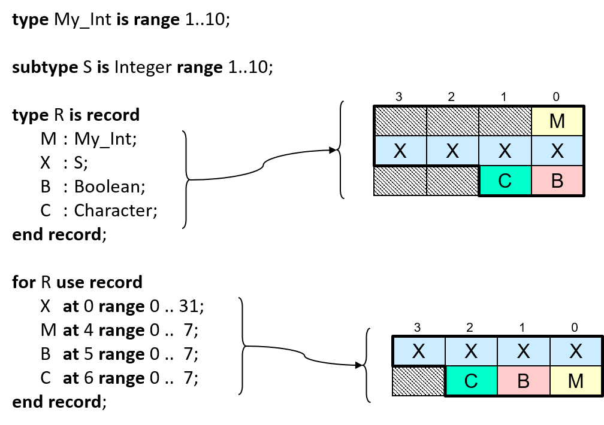

.. _Intro_Embedded_Sys_Prog_Low_Level_Programming:

Low Level Programming
=====================

.. include:: ../../global.txt

This section introduces a number of topics in low-level programming, in
which the hardware and the compiler's representation choices are much
more in view at the source code level. In comparatively high level code
these topics are "abstracted away" in that the programmer can assume
that the compiler does whatever is necessary on the current target
machine so that their code executes as intended. That approach is not
sufficient in low-level programming.

Note that we do not cover every possibility or language feature.
Instead, we cover the necessary concepts, and also potential surprises
or pitfalls, so that the parts not covered can be learned on your own.

Separation Principle
--------------------

There is a language design principle underlying the Ada facilities
intended for implementing embedded software. This design principle
directly affects how the language is used, and therefore, the
portability and readability of the resulting application code.

This language design principle is known as the "separation principle."
What's being separated? The low-level, less portable aspects of some
piece of code are separated from the usage of that piece of code.

Don't confuse this with hiding unnecessary implementation details via
compile-time visibility control (i.e., information hiding and
encapsulation). That certainly should be done too. Instead, because of
the separation principle, we specify the low-level properties of
something once, when we declare it. From then on, we can use regular Ada
code to interact with it. That way the bulk of the code |mdash| the
usage |mdash| is like any other Ada code, and doesn't propagate the
low-level details all over the client code. This greatly simplifies
usage and understandability as well as easing porting to new
hardware-specific aspects. You change things in one place, rather than
everywhere.

For example, consider a device mapped to the memory address space of the
processor. To interact with the device we interact with one or more
memory cells. Reading input from the device amounts to reading the value
at the associated memory location. Likewise, sending output to the
device amounts to writing to that location.

To represent this device mapping we declare a variable of an appropriate
type and specify the starting address the object should occupy. (There
are other ways too, but for a single, statically mapped object this is
the simplest approach.) We'd want to specify some other characteristics
as well, but let's focus on the address.

.. image:: images/memory-mapped-device.png
  :width: 600
  :alt: Memory-mapped device with Ada object declared at specific address
  :class: dark-mode-invert-image

If the hardware presents an interface consisting of multiple fields
within individual memory cells, we can use a record type instead of a
single unsigned type representing a single word. Ada allows us to
specify the exact record layout, down to the individual bit level, for
any types we may need to use for the record components. When we
declare the object we use that record type, again specifying the
starting address. Then we can just refer to the object's record
components as usual, having the compiler compute the address offsets
required to access the components representing the individual hardware
fields.

Note that we aren't saying that other languages cannot do this too. Many
can, using good programming practices. What we're saying is that those
practices are designed into the Ada way of doing it.

Guaranteed Level of Support
---------------------------

The Ada reference manual has an entire section dedicated to low-level
programming. That's section 13, "Representation Issues," which provides
facilities for developers to query and control aspects of various
entities in their code, and for interfacing to hardware. Want to specify
the exact layout for a record type's components? Easy, and the compiler
will check your layout too. Want to specify the alignment of a type?
That's easy too. And that's just the beginning. We'll talk about these
facilities as we go, but there's another point to make about this
section.

In particular, section 13 includes recommended levels of support to be
provided by language implementations, i.e., compilers and other
associated tools. Although the word "recommended" is used, the
recommendations are meant to be followed.

For example, section 13.3 says that, for some entity named X, ":ada:`X'Address`
should produce a useful result if X is an object that is aliased or of a
by-reference type, or is an entity whose :ada:`Address` has been specified."
So, for example, if the programmer specifies the address for a
memory-mapped variable, the compiler cannot ignore that specification
and instead, for the sake of performance, represent that variable using a
register. The object must be represented as an addressable entity, as
requested by the programmer. (Registers are not addressable.)

We mention this because, although the recommended levels of support are
intended to be followed, those recommendations become **requirements**
if the Systems Programming (SP) Annex is implemented by the vendor. In
that case the vendor's implementation of section 13 must support at
least the recommended levels. The SP Annex defines additional, optional
functionality oriented toward this programming domain; you want it
anyway. (Like all the annexes it adds no new syntax.) Almost all
vendors, if not literally all, implement the Annex so you can rely on
the recommended levels of support.

Querying Implementation Limits and Characteristics
--------------------------------------------------

Sometimes you need to know more about the underlying machine than is
typical for general purpose applications. For example, your numerical
analysis algorithm might need to know the maximum number of digits of
precision that a floating-point number can have on this specific
machine. For networking code, you will need to know the "endianness" of
the machine so you can know whether to swap the bytes in an Ethernet
packet. You'd go look in the :file:`limits.h` file in C implementations,
but in Ada we go to a package named :ada:`System` to get this information.

Clearly, these implementation values will vary with the hardware, so the
package declares constants with implementation-defined values. The names
of the constants are what's portable, you can count on them being the
same in any Ada implementation.

However, vendors can add implementation-defined declarations to the
language-defined content in package System. You might require some of
those additions, but portability could then suffer when moving to a new
vendor's compiler. Try not to use them unless it is unavoidable. Ideally
these additions will appear in the private part of the package, so the
implementation can use them but application code cannot.

For examples of the useful, language-defined constants, here are those
for the numeric limits of an Ada compiler for an Arm 32-bit SoC:

.. code-block:: ada

   Min_Int               : constant := Long_Long_Integer'First;
   Max_Int               : constant := Long_Long_Integer'Last;

   Max_Binary_Modulus    : constant := 2 ** Long_Long_Integer'Size;
   Max_Nonbinary_Modulus : constant := 2 ** Integer'Size - 1;

   Max_Base_Digits       : constant := Long_Long_Float'Digits;
   Max_Digits            : constant := Long_Long_Float'Digits;

   Max_Mantissa          : constant := 63;
   Fine_Delta            : constant := 2.0 ** (-Max_Mantissa);

:ada:`Min_Int` and :ada:`Max_Int` supply the most-negative and most-positive
integer values supported by the machine.

:ada:`Max_Binary_Modulus` is the largest power of two allowed as the modulus of
a modular type definition.

But a modular type need not be defined in terms of powers of two. An
arbitrary modulus is allowed, as long as it is not bigger than the
machine can handle. That's specified by :ada:`Max_Nonbinary_Modulus`, the
largest non-power-of-two value allowed as the modulus of a modular type
definition.

:ada:`Max_Base_Digits` is the largest value allowed for the requested decimal
precision in a floating-point type's definition.

We won't go over all of the above, you get the idea. Let's examine the
more important contents.

Two of the most frequently referenced constants in :ada:`System` are the
following, especially the first. (The values here are again for the Arm
32-bit SoC):

.. code-block:: ada

   Storage_Unit : constant := 8;
   Word_Size    : constant := 32;

:ada:`Storage_Unit` is the number of bits per memory storage element. Storage
elements are the components of memory cells, and typically correspond to
the individually addressable memory elements. A "byte" would correspond
to a storage element with the above constant value.

Consider a typical idiom for determining the number of whole storage
elements an object named :ada:`X` occupies:

.. code-block:: ada

  Units : constant Integer := (X'Size + Storage_Unit - 1) / Storage_Unit;

Remember that :ada:`'Size` returns a value in terms of bits. There are more
direct ways to determine that size information but this will serve as an
example of the sort of thing you might do with that constant.

A machine "word" is the largest amount of storage that can be
conveniently and efficiently manipulated by the hardware, given the
implementation's run-time model. A word consists of some number of
storage elements, maybe one but typically more than one. As the unit the
machine natively manipulates, words are expected to be independently
addressable. (On some machines only words are independently
addressable.)

:ada:`Word_Size` is the number of bits in the machine word. On a 32-bit
machine we'd expect :ada:`Word_Size` to have a value of 32; on a 64-bit
machine it would probably be 64, and so on.

:ada:`Storage_Unit` and :ada:`Word_Size` are obviously related.

Another frequently referenced declaration in package :ada:`System` is
that of the type representing memory addresses, along with a constant
for the null address designating no storage element.

.. code-block:: ada

   type Address is private;
   Null_Address : constant Address;

You may be wondering why type :ada:`Address` is a private type, since that
choice means that we programmers cannot treat it like an ordinary
(unsigned) integer value. Portability is of course the issue, because
addressing, and thus address representation, varies among computer
architectures. Not all architectures have a flat address space directly
referenced by numeric values, although that is common. Some are
represented by a base address plus an offset, for example. Therefore,
the representation for type :ada:`Address` is hidden from us, the clients.
Consequently we cannot simply treat address values as numeric values.
Don't worry, though. The operations we need are provided.

Package `System` declares these comparison functions, for example:

.. code-block:: ada

   function "<"  (Left, Right : Address) return Boolean;
   function "<=" (Left, Right : Address) return Boolean;
   function ">"  (Left, Right : Address) return Boolean;
   function ">=" (Left, Right : Address) return Boolean;
   function "="  (Left, Right : Address) return Boolean;

These functions are intrinsic, i.e., built-in, meaning that the compiler
generates the code for them directly at the point of calls. There is no
actual function body for any of them so there is no performance penalty.

Any private type directly supports the equality function, and
consequently the inequality function, as well as assignment. What we
don't get here is address arithmetic, again because we don't have a
compile-time view of the actual representation. That functionality is
provided by package :ada:`System.Storage_Elements`, a child package we will
cover later. We should say though, that the need for address arithmetic
in Ada is rare, especially compared to C.

Having type :ada:`Address` presented as a private type is not, strictly
speaking, required by the language. Doing so is a good idea for the
reasons given above, and is common among vendors. Not all vendors do,
though.

Note that :ada:`Address` is the type of the result of the query attribute
:ada:`Address`.

We mentioned potentially needing to swap bytes in networking
communications software, due to the differences in the "endianness" of
the machines communicating. That characteristic can be determined via a
constant declared in package :ada:`System` as follows:

.. code-block:: ada

   type Bit_Order is (High_Order_First, Low_Order_First);
   Default_Bit_Order : constant Bit_Order := implementation-defined;

:ada:`High_Order_First` corresponds to "Big Endian" and
:ada:`Low_Order_First` to "Little Endian." On a Big Endian machine, bit
0 is the most significant bit. On a Little Endian machine, bit 0 is the
least significant bit.

Strictly speaking, this constant gives us the default order for bits
within storage elements in record representation clauses, not the order
of bytes within words. However, we can usually use it for the byte order
too. In particular, if :ada:`Word_Size` is greater than :ada:`Storage_Unit`, a
word necessarily consists of multiple storage elements, so the default bit
ordering is the same as the ordering of storage elements in a word.

Let's take that example of swapping the bytes in a received Ethernet
packet. The "wire" format is Big Endian so if we are running on a Little
Endian machine we must swap the bytes received.

Suppose we want to retrieve typed values from a
given buffer or bytes. We get the bytes from the buffer into a variable named
:ada:`Value`, of the type of
interest, and then swap those bytes within :ada:`Value` if necessary.

.. code-block:: ada

      ...
   begin
      Value := ...

      if Default_Bit_Order /= High_Order_First then
         -- we're not on a Big Endian machine
         Value := Byte_Swapped (Value);
      end if;
   end Retrieve_4_Bytes;

We have elided the code that gets the bytes into :ada:`Value`, for the sake of
simplicity. How the bytes are actually swapped by function :ada:`Byte_Swapped`
is also irrelevant. The point here is the if-statement: the expression
compares the :ada:`Default_Bit_Order` constant to
:ada:`High_Order_First` to see if this execution is on a Big Endian
machine. If not, it swaps the bytes because the incoming bytes are
always received in "wire-order," i.e., Big Endian order.

Another important set of declarations in package :ada:`System` define the
values for priorities, including interrupt priorities. We will ignore
them until we get to the section on interrupt handling.

Finally, and perhaps surprisingly, a few declarations in package
:ada:`System` are almost always (if not actually always) ignored.

.. code-block:: ada

   type Name is implementation-defined-enumeration-type;
   System_Name : constant Name := implementation-defined;

Values of type :ada:`Name` are the names of alternative machine
configurations supported by the implementation. :ada:`System_Name` represents
the current machine configuration. We've never seen any actual use of
this.

:ada:`Memory_Size` is an implementation-defined value that is intended
to reflect the memory size of the configuration, in units of storage
elements. What the value actually refers to is not specified. Is it the
size of the address space, i.e., the amount possible, or is it the
amount of physical memory actually on the machine, or what? In any case,
the amount of memory available to a given computer is neither dependent
upon, nor reflected by, this constant. Consequently, :ada:`Memory_Size`
is not useful either.

Why have something defined in the language that nobody uses? In short,
it seemed like a good idea at the time when Ada was first defined.
Upward-compatibility concerns propagate these declarations forward as
the language evolves, just in case somebody does use them.

Querying Representation Choices
-------------------------------

As we mentioned in the introduction, in low-level programming the
hardware and the compiler's representation choices can come to the
forefront. You can, therefore, query many such choices.

For example, let's say we want to query the addresses of some objects
because we are calling the imported C :c:`memcpy` function. That function
requires two addresses to be passed to the call: one for the source, and
one for the destination. We can use the :ada:`'Address` attribute to get
those values.

We will explore importing routines and objects implemented in other
languages elsewhere. For now, just understand that we will have an Ada
declaration for the imported routine that tells the compiler how it
should be called. Let's assume we have an Ada function declared like so:

.. code-block:: ada

   function MemCopy
     (Destination : System.Address;
      Source      : System.Address;
      Length      : Natural)
   return Address
   with
     Import,
     Convention => C,
     Link_Name => "memcpy",
     Pre  => Source /= Null_Address      and then
             Destination /= Null_Address and then
             not Overlapping (Destination, Source, Length),
     Post => MemCopy'Result = Destination;
   --  Copies Length bytes from the object designated by Source to the object
   --  designated by Destination.

The three aspects that do the importing are specified after the reserved
word :ada:`with` but can be ignored for this discussion. We'll talk
about them later. The preconditions make explicit the otherwise implicit
requirements for the arguments passed to :c:`memcpy`, and the postcondition
specifies the expected result returned from a successful call. Neither
the preconditions nor the postconditions are required for importing
external entities but they are good "guard-rails" for using those
entities. If we call it incorrectly the precondition will inform us, and
likewise, if we misunderstand the result the postcondition will let us
know (at least to the extent that the return value does that).

For a sample call to our imported routine, imagine that we have a
procedure that copies the bytes of a :ada:`String` parameter into a
:ada:`Buffer` parameter, which is just a contiguous array of bytes. We need to
tell :ada:`MemCopy` the addresses of the arguments passed so we apply the
:ada:`'Address` attribute accordingly:

.. code-block:: ada

   procedure Put (This : in out Buffer; Start : Index; Value : String) is
      Result : System.Address with Unreferenced;
   begin
      Result := MemCopy (Destination => This (Start)'Address,
                         Source      => Value'Address,
                         Length      => Value'Length);
   end Put;

The order of the address parameters is easily confused so we use the
named association format for specifying the actual parameters in the
call.

Although we assign :ada:`Result` we don't otherwise use it, so we tell the
compiler this is not a mistake via the :ada:`Unreferenced` aspect. And if we
do turn around and reference it the compiler will complain, as it should.
Note that :ada:`Unreferenced` is defined by GNAT, so usage is not necessarily
portable. Other vendors may or may not implement something like it, perhaps
with a different name.

(We don't show the preconditions for :ada:`Put`, but they would have specified
that :ada:`Start` must be a valid index into this particular buffer, and that
there must be room in the :ada:`Buffer` argument for the number of bytes in
:ada:`Value` when starting at the :ada:`Start` index, so that we don't copy
past the end of the :ada:`Buffer` argument.)

There are other characteristics we might want to query too.

We might want to ask the compiler what alignment it chose for a given
object (or type, for all such objects).

For a type, when :ada:`Alignment` returns a non-zero value we can be sure that
the compiler will allocate storage for objects of the type at correspondingly
aligned addresses (unless we force it to do otherwise). Similarly, references
to dynamically allocated objects of the type will be to properly aligned
locations. Otherwise, an :ada:`Alignment` of zero means that the guarantee does
not hold. That could happen if the type is packed down
into a composite object, such as an array of :ada:`Booleans`. We'll discuss
"packing" soon. More commonly, the smallest likely value is 1, meaning
that any storage element's address will suffice. If the machine has no
particular natural alignments, then all type alignments will probably
be 1 by default. That would be somewhat rare today, though, because
modern processors usually have comparatively strict alignment requirements.

We can ask for the amount of storage associated with various entities.
For example, when applied to a task, :ada:`'Storage_Size` tells us the
number of storage elements reserved for the task's execution. The value
includes the size of the task's stack, if it has one. We aren't told if
other required storage, used internally in the implementation, is also
included in this number. Often that other storage is not included in
this number, but it could be.

:ada:`Storage_Size` is also defined for access types. The meaning is a
little complicated. Access types can be classified into those that
designate only variables and constants ("access-to-object") and those that can
designate subprograms. Each access-to-object type has an associated storage
pool. The storage allocated by :ada:`new` comes from the pool, and instances
of :ada:`Unchecked_Deallocation` return storage to the pool.

When applied to an access-to-object type, :ada:`Storage_Size` gives us
the number of storage elements reserved for the corresponding pool.

Note that :ada:`Storage_Size` doesn't tell us how much available,
unallocated space remains in a pool. It includes both allocated and
unallocated space. Note, too, that although each access-to-object type
has an associated pool, that doesn't mean that each one has a distinct,
dedicated pool. They might all share one, by default. On an operating
system, such as Linux, the default shared pool might even be implicit,
consisting merely of calls to the OS routines in C.

As a result, querying :ada:`Storage_Size` for access types and tasks is
not necessarily all that useful. Specifying the sizes, on the other hand,
definitely can be useful.

That said, we can create our own pool types and define precisely how
they are sized and how allocation and deallocation work, so in that case
querying the size for access types could be more useful.

For an array type or object, :ada:`'Component_Size` provides the size in
bits of the individual components.

More useful are the following two attributes that query a degree
of memory sharing between objects.

Applied to an object, :ada:`'Has_Same_Storage` is a Boolean function that takes
another object of any type as the argument. It indicates whether the two
objects' representations occupy exactly the same bits.

Applied to an object, :ada:`'Overlaps_Storage` is a Boolean function that takes
another object of any type as the argument. It indicates whether the two
objects' representations share at least one bit.

Generally, though, we specify representation characteristics far more
often than we query them. Rather than describe all the possibilities, we
can just say that all the representation characteristics that can be
specified can also be queried. We cover specifying representation
characteristics next, so just assume the corresponding queries are
available.

That said, there is one particular representation query we need to talk about
explicitly, now, because there is a lot of confusion about it: the
:ada:`'Size` attribute. The confusion stems from the fact that there are
multiple contexts for applying the attribute, and multiple reasonable
interpretations possible. We can apply the :ada:`'Size` attribute to a
type, in an attempt to get information about all objects of the type, or
we can apply it to individual objects to get specific information. In
both cases, what actual information do we get? In the original version
of Ada these questions weren't really answered so vendors did what they
thought was correct. But they did not agree with each other, and
portability became a problem.

For example, suppose you want to convert some value to a series of bytes
in order to send the value over the wire. To do that you need to know
how many bytes are required to represent the value. Many applications
queried the size of the type to determine that, and then, when porting
to a new vendor's compiler, found that their code no longer worked
correctly. The new vendor's implementation wasn't wrong, it was just
different.

Later versions of Ada answered these questions, where possible,
so let's examine the contexts and meaning. Above all, though, remember
that :ada:`'Size` returns values in terms of **bits**.

If we apply :ada:`'Size` to a type, the resulting value depends on the
kind of type.

For scalar types, the attribute returns the *minimum* number of bits
required to represent all the values of the type. Here's a diagram
showing what the category "scalar types" includes:

Consider type :ada:`Boolean`, which has two possible values. One bit
will suffice, and indeed the language standard requires
:ada:`Boolean'Size` to be the value 1.

This meaning also applies to subtypes, which can constrain the number of
values for a scalar type. Consider subtype :ada:`Natural`. That's a subtype
defined by the language to be type :ada:`Integer` but with a range of
:ada:`0 .. Integer'Last`.
On a 32-bit machine we would expect :ada:`Integer` to be a native type, and
thus 32-bits. On such a machine if we say :ada:`Integer'Size` we will
indeed get 32. But if we say :ada:`Natural'Size` we will get 31, not 32,
because only 31 bits are needed to represent that range on that machine.

The size of objects, on the other hand, cannot be just a matter of the
possible values. Consider type :ada:`Boolean` again, where
:ada:`Boolean'Size` is required to be 1. No compiler is likely to
allocate one bit to a :ada:`Boolean` variable, because typical machines
don't support individually-addressable bits. Instead, addresses refer to
storage elements, of a size indicated by the :ada:`Storage_Unit`
constant. The compiler will allocate the smallest number of storage
elements necessary, consistent with other considerations such as
alignment. Therefore, for a machine that has :ada:`Storage_Unit` set to
a value of eight, we can assume that a compiler for that machine will
allocate an entire eight-bit storage element to a stand-alone
:ada:`Boolean` variable. The other seven bits are simply not used by
that variable. Moreover, those seven bits are not used by any other
stand-alone object either, because access would be far less efficient,
and such sharing would require some kind of locking to prevent tasks
from interfering with each other when accessing those stand-alone
objects. (Stand-alone objects are independently addressable; they
wouldn't stand alone otherwise.)

By the same token (and still assuming a 32-bit machine), a compiler will
allocate more than 31 bits to a variable of subtype Natural because
there is no 31-bit addressable unit. The variable will get all 32-bits.

Note that we're talking about individual, stand-alone variables.
Components of composite types, on the other hand, might indeed share
bytes if the individual components don't require all the bits of their
storage elements. You'd have to request that representation, though,
with most implementations, because accessing the components at run-time
would require more machine instructions. We'll go into the details of
that later.

Let's talk further about sizes of types.

For record types, :ada:`'Size` gives the minimum number of bits required
to represent the whole composite value. But again, that's not
necessarily the number of bits required for the objects' in-memory
representation. The order of the components within the record can make
a difference, as well as their alignments. The compiler will respect the
alignment requirements of the components, and may add padding bytes
within the record and also at the end to ensure components start at
addresses compatible with their alignment requirements. As a result the
overall size could be larger.

Note that Ada compilers are allowed to reorder the components; the order
in memory might not match the order in the source code.

For example, consider this record type and its components:

.. image:: images/unoptimized-record-component-order.png
  :width: 600
  :alt: Memory allocated to a record with unoptimized layout
  :class: dark-mode-invert-image

In the figure, we see a record type with some components, and a sample
layout for that record type assuming the compiler does not reorder the
components. Observe that some bytes allocated to objects of type :ada:`R` are
unused (the darkly shaded ones). In this case that's because the
alignment of subtype :ada:`S` happens to be 4 on this machine. The component
:ada:`X` of that subtype :ada:`S` cannot start at byte offset 1, or 2, or 3,
because those addresses would not satisfy the alignment constraint of
:ada:`S`. (We're assuming byte 0 is at a word-aligned address.) Therefore,
:ada:`X` starts at the object's starting address plus 4. Components
:ada:`B` and :ada:`C` are of types that have an alignment of 1, so they
can start at any storage element.
They immediately follow the bytes allocated to component :ada:`X`.
Therefore, :ada:`R'Size` is 80, or 10 bytes. The three bytes following
component :ada:`M` are simply not used.

But what about the two bytes following the last component :ada:`C`? They could
be allocated to stand-alone objects if they would fit. More likely, though,
the compiler will allocate those two bytes to objects of type :ada:`R`, that
is, 12 bytes instead of 10 are allocated. As a result, 96 bits are
actually used in memory. The extra, unused 16 bits are "padding."

Why add unused padding? It simplifies the memory allocation of objects of type
:ada:`R`. Suppose some array type has components of record type :ada:`R`.
Assuming the first component is aligned properly, every following
component will also be aligned properly, automatically, because the two
padding bytes are considered parts of the components.

To make that work, the compiler takes the most stringent alignment of
all the record type's components and uses that for the alignment of the
overall record type. That way, any address that satisfies the record
object's alignment will satisfy the components' alignment requirements.
The alignment is component :ada:`X`, of subtype :ada:`S`, is 4. The other
components have an alignment of 1, therefore :ada:`R'Alignment` is 4. An
aligned address plus 12 will also be an aligned address.

This rounding up based on alignment is recommended behavior for the
compiler, not a requirement, but is reasonable and typical among
vendors. Although it can result in unused storage, that's the price paid
for speed of access (or even correctness for machines that would fault
on misaligned component accesses).

As you can see, alignment is a critical factor in the sizes of composite
objects. If you care about the layout of the type you very likely need
to care about the alignment of the components and overall record type.

Ada compilers are allowed to reorder the components of record types in
order to minimize these gaps or satisfy the alignment requirements of
the components. Some compilers do, some don't. Consider the type :ada:`R`
again, this time with the first two components switched in the component
declaration order:

.. image:: images/optimized-record-component-order.png
  :width: 600
  :alt: Memory allocated to a record with optimized layout
  :class: dark-mode-invert-image

Now :ada:`R'Size` will report 56 bits instead of 80. The one trailing byte will
still be padding, but only that one.

What about unbounded types, for example type :ada:`String`? Querying the
:ada:`'Size` in that case would provide an implementation-defined result.
A somewhat
silly thing to do, really, since the type |mdash| by definition |mdash|
doesn't specify how many components are involved.

Usually, though, you don't want to query the size of a type. Most of the
time what you want is the size of objects of the type. Going back to
sending values over the wire, the code should query the size of the
*parameter* holding the value to be sent. That will tell you how many
bits are really needed.

One last point: GNAT, and now Ada 202x, define an attribute named
:ada:`Object_Size`. It does just what the name suggests: what
:ada:`'Size` does when applied to objects rather than types. GNAT also
defines another attribute, named :ada:`Value_Size`, that does what
:ada:`'Size` does when applied to types. The former is far more useful
so Ada has standardized it.

Specifying Representation
-------------------------

Recall that we said :ada:`Boolean'Size` is required to be 1, and that
stand-alone objects of type :ada:`Boolean` are very likely allocated some
integral number of storage elements (e.g., bytes) in memory, typically
one. What about arrays of Booleans? Suppose we have an array of 16
Boolean components. How big are objects of the array type? It depends on
the machine. Continuing with our hypothetical (but typical)
byte-addressable machine, for the sake of efficient access each
component is almost certainly allocated an individual byte rather than a
single bit, just like stand-alone objects. Consequently, our array of 16
Booleans will be reported by :ada:`'Size` to be 128 bits, i.e., 16
bytes. If you wanted a bit-mask, in which each Boolean component is
allocated a single bit and the total array size is 16 bits, you'd have a
problem. The compiler assumes you want speed of access rather than
storage minimization, and normally that would be the right assumption.

Naturally there is a solution. Ada allows us to specify the
representation characteristics of types, and thus objects of those
types, including their bit-wise layouts. It also allows us to specify
the representation of individual objects. You should understand, though,
that the compiler is not required to do what you ask, because you might
ask the impossible. For example, if you specify that
the array of 16 Booleans is to be represented completely in 15 bits,
what can the compiler do? Rejecting that specification is the only
reasonable response. But if you specify something possible, the compiler
must do what you ask, absent some compelling reason to the contrary.

With that in mind, let's examine setting the size for types.

So, how do we specify that we want our array of 16 Boolean components
to be allocated one bit per component, for a total allocation of 16
bits? There are a couple of ways, one somewhat better than the other.

First, you can ask that the compiler "pack" the components into as small
a number of bits as it can:

.. code-block:: ada

   type Bits16 is array (0 .. 15) of Boolean with
     Pack;

That likely does what you want: :ada:`Bits16'Size` will probably be 16.

But realize that the :ada:`Pack` aspect (and corresponding pragma) is merely a
request that the compiler do its best to minimize the number of bits
allocated, not necessarily that it do exactly what you expected or
required.

We could set the size of the entire array type:

.. code-block:: ada

   type Bits16 is array (0 .. 15) of Boolean with
     Size => 16;

But the language standard says that a :ada:`Size` clause on array and record
types should not affect the internal layout of their components. That's
Implementation Advice, so not normative, but implementations are really
expected to follow the advice, absent some compelling reason. That's
what the :ada:`Pack` aspect, record representation clauses, and
:ada:`Component_Size` clauses are for. (We'll talk about record representation
clauses momentarily.) That said, at least one other vendor's compiler would
have changed the size of the array type because of the :ada:`Size` clause, so
GNAT defines a configuration pragma named :ada:`Implicit_Packing` that
overrides the default behavior. With that pragma applied, the :ada:`Size`
clause would compile and suffice to make the overall size be 16. That's a
vendor-defined pragma though, so not portable.

Therefore, the best way to set the size for the array type is to set the
size of the individual components, via the :ada:`Component_Size` aspect as the
Implementation Advice indicates. That will say what we really want,
rather than a "best effort" request for the compiler, and is portable:

.. code-block:: ada

   type Bits16 is array (0 .. 15) of Boolean with
     Component_Size => 1;

With this approach the compiler must either use the specified size for
each component or refuse to compile the code. If it compiles, objects
of the array type will be 16 bits total (plus any padding bits required to
make objects have a size that is a multiple of Storage_Unit, typically
zero on modern machines).

Now that we have a bit-mask array type, let's put it to use.

Let's say that you have an object that is represented as a simple signed
integer because, for most usage, that's the appropriate representation.
Sometimes, though, let's say you need to access individual bits of the object
instead of the whole numeric value. Signed integer types don't provide
bit-level access. In Ada we'd say that the "view" presented by the object's
type doesn't include bit-oriented operations. Therefore, we need to add a
view to the object that does provide them. A different view will require an
additional type for the same object.

Applying different types, and thus their operations, to the same object is
known as :wikipedia:`type punning <Type_punning>` in computer programming.
Realize that doing so circumvents the static strong typing we harness to
protect us from ourselves and from others. Use it with care! (For example,
limit the compile-time visibility to such code.)

One way to add a view is to express an "overlay," in which an object of one
type is placed at the same memory location as a distinct object of a different
type, thus "overlaying" one object over the other in memory. The different
types present different views, therefore different operations available for
the shared memory cells. Our hypothetical example uses two views, but you can
overlay as many different views as needed. (That said, requiring a large number
of different views of the same object would be suspect.)

There are other ways in Ada to apply different views, some more flexible than
others, but an overlay is a simple one that will often suffice.

Here is an implementation of the overlay approach, using our bit-mask array
type:

.. code-block:: ada

   type Bits32 is array (0 .. 31) of Boolean with
     Component_Size => 1;

   X : Integer;
   Y : Bits32 with Address => X'Address;

We can query the addresses of objects, and other things too, but objects,
especially variables, are the most common case. In the above, we say
:ada:`X'Address` to query the starting address of object :ada:`X`. With that
information we know what address to specify for our bit-mask overlay object
:ada:`Y`. Now :ada:`X` and :ada:`Y` are aliases for the same memory cells, and
therefore we can manipulate and query that memory as either a signed integer or
as an array of bits. Reading or updating individual array components accesses
the individual bits of the overlaid object.

Instead of the :ada:`Bits32` array type, we could have specified a modular type
for the overlay :ada:`Y` to get a view providing bit-oriented operations.
Overlaying such an array was a common idiom prior to the introduction of
modular "unsigned" types in Ada, and remains useful for accessing individual
bits. In other words, using a modular type for :ada:`Y`, you could indeed
access an individual bit by passing a mask value to the :ada:`and` operator
defined in any modular type's view. Using a bit array representation lets the
compiler do that work for you, in the generated code. The source code will be
both easier to read and more explicit about what it is doing when using the bit
array overlay.

One final issue remains: in our specific overlay example the compiler would
likely generate code that works. But strictly speaking it might not.

The Ada language rules say that for such an overlaid object
|mdash| :ada:`Y` in the example above |mdash| the compiler should not perform
optimizations regarding :ada:`Y` that it would otherwise apply in the absence
of aliases. That's necessary, functionally, but may imply degraded performance
regarding :ada:`Y`, so keep it in mind. Aliasing precludes some desirable
optimizations.

But what about :ada:`X` in the example above? We're querying that object's
address, not specifying it, so the RM rule precluding optimizations doesn't
apply to :ada:`X`. That can be problematic.

The compiler might very well place :ada:`X` in a register, for example, for the
sake of the significant performance increase (another way of being friendly).
But in that case :ada:`System.Null_Address` will be returned by the
:ada:`X'Address` query and, consequently, the declaration for :ada:`Y` will not
result in the desired overlaying.

Therefore, we should mark :ada:`X` as explicitly :ada:`aliased` to ensure that
:ada:`X'Address` is well-defined:

.. code-block:: ada

   type Bits32 is array (0 .. 31) of Boolean with
     Component_Size => 1;

   X : aliased Integer;
   Y : Bits32 with Address => X'Address;

The only difference in the version above is the addition of :ada:`aliased` in
the declaration of :ada:`X`. Now we can be certain that the optimizer will not
represent :ada:`X` in some way incompatible with the idiom, and
:ada:`X'Address` will be well-defined.

In our example :ada:`X` and :ada:`Y` are clearly declared in the same
compilation unit. Most compilers will be friendly in this scenario,
representing :ada:`X` in such a way that querying the address will return a
non-null address value even if :ada:`aliased` is not applied. Indeed,
:ada:`aliased` is relatively new to Ada, and earlier compilers typically
emitted code that would handle the overlay as intended.

But suppose, instead of being declared in the same declarative part, that
:ada:`X` was declared in some other compilation unit. Let's say it is in the
visible part of a package declaration. (Assume :ada:`X` is visible to clients
for some good reason.) That package declaration can be, and usually will be,
compiled independently of clients, with the result that :ada:`X` might be
represented in some way that cannot supporting querying the address
meaningfully.

Therefore, the declaration of :ada:`X` in the package spec should be marked as
aliased, explicitly:

.. code-block:: ada

   package P is
      X : aliased Integer;
   end P;

Then, in the client code declaring the overlay, we only declare :ada:`Y`,
assuming a with-clause for :ada:`P`:

.. code-block:: ada

   type Bits32 is array (0 .. 31) of Boolean with
     Component_Size => 1;

   Y : Bits32 with Address => P.X'Address;

All well and good, but how did the developer of the package know that some
other unit, a client of the package, would query the address of :ada:`X`, such
that it needed to be marked as aliased? Indeed, the package developer might not
know. Yet the programmer is responsible for ensuring a valid and appropriate
:ada:`Address` value is used in the declaration of :ada:`Y`. Execution is
erroneous otherwise, so we can't say what would happen in that case. Maybe an
exception is raised or a machine trap, maybe not.

Worse, the switches that were applied when compiling the spec for package
:ada:`P` can make a difference: :ada:`P.X` might not be placed in a register
unless the optimizer is enabled. Hence the client code using :ada:`Y` might
work as expected when built for debugging, with the optimizer disabled, and
then not do so when re-built for the final release. You'd probably have to
solve this issue by debugging the application.

On a related note, you may be asking yourself how to know that type
:ada:`Integer` is 32 bits wide, so that we know what size array to use for the
bit-mask. The answer is that you just have to know the target well when doing
low-level programming. The hardware becomes much more visible, as we mentioned.

That said, you could at least verify the assumption:

.. code-block:: ada

   pragma Compile_Time_Error (Integer'Object_Size /= 32,
                              "Integers expected to be 32 bits");
   X : aliased Integer;
   Y : Bits32 with Address => X'Address;

That's a vendor-defined pragma so this is not fully portable. It isn't
an unusual pragma, though, so at least you can probably get the same
functionality even if the pragma name varies.

Overlays aren't always structured like our example above, i.e., with two
objects declared at the same time. We might apply a different type to the same
memory locations at different times. Here's an example from the ADL to
illustrate the idea. We'll elaborate on this example later, in another section.

First, a package declaration, with two functions that provide a device-specific
unique identifier located in shared memory. Each function provides the same Id
value in a distinct format. One format is a string of 12 characters, the other
is a sequence of three 32-bit values. Hence both representations are the same
size.

.. code-block:: ada

   package STM32.Device_Id is

      subtype Device_Id_Image is String (1 .. 12);

      function Unique_Id return Device_Id_Image;

      type Device_Id_Tuple is array (1 .. 3) of UInt32
        with Component_Size => 32;

      function Unique_Id return Device_Id_Tuple;

   end STM32.Device_Id;

In the package body we implement the functions as two ways to access the
same shared memory, specified by :ada:`ID_Address`:

.. code-block:: ada

   with System;

   package body STM32.Device_Id is

      ID_Address : constant System.Address := System'To_Address (16#1FFF_7A10#);

      function Unique_Id return Device_Id_Image is
         Result : Device_Id_Image with Address => ID_Address, Import;
      begin
         return Result;
      end Unique_Id;

      function Unique_Id return Device_Id_Tuple is
         Result : Device_Id_Tuple with Address => ID_Address, Import;
      begin
         return Result;
      end Unique_Id;

   end STM32.Device_Id;

:ada:`System'To_Address` is just a convenient way to convert a numeric value
into an :ada:`Address` value. The primary benefit is that the call is a static
expression, but we can ignore that here. Using :ada:`Import` is a good idea to
ensure that the Ada code does no initialization of the object, since the value
is coming from the hardware via the shared memory. Doing so may not be
necessary, depending on the type used, but is a good habit to develop.

The point of this example is that we have one object declaration per function,
of a type corresponding to the intended function result type. Because each
function places their local object at the same address, they are still
overlaying the shared memory.

Now let's return, momentarily, to setting the size of entities, but now let's
focus on setting the size of objects.

We've said that the size of an object is not necessarily the same as the
size of the object's type. The object size won't be smaller, but it
could be larger. Why? For a stand-alone object or a parameter, most
implementations will round the size up to a storage element boundary, or
more, so the object size might be greater than that of the type. Think
back to :ada:`Boolean`, where :ada:`Size` is required to be 1, but stand-alone
objects are probably allocated 8 bits, i.e., an entire storage element (on our
hypothetical byte-addressed machine).

Likewise, recall that numeric type declarations are mapped to underlying
hardware numeric types. These underlying numeric types provide at least
the capabilities we request with our type declarations, e.g., the range
or number of digits, perhaps more. But the mapped numeric hardware type
cannot provide less than requested. If there is no underlying hardware
type with at least our requested capabilities, our declarations won't compile.
That mapping means that specifying the size of a numeric type doesn't
necessarily affect the size of objects of the type. That numeric
hardware type is the size that it is, and is fixed by the hardware.

For example, let's say we have this declaration:

.. code-block:: ada

   type Device_Register is range 0 .. 2**5 - 1 with Size => 5;

That will compile successfully, because there will be a signed integer
hardware type with at least that range. (Not necessarily, legally
speaking, but realistically speaking, there will be such a hardware
type.) Indeed, it may be an 8-bit signed integer, in which case
:ada:`Device_Register'Size` will give us 5, but objects of the type will have a
size of 8, unavoidably, even though we set :ada:`Size` to 5.

The difference between the type and object sizes can lead to potentially
problematic code:

.. code-block:: ada

   type Device_Register is range 0 .. 2**8 - 1 with Size => 8;

   My_Device : Device_Register
     with Address => To_Address (...);

The code compiles successfully, and tries to map a byte to a hardware
device that is physically connected to one storage element in the
processor memory space. The actual address is elided as it is not
important here.

That code might work too, but it might not. We might think that
:ada:`My_Device'Size` is 8, and that :ada:`My_Device'Address` points at an
8-bit location. However, this isn't necessarily so, as we saw with the
supposedly 5-bit example earlier. Maybe the smallest signed integer the
hardware has is 16-bits wide. The code would compile because a 16-bit
signed numeric type can certainly handle the 8-bit range requested.
:ada:`My_Device'Size` would be then 16, and because :ada:`'Address` gives us
the *starting* storage element, :ada:`My_Device'Address` might designate the
high-order byte of the overall 16-bit object. When the compiler reads
the two bytes for :ada:`My_Device` what will happen? One of the bytes will be
the data presented by the hardware device mapped to the memory. The
other byte will contain undefined junk, whatever happens to be in the
memory cell at the time. We might have to debug the code a long time to
identify that as the problem. More likely we'll conclude we have a
failed device.

The correct way to write the code is to specify the size of the
object instead of the type:

.. code-block:: ada

   type Device_Register is range 0 .. 2**8 - 1;

   My_Device : Device_Register with
     Size => 8,
     Address => To_Address (...);

If the compiler cannot support stand-alone 8-bit objects for the type, the code
won't compile.

Alternatively, we could change the earlier :ada:`Size` clause on the
type to apply :ada:`Object_Size` instead:

.. code-block:: ada

   type Device_Register is range 0 .. 2**8 - 1 with Object_Size => 8;

   My_Device : Device_Register with
     Address => To_Address (...);

The choice between the two approaches comes down to personal preference,
at least if only a small number of stand-alone objects of the type are
going to be declared. With either approach, if the implementation cannot
support 8-bit stand-alone objects, we find out that there is a problem at
compile-time. That's always cheaper than debugging.

You might conclude that setting the :ada:`Size` for a type serves no purpose.
That's not an unreasonable conclusion, given what you've seen, but in
fact there are reasons to do so. However, there are only a few specific
cases so we will save the reasons for the discussions of the specific
cases.

There is one general case, though, for setting the :ada:`'Size` of a type.
Specifically, you may want to specify the size that you think is the
minimum possible, and you want the compiler to confirm that belief. This
would be one of the so-called "confirming" representation clauses, in
which the representation detail is what the compiler would have chosen
anyway, absent the specification. You're not actually changing anything,
you're just getting confirmation via :ada:`Size` whether or not the compiler
accepts the clause. Suppose, for example, that you have an enumeration type
with 256 values. For enumeration types, the compiler allocates the smallest
number of bits required to represent all the values, rounded up to the
nearest storage element. (It's not like C, where enums are just named
int values.) For 256 values, an eight-bit byte would suffice, so setting
the size to 8 would be confirming. But suppose we actually had 257
enumerals, accidentally? Our size clause set to 8 would not compile, and
we'd be told that something is amiss.

However, note that if your supposedly "confirming" size clause actually
specifies a size larger than what the compiler would have chosen, you won't
know, because the compiler will silently accept sizes larger than necessary. It
just won't accept sizes that are too small.

There are other confirming representation clauses as well. Thinking
again of enumeration types, the underlying numeric values are
integers, starting with zero and consecutively increasing from there
up to N-1, where N is the total number of enumeral values.

For example:

.. code-block:: ada

   type Commands is (Off, On);

   for Commands use (Off => 0, On => 1);

As a result, :ada:`Off` is encoded as 0 and :ada:`On` as 1. That specific
underlying encoding is guaranteed by the language, as of Ada 95, so this is
just a confirming representation clause nowadays. But it was not guaranteed in
the original version of the language, so if you wanted to be sure of the
encoding values you would have specified the above. It wasn't necessarily
confirming before Ada 95, in other words.

But let's also say that the underlying numeric values are not what you
want because you're interacting with some device and the commands are
encoded with values other than 0 and 1. Maybe you want to use an
enumeration type because you want to specify all the possible values
actually used by clients. If you just used some numeric type instead and
made up constants for :ada:`On` and :ada:`Off`, there's nothing to keep clients
from using other numeric values in place of the two constants (absent some
comparatively heavy code to prevent that from happening). Better to use
the compiler to make that impossible in the first place, rather than
debug the code to find the incorrect values used. Therefore, we could
specify different encodings:

.. code-block:: ada

   for Commands use (Off => 2, On => 4);

Now the compiler will use those encoding values instead of 0 and 1,
transparently to client code.

The encoding values specified must maintain the relative ordering,
otherwise the relational operators won't work correctly. For example,
for type Commands above, Off is less than On, so the specified encoding
value for Off must be less than that of On.

Note that the values given in the example no longer increase consecutively,
i.e., there's a gap. That gap is OK, in itself. As long as we use the two
enumerals the same way we'd use named constants, all is well. Otherwise,
there is both a storage issue and a performance issue possible. Let's
say that we use that enumeration type as the index for an array type.
Perfectly legal, but how much storage is allocated to objects of this
array type? Enough for exactly two components? Four, with two unused? The
answer depends on the compiler, and is therefore not portable. The bigger the
gaps, the bigger the overall storage difference possible. Likewise,
imagine we have a for-loop iterating over the index values of one of
these array objects. The for-loop parameter cannot be coded by the
compiler to start at 0, clearly, because there is no index (enumeration)
value corresponding to 0. Similarly, to get the next index, the compiler
cannot have the code simply increment the current value. Working around
that takes some extra code, and takes some extra time that would not be
required if we did not have the gaps.

The performance degradation can be significant compared to the usual
code generated for a for-loop. Some coding guidelines say that you
shouldn't use an enumeration representation clause for this reason, with
or without gaps. Now that Ada has type predicates we could limit the
values used by clients for a numeric type, so an enumeration type is not
the only way to get a restricted set of named, encoded values.

.. code-block:: ada

   type Commands is new Integer with
      Static_Predicate => Commands in 2 | 4;

   On    : constant Commands := 2;
   Off   : constant Commands := 4;

The storage and performance issues bring us back to confirming clauses.
We want the compiler to recognize them as such, so that it can generate
the usual code, thereby avoiding the unnecessary portability and
performance issues. Why would we have such a confirming clause now? It
might be left over from the original version of the language, written
before the Ada 95 change. Some projects have lifetimes of several
decades, after all, and changing the code can be expensive (certified
code, for example). Whether the compiler does recognize confirming
clauses is a feature of the compiler implementation. We can expect a
mature compiler to do so, but there's no guarantee.

Now let's turn to what is arguably the most common representation
specification, that of record type layouts.

Recall from the discussion above that Ada compilers are allowed to
reorder record components in physical memory. In other words, the
textual order in the source code is not necessarily the physical order
in memory. That's different from, say, C, where what you write is what
you get, and you better know what you're doing. On some targets a
misaligned :c:`struct` component access will perform very poorly, or even
trap and halt, but that's not the C compiler's fault. In Ada you'd have to
explicitly specify the problematic layout. Otherwise, if compilation is
successful, the Ada compiler must find a representation that will work,
either by reordering the components or by some other means. Otherwise it
won't compile.

GNAT did not reorder components until relatively recently but does now,
at least for the more egregious performance cases. It does this reordering
silently, too, although there is a switch to have it warn you when it does.
To prevent reordering, GNAT defines a pragma named
:ada:`No_Component_Reorder` that does what the name suggests. You can apply
it to individual record types, or globally, as a configuration pragma. But
of course because the pragma is vendor defined it is not portable.

Therefore, if you care about the record components' layout in memory, the
best approach is to specify the layout explicitly. For example, perhaps you
are passing data to code written in C. In that case, you need the component
order in memory to match the order given in the corresponding C struct
declaration. That order in memory is not necessarily guaranteed from the
order in the Ada source code. The Ada compiler is allowed to chose the
representation unless you specify it, and it might chose a different layout
from the one given. (Ordinarily, letting the compiler chose the layout is the
most desirable approach, but in this case we have an external layout
requirement.)

Fortunately, specifying a record type's layout is straightforward.
The record layout specification consists of the storage places for some
or all components, specified with a record representation clause. This
clause specifies the order, position, and size of components (including
discriminants, if any).

The approach is to first define the record type, as usual, using any
component order you like |mdash| you're about to specify the physical
layout explicitly, in the next step.

Let's reuse that record type from the earlier discussion:

.. code-block:: ada

   type My_Int is range 1 .. 10;

   subtype S is Integer range 1 .. 10;

   type R is record
      M : My_Int;
      X : S;
      B : Boolean;
      C : Character;
   end record;

The resulting layout might be like so, assuming the compiler doesn't reorder
the components:

.. image:: images/unoptimized-record-component-order.png
  :width: 600
  :alt: Memory allocated to a record with unoptimized layout
  :class: dark-mode-invert-image

As a result, :ada:`R'Size` will be 80 bits (10 bytes), but those last two bytes
will be will be allocated to objects, for an :ada:`Object_Size` of 96 bits (12
bytes). We'll change that with an explicit layout specification.

Having declared the record type, the second step consists of defining
the corresponding record representation clause giving the components'
layout. The clause uses syntax that somewhat mirrors that of a record
type declaration. The components' names appear, as in a record type
declaration. But now, we don't repeat the components' types, instead we
give their relative positions within the record, in terms of a relative
offset that starts at zero. We also specify the bits we want them to
occupy within the storage elements starting at that offset.

.. code-block:: ada

   for R use record
      X at 0 range 0 .. 31;  -- note the order swap,
      M at 4 range 0 ..  7;  -- with this component
      B at 5 range 0 ..  7;
      C at 6 range 0 ..  7;
   end record;

Now we'll get the optimized order, and we'll always get that order, or
the layout specification won't compile in the first place. In the
following diagram, both layouts, the default, and the one resulting from
the record representation clause, are depicted for comparison:

:ada:`R'Size` will be 56 bits (7 bytes), but that last padding byte will also
be allocated to objects, so the :ada:`Object_Size` will be 64 bits (8 bytes).

Notice how we gave each component an offset, after the reserved word
:ada:`at`. These offsets are in terms of storage elements, and specify their
positions within the record object as a whole. They are relative to the
beginning of the memory allocated to the record object so they are
numbered starting at zero. We want the :ada:`X` component to be the very first
component in the allocated memory so the offset for that one is zero.
The :ada:`M` component, in comparison, starts at an offset of 4 because we are
allocating 4 bytes to the prior component :ada:`X`: bytes 0 through 3
specifically. :ada:`M` just occupies one storage element so the next component,
:ada:`B`, starts at offset 5. Likewise, component :ada:`C` starts at offset 6.

Note that there is no requirement for the components in the record
representation clause to be in any particular textual order. The offsets alone
specify the components' order in memory. A good style, though, is to order the
components in the representation clause so that their textual order
corresponds to their order in memory. Doing so facilitates our verifying that
the layout is correct because the offsets will be increasing as we read the
specification.

An individual component may occupy part of a single storage element, all
of a single storage element, multiple contiguous storage elements, or a
combination of those (i.e., some number of whole storage elements but
also part of another). The bit "range" specifies this bit-specific
layout, per component, by specifying the first and last bits occupied.
The :ada:`X` component occupies 4 complete 8-bit storage elements, so the bit
range is 0 through 31, for a total of 32 bits. All the other components
each occupy an entire single storage element so their bit ranges are 0
through 7, for a total of 8 bits.

The text specifying the offset and bit range is known as a
"component_clause" in the syntax productions. Not all components need be
specified by component_clauses, but (not surprisingly) at most one
clause is allowed per component. Really none are required but it would
be strange not to have some. Typically, all the components are given
positions. If component_clauses are given for all components, the
record_representation_clause completely specifies the representation of
the type and will be obeyed exactly by the implementation.

Components not otherwise given an explicit placement are given positions
chosen by the compiler. We don't say that they "follow" those explicitly
positioned because there's no requirement that the explicit positions
start at offset 0, although it would be unusual not to start there.

Placements must not make components overlap, except for components of
variant parts, a topic covered elsewhere. You can also specify the
placement of implementation-defined components, as long as you have a
name to refer to them. (In addition to the components listed in the
source code, the implementation can add components to help implement
what you wrote explicitly.) Such names are always attribute
references but the specific attributes, if any, are
implementation-defined. It would be a mistake for the compiler to define
such implicit components without giving you a way to refer to them.
Otherwise they might go exactly where you want some other component to
be placed, or overlap that place.

The positions (offsets) and the bit numbers must be static, informally
meaning that they are known at compile-time. They don't have to be
numeric literals, though. Numeric constants would work, but literals are
the most common by far.

Note that the language does not limit support for component clauses to
specific component types. They need not be one of the integer types, in
particular. For example, a position can be given for components that are
themselves record types, or array types. Even task types are allowed as
far as the language goes, although the implementation might require a
specific representation, such as the component taking no bits whatsoever
(:ada:`0 .. -1`). There are restrictions that keep things sane, for
example rules about how a component name can be used within the overall
record layout construct, but not restrictions on the types allowed for
individual components. For example, here is a record layout containing a
:ada:`String` component, arbitrarily set to contain 11 characters:

.. code-block:: ada

   type R is record
      S : String (1 .. 11);
      B : Boolean;
   end record;

   for R use record
      S at 0  range 0 .. 87;
      B at 11 range 0 .. 7;
   end record;

Component :ada:`S` is to be the first component in memory in this example,
hence the position offset is 0, for the first byte of :ada:`S`. Next, :ada:`S`
is 11 characters long, or 88 bits, so the bit range is 0 .. 87. That's 11
bytes of course, so :ada:`S` occupies storage elements 0 .. 10. Therefore, the
next component position must be at least 11, unless there is to be a
gap, in which case it would be greater than 11. We'll place :ada:`B`
immediately after the last character of :ada:`S`, so :ada:`B` is at storage
element offset 11 and occupying all that one byte's bits.

We'll have more to say about record type layouts but first we need to talk
about alignment.

Modern target architectures are comparatively strict about the address
alignments for some of their types. If the alignment is off, an access
to the memory for objects of the type can have highly undesirable
consequences. Some targets will experience seriously degraded
performance. On others, the target will halt altogether. As you can see,
getting the alignment correct is a low-level, but vital, part of correct
code on these machines.

Normally the compiler does this work for us, choosing an alignment that
is both possible for the target and also optimal for speed of access.
You can, however, override the compiler's alignment choice using an
attribute definition clause or the :ada:`Alignment` aspect. You can do
so on types other than record types, but specifying it on record types
is typical. Here's our example record type with the alignment specified
via the aspect:

.. code-block:: ada

   type My_Int is range 1 .. 10;

   subtype S is Integer range 1 .. 10;

   type R is record
      M : My_Int;
      X : S;
      B : Boolean;
      C : Character;
   end record with
      Alignment => 1;

Alignment values are in terms of storage elements. The effect of the
aspect or attribute clause is to ensure that the starting address of the
memory allocated to objects of the type will be a multiple of the
specified value.

In fact, whenever we specify a record type layout we really should also
specify the record type's alignment, even though doing so is optional.
Why? The alignment makes a difference in the overall record object's
size. We've seen that already, with the padding bytes: the compiler will
respect the alignment requirements of the components, and may add
padding bytes within the record and also at the end to ensure components
start at addresses compatible with their alignment requirements. The
alignment also affects the size allocated to the record type even when
the components are already aligned. As a result the overall size could
be larger than we want for the sake of space. Additionally, when we pass
such objects to code written in other languages, we want to ensure that
the starting address of these objects is aligned as the external code
expects. The compiler might not choose that required alignment by
default.

Specifying alignment for record types is so useful that in the first
version of Ada there was no syntax to specify alignment for anything
other than record types (via the obsolete :ada:`at mod` clause on record
representation clauses).

For that reason GNAT provides a pragma named :ada:`Optimize_Alignment`. This is
a configuration pragma that affects the compiler's choice of default
alignments where no alignment is explicitly specified. There is a
time/space trade-off in the selection of these values, as we've seen.
The normal choice tries to balance these two characteristics, but with
an argument to the pragma you can give more weight to one or the other.
The best approach is to specify the alignments explicitly, per type, for
those that require specific alignment values. The pragma has the nice
property of giving general guidance to the compiler for what should be
done for the other types and objects not explicitly specified.

Now let's look into the details. We'll use a case study for this
purpose, including specifying sizes as well as alignments.

The code for the case study is as follows. It uses :ada:`Size` clauses to
specify the :ada:`Size`\ s, instead of the :ada:`Size` aspect, just to
emphasize that the :ada:`Size` clause approach is not obsolete.

.. code-block:: ada

   package Some_Types is

      type Temperature is range -275 .. 1_000;

      type Identity is range 1 .. 127;

      type Info is record
         T  : Temperature;
         Id : Identity;
      end record;

      for Info use record
         T  at 0 range 0 .. 15;
         Id at 2 range 0 .. 7;
      end record;

      for Info'Size use 24;

      type List is array (1 .. 3) of Info;
      for List'Size use 24 * 3;

   end Some_Types;

When we compile this, the compiler will complain that the size for
:ada:`List` is too small, i.e., that the minimum allowed is 96 bits instead
of the 72 we specified. We specified 24 * 3 because we said the record
size should be 24 bits, and we want our array to contain 3 record
components of that size, so 72 seems right.

What's wrong? As we've shown earlier, specifying the record type size
doesn't necessarily mean that objects (in this case array components)
are that size. The object size could be bigger than we specified for the
type. In this case, the compiler says we need 96 total bits for the
array type, meaning that each of the 3 array components is 32 bits wide
instead of 24.

Why is it 32 bits? Because the alignment for :ada:`Info` is 2 (on this
machine). The record alignment is a multiple of the largest
alignment of the enclosed components. The alignment for type :ada:`Temperature`
(2), is larger than the alignment for type :ada:`Identity` (1), therefore the
alignment for the whole record type is 2. We need to go from that number
of storage elements to a number of bits for the size.

Here's where it gets subtle. The alignment is in terms of storage
elements. Each storage element is of a size in bits given by
:ada:`System.Storage_Unit`. We've said that on our hypothetical machine
:ada:`Storage_Unit` is 8, so storage elements are 8 bits wide on this machine.
Bytes, in other words. Therefore, to get the required size in bits, we
have to find a multiple of the two 8-bit bytes (specified by the
alignment) that has at least the number of bits we gave in the :ada:`Size`
clause. Two bytes only provides 16 bits, so that's not big enough, we
need at least 24 bits. The next multiple of 2 bytes is 4 bytes,
providing 32 bits, which is indeed larger than 24. Therefore, the
overall size of the record type, consistent with the alignment, is 4
bytes, or 32 bits. That's why the compiler says each array component is
32 bits wide.

But for our example let's say that we really want to use only 72 total
bits for the array type (and that we want three array components).
That's the size we specified, after all. So how do we get the record
type to be 24 bits instead of 32? Yes, you guessed it, we change the
alignment for the record type. If we change it from 2 to 1, the size of
24 bits will work. Adding this :ada:`Alignment` clause line will do that:

.. code-block:: ada

   for Info'Alignment use 1;

An alignment of 1 means that any address will work, assuming that
addresses refer to entire storage elements. (An alignment of 0 would
mean that the address need not start on a storage element boundary, but
we know of no such machines.)

We can even entirely replace the :ada:`Size` clause with the :ada:`Alignment`
clause, because the :ada:`Size` clause specifying 24 bits is just confirming:
it's the value that :ada:`'Size` would return anyway. The problem is the object
size.

Now, you may be wondering why an alignment of 1 would work, given that
the alignment of the :ada:`Temperature` component is 2. Wouldn't it slow down
the code, or even trap? Well, maybe. It depends on the machine. If it
doesn't work we would just have to use 32 bits for the record type, with
the original alignment of 2, for a larger total array size. Of course, if the
compiler recognizes that a representation cannot be supported it must reject
the code, but the compiler might not recognize the problem.

We said earlier that there are only a small number of reasons to specify
:ada:`'Size` for a type. We can mention one of them now. Setting :ada:`'Size`
can be useful to give the minimum number of bits to use for a component
of a packed composite type, that is, within either a record type or an
array type that is explicitly packed via the aspect or pragma :ada:`Pack`. It
says that the compiler, when giving its best effort, shouldn't compress
components of the type any smaller than the number of bits specified.
No, it isn't earth-shattering, but other uses are more valuable, to be
discussed soon.

One thing we will leave unaddressed (pun intended) is the question of
bit ordering and byte ordering within our record layouts. In other
words, the "endian-ness". That's a subject beyond the scope of this
course. Suffice it to say that GNAT provides a way to specify record
layouts that are independent of the endian-ness of the machine, within
some implementation-oriented limits. That's obviously useful when the
code might be compiled for a different ISA in the future. On the other
hand, if your code is specifically for a single ISA, e.g. Arm, even if
different boards and hardware vendors are involved, there's no need to
be independent of the endian-ness. It will always be the same in that
case. (Those are "famous last words" though.) For an overview of the
GNAT facility, an attribute named attribute :ada:`Scalar_Storage_Order`
see
https://www.adacore.com/papers/lady-ada-mediates-peace-treaty-in-endianness-war.

Although specifying record type layouts and alignments are perhaps the
most common representation characteristics expressed, there are a couple
of other useful cases. Both involve storage allocation.

One useful scenario concerns tasking. We can specify the number of
storage elements reserved for the execution of a task object, or all
objects of a task type. You use the :ada:`Storage_Size` aspect to do so:

.. code-block:: ada

   task Servo with
     Storage_Size => 1 * 1024,
     ...

Or the corresponding pragma:

.. code-block:: ada

   task Servo is
      pragma Storage_Size (1 * 1024);
   end Servo;

The aspect seems textually cleaner and lighter unless you have task
entries to declare as well. In that case the line for the pragma
wouldn't add all that much. That's a matter of personal aesthetics
anyway.

The specified number of storage elements includes the size of
the task's stack (GNAT does have one, per task). The language does not
specify whether or not it includes other storage associated with the
task used for implementing and managing the task execution. With GNAT,
the extent of the primary stack size is the value returned, ignoring any
other storage used internally in the run-time library for managing the
task.

The GNAT run-time library allocates a default stack amount to each task,
with different defaults depending on the underlying O.S., or lack
thereof, and the target. You need to read the documentation to find the
actual amount, or, with GNAT, read the code.

You would need to specify this amount in order to either increase or
decrease the allocated storage. If the task won't run properly, perhaps
crashing at strange and seemingly random places, there's a decent chance
it is running out of stack space. That might also be the reason if you
have a really deep series of subprogram calls that fails. The correction
is to increase the allocation, as shown above. How much? Depends on the
application code. The quick-and-dirty approach is to iteratively
increase the allocation until the task runs properly. Then, reverse the
approach until it starts to fail again. Add a little back until it runs,
and leave it there. We'll mention a much better approach momentarily
(:program:`GNATstack`).

Even if the task doesn't seem to run out of task stack, you might want
to reduce it anyway, to the extent possible, because the total amount of
storage on your target might be limited. Some of the GNAT bare-metal
embedded targets have very small amounts of memory available, so much so that
the default task stack allocations would exhaust the memory available
quickly. That's what the example above does: empirical data showed that
the :ada:`Servo` task could run with just 1K bytes allocated, so we reduced it
from the default accordingly. (We specified the size with that
expression for the sake of readability, relative to using literals
directly.)

Notice we said "empirical data" above. How do we know that we exercised
the task's thread of control exhaustively, such that the arrived-at
allocation value covers the worst case? We don't, not with certainty. If
we really must know the allocation will suffice for all cases, say
because this is a high-integrity application, we would use
:program:`GNATstack`. GNATstack is an offline tool that exploits data generated
by the compiler to compute worst-case stack requirements per subprogram and per
task. As a static analysis tool, its computation is based on information
known at compile time. It does not rely on empirical run-time
information.

The other useful scenario for allocating storage concerns access types,
specifically access types whose values designate objects, as opposed to
designating subprograms. (Remember, objects are either variables or
constants.) There is no notion of dynamically allocating procedures and
functions in Ada so access-to-subprogram types are not relevant here.
But objects can be of protected types (or task types), and protected
objects can "contain" entries and protected subprograms, so there's a lot
of expressive power available. You just don't dynamically
allocate procedures or functions as such.

First, a little background on access types, to supplement what we said earlier.

By default, the implementation chooses a standard storage pool for each
named access-to-object type. The storage allocated by an allocator (i.e.,
:ada:`new`) for such a type comes from the associated pool.

Several access types can share the same pool. By default, the
implementation might choose to have a single global storage pool, used
by all such access types. This global pool might consist merely of calls
to operating system routines (e.g., :c:`malloc`), or it might be a
vendor-defined pool instead. Alternatively, the implementation might
choose to create a new pool for each access-to-object type, reclaiming
the pool's memory when the access type goes out of scope (if ever).
Other schemes are possible.

Finally, users may define new pool types, and may override the choice of
pool for an access-to-object type by specifying :ada:`Storage_Pool` for
the type. In this case, allocation (via :ada:`new`) takes memory from
the user-defined pool and deallocation puts it back into that pool,
transparently.

With that said, here's how to specify the storage to be used for an
access-to-object type. There are two ways to do it.

If you specify :ada:`Storage_Pool` for an access type, you indicate a
specific pool object to be used (user-defined or vendor-defined). The
pool object determines how much storage is available for allocation via
:ada:`new` for that access type.

Alternatively, you can specify :ada:`Storage_Size` for the access type.
In this case, an implementation-defined pool is used for the access
type, and the storage available is at least the amount requested, maybe
more (it might round up to some advantageous block size, for example).
If the implementation cannot satisfy the request, :ada:`Storage_Error` is
raised.

It should be clear that that the two alternatives are mutually
exclusive. Therefore the compiler will not allow you to specify both.

Each alternative has advantages. If your only concern is the total
number of allocations possible, use :ada:`Storage_Size` and let the
implementation do the rest. However, maybe you also care about the
behavior of the allocation and deallocation routines themselves, beyond
just providing and reclaiming the storage. In that case, use
:ada:`Storage_Pool` and specify a pool object of the appropriate type.
For example, you (or the vendor, or someone else) might create a pool
type in which the allocation routine performs in constant time, because
you want to do :ada:`new` in a real-time application where
predictability is essential.

Lastly, an idiom: when using :ada:`Storage_Size` you may want to specify
a value of zero. That means you intend to do no allocations whatsoever,
and want the compiler to reject the code if you try. Why would you want an
access type that doesn't allow dynamically allocating objects? It isn't as
unreasonable as it might sound. If you plan to use the access type
strictly with aliased objects, never doing any allocations, you can have
the compiler enforce your intent. There are application domains that
prohibit dynamic allocations due to the difficulties in analyzing their
behavior, including issues of fragmentation and exhaustion. Access types
themselves are allowed in these domains. You'd simply use them to designate
aliased objects alone. In addition, in this usage scenario, if the
implementation associates an actual pool with each access type, the
pool's storage would be wasted since you never intend to allocate any
storage from it. Specifying a size of 0 tells the implementation not to
waste that storage.

Before we end this section, there is a GNAT compiler switch you should
know about. Th ``-gnatR?`` switch instructs the compiler to list the
representation details for the types, objects and subprograms in the
compiled file(s). Both implementation-defined and user-defined
representation details are presented. The '?' is just a placeholder and
can be one of the following characters:

   ``[0|1|2|3|4][e][j][m][s]``

Increasing numeric values provide increasing amounts of information. The
default is '1' and usually will suffice. See the GNAT User's Guide for
Native Platforms for the details of the switch in
:gnat_ugn_url:`section 4.3.15 Debugging Control <building_executable_programs_with_gnat.html#debugging-control>`.

You'll have to scroll down some to find that specific switch but it is
worth finding and remembering. When you cannot understand what the
compiler is telling you about the representation of something, this
switch is your best friend.

Unchecked Programming
---------------------

Ada is designed to be a reliable language by default, based as it is on
static strong typing and high-level semantics. Many of the pitfalls that
a developer must keep in the back of their mind with other languages do
not apply in Ada, and are typically impossible. That protection extends
to low-level programming as well, e.g., the Separation Principle.
Nevertheless, low-level programming occasionally does require mechanisms
that allow us to go beyond the safety net provided by the type rules and
high-level language constructs.

One such mechanism (unchecked conversion) provides a way to circumvent
the type system, a system otherwise firmly enforced by the compiler on
our behalf. Note that by "circumventing the type system" we do not
include so-called "checked" conversions. These conversions have
meaningful semantics, and are, therefore, allowed by the language using a
specific syntax. This conversion syntax is known as "functional" syntax
because it looks like a function call, except that the "function" name is
a type name, and the parameter is the object or value being converted to
that type. These conversions are said to be "checked" because only
specific kinds of types are allowed, and the compiler checks that such
conversions are indeed between these allowed types.

Instead, this section discusses "unchecked" programming, so-called
because the compiler does not check for meaningful semantics. There are
multiple mechanisms for unchecked programming in Ada: in addition to
circumventing the type system, we can also deallocate a
previously-allocated object, and can create an access value without the
usual checks. In all cases the responsibility for correct meaning and
behavior rests on the developer. Very few, if any, checks are done by
the compiler. If we convert a value to another type that generally makes
no sense, for example a task object converted to a record type, we are
on our own. If we deallocate an allocated object more than once, it is
our fault and Bad Things inevitably result.

Likened to "escape hatches," the facilities for unchecked programming
are explicit in Ada. Their use is very clear in the source code, and is
relatively heavy: each mechanism is provided by the language in the form
of a generic library subprogram that must be specified in a context clause
("with-clause") at the top of the file, and then instantiated prior to
use, like any generic. For an introduction to generic units in Ada, see
that section in the introductory Ada course:
:doc:`Introduction to Ada </courses/intro-to-ada/chapters/generics>`

You should understand that the explicitly unchecked facilities in Ada
are no more unsafe than the implicitly unchecked facilities in other
languages. There's no safety-oriented reason to "drop down" to C, for example,
to do low-level programming. For that matter, the low-level programming
facilities in Ada are at least as powerful as those in other languages,
and probably more so.

We will explore unchecked storage deallocation in a separate book so
let's focus on unchecked type conversions.

Unchecked type conversions are achieved by instantiating this
language-defined generic library function, a "child" of the root package
named "Ada":

.. code-block:: ada

   generic
      type Source(<>) is limited private;
      type Target(<>) is limited private;
   function Ada.Unchecked_Conversion (S : Source) return Target
      with Pure, Nonblocking, Convention => Intrinsic;

The function, once instantiated and eventually invoked, returns the caller's
value passed to :ada:`S` (of type :ada:`Source`) as if it is a value of type
:ada:`Target`. That value can then be used in any way consistent with the
:ada:`Target` type.

The two generic parameters, :ada:`Source` and :ada:`Target`, are defined in a
manner that makes them very permissive in terms of the types they will accept
when instantiated. To understand how, you need to understand a little
bit of Ada's terminology and design for generic unit parameters. (If you
are already familiar with generic formal types and how they are matched,
feel free to skip this material.)

First, the terminology. The type parameters defined by a generic unit
are known as "generic formal types," or "generic formals" for short.
Types :ada:`Source` and :ada:`Target` are the generic formals in the unit
above. When instantiating such a generic, clients must specify a type for each
generic formal type. The types specified by the client are known as
"generic actual types," or "generic actuals" for short. You can remember
that by the fact that the actuals are the types "actually" given to the
generic unit to work with when instantiated. (You may laugh, but that
mnemonic works.)

Now we're ready to discuss the language design concept. The idea is
that the syntax of a generic formal type indicates what kind of generic
actual is required for a legal instantiation. This is known as the
"Contract Model" because we can think of the formal parameters as
expressing a contract between the generic unit's implementation and the
client code that instantiates the generic. The contract is enforced by
the compiler, in that it will reject any instantiation that attempts to
specify some actual type that does not match the formal's requirements.

For example, if the generic computes some value for any floating point
type, that floating-point type would be declared as a generic formal
type, and would be defined so that only some floating-point type
could be used for the corresponding actual type:

.. code-block:: ada

   generic
      type Real is digits <>;

The formal parameter syntax reflects the syntax of a floating-point type
declaration, except that the :ada:`<>` (the "box") indicates that the generic
does not care how many digits are available. The generic actual will be
some floating point type and it will specify the number of decimal
digits.

If instead we try to match that formal with some actual that is anything
other than a floating-point type the compiler will reject the instantiation.
Therefore, within the generic body, the implementation code can be
written with the assurance that the characteristics and capabilities
required of a floating point type will be available. That's the Contract
Model in full: the requirements are a matter of the generic unit's
purpose and implementation, so the formal parameters reflect those
requirements and the compiler ensures they will be met.

Some generic units, though, do not require specifically numeric actual
types. These generics can use less specific syntax for their formal types,
and as a result, more kinds of actual types are permitted in the
instantiations. Remember the Contract Model and this will make sense.
The contract between the generic and the clients is, in this case, more
permissive: it does not require a numeric type in order to implement
whatever it does.

For illustration, suppose we want a generic procedure that will exchange
two values of some type. What operations does the generic unit require
in the implementation in order to swap two values? There are two:
assignment, as you might expect, but also the ability to declare objects
of the type (the "temporary" used to hold one of the values during the
swap steps). As long as the body can do that, any type will suffice, so
the generic formals are written to be that permissive. What is the
syntax that expresses that permissiveness, you ask? To answer that, first
consider simple, non-generic private types from the user's point of view.
For example:

.. code-block:: ada

   package P is
      type Foo is private;
      procedure Do_Something (This : Foo);
   private
      type Foo is ...  -- whatever
   end P;

There are two "views" associated with the package: one for the "visible"
part of the package spec (declaration), known as the "partial" view, and
one for the "private" part of the package spec and the package body,
known as the "full" view. The differences between the two views are a
function of compile-time visibility.

The partial view is what clients (i.e., users) of the package have: the
ability to do things that a type name provides, such as declarations of
objects, as well as some basic operations such as assignment, some
functions for equality and inequality, some conversions, and whatever
subprograms work on the type (the procedure :ada:`Do_Something` above).
Practically speaking, that's about all that the partial view provides.
That's quite a lot, in fact, and corresponds to the classic definition
of an "abstract data type."

The code within the package private part and package body has the full
view. This code has compile-time visibility to the full definition for
type Foo, so there are additional capabilities available to this code.
For example, if the full definition for :ada:`Foo` is as an array type,
indexing will be available with the private part and body. If Foo is
fully defined as some numeric type, arithmetic operations will be
possible within the package, and so on.

Therefore, the full view provides capabilities for type :ada:`Foo` that users
of the type cannot access via the partial view. Only the implementation
for type :ada:`Foo` and procedure :ada:`Do_Something` have the potential to
access them.

Now, back to the generic formal parameter. If the generic unit doesn't
care what the actual type is, and just needs to be able do assignment
and object declaration, a "generic formal private type" expresses exactly
that:

.. code-block:: ada

   generic
      type Item is private;
   procedure Exchange( Left, Right : in out Item );

   procedure Exchange( Left, Right : in out Item ) is
      Old_Left : Item;
   begin
      Old_Left := Left;
      Left := Right;
      Right := Old_Left;
   end Exchange;

Inside generic procedure :ada:`Exchange`, the view of type :ada:`Item` is as if
:ada:`Item` were some private type declared in a package, with only the partial
view available. But the operations provided by a partial view are sufficient
to implement the body of :ada:`Exchange`: only assignment and object
declaration are required. Any additional capabilities that the generic
actual type may have |mdash| array indexing, arithmetic operators,
whatever |mdash| are immaterial because they are not required. That's
the Contract Model: only the specified view's required capabilities are
important. Anything else the type can also do is not relevant.

But consider limited types. Those types don't allow assignment, by
definition. Therefore, an instantiation that specified a limited actual
type for the generic formal type Item above would be rejected by the
compiler. The contract specifies the ability to do assignment so a
limited type would violate the contract.

Finally, as mentioned, our :ada:`Exchange` generic needs to declare the
"temporary" object :ada:`Old_Left`. A partial view of a private type allows
that. But not all types are sufficient, by their name alone, to declare
objects. Unconstrained array types, such as type :ada:`String`, are a familiar
example: they require the bounds to be specified when declaring objects;
the name :ada:`String` alone is insufficient. Therefore, such types would also
violate the contract and, therefore, would be rejected by the compiler when
attempting to instate generic procedure :ada:`Exchange`.

Suppose, however, that we have some other generic unit whose
implementation does not need to declare objects of the formal type. In
that case, a generic actual type that did not support object declaration
(by the name alone) would be acceptable for an instantiation. The
generic formal syntax for expressing that contract uses these tokens:
:ada:`(<>)` in addition to the other syntax mentioned earlier:

.. code-block:: ada

   generic
      type Foo(<>) is private;

In the above, the generic formal type :ada:`Foo` expresses the fact that it can
allow unconstrained types |mdash| known as "indefinite types" |mdash|
when instantiated because it will not attempt to use that type name to
declare objects. Of course, the compiler will also allow constrained
types (e.g., :ada:`Integer`, :ada:`Boolean`, etc.) in instantiations because it
doesn't matter one way or the other inside the generic implementation.
The Contract Model says that additional capabilities, declaring objects
in this case, are allowed but not required. (There is a way to declare
objects of indefinite types, but not using the type name alone. The
unchecked facilities don't need to declare objects so we will not show
how to do it.)

Now that you understand the Contract Model (perhaps more than you
cared), we are ready to examine the generic formal type parameters for
:ada:`Ada.Unchecked_Conversion`. Here's the declaration again:

.. code-block:: ada

   generic
      type Source(<>) is limited private;
      type Target(<>) is limited private;
   function Ada.Unchecked_Conversion (S : Source) return Target
      with Pure, Nonblocking, Convention => Intrinsic;

The two generic formal types, :ada:`Source`, and :ada:`Target`, are the types
used for the incoming value and the returned value, respectively. Both formals
are "indefinite, limited private types" in the jargon, but now you know
what that means. Inside the implementation of the generic function,
neither :ada:`Source` nor :ada:`Target` will be used to declare objects (the
:ada:`(<>)` syntax). Likewise, neither type will be used in an assignment
statement (the "limited" reserved word). And finally, no particular kind of
type is required for :ada:`Source` or :ada:`Target` (the :ada:`private`
reserved word). That's a fairly restricted usage within the generic
implementation, but as a result the contract can be very permissive: the
generic can be instantiated with almost any type. It doesn't matter if the
actual is limited or not, private or not, and indefinite or not. The generic
implementation doesn't need those capabilities to implement a conversion so
they are not part of the contract expressed by the generic formal types.

What sort of type would be disallowed? Abstract types, and incomplete
types. However, it is impossible to declare objects of those types, for
good reasons, so unchecked conversion is never needed for them.

Note that the result value is returned by-reference whenever possible,
in which case it is just a view of the :ada:`Source` bits in the formal
parameter :ada:`S` and not a copy. For a :ada:`Source` type that is not a
by-copy type, the result of an unchecked conversion will typically be
returned by-reference (so that the result and the parameter :ada:`S`
share the same storage); for a by-copy :ada:`Source` type, a copy is made.

.. todo::

    Add pointer to course defining which types are by-reference.

The compiler can restrict instantiations but implementers are advised by
the language standard to avoid them unless they are required by the
target environment. For example, an instantiation for types for which
unchecked conversion can't possibly make sense might be disallowed.

Clients can apply language- and vendor-defined restrictions as well,
via pragma :ada:`Restrictions`. In particular, the language defines
the :ada:`No_Dependence` restriction, meaning that no client's context clause
can specify the unit specified. As a result no client can instantiate
the generic for unchecked conversion:

.. code-block:: ada

    pragma Restrictions (No_Dependence => Ada.Unchecked_Conversion);

hence there would be no use of unchecked conversion.

From the Contract Model's point of view most any type can be converted
to some other type via this generic function. But practically speaking,
some limitations are necessary. The following must all be true for the
conversion effect to be defined by the language:

   * :ada:`S'Size = Target'Size`

   * :ada:`S'Alignment` is a multiple of :ada:`Target'Alignment`, or
     :ada:`Target'Alignment` is 0 (meaning no alignment required whatsoever)

   * :ada:`Target` is not an unconstrained composite type

   * :ada:`S` and :ada:`Target` both have a contiguous representation

   * The representation of :ada:`S` is a representation of an object of the
     target subtype

We will examine these requirements in turn, but realize that they are
not a matter of legality. Compilers can allow instantiations that
violate these requirements. Rather, they are requirements for
conversions to have the defined effect.

The first requirement is that the size (in bits) for the parameter :ada:`S`, of
type :ada:`Source`, is the same as the size of the :ada:`Target` type. That's
reasonable if you consider it. What would it mean to convert, for
example, a 32-bit value to an 8-bit value? Which 8 bits should be used?

As a result, one of the few reasons for setting the size of a type (as
opposed to the size of an object) is for the sake of well-defined unchecked
conversions. We might make the size larger than it would need to be
because we want to convert a value of that type to what would otherwise
be a larger :ada:`Target` type.

Because converting between types that are not the same size is so open
to interpretation, most compilers will issue a warning when the sizes
are not the same. Some will even reject the instantiation. GNAT will
issue a warning for these cases when the warnings are enabled, but will
allow the instantiation. We're supposed to know what we are doing, after
all. The warning is enabled via the specific ``-gnatwz`` switch or the
more general ``-gnatwa`` switch. GNAT tries to be permissive. For example,
in the case of discrete types, a shorter source is first zero or sign
extended as necessary, and a shorter target is simply truncated on the
left. See the GNAT RM for the other details.

The next requirement concerns alignment. As we mentioned earlier, modern
architectures tend to have strict alignment requirements. We can
meaningfully convert to a type with a stricter alignment, or to a type
with no alignment requirement, but converting in the other direction would
require a copy.

Next, recall that objects of unconstrained types, such as unconstrained
array types or discriminated record types, must have their constraints
specified when the objects are declared. We cannot just declare a :ada:`String`
object, for example, we must also specify the lower and upper bounds.
Those bounds are stored in memory, logically as part of the :ada:`String`
object, since each object could have different bounds (that's the point,
after all). What, then, would it mean to convert some value of a type
that has no bounds to a type that requires bounds? The third requirement
says that it is not meaningful to do so.

The next requirement is that the argument for :ada:`S`, and the conversion
target type :ada:`Target`, have a contiguous representation in memory. In other
words, each storage unit must be immediately adjacent, physically, to
the next logical storage unit in the value. Such a representation for
any given type is not required by the language, although on typical
modern architectures it is common. (The type
:ada:`System.Storage_Elements.Storage_Array` is an exception, in that a
contiguous representation is guaranteed.) An instance of
:ada:`Ada.Unchecked_Conversion` just takes the bits of :ada:`S` and treats them
as if they are bits for a value of type :ada:`Target` (more or less), and does
not handle issues of segmentation.

The last requirement merely states that the bits of the argument :ada:`S`, when
treated as a value of type :ada:`Target`, must actually be a bit-pattern
representing a value of type :ada:`Target` (strictly, the subtype). For
example, with signed integers, any bit pattern (of the right size)
represents a valid value for those types. In contrast, consider an
enumeration type. By default, the underlying representational values are
the same as the position values, i.e., starting at zero and increasing
by one. But users can override that representation: they can start with
any value and, although the values must increase, they need not increase
by one:

.. code-block:: ada

   type Toggle_Switch is (Off, On);
   for Toggle_Switch use (Off => 0, On => 4);

If we covert an unsigned integer (of the right size) to a :ada:`Toggle_Switch`
value, what would it mean if the :ada:`Source` value was neither 0 nor 4?

We've said that the instantiations are likely allowed, hence callable
functions are created. If the above requirements are not met, what happens?

What happens depends on the :ada:`Target` type, that is, the result type for
the conversion. Specifically, it depends on whether the target type is a
"scalar" type. As we mentioned earlier, a scalar type is either a
"discrete" type or a "real" type, which are themselves further defined,
as the figure below indicates. Any other type is a non-scalar type,
e.g., record types, access types, task types, and so on.

When the requirements for meaningful instantiations are not respected
and the :ada:`Target` type is a scalar type, the result returned from the call
is implementation defined and is potentially an invalid representation. For
example, type :ada:`Toggle_Switch` is an enumeration type, hence it is a scalar
type. Therefore, if we covert an unsigned integer (of the right size) to
a :ada:`Toggle_Switch` value, and the :ada:`Source` value is neither 0 nor 4,
the resulting value is an invalid representation. That's the same as an
object of type :ada:`Toggle_Switch` that is never assigned a value. The random
junk in the bits may or may not be a valid :ada:`Toggle_Switch` value. That's
not a good situation, clearly, but it is well-defined: if it is
detected, either :ada:`Constraint_Error` or :ada:`Program_Error` is raised. If
the situation is not detected, execution continues using the invalid
representation. In that case it may or may not be detected, near the
call or later. For example:

.. code-block:: ada

   with Ada.Unchecked_Conversion;
   with Ada.Text_IO;  use Ada.Text_IO;
   with Interfaces;   use Interfaces;

   procedure Demo is

      type Toggle_Switch is (Off, On) with Size => 8;
      for Toggle_Switch use (Off => 1, On => 4);

      function As_Toggle_Switch is new Ada.Unchecked_Conversion
        (Source => Unsigned_8, Target => Toggle_Switch);

      T1 : Toggle_Switch;
      T2 : Toggle_Switch;
   begin
      T1 := As_Toggle_Switch (12);  -- neither 1 nor 4
      if T1 = Off then
         Put_Line ("T1's off");
      else
         Put_Line ("T1's on");
      end if;
      T2 := T1;
      if T2 = Off then
         Put_Line ("T2's off");
      else
         Put_Line ("T2's on");
      end if;
      Put_Line (T2'Image);
   end Demo;

In the execution of the code above, the invalid representation value in
:ada:`T1` is not detected, except that it is copied into :ada:`T2`, where it is
eventually detected when :ada:`'Image` is applied to :ada:`T2`. The invalid
representation is not detected in the assignment statement or the
comparison because we want the optimizer to be able to avoid emitting a
check prior to every use of the value. Otherwise the generated code
would be too slow. (The language explicitly allows this optimization.)

The evaluation of an object having an invalid representation value due
to unchecked conversion is a so-called "bounded error" because the
results at run-time are predictable and limited to one of those three
possibilities: the two possible exceptions, or continued execution.

Continued execution might even work as hoped, but such code is not
portable and should be avoided. A new vendor's compiler, or even a new
version of a given vendor's compiler, might detect the situation and
raise an exception. That happens, and it ends up costing developer time
to make the required application code changes.

The possibilities get much worse when the result type is not a scalar
type. In this case, the *effect* of the call |mdash| not the value
returned by the call |mdash| is implementation defined. As a result, the
possible run-time behavior is unpredictable and, consequently, from the
language rules point of view anything is possible. Such execution is
said to be "erroneous."

Why the difference based on scalar versus non-scalar types? Scalar types
have a simple representation: their bits directly represent their
values. Non-scalar types don't always have a simple representation that
can be verified by examining their bits.

For example, we can have record types with discriminants that control
the size of the corresponding objects because the record type contains
an array component that uses the discriminant to set the upper bound.
These record types might have multiple discriminants, and multiple
dependent components. As a result, an implementation could have hidden,
internal record components. These internal components might be used to
store the starting address of the dependent components, for example, or
might use pointers to provide a level of indirection. If an unchecked
conversion did not provide correct values for these internal components,
the effect of referencing the record object would be unpredictable.

Even a comparatively simple record type with one such dependent
component is sufficient to illustrate the problem. There are no
internal, hidden components involved:

.. code-block:: ada

   with Ada.Unchecked_Conversion;
   with Ada.Text_IO;             use Ada.Text_IO;
   with System;                  use System;  -- for Storage_Unit
   with System.Storage_Elements; use System.Storage_Elements;

   procedure Demo_Erroneous is

      subtype Buffer_Size is Storage_Offset range 1 .. Storage_Offset'Last;

      type Bounded_Buffer (Capacity : Buffer_Size) is record
         Content : Storage_Array (1 .. Capacity);
         Length  : Storage_Offset := 0;
      end record;

      procedure Show_Capacity (This : Bounded_Buffer);

      subtype OneK_Bounded_Buffer is Bounded_Buffer (Capacity => 1 * 1024);

      function As_OneK_Bounded_Buffer is new Ada.Unchecked_Conversion
        (Source => Storage_Array, Target => OneK_Bounded_Buffer);

      Buffer   : OneK_Bounded_Buffer;
      Sequence : Storage_Array (1 .. Buffer'Size / Storage_Unit);

      procedure Show_Capacity (This : Bounded_Buffer) is
      begin
         Put_line ("This.Capacity is" & This.Capacity'Image);
      end Show_Capacity;

   begin
      Buffer := As_OneK_Bounded_Buffer (Sequence);
      Put_Line ("Buffer capacity is" & Buffer.Capacity'Image);
      Show_Capacity (Buffer);
      Put_Line ("Done");
   end Demo_Erroneous;

In the above, the type :ada:`Bounded_Buffer` has an array component
:ada:`Content` that depends on the discriminant :ada:`Capacity` for the number
of array components. This is an extremely common idiom. However, unchecked
conversion is only meaningful, as defined earlier, when converting to
constrained target types. :ada:`Bounded_Buffer` is not constrained, so we
define a constrained subtype (:ada:`OneK_Bounded_Buffer`) for the sake of the
conversion.

The specific :ada:`Buffer` object is 8320 bits (1024 * 8, plus 2 * 64), as is
the :ada:`Sequence` object, so the sizes are the same.

The alignment of :ada:`OneK_Bounded_Buffer` is 8, and :ada:`Storage_Array`\ 's
alignment is 1, so the :ada:`Target` type is a multiple of the :ada:`Source`
type, as required.

Both types have a contiguous representation, and the sequence of bytes
can be a valid representation for the record type, although it certainly
might not be valid. For example, if we change the discriminant from what
the subtype specifies, we would have an invalid representation for that
subtype.

So we can reasonably invoke an unchecked conversion between the array of
bytes and the record type. However, as you can see in the code and as
the compiler warns, we never assigned a value to the Sequence array
object. The unchecked conversion from that Sequence of bytes includes the
discriminant value, so it is very possible that we will get a
discriminant value that is not 1K.

We can test that possibility by running the program. In the first call
to :ada:`Put_Line`, the program prints the :ada:`Capacity` discriminant for the
:ada:`Buffer` object. The compiler knew it was 1024, so it doesn't get the
discriminant component from memory, it just directly prints 1024.
However, we can force the compiler to query the discriminant in memory.
We can pass :ada:`Buffer` to procedure :ada:`Show_Capacity`, which takes any
:ada:`Bounded_Buffer`, and there query (print) the :ada:`Capacity` component
under that different view. That works because the view inside the procedure
:ada:`Show_Capacity` is as of :ada:`Bounded_Buffer`, in which the discriminant
value is unknown at compile-time.

In the above examples, we are responsible for ensuring that the
enumeration representation encoding and the record discriminant value
are correct when converted from some other type. That's not too hard to
recognize because we can literally see in the source code
that there is something to be maintained by the conversions. However,
there might be hidden implementation artifacts that we cannot see in the
source code but that must be maintained nevertheless.

For example, the compiler's implementation for some record type might
use dynamic memory allocations instead of directly representing some
components. That would not appear in the source code. As a simpler
example of invisible implementation issues, consider again our earlier
record type:

.. image:: images/unoptimized-record-component-order.png
  :width: 600
  :alt: A record type layout with unused bytes
  :class: dark-mode-invert-image

As we discussed earlier, between the bytes that are allocated to the
record components are some other bytes that are not used at all. As
usual, the compiler must implement the language-defined equality
operator for the record type. One way to implement that function would
be to generate code that checks the equality for each component
individually, ignoring any unused bytes. But suppose you have a large
record type with many components. The code for checking record level
equality will be extensive and inefficient. An alternative
implementation for the compiler would be to use a "block compare"
machine instruction to check the equality of the entire record at once,
rather than component-by-component. That will be considerably more
efficient because the block-compare instruction just compares the bits
from one starting address to another ending address. But in that case
the "unused" bytes are not skipped so the values within those bytes become
significant. Comparison of those unused bytes will only work if their
values are defined and assigned in each record object. Compilers that
may use a block-comparison approach will, therefore, always set those
unused bytes to a known value (typically zero). That is part of the
valid representation for values of the type, and consequently must be
maintained by our unchecked conversions. This being a non-scalar target
type, failure to do so results in erroneous execution, i.e., undefined
behavior. "There be dragons" as ancient maps of the unknown world once
said.

As you can see, you should use unchecked conversions with considerable
care and thought. Moreover, because unchecked programming is such a
low-level activity, and has vendor-defined implementation issues, it is
not only less portable than high-level coding, it is also less portable
than other low-level programming. You will be well served if you limit
the use of unchecked conversions overall. If your application code is
performing unchecked conversions all over the code, something is very
likely wrong, or at least very questionable. A well-designed Ada program
should not need ubiquitous unchecked conversions.

That said, of course sometimes unchecked conversions are reasonable. But
even then, it is better to isolate and hide their use via compile-time
visibility controls. For example, instead of having clients invoke
unchecked conversion instances many times, have a procedure that is
invoked many times, and let the procedure body do the conversion. That
way, the clients see a high-level specification of functionality, and,
if the conversion needs to be changed later, there is only that one
conversion usage (the procedure body) to change. This approach is really
just another example of isolating and hiding code that might need to
change in the future.

Data Validity
-------------

Our earlier demo program assigned an incorrect value via unchecked
conversion into an object of an enumeration type that had non-standard
representation values. The value assigned was not one of those
representation values so the object had an invalid representation. Certain uses
of an invalid representation value will be erroneous, and we saw that the
effect of erroneous execution was unpredictable and unbounded.

That example was somewhat artificial, for the sake of illustration. But
we might get an invalid value in a real-world application. For example,
we could get an invalid value from a sensor. Hardware sensors are
frequently unreliable and noisy. We might get an invalid value from a
call to an imported function implemented in some other language.
Whenever an assignment is aborted, the target of the assignment might
not be fully assigned, leading to so-called "abnormal" values. Other causes are
also possible. The problem is not unusual in low-level programming.

How do we avoid the resulting bounded errors and erroneous execution?

In addition to assignment statements, we can safely apply the :ada:`Valid`
attribute to the object. This language-defined attribute returns a Boolean
value indicating whether or not the object's value is a valid representation
for the object's subtype. (More details in a moment.) There is no
portable alternative to check an object's validity. Here's an example:

.. code-block:: ada

   with Ada.Unchecked_Conversion;
   with Ada.Text_IO;  use Ada.Text_IO;
   with Interfaces;   use Interfaces;
   with System;

   procedure Demo_Validity_Check is

      type Toggle_Switch is (Off, On) with Size => 8;
      for Toggle_Switch use (Off => 1, On => 4);

      T1 : Toggle_Switch;

      function Sensor_Reading (Default : Toggle_Switch) return Toggle_Switch is

         function As_Toggle_Switch is new Ada.Unchecked_Conversion
           (Source => Unsigned_8, Target => Toggle_Switch);

         Result : Toggle_Switch;
         Sensor : Unsigned_8;
         --  for Sensor'Address use System'To_Address (...);

      begin
         Result := As_Toggle_Switch (Sensor);
         return (if Result'Valid then Result else Default);
      end Sensor_Reading;

   begin
      T1 := Sensor_Reading (Default => Off); -- arbitrary
      Put_Line (T1'Image);
   end Demo_Validity_Check;

In the above, :ada:`Sensor_Reading` is the high-level, functional API provided
to clients. The function hides the use of the unchecked conversion, and
also hides the memory-mapped hardware interface named :ada:`Sensor`. We've
commented out the address clause since we don't really have a memory
mapped device available. You can experiment with this program by
changing the code to assign a value to :ada:`Sensor` (e.g., when it is
declared). It is an unsigned 8-bit quantity so any value in the
corresponding range would be allowed.

In addition to checking for a valid representation, thus preventing the
bounded error, Valid also checks that the object is not abnormal, so
erroneous execution can be prevented too. (It also checks that any
subtype predicate defined for the :ada:`Target` type is also satisfied, but
that's a lesson for another day.)

However, the :ada:`Valid` attribute can be applied only to scalar objects.
There is no language-defined attribute for checking objects of composite types.
That's because it would be very hard to implement for some types, if not
impossible. For example, given a typical run-time model, it is
impossible to check the validity of an access value component.
Therefore, you must individually check the validity of scalar record or
array components.

At least, you would have to check them individually in standard Ada.
GNAT defines another Boolean attribute, named :ada:`Valid_Scalars`, to check
them all for us. This attribute returns :ada:`True` if the evaluation of
:ada:`Valid` returns :ada:`True` for every scalar subcomponent of the enclosing
composite type. It also returns :ada:`True` when there are no scalar
subcomponents. See the GNAT RM for more information.
