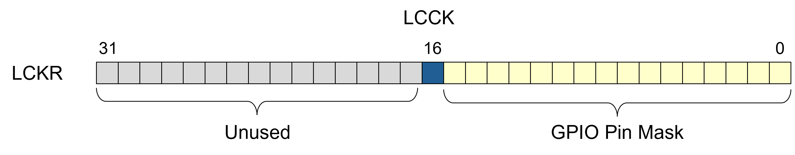

Multi-Language Development
==========================

.. include:: ../../../global.txt

Software projects often involve more than one programming language. Typically
that's because there is existing code that already does something we need done
and, for that specific code, it doesn't make economic sense to redevelop it in
some other language. Consider the rotor blade model in a high-fidelity
helicopter simulation. Nobody touches the code for that model except for a few
specialists, because the code is extraordinarily complex. (This complexity is
unavoidable because a rotor blade's dynamic behavior is so complex. You can't
even model it as one physical piece because the tip is traveling so much faster
than the other end.) Complex and expensive models like that are a simulator
company's crown jewels; their cost is meant to be amortized over as many
projects as possible. Nobody would imagine redeveloping it simply because a new
project is to be written in a different language.

Therefore, Ada includes extensive facilities to "import" foreign entities into
Ada code, and to "export" Ada entities to code in foreign languages. The
facilities are so useful that Ada has been used purely as "glue code" to allow
code written in two other programming languages to be used together.

You've already seen an introduction to Ada and C code working together in the
:doc:`"Interfacing" section of the Ada introductory course </courses/intro-to-ada/chapters/interfacing_with_c>`.
If you have not seen that material, be sure to see it first. We will cover some
further details not already discussed there, and then go into the details of
the facilities not covered elsewhere, but we assume you're familiar with it.

The Ada foreign language interfacing facilities include both "general" and
"language-specific" capabilities. The "general" facilities are known as such
because they are not tied to any specific language. These pragmas and aspects
work with any of the supported foreign languages. In contrast, the
"language-specific" interfacing facilities are collections of Ada declarations
that provide Ada analogues for specific foreign language types and subprograms.
For example, as you saw in that "Interfacing" section, there is a package with
a number of declarations for C types, such as :c:`int`, :c:`float`, and
:c:`double`, as well as C "strings", with subprograms to convert back and forth
between them and Ada's string type. Other languages are also supported, both by
the Ada Standard and by vendor additions. You will frequently use both the
"general" and the "language-specific" facilities together.

All these interfacing capabilities are defined in Annex B of the language
standard. Note that Annex B is not a "Specialized Needs" annex, unlike some of
the other annexes. The Specialized Needs annexes are wholly optional, whereas
all Ada implementations must implement Annex B. However, some parts of Annex B
are optional, so more precisely we should say that every implementation must
support all the required features of Annex B. That comes down mainly to the
package :ada:`Interfaces` (more on that package in a moment). However, if an
implementation does implement any optional part of Annex B, it must be
implemented as described by the standard, or with less functionality. An
implementation cannot use the same name for some facility (aspect, etc.) but
with different semantics. That's true of the Specialized Needs annexes too:
not every part need be implemented, but any part that is implemented must
conform to the standard. In practice, for Annex B, all implementations provide
the required parts, but not all provide support for all the "language-specific"
foreign languages' interfaces. The vendors make a business decision for the
optional parts, just as they do regarding the Specialized Needs annexes.

General Interfacing
-------------------

In the "Interfacing" section of the Ada introductory course you saw that Ada
defines aspects and pragmas for working with foreign languages. These aspects
and pragmas are functionally interchangeable, and we will use whichever one of
the two that is most convenient in our discussion. The pragmas are officially
"obsolescent," but that merely means that a newer approach is available, in
this case the corresponding aspects. You can use either one without concern for
future support because language constructs that are obsolescent are not removed
from the language. Any compiler that supports such constructs will almost
certainly support them forever, for the sake of not invalidating existing
customers' code. The pragmas have been in the language since Ada 95 so there's
a lot of existing code using them. Changing the compiler isn't cost-free, after
all, so why spend the money to potentially lose a customer? Likewise, a brand
new compiler will also probably support them, for the sake of potentially
gaining a customer.

The general interfacing facility consists of these aspects and pragmas,
specifically :ada:`Import`, :ada:`Export`, and :ada:`Convention`. As you saw in
the Ada Introduction course, :ada:`Import` brings a foreign entity into Ada
code, :ada:`Export` does the opposite, and :ada:`Convention` supplies
additional information and directives to the compiler. We will go into the
details of each.

Regardless of whether the Ada code is importing or exporting some entity, there
will be an Ada declaration for that entity. That declaration tells the compiler
how the entity can be used, as usual. The interfacing aspects and pragmas are
then applied to these Ada declarations.

If we are exporting, then the entity is implemented in Ada. For a subprogram
that means there will also be a subprogram body matching the declaration, and
the compiler will enforce that requirement as usual. In contrast, if we are
importing a subprogram, then it is not implemented in Ada, and therefore there
will be no corresponding subprogram body for the Ada declaration. The compiler
would not allow it if we tried. In that case the :ada:`Import` is the
subprogram's completion.

Subprograms often have a separate declaration. Sometimes that's required, for
example when we want to include a subprogram as part of a package's API, but at
other times it is optional. Remember that a subprogram body acts as a
corresponding declaration when there is no separate declaration defined. Thus,
either way, we have a subprogram declaration available for the interfacing
aspects and/or pragmas.

For data that are imported or exported, we'll have the declaration of the
object in Ada to which we can apply the necessary interfacing aspects/pragmas.
But we will also have the types for these objects, and as you will see, the
types can be part of interfacing too.

Aspect/Pragma Convention
~~~~~~~~~~~~~~~~~~~~~~~~

As you saw in the
:doc:`"Interfacing" section of the Ada introductory course </courses/intro-to-ada/chapters/interfacing_with_c>`,
when importing and exporting you'll also specify the "convention" for the
entity in question. The pragmas for importing and exporting include a parameter
for this purpose. When using the aspects, you'll specify the :ada:`Convention`
aspect too.

For types, though, you will specify the :ada:`Convention` aspect/pragma alone,
without :ada:`Import` or :ada:`Export`. In this case the convention specifies
the layout for objects of that type, presumably a layout different than the Ada
compiler would normally use. You would need to specify this other layout either
because you're going to later declare and export an object of the type, or
because you are going to declare an object of the type and pass it as a
argument to an imported subprogram.

For example, Ada specifies that multi-dimensional arrays are represented in
memory in row-major order. In contrast, the Fortran standard specifies
column-major order. If we want to define a type in Ada that can be used for
passing parameters to Fortran routines, we need to specify that convention for
the type. For example:

.. code-block:: ada

   type Matrix is array (Rows, Columns) of Float
     with Convention => Fortran;

(:ada:`Rows` and :ada:`Columns` are user-defined discrete subtypes.)

As a result when we declare :ada:`Matrix` objects the Ada compiler will use the
column-major layout. That makes it possible to pass objects of the type to
imported Fortran subprograms because the formal parameter will also be of type
:ada:`Matrix`. The imported Fortran routine will then see the parameter in
memory as it expects to see it. So although you wouldn't need to import or
export a type itself, you might very well import or export an object of the
type, or pass it as a argument.

When :ada:`Convention` is applied to subprograms, a natural mistake is to think
that we are specifying the programming language used to implement the
subprogram. In reality, the convention indicates the subprogram calling
convention, not the implementation language. The calling convention specifies
how parameters are passed to and from subprogram calls, how result values for
functions are returned, the order that parameters are pushed on the call stack,
how dynamically-sized parameters are passed, and so on. Ordinarily these are
matters you don't need to consider because you're working within a single
convention automatically, in other words the one used by the Ada compiler
you're using.

To illustrate that the convention is not the implementation language, consider
a subprogram that we intend to import and call from Ada. This imported routine
is implemented in assembly language, but, in addition, let's say it is written
to use the same calling convention as the Ada compiler we are using for Ada
code. Therefore, the calling convention would be :ada:`Ada` even though the
implementation is in assembler.

.. code-block:: ada

   procedure P (X : Integer) with
      ...
      Convention => Ada,
      ...

In the example above, :ada:`Ada` is known as a convention identifier, as is
:ada:`Fortran` in the earlier example. Convention identifiers are defined by
the Ada language standard, but also by Ada vendors.

The Ada standard defines two convention identifiers: :ada:`Ada` (the default),
and :ada:`Intrinsic`. In addition, Annex B defines convention identifiers
:ada:`C`, :ada:`COBOL`, and :ada:`Fortran`. Support for these Annex B
conventions is optional.

GNAT supports the standard and Annex B conventions, as well as the following:
:ada:`Assembler`, "C_PLUS_PLUS" (or :ada:`CPP`), :ada:`Stdcall`, :ada:`WIN32`,
and a few others. :ada:`C_PLUS_PLUS` is the convention identifier required by
the standard when C++ is supported. (Convention identifiers are actual
identifiers, not strings, so they must obey the syntax rules for identifiers.
"C++" would not be a valid identifier.) See the GNAT User Guide for those other
GNAT-specific conventions.

:ada:`Stdcall` and :ada:`WIN32` actually do specify a particular calling
convention, but for those convention identifiers that are language names, how
do we get from the name to a calling convention?

The ultimate requirement for any calling convention is compatibility with the
Ada compiler we are using. Specifically, the Ada compiler must recognize what
the calling convention specifies, and support importing and exporting
subprograms with that convention applied.

For the :ada:`Ada` convention that's simple. There is no standard calling
convention for Ada. Convention :ada:`Ada` simply means the calling convention
applied by the Ada compiler we happen to be using. (We'll talk about
:ada:`Intrinsic` shortly.)

So far, so good. But how to we get from those other language names to
corresponding calling conventions? There is no standard calling convention for,
say, C, any more than there is a standard calling convention for Ada.

In fact we don't get to the calling convention, at least not directly. What the
language name in the convention identifier actually tells us is that, when that
convention is supported, there is a compiler for that foreign language that
uses a calling convention known to, and supported by, the Ada compiler we are
using. The Ada compiler vendor defines which languages it supports, after all.
For example, when supported, convention :ada:`C` means that there is a
compatible C compiler known to the Ada compiler vendor. For GNAT you can guess
which C compiler that might be.

It's actually pretty straightforward once you have the big picture. If the
convention is supported, the Ada compiler in use knows of a compiler for that
language with which it can work. Annex B just defines some convention
identifiers for the sake of portability.

But suppose a given Ada compiler supports more than one vendor for a given
programming language? In that case the Ada compiler would define and support
multiple convention identifiers for the same programming language. Presumably
these identifiers would be differentiated by the compiler vendors' names. Thus
we might have available conventions :ada:`GNU_Fortran` and
:ada:`Intel_Fortran` if both were supported. The :ada:`Fortran` convention
identifier would then indicate the default vendor's compiler.

The :ada:`Intrinsic` calling convention represents subprograms that are
"built in" to the compiler. When such a subprogram is called the compiler
doesn't actually generate the code for an out-of-line call. Instead, the
compiler emits the assembly code |mdash| often just a single instruction
|mdash| corresponding to the intrinsic subprogram's name. There will be a
separate declaration for the subprogram, but no actual subprogram body
containing a sequence of statements. The compiler just knows what to emit in
place of the call.

For example:

.. code-block:: ada

   function Shift_Left
     (Value  : Unsigned_16;
      Amount : Natural)
     return Unsigned_16
       with ..., Convention => Intrinsic;

The effect is much like a subprogram call that is always in-lined, except that
there's no body for the subprogram. In this example the compiler simply issues
a shift-left instruction in assembly language.

You'll see the :ada:`Intrinsic` convention applied to many language-defined
subprograms. For example:

.. code-block:: ada

   generic
      type Source(<>) is limited private;
      type Target(<>) is limited private;
   function Ada.Unchecked_Conversion(S : Source) return Target
      with ..., Convention => Intrinsic;

Thus when we call an instantiation of :ada:`Ada.Unchecked_Conversion` there is
no actual call made to some subprogram. The compiler just treats the bits of
:ada:`S` as a value of type :ada:`Target`.

Intrinsic subprograms are a good way to access interesting capabilities of the
target hardware, without having to write the assembly language yourself
(although we will show how to do that, later, directly in Ada). For example,
some targets provide an instruction that atomically compares and swaps a value
in memory. Ada 2022 just added a standard package for this, but before that we
could use the following to access a gcc built-in:

.. code-block:: ada

   -- Perform an atomic compare and swap: if the current value of
   -- Destination.all is Comparand, then write New_Value into Destination.all.
   -- Returns an indication of whether the swap took place.

   function Sync_Val_Compare_And_Swap_Bool_8
     (Destination : access Unsigned_8;
      Comparand   : Unsigned_8;
      New_Value   : Unsigned_8)
      return Boolean
   with Convention => Intrinsic,
        ...

We would specify additional aspects beyond that of :ada:`Convention` but these
have not yet been discussed. That's what the ellipses indicate in the various
examples above.

Aspect/Pragma Import and Export
~~~~~~~~~~~~~~~~~~~~~~~~~~~~~~~

You've already seen these aspects in the Ada Introduction course, but for
completeness: :ada:`Import` brings a foreign entity into Ada code, and
:ada:`Export` makes an Ada entity available to foreign code. In practice, these
entities consist of objects and subprograms, but the language doesn't impose
many restrictions. It is up to the vendor to decide what makes sense for their
specific target.

The aspects :ada:`Import` and :ada:`Export` are so-called Boolean aspects
because their value is either :ada:`True` or :ada:`False`. For example:

.. code-block:: ada

   Obj : Matrix with
      Export => True,
      ...

For any Boolean-valued aspect the default is :ada:`True` so you only need to
give the value explicitly if that value is :ada:`False`. There would be no
point in doing that in these two cases, of course. Hence we just give the
aspect name:

.. code-block:: ada

   Obj : Matrix with
      Export,
      ...

Recall that objects of some types are initialized automatically during the
objects' elaboration, unless they are explicitly initialized as part of their
declarations. Access types are like that, for example. Objects of these types
are default initialized to :ada:`null` as part of ensuring that their values
are always meaningful (absent unchecked conversion).

.. code-block:: ada

   type Reference is access Integer;

   Obj : Reference;

In the above the value of :ada:`Obj` is :ada:`null`, just as if we had
explicitly set it that way.

But that initialization is a problem if we are importing an object of an access
type. Presumably the value is set by the foreign code, so automatic
initialization to null would overwrite the incoming value. Therefore, the
language guarantees that implicit initialization won't be applied to imported
objects.

.. code-block:: ada

   type Reference is access Integer;

   Obj : Reference with Import;

Now the value of :ada:`Obj` is whatever the foreign code sets it to, and is
not, in other words, overwritten during elaboration of the declaration.

Aspect/Pragma External_Name and Link_Name
~~~~~~~~~~~~~~~~~~~~~~~~~~~~~~~~~~~~~~~~~

For an entity with a :ada:`True` :ada:`Import` or :ada:`Export` aspect, we can
also specify a so-called external name or link name. These names are specified
via aspects :ada:`External_Name` and :ada:`Link_Name` respectively.

An external name is a string value indicating the name for some entity as known
by foreign language code. For an entity that Ada code imports, this is the name
that the foreign code declares it to be. For an entity that Ada code exports,
this is the name that the foreign code is told to use. This string value is
exactly the name to be used, so if you misspell the name the link will fail.
For example:

.. code-block:: ada

   function Sync_Val_Compare_And_Swap_Bool_8
     (Destination : access Unsigned_8;
      Comparand   : Unsigned_8;
      New_Value   : Unsigned_8)
     return Boolean
   with
     Import,
     Convention    => Intrinsic,
     External_Name => "__sync_bool_compare_and_swap_1";

The :ada:`External_Name` and :ada:`Link_Name` values are strings because the
foreign unit names don't necessary follow the Ada rules for identifiers (the
leading underscores in this case). Note that the ending digit in the name above
is different from the declared Ada name.

Usually, the name of the imported or exported entity is precisely known and
hence exactly specified by :ada:`External_Name`. Sometimes, however, a
compilation system may have a linker "preprocessor" that augments the name
actually used by the linkage step. For example, an implementation might always
prepend "_" and then pass the result to the system linker. In that case we
don't want to specify the exact name. Instead, we want to provide the
"starting point" for the name modification. That's the purpose of the
aspect :ada:`Link_Name`.

If you don't specify either :ada:`External_Name` or :ada:`Link_Name` the
compilation system will choose one in some implementation-defined manner.
Typically this would be the entity's defining name in the Ada declaration, or
some simple transformation thereof. But usually we know the name exactly and
so we use :ada:`External_Name` to give it.

As you can see, it really wouldn't make sense to specify both
:ada:`External_Name` and :ada:`Link_Name` since the semantics of the two
conflict. But if both are specified for some reason, the :ada:`External_Name`
value is ignored.

Note that :ada:`Link_Name` cannot be specified for :ada:`Intrinsic` subprograms
because there is no actual unit being linked into the executable, because
intrinsics are built-in. In this case you must specify the
:ada:`External_Name`.

Finally, because you will see a lot the pragma usage we should go into enough
detail so that you know what you're looking at when you see them.

Pragma :ada:`Import` and pragma :ada:`Export` work almost like a subprogram
call. Parameters cannot be omitted unless named notation is used. Reordering
the parameters is not permitted, however, unlike subprogram calls.

The BNF syntax is as follows. We show Import, but Export has identical
parameters:

.. code-block::

   pragma Import(
       [Convention =>] convention_identifier,
       [Entity =>] local_name
    [, [External_Name =>] external_name_string_expression]
    [, [Link_Name =>] link_name_string_expression]);

As you can see, the parameters correspond to the individual aspects
:ada:`Convention`, :ada:`External_Name`, and :ada:`Link_Name`. When using
aspects you don't need to say which Ada entity you're applying the aspects to,
because the aspects are part of the entity declaration syntax. In contrast,
the pragma is distinct from the declaration so we must specify what's being
imported or exported via the :ada:`Entity` parameter. That's the declared Ada
name, in other words. Note that both the :ada:`External_Name` and
:ada:`Link_Name` parameters are optional.

Here's that same built-in function, using the pragma to import it:

.. code-block:: ada

   -- Perform an atomic compare and swap: if the current value of
   -- Destination.all is Comparand, then write New_Value into Destination.all.
   -- Returns an indication of whether the swap took place.

   function Sync_Val_Compare_And_Swap_Bool_8
     (Destination : access Unsigned_8;
      Comparand   : Unsigned_8;
      New_Value   : Unsigned_8)
      return Boolean;

   pragma Import (Intrinsic,
                  Sync_Val_Compare_And_Swap_Bool_8,
                  "__sync_bool_compare_and_swap_1");

The first pragma parameter is for the convention. The next parameter, the
:ada:`Entity`, is the Ada unit's declared name. The last parameter is the
external name. The compiler either knows what we are referencing by that
external name or it will reject the pragma. As we mentioned before, the string
value for the name is not required to match the Ada unit name.

You will see later that there are other convention identifiers as well, but we
will wait for the
:ref:`Specific Interfacing section <Intro_Embedded_Sys_Prog_Language_Specific_Interfacing>`
to introduce those.

Package Interfaces
~~~~~~~~~~~~~~~~~~

Package :ada:`Interfaces` must be provided by all Ada implementations. The
package is intended to provide types that reflect the actual numeric types
provided by the target hardware. Of course, the standard has no way to know
what hardware is involved, therefore the actual content is
implementation-defined. But even so, it is possible to standardize the names for
these types, and that is what the language standard does.

Specifically, the standard defines the format for the names for the hardware's
signed and modular (unsigned) integer types, and for the floating-point types.

The signed integers have names of the form :ada:`Integer_n`, where `n` is the
number of bits used by the machine-supported type. The type for an eight-bit
signed integer would be named :ada:`Integer_8`, for example, and then
:ada:`Integer_16` and so on for the larger  types, for as many as the target
machine supports.

Likewise, for the unsigned integers, the names are of the form
:ada:`Unsigned_n`, with the same meaning for `n`. The colloquial eight-bit
"byte" would be named :ada:`Unsigned_8`, with :ada:`Unsigned_16` for the 16-bit
version, and so on, again for as many as the machine supports.

For floating-point types it is harder to talk about a format that is
sufficiently common to standardize. The IEEE floating-point standard is well
known and widely used, however, so if the machine does support the IEEE format
that name can be used. Such types would be named :ada:`IEEE_Float_n`, again
with the same meaning for `n`. Thus we might see declarations for types
:ada:`IEEE_Float_32` and :ada:`IEEE_Float_64` and so on, for all the machine
supported floating-point types.

In addition to these type declarations, for the unsigned integers only, there
will be declarations for shift and rotate operations provided as intrinsic
functions.

The resulting package declaration might look something like this:

.. code-block:: ada

   package Interfaces is

      type Integer_8  is range -2 ** 7 .. 2 ** 7 - 1;

      type Integer_16 is range -2 ** 15 .. 2 ** 15 - 1;

      type Integer_32 is range -2 ** 31 .. 2 ** 31 - 1;

      ...

      type Unsigned_8 is mod 2 ** 8;

      function Shift_Left   (Value : Unsigned_8;  Amount : Natural) return Unsigned_8;
      function Shift_Right  (Value : Unsigned_8;  Amount : Natural) return Unsigned_8;
      function Rotate_Left  (Value : Unsigned_8;  Amount : Natural) return Unsigned_8;
      function Rotate_Right (Value : Unsigned_8;  Amount : Natural) return Unsigned_8;
      function Shift_Right_Arithmetic (Value : Unsigned_8;  Amount : Natural)
        return Unsigned_8;

      type Unsigned_16 is mod 2 ** 16;

      function Shift_Left  (Value : Unsigned_16;  Amount : Natural)
        return Unsigned_16;
      function Shift_Right (Value : Unsigned_16;  Amount : Natural)
        return Unsigned_16;
      ...

      type Unsigned_32 is mod 2 ** 32;

      function Shift_Left  (Value : Unsigned_32;  Amount : Natural)
        return Unsigned_32;
      function Shift_Right (Value : Unsigned_32;  Amount : Natural)
        return Unsigned_32;
      ...

      type IEEE_Float_32 is digits 6;
      type IEEE_Float_64 is digits 15;
      ...

   end Interfaces;

As you can see, when you need to write code in terms of the hardware's numeric
types, this package is a great resource. There's no need to declare your own
:ada:`UInt32` type, for example, although of course you could, trivially:

.. code-block:: ada

   type UInt32 is mod 2 ** 32;

But if you do, realize that you won't get the shift and rotate operations for
your type. Those are only defined for the types in package :ada:`Interfaces`.
If you do need to declare such a type, and you do want the additional
shift/rotate operations, use inheritance:

.. code-block:: ada

   type UInt32 is new Interfaces.Unsigned_32;

GNAT also defines a pragma, as an alternative to inheritance:

.. code-block:: ada

   type UInt32 is mod 2 ** 32;
   pragma Provide_Shift_Operators (UInt32);

The approach using inheritance is preferable because it is portable, all other
things being equal.

One reason to make up your own unsigned type is that you need one that does not
in fact reflect the target hardware's numeric types. For example, a hardware
device register might have gaps of bits that are currently not used by the
device. Those gaps are frequently not the size of a type declared in package
:ada:`Interfaces`. We might need an :ada:`Unsigned_3` type, for example. That's
a reasonable thing to do.

.. _Intro_Embedded_Sys_Prog_Language_Specific_Interfacing:

Language-Specific Interfacing
-----------------------------

In addition to the aspects and pragmas for importing and exporting entities
that work with any language, Ada also defines standard language-specific
facilities for interfacing with a set of foreign languages. The standard
defines which languages, but vendors can (and do) expand the set.

Specifically, the "language-specific" interfacing facilities are collections of
Ada declarations that provide Ada analogues for specific foreign language types
and subprograms. Package :ada:`Interfaces` is the root package for a hierarchy
of packages that organize these declarations by language, with one or more
child packages per language.

Note that the declarations within package :ada:`Interfaces` are, by definition,
compile-time visible to any child package in the subsystem. Thus whenever one
of the language-specific packages needs to mention the machine types they are
automatically available.

The standard defines specific support for foreign languages C, COBOL, and
Fortran. Thus there are one or more child packages rooted at :ada:`Interfaces`
that have those language names as their child package names:
:ada:`Interfaces.C`, :ada:`Interfaces.COBOL`, and :ada:`Interfaces.Fortran`.

The material below will focus on C and, to a lesser extent, Fortran, ignoring
altogether the support for COBOL. That's not because COBOL is unimportant.
There is a lot of COBOL business software out there in use. Rather, we skip
COBOL because it is not relevant to embedded systems. Similarly, although
Fortran is extensively used, especially in high-performance computing, it is
not used extensively in embedded systems. We will provide some information
about the Fortran support but will not dwell on it.

Even though we do not consider C to be appropriate for large development
projects, neither technically not economically, it has its place in small,
low-criticality embedded systems. Ada developers can profit from existing
device drivers and mature libraries coded in C, for example. Hence interfacing
to it is important.

What about C++? Interfacing to C++ is tricky compared to C, because of the
vendor-defined name-mangling, automatic invocations of constructors and
destructors, exceptions, and so on.  Generally, interfacing with C++ code can
be facilitated by preventing much of those difficulties using the
:c:`extern "C" {... }` linkage-specification. Doing so then makes the
bracketed C++ code look like C, so the C interfacing facilities then can be
used.

Package Interfaces.C
~~~~~~~~~~~~~~~~~~~~

The child package :ada:`Interfaces.C` supports interfacing with units written
in the C programming language. Support is in the form of Ada constants and
types, and some subprograms. The constants correspond to C's :file:`limits.h`
header file, and the Ada types correspond to types for C's :ada:`int`,
:ada:`short`, :ada:`unsigned_short`, :ada:`unsigned_long`,
:ada:`unsigned_char`, :ada:`size_t`, and so on. There is also support for
converting Ada's type :ada:`String` to/from :ada:`char_array`, and similarly
for type :ada:`Wide_String`, etc.

It's a large package so we will elide parts. The idea is to give you a feel for
what's there. If you want the details, see either the Ada reference manual or
bring up the source code in GNAT Studio.

.. code-block:: ada

   package Interfaces.C is

      --  Declaration's based on C's <limits.h>

      CHAR_BIT  : constant := 8;
      SCHAR_MIN : constant := -128;
      SCHAR_MAX : constant := 127;
      UCHAR_MAX : constant := 255;

      --  Signed and Unsigned Integers. Note that in GNAT, we have ensured that
      --  the standard predefined Ada types correspond to the standard C types

      type int   is new Integer;
      type short is new Short_Integer;
      type long  is range -(2 ** (System.Parameters.long_bits - Integer'(1)))
        .. +(2 ** (System.Parameters.long_bits - Integer'(1))) - 1;
      type long_long is new Long_Long_Integer;

      type signed_char is range SCHAR_MIN .. SCHAR_MAX;
      for signed_char'Size use CHAR_BIT;

      type unsigned           is mod 2 ** int'Size;
      type unsigned_short     is mod 2 ** short'Size;
      type unsigned_long      is mod 2 ** long'Size;
      type unsigned_long_long is mod 2 ** long_long'Size;

      ...

      --  Floating-Point

      type C_float     is new Float;
      type double      is new Standard.Long_Float;
      type long_double is new Standard.Long_Long_Float;

      ----------------------------
      -- Characters and Strings --
      ----------------------------

      type char is new Character;

      nul : constant char := char'First;

      function To_C   (Item : Character) return char;
      function To_Ada (Item : char)      return Character;

      type char_array is array (size_t range <>) of aliased char;
      for char_array'Component_Size use CHAR_BIT;

      ...

   end Interfaces.C;

The primary purpose of these types is for use in the formal parameters of Ada
subprograms imported from C or exported to C. The various conversion functions
can be called from within Ada to manipulate the actual parameters.

When writing the Ada subprogram declaration corresponding to a C function, an
Ada procedure directly corresponds to a void function. An Ada procedure also
corresponds to a C function if the return value is always to be ignored.
Otherwise, the Ada declaration should be a function.

As we said, the types declared in this package can be used as the formal
parameter types. That is the intended and recommended approach. However, some
Ada types naturally correspond to C types, and you might see them used instead
of those from :ada:`Interfaces.C`. Type :ada:`int` is the C native integer type
for the target, for example, as is type :ada:`Integer` in Ada. Likewise, C's
type :ada:`float` and type Ada's :ada:`Float` are likely compatible. GNAT goes
to some lengths to maintain compatibility with C, since the two gcc compilers
share so much internal technology. Other vendors might not do so. Best practice
is use the types in :ada:`Interfaces.C` for your parameters.

Of course, the types in :ada:`Interfaces.C` are not sufficient for all uses.
You will often need to use user-defined types for the formal parameters, such
as enumeration types and record types.

Ada enumeration types are compatible with C's enums but note that C requires
enum values to be the size of an :ada:`int`, whereas Ada does not. The Ada
compiler uses whatever sized machine type will support the specified number of
enumeral values. It might therefore be smaller than an :ada:`int` but it might
also be larger. (Declaring more enumeration values than would fit in an integer
is unlikely except in tool-generated code, but it is possible.) For example:

.. code-block:: ada

    type Small_Enum is (A, B, C);

If we printed the object size for :ada:`Small_Enum` we'd get 8 (on a typical
machine with GNAT). Therefore, applying the aspect :ada:`Convention` to the Ada
enumeration type declaration is a good idea:

.. code-block:: ada

   type Small_Enum is (A, B, C) with Convention => C;

Now the object size will be 32, the same as :ada:`int`.

Speaking of enumeration types, note that Ada 2022 added a boolean type to
:ada:`Interfaces.C` named :ada:`C_Bool` to match that of C99, so you should use
it instead of Ada's :ada:`Boolean` type for formal parameters.

A simple Ada record type is compatible with a C struct, but remember that the
Ada compiler is allowed to reorder the record components. The compiler would do
that if it saw that the layout was inefficient, but the point here is that the
compiler could do it silently. As a result, you should specify the record
layout explicitly using a record representation clause, matching the layout of
the C struct in question. Then there will be no question of the layouts
matching. Once your record types get more complicated, for example with
discriminants or tagged record extensions, things get tricky. Your best bet it
to stick with the simple cases when interfacing to C.

Some types that you might think would correspond do not, at least not
necessarily. For example, an Ada access type's value might be represented as a
simple address, but it might not. In GNAT, an access value designating a value
of some unconstrained array type (e.g., :ada:`String`) is comprised of two
addresses, by default. One designates the characters and the other designates
the bounds. You can override that with a pragma, but you must know to do so.
For example, if we run the following program, we will see that the object size
for the access type :ada:`Name` is twice the object size of
:ada:`System.Address`:

.. code-block:: ada

   with Ada.Text_IO;  use Ada.Text_IO;
   with System;       use System;

   procedure Demo is

      type Name is access String;

   begin
      Put_Line (Address'Object_Size'Image);
      Put_Line (Name'Object_Size'Image);
   end Demo;

Some Ada types simply have no corresponding type in C, such as record
extensions, task types, and protected types. You'll have to pass those as an
"opaque" type, usually as an address. It isn't clear that a C function would
know what to do with values of these types, but the general notion of passing
an opaque type as an address is useful and not uncommon. Of course, that
approach forgoes all type safety, so avoid it when possible.

In addition to the types for the formal parameters, you'll also need to know
how parameters are passed to and from C functions. That affects the parameter
profiles on both sides, Ada and C. The text in Annex B for :ada:`Interfaces.C`
specifies how parameters are to be passed back and forth between Ada and C so
that your subprogram declarations can be portable. That's the approach for each
supported programming language, i.e., in the discussion of the corresponding
child package under :ada:`Interfaces`.

The rules are expressed in terms of scalar types, "elementary" types, array
types, and record types. Remember that scalar types are composed of the
discrete types and the real types, so we're talking about the signed and
modular integers, enumerations, floating-point, and the two kinds of
fixed-point types. The "elementary" types consist of the scalars and access
types. The rules are fairly intuitive, but throw in Ada's access parameters and
parameter modes and some subtleties arise. We won't cover all the various rules
but will explore some of the subtleties.

First, the easy cases: mode :ada:`in` scalar parameters, such as :ada:`int`,
as simply passed by copy. Scalar parameters are passed by copy anyway in Ada so
the mechanism aligns with C in a straightforward manner. A record type :ada:`T`
is passed by reference, so on the C side we'd see :c:`t*` where :c:`t` is a C
struct corresponding to :ada:`T`. A constrained array type in Ada with a
component type :ada:`T` would correspond to a C formal parameter :c:`t*` where
:c:`t` corresponds to :ada:`T`. An Ada access parameter :ada:`access T`
corresponds on the C side to :c:`t*` where :c:`t` corresponds to :ada:`T`. And
finally, a private type is passed according to the full definition of the type;
the fact that it is private is just a matter of controlling the client
view, being private doesn't affect how it is passed. There are other simple
cases, such as access-to-subprogram types, but we can leave that to the Annex.

Now to the more complicated cases. First, some C ABIs (application binary
interfaces) pass small structs by copy instead of by reference. That can make
sense, in particular when the struct is small, say the size of an address or
smaller. In that case there's no performance benefit to be had by passing a
reference. When that situation applies, there is another convention we have
not yet mentioned: :ada:`C_Pass_By_Copy`. As a result the record parameter
will be passed by copy instead of the default, by reference (i.e., :ada:`T`
rather than :ada:`*T`), as long as the mode is :ada:`in`. For example:

.. code-block:: ada

   type R2 is record
      V : int;
   end record
   with Convention => C_Pass_By_Copy;

   procedure F2 (P : R2) with
      Import,
      Convention => C,
      External_Name => "f2";

.. code-block:: c

   struct R2 {
      int V;
   };

   void f2 (R2 p);

On the C side we expect that :c:`p` is passed by copy and indeed that is how we
find it. That said, passing record values to structs by reference is the more
common programmer choice. Like arrays, records are typically larger than an
address. The point here is that the Ada code can be configured easily to match
the C code.

Next, consider passing array values, both to and from C. When passing an array
value to C, remember that Ada array types have bounds. Those bounds are either
specified at compile time when they are declared, or, for unconstrained array
types, specified elsewhere, at run-time.

Array types are not first-class types in C, and C has no notion of
unconstrained array types, or even of upper bounds. Therefore, passing an
unconstrained array type value is interesting. One approach is to avoid them.
Instead, declare a sufficiently large constrained array as a subtype of the
unconstrained array type, and then just pass the actual upper bound you want,
along with the array object itself.

.. code-block:: ada

   type List is array (Integer range <>) of Interfaces.C.int;

   subtype Constrained_List is List (1 .. 100);

   procedure P (V : Constrained_List;  Size : Interfaces.C.int);
   pragma Import (C, P, "p");

   Obj : Constrained_List := (others => 42);  -- arbitrary values

With that, we can just pass the value by reference as usual on the C side:

.. code-block:: c

   void p (int* v, int size) {
     // whatever
   }

But that's assuming we know how many array components are sufficient from the C
code's point of view. In the example above we'll pass a value up to 100 to the
:ada:`Size` parameter and hope that is sufficient.

Really, it would work to use the unconstrained array type as the formal
parameter type instead:

.. code-block:: ada

   type List is array (Integer range <>) of Interfaces.C.int;

   procedure P (V : List;  Size : Interfaces.C.int);
   pragma Import (C, P, "p");

The C function parameter profile wouldn't change. But why does this work? With
values of unconstrained array types, the bounds are stored with the value.
Typically they are stored just ahead of the first component, but it is
implementation-defined. So why doesn't the above accidentally pass the bounds
instead of the first array component itself? It works because we are guaranteed
by the Ada language that passing an array will pass (the address of) the
components, not the bounds, even for Ada unconstrained array types.

Now for the other direction: passing an array from C to Ada. Here the lack of
bounds information on the C side really makes a difference. We can't just pass
the array by itself because that would not include the bounds, unlike an Ada
call to an Ada routine. In this case the approach is the similar to the first
alternative described above, in which we declare a very large array and then
pass the bounds explicitly:

.. code-block:: ada

   type List is array (Natural) of int;
   --  DO NOT DECLARE AN OBJECT OF THIS TYPE

   procedure P (V : List; Size : Interfaces.C.int);
   pragma Export (C, P, "p");

   procedure P (V : List; Size : Interfaces.C.int) is
   begin
      for J in 0 .. Size - 1 loop
         -- whatever
      end loop;
   end P;

.. code-block:: c

   extern void p (int* v, int size);

   int x [100];

   p (x, 100);  // call to Ada routine, passing x

The fundamental idea is to declare an Ada type big enough to handle anything
conceivably needed on the C side. Subtype :ada:`Natural` means
:ada:`0 .. Integer'Last` so :ada:`List` is quite large indeed. Just be sure
never to declare an object of that type. You'll probably run out of storage on
an embedded target.

Earlier we said that it is the Ada type that determines how parameters are
passed, and that scalars and elementary types are always passed by copy. For
mode :ada:`in` that's simple, the copy to the C formal parameter is done and
that's all there is to it. But suppose the mode is instead :ada:`out` or
:ada:`in out`? In that case the presumably updated value must be returned to
the caller, but C doesn't do that by copy. Here the compiler will come to the
rescue and make it work, transparently. Specifically, we just declare the Ada
subprogram's formal parameter type as usual, but on the C formal we use a
reference. We're talking about scalar and elementary types so let's use
:ada:`int` arbitrarily. We make the mode :ada:`in out` but :ada:`out` would
also serve:

.. code-block:: ada

   procedure P (Formal : in out int);

.. code-block:: c

   void function p (int* formal);

Now the compiler does its magic: it generates code to make a copy of the actual
parameter, but it makes that copy into a hidden temporary object. Then, when
calling the C routine, it passes the address of the hidden object, which
corresponds to the reference expected on the C side. The C code updates the
value of the temporary object via the reference, and then, on return, the
compiler copies the value back from the temporary to the actual parameter.
Problem solved, if a bit circuitous.

There are other aspects to interfacing with C, such as variadic functions that
take a varying number of arguments, but you can find these elsewhere in the
learn courses.

 .. todo::

    Add link to section (or write section) about interfacing with more
    advanced use-cases (such as variadic functions).

Next, we examine the child packages under :ada:`Interfaces.C`. These packages
are not used as much as the parent :ada:`Interfaces.C` package so we will
provide an overview. You can look up the contents within GNAT Studio or the Ada
language standard.

Package Interfaces.C.Strings
~~~~~~~~~~~~~~~~~~~~~~~~~~~~

Package :ada:`Interfaces.C` declares types and subprograms allowing an Ada
program to allocate, reference, update, and free C-style strings. In
particular, the private type :ada:`chars_ptr` corresponds to a common use of
:ada:`char *` in C programs, and an object of this type can be passed to
imported subprograms for which :ada:`char *` is the type of the argument of the
C function.  A subset of the package content is as follows:

.. code-block:: ada

   package Interfaces.C.Strings is

      type chars_ptr is private;
      ...

      function New_Char_Array (Chars : in char_array) return chars_ptr;

      function New_String (Str : in String) return chars_ptr;

      procedure Free (Item : in out chars_ptr);
      ...

      function Value (Item : in chars_ptr) return char_array;
      function Value (Item : in chars_ptr) return String;
      ...

      function Strlen (Item : in chars_ptr) return size_t;

      procedure Update (Item   : in chars_ptr;
                        Offset : in size_t;
                        Chars  : in char_array;
                        Check  : in Boolean := True);

      ...

   end Interfaces.C.Strings;

Note that allocation might be via malloc, or via Ada’s allocator :ada:`new`. In
either case, the returned value is guaranteed to be compatible with
:ada:`char*`. Deallocation must be via the supplied procedure :ada:`Free`.

An amusing point is that you can overwrite the end of the char array just like
you can in C, via procedure :ada:`Update`. The :ada:`Check` parameter indicates
whether overwriting past the end is checked. The default is :ada:`True`, unlike
in C, but you could pass an explicit :ada:`False` if you felt the need to do
something questionable.

Package Interfaces.C.Pointers
~~~~~~~~~~~~~~~~~~~~~~~~~~~~~

The generic package :ada:`Interfaces.C.Pointers` allows us to perform C-style
operations on pointers. It includes an access type named :ada:`Pointer`,
various :ada:`Value` functions that dereference a :ada:`Pointer` value and
deliver the designated array, several pointer arithmetic operations, and "copy"
procedures that copy the contents of a source pointer into the array designated
by a destination pointer.

We won't go into the details further. See the Ada RM for more.

Package Interfaces.Fortran
~~~~~~~~~~~~~~~~~~~~~~~~~~

Like Interfaces.C, package :ada:`Interfaces.Fortran` defines Ada types to be
used when working with subprograms using the Fortran calling convention. These
types have representations that are identical to the default representations of
the Fortran intrinsic types `Integer`, `Real`, `Double Precision`, `Complex`,
`Logical`, and `Character` in some supported Fortran implementation. And like
the C package, the ways that parameters of various types are passed are also
specified.

We leave the details to you to look up in the language standard, if you find
them needed in an embedded application.

Machine Code Insertions (MCI)
~~~~~~~~~~~~~~~~~~~~~~~~~~~~~

When working close to the hardware, especially when interacting with a device,
it is not uncommon for the hardware to require a very specific set of assembly
language instructions to be generated. There are two ways to achieve this: the
right way and the wrong way.

The wrong way is to experiment with the source code and compiler switches until
you get the exact assembly code you need generated (assuming it is possible at
all). But what happens when the next compiler release arrives with a new
optimization? And abandon all hope if you go to a new compiler vendor. This
approach is both labor-intensive and very brittle.

The right way is to express the precise assembly code sequence explicitly
within the Ada source code. (That's true to any high level language, not just
Ada.) Or you can call an intrinsic function, if there is one that does exactly
what you need. We will focus on inserting it directly, in what is known as
"machine code insertion", or "inline assembler."

As an example of the need for this capability, consider the GPIO (General
Purpose I/O) port on an STM32 Arm microcontroller. Each port contains 16
individual I/O pins, each of which can be configured as an independent discrete
input or output, or as a control line for a device, with pull-up or pull-down
registers, with different clock speeds, and so on. Different on-chip devices
use various collections of pins in ways specific to the devices, and require
exclusive assignment of the pins. However, any given pin can be used by several
different devices. For example, pin 11 on port A ("PA11") can be used by USART
#1 as the clear-to-send ("CTS") line, or the CAN #1 bus Rx line, or Channel 4
of Timer 1, among others. Therefore, one of the responsibilities of the system
designer is to allocate pins to devices, ensuring that they are allocated
uniquely. It is difficult to debug the case in which a pin is accidentally
configured for one device and then reconfigured for use with another device
(assuming the first device remains in use). To help ensure exclusive
allocations, every GPIO port on this Arm implementation has a way of locking
the configuration of each I/O pin. That way, some other part of the software
can't successfully change the configuration accidentally, for use with some
other device. Even if the same configuration was to be used for another device,
the lock prevents the accidental update so we find out about the unintentional
sharing.

To lock a pin on a port requires a special sequence of reads and writes to a
GPIO register for that port. A specific bit pattern is required during the
reads and writes. The sequence and bit pattern is such that accidentally
locking the pin is highly unlikely.

Once we see how to express assembly language sequences in general we will see
how to get the necessary sequence to lock a port/pin pair. Unfortunately,
although you can express exactly the code sequence required, such a sequence of
assembly language instructions is clearly target hardware-specific. That means
portability is inherently limited. Moreover, the syntax for expressing it
varies with the vendor, even for the same target hardware. Being able to insert
it at the Ada source level doesn't help with either portability issue. You
should understand that the use-case for machine code insertion is for small,
short sequences. Otherwise you would write the code in assembly language
directly, in a separate file. That might obtain a degree of vendor
independence, at least for the given target, but not necessarily. The use of
inline assembler is intended for cases in which a separate file containing
assembly language is not simpler.

With those caveats in place, let's first examine how to do it in general and
then how to express it with GNAT specifically.

The right way to express an arbitrary sequence of one or more assembly language
statements is to use so-called "code statements." A code statement is an Ada
statement, but it is also a qualified expression of a type defined in package
:ada:`System.Machine_Code`. The content of that package, and the details of
code statements, are implementation-defined. Although that affects portability
there really is no alternative because we are talking about machine instruction
sets, which vary considerably and cannot be standardized at this level.

Package :ada:`System.Machine_Code` contains types whose values provide a way of
expressing assembly instructions. For example, let's say that there is a "HLT"
instruction that halts the processor for some target. There is no other
parameter required, just that op-code. Let's also say that one of the types in
:ada:`System.Machine_Code` is for these "short" instructions consisting only of
an op-code. The syntax for the type declaration would then allow the following
code statement:

.. code-block:: ada

   Short_Instruction'(Command => HLT);

Each of :ada:`Short_Instruction`, :ada:`Command`, and :ada:`HLT` are defined by
the vendor in this hypothetical version of package :ada:`System.Machine_Code`.
You can see why we say that it is both a statement (note the semicolon) and a
qualified expression (note the apostrophe).

Code statements must appear in a subprogram body, after the :ada:`begin`. Only
code statements are allowed in such a body, only use-clauses can be in the
declarative part, and no exception handlers are allowed. The complete example
would be as follows:

.. code-block:: ada

   procedure Halt -- stops processor
      with Inline;

   with System.Machine_Code; use System.Machine_Code;
   procedure Halt is
   begin
      Short_Instruction'(Command => HLT);
   end Halt;

With that, to halt the processor the Ada code can simply call procedure
:ada:`Halt`. When the optimizer is enabled there will be no code emitted to
make the call, we'd simply see the halt instruction emitted directly in-line.

Package :ada:`System.Machine_Code` provides access to machine instructions but
as we mentioned, the content is vendor-defined. In addition, the package itself
is optional, but is required if Annex C, the Systems Programming Annex, is
implemented by the vendor. In practice most all vendors provide this annex.

In GNAT, the content of :ada:`System.Machine_Code` looks something like this:

.. code-block:: ada

   type Asm_Input_Operand  is ...
   type Asm_Output_Operand is ...
   type Asm_Input_Operand_List  is array (Integer range <>) of Asm_Input_Operand;
   type Asm_Output_Operand_List is array (Integer range <>) of Asm_Output_Operand;

   type Asm_Insn is private;

   ...

   function Asm
      (Template : String;
       Outputs  : Asm_Output_Operand := No_Output_Operands;
       Inputs   : Asm_Input_Operand  := No_Input_Operands;
       Clobber  : String  := "";
       Volatile : Boolean := False) return Asm_Insn;

With this package content, the expression in a code statement is of type
Asm_Insn, short for "assembly instruction." Multiple overloaded functions named
:ada:`Asm` return values of that type.

The :ada:`Template` parameter in a string containing one or more assembly
language instructions. These instructions are specific to the target machine.
The parameter :ada:`Outputs` provides mappings from registers to source-level
entities that are updated by the assembly statement(s). :ada:`Inputs` provides
mappings from source-level entities to registers for inputs. :ada:`Volatile`,
when True, tells the compiler not to optimize the call away, and :ada:`Clobber`
tells the compiler which registers, or memory, if any, are altered by the
instructions in :ada:`Template`. ("Clobber" is colloquial English for
"destroy.") That last is important because the compiler was likely already
using some of those registers so the compiler will need to restore them after
the call.

We could say, for example, the following, taking all the defaults except for
:ada:`Volatile`:

.. code-block:: ada

   Asm ("nop", Volatile => True);

As you can imagine the full details are extensive, beyond the scope of this
introduction. See the GNAT User Guide ("Inline Assembler") for all the gory
details.

Now, back to our GPIO port/bin locking example. The port type is declared as
follows:

.. code-block:: ada

   type GPIO_Port is limited record
      ...
      LCKR : Word with Atomic;  -- lock register
      ...
   end record with ...

We've elided all but the :ada:`LCKR` component representing the "lock register"
within each port. We'd have a record representation clause to ensure the
required layout but that's not important here. :ada:`Word` is an unsigned
(modular) 32-bit integer type. One of the hardware requirements for accessing
the lock register is that the entire register has to be read or written
whenever any bits within it are accessed. The compiler must not, for example,
write one of the bytes within the register in order to set or clear a bit
within that part of the register. Therefore we mark the register as Atomic. If
the compiler cannot honor that aspect the compilation will fail, so we would
know there is a problem.

Per the ST Micro Reference Manual, the lock control bit is referred to as
:ada:`LCKK` and is bit #16, i.e., the first in the upper half of the
:ada:`LCKR` register word.

.. code-block:: ada

   LCCK : constant Word := 16#0001_0000#;  -- the "lock control bit"

That bit is also known as the "Lock Key" (hence the abbreviation) because it is
used to control the locking of port/pin configurations.

There are 16 GPIO pins per port, represented by the lower 16 bits of the
register. Each one of these 16 bits corresponds to one of the 16 GPIO pins on a
port. If any given bit reads as a 1 then the corresponding pin is locked.

Graphically that looks like this:

Therefore, the Ada types are:

.. code-block:: ada

   type GPIO_Pin is
      (Pin_0, Pin_1, Pin_2,  Pin_3,  Pin_4,  Pin_5,  Pin_6,  Pin_7,
       Pin_8, Pin_9, Pin_10, Pin_11, Pin_12, Pin_13, Pin_14, Pin_15);

   for GPIO_Pin use (Pin_0  => 16#0001#,
                     Pin_1  => 16#0002#,
                     Pin_2  => 16#0004#,
                     ...
                     Pin_15 => 16#8000#);

Note that we had to override the default enumeration representation so that
each pin |mdash| each enumeral value  |mdash| would occupy a single dedicated
bit in the bit-mask.

With that in place, let's lock a pin. A specific sequence is required to set a
pin's lock bit. The sequence writes and reads values from the port's LCKR
register. Remember that this 32-bit register has 16 bits for the pin mask (0
.. 15), with bit #16 used as the "lock control bit".

#. write a 1 to the lock control bit with a 1 in the pin bit mask for the pin
   to be locked

#. write a 0 to the lock control bit with a 1 in the pin bit mask for the pin
   to be locked

#. do step 1 again

#. read the entire LCKR register

#. read the entire LCKR register again (optional)

Throughout the sequence the same value for the lower 16 bits of the word must
be maintained (i.e., the pin mask), including when clearing the LCCK bit in the
upper half.

If we wrote this in Ada it would look like this:

.. code-block:: ada

   procedure Lock (Port : in out GPIO_Port;  Pin : GPIO_Pin) is
      Temp : Word with Volatile;
   begin
      --  set the lock control bit and the pin bit, clear the others
      Temp := LCCK or Pin'Enum_Rep;
      --  write the lock and pin bits
      Port.LCKR := Temp;
      --  clear the lock bit in the upper half
      Port.LCKR := Pin'Enum_Rep;
      --  write the lock bit again
      Port.LCKR := Temp;
      --  read the lock bit
      Temp := Port.LCKR;
      --  read the lock bit again
      Temp := Port.LCKR;
   end Lock;

:ada:`Pin'Enum_Rep` gives us the underlying value for the enumeration value. We
cannot use :ada:`'Pos` because that attribute provides the logical position
number within the enumerated values, and as such always increases
consecutively. We need the underlying representation value that we specified
explicitly.

The Ada procedure works, but only if the optimizer is enabled (which also
precludes debugging). But even so, there is no guarantee that the required
assembly language instruction sequence would be generated, especially one that
maintains that required bit mask value on each access. A machine-code insertion
is appropriate for all the reasons presented earlier:

.. code-block:: ada

   procedure Lock (Port : in out GPIO_Port;
                   Pin  :        GPIO_Pin) is
      use System.Machine_Code, ASCII, System;
   begin
      Asm ("orr  r3, %1, #65536" & LF & HT &  -- 0) Temp := LCCK or Pin'Enum_Rep
           "str  r3, [%0, #28]"  & LF & HT &  -- 1) Port.LCKR := Temp
           "str  %1, [%0, #28]"  & LF & HT &  -- 2) Port.LCKR := Pin'Enum_Rep
           "str  r3, [%0, #28]"  & LF & HT &  -- 3) Port.LCKR := Temp
           "ldr  r3, [%0, #28]"  & LF & HT &  -- 4) Temp := Port.LCKR
           "ldr  r3, [%0, #28]"  & LF & HT,   -- 5) Temp := Port.LCKR
           Inputs => (Address'Asm_Input ("r", This'Address), -- %0
                     (GPIO_Pin'Asm_Input ("r", Pin))),       -- %1
           Volatile => True,
           Clobber  => ("r3"));
   end Lock;

We've combined the instructions into one :ada:`Asm` expression. As a result, we
can use ASCII line-feed and horizontal tab characters to format the listing
produced by the compiler so that each instruction is on a separate line and
aligned with the previous instruction, as if we had written the sequence in
assembly language directly. That enhances readability later, during examination
of the compiler output to verify the required sequence was emitted.

In the above, :ada:`"%0"` is the first input, containing the address of the
:ada:`Port` parameter. :ada:`"%1"` is the other input, the value of the
:ada:`Pin` parameter. We're using register :ada:`r3` explicitly, as the
"temporary" variable, so we tell the compiler that it has been "clobbered."

If we examine the assembly language output from compiling the file, we find the
body of procedure :ada:`Lock` is as hoped:

.. code-block:: asm

    ldr  r2, [r0, #4]
    ldrh r1, [r0, #8]
    .syntax unified
    orr  r3, r1, #65536
    str  r3, [r2, #28]
    str  r1, [r2, #28]
    str  r3, [r2, #28]
    ldr  r3, [r2, #28]
    ldr  r3, [r2, #28]

The first two statements load register 2 (r2) and register 1 (r1) with the
subprogram parameters, i.e., the port and pin, respectively. Register 2 gets
the starting address of the port record, in particular. (Offset #28 is the
location of the LCKR register. The port is passed by reference so that address
is actually that of the hardware device.)

We will have separately declared procedure :ada:`Lock` with inlining enabled,
so whenever we call the procedure we will get the exact assembly language
sequence required to lock the indicated pin on the given port, without any
additional code for a procedure call.

Note that we get the calling convention right automatically, because the
subprogram is not a foreign entity written in some other language (such as
assembly language). It's an Ada subprogram with special content so the
:ada:`Ada` convention applies as usual.

When Ada Is Not the Main Language
---------------------------------

When multiple programming languages are involved, the main procedure might not
be implemented in Ada. Maybe the bulk of the program is written in C, for
example, and this C code calls some Ada routines that have been exported (with
the C convention).

That means the Ada builder does not create the executable image's entry point.
In fact the Ada main procedure is never the entry point for the final
executable image, it's just where the application code begins, like the C
:c:`main` function. There are setup and initialization steps that must happen
before any program can execute on a target, and the entry point code is
responsible for this functionality. For example, on a bare machine target, the
hardware must be initialized, the trap vectors installed, the segments
initialized, and so on. On a target running an operating system, the OS is
responsible for that initialization but there will be OS-specific
initialization steps too. For example, if command-line arguments are supported
these may be gathered. All this initialization code is generated by the
builder, regardless of the language, followed by a call to the main routine.

Some of the initialization is specific to Ada programming, and must occur
before any calls occur to the exported Ada routines. In particular, the entry
point code emitted by the Ada builder initializes the Ada run-time system and
calls all the elaboration routines for the library units in the application
code. Only then does the emitted code invoke the Ada main. If the Ada builder
is not going to create the executable it has no chance to emit the code to do
that prior initialization. A foreign language builder will not emit such code,
so we have a problem.

You could learn enough about how the foreign builder works, and how your Ada
builder works, to create a work-around. You could learn what the Ada builder
would emit, in other words, and ensure those routines are called manually,
either directly or by augmenting the builder scripts (assuming that's
possible). But the work-around would be labor-intensive and not robust to
changes by the tool vendors. It would be an ugly hack, in other words.

That work-around would not be portable either. The Ada standard can't address
hardware- or OS-specific initialization, but it can standardize the name for a
routine to do the Ada-specific initialization. Specifically, procedure
:ada:`adainit` initializes the Ada application code and the Ada run-time
library. Similarly, one might need to shut down the Ada code when no further
calls will be made to the exported Ada routines. Procedure :ada:`adafinal`
performs this shut-down functionality. Neither procedure has parameters.

The main function in the other language is intended to import these routines
and manually call them each exactly once. :ada:`adainit` must be called prior
to any calls to the Ada code, and :ada:`adafinal` is to be called after all the
calls to the Ada code.

For example:

.. code-block:: c

   #include "stdio.h"

   extern int checksum (char *input, int count);

   extern void adainit (void);
   extern void adafinal (void);

   int main (int argc, char *argv[]) {
      char * Str = "Hello World!";
      int sum;
      adainit ();
      sum = checksum (Str, strlen (Str));
      adafinal ();
      printf ("checksum for '%s' is %d", Str, sum);
      return 0;
   }

In the above, we have an Ada routine to compute a checksum, called by a C main
function. Therefore, we use "extern" to tell the C compiler that the "checksum"
function is defined elsewhere, i.e., in the Ada routine. Likewise, we tell the
compiler that functions :c:`adainit` and :c:`adafinal` are defined elsewhere.
The call to :ada:`adainit` is made before the call to any Ada code, thus all
the elaboration code is guaranteed to happen before :ada:`checksum` needs it.
Once the Ada code is not needed, the call to :ada:`adafinal` can be made.

Both :ada:`adainit` and :ada:`adafinal` have no effect after the first
invocation. That means you cannot structure your foreign code to iteratively
call the two routines whenever you want to invoke some Ada code. In practice
you just call them once in the main and be done with it.
