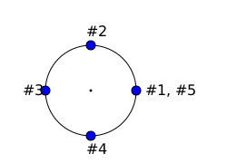

:orphan:

Standard library
================

:code-config:`reset_accumulator=True;accumulate_code=False`

.. include:: <isopub.txt>

.. role:: ada(code)
   :language: ada

.. role:: c(code)
   :language: c

.. role:: cpp(code)
   :language: c++

Simple todo list
----------------

This exercise is based on the *Simple todo list* exercise from the
:doc:`more_about_types`. Your goal is to rewrite that exercise using
vectors instead of arrays. Please refer to the original exercise for
details. You may reuse the code you've implemented as a starting point.

.. code:: ada lab=Standard_Library.Simple_Todo_List

    --  START LAB IO BLOCK
    in 0:Todo_List_Chk
    out 0:TO-DO LIST Buy milk Buy tea Buy present Buy tickets Pay electricity bill Schedule dentist appointment Call sister Revise spreasheet Edit entry page Select new design Create upgrade plan
    --  END LAB IO BLOCK

    package Todo_Lists is

       type Todo_Item is access String;

       type Todo_List is null record;

       procedure Add (Todos : in out Todo_List;
                      Item  : String);

       procedure Display (Todos : Todo_List);

    end Todo_Lists;

    with Ada.Text_IO; use Ada.Text_IO;

    package body Todo_Lists is

       procedure Add (Todos : in out Todo_List;
                      Item  : String) is
       begin
          null;
       end Add;

       procedure Display (Todos : Todo_List) is
       begin
          Put_Line ("TO-DO LIST");
       end Display;

    end Todo_Lists;

    with Ada.Command_Line;  use Ada.Command_Line;
    with Ada.Text_IO;       use Ada.Text_IO;

    with Todo_Lists;        use Todo_Lists;

    procedure Main is
       type Test_Case_Index is
         (Todo_List_Chk);

       procedure Check (TC : Test_Case_Index) is
          T : Todo_List;
       begin
          case TC is
             when Todo_List_Chk =>
                Add (T, "Buy milk");
                Add (T, "Buy tea");
                Add (T, "Buy present");
                Add (T, "Buy tickets");
                Add (T, "Pay electricity bill");
                Add (T, "Schedule dentist appointment");
                Add (T, "Call sister");
                Add (T, "Revise spreasheet");
                Add (T, "Edit entry page");
                Add (T, "Select new design");
                Add (T, "Create upgrade plan");
                Display (T);
          end case;
       end Check;

    begin
       if Argument_Count < 1 then
          Put_Line ("ERROR: missing arguments! Exiting...");
          return;
       elsif Argument_Count > 1 then
          Put_Line ("Ignoring additional arguments...");
       end if;

       Check (Test_Case_Index'Value (Argument (1)));
    end Main;

Inventory
---------

This exercise is based on the *Inventory* exercise from the
:doc:`more_about_types`. Your goal is to rewrite that exercise using
vectors |mdash| instead of arrays |mdash| and unbounded strings.

- Hint: for the declaration of the :ada:`Item_ID` type, you can use the
  cursor from the vector container.

Please refer to the original exercise for further details. You may reuse
the code you've implemented as a starting point.

.. code:: ada lab=Standard_Library.Inventory

    --  START LAB IO BLOCK
    in 0:Inventory_Chk
    out 0:==== ITEM : Ballpoint Pen == BOUGHT Quantity:  10 Value:     1.50 == SOLD Quantity:  4 Value:     0.60 == IN STOCK Quantity:  6 Value:     0.90  ==== ITEM : Oil-based Pen Marker == BOUGHT Quantity:  20 Value:     180.00 == SOLD Quantity:  0 Value:     0.00 == IN STOCK Quantity:  20 Value:     180.00  ==== ITEM : Feather Quill Pen == BOUGHT Quantity:  50 Value:     750.00 == SOLD Quantity:  20 Value:     300.00 == IN STOCK Quantity:  30 Value:     450.00  ==== OVERALL Value bought:     931.50 Value sold:       300.60 Value in stock:   630.90
    --  END LAB IO BLOCK

    with Ada.Strings.Unbounded;  use Ada.Strings.Unbounded;
    with Ada.Containers.Vectors;

    package Inventory_Pkg is

       subtype Item_Quantity is Natural;

       type Currency is delta 10.0 ** (-2) digits 12;

       type Transaction_Type is (Bought, Sold);

       type Item is private;

       type Item_ID is private;

       type Inventory is private;

       function Init (Name  : String;
                      Price : Currency) return Item;

       procedure Init (Inv : in out Inventory);

       procedure Add (Inv     : in out Inventory;
                      I       :        Item;
                      ID      : out    Item_ID);

       function Get (Inv       : Inventory;
                     Item_Name : String) return Item_ID;

       procedure Set (Inv      : in out Inventory;
                      Trans    :        Transaction_Type;
                      ID       :        Item_ID;
                      Quantity :        Positive;
                      Success  :    out Boolean);

       function Get (Inv   : Inventory;
                     ID    : Item_ID) return String;
       --  Retrieve item name
       --
       --  Item_Name : String := Get (Inv, ID);

       function Get (Inv   : Inventory;
                     ID    : Item_ID) return Item_Quantity;
       --  Retrieve number of units in stock for specified item
       --
       --  Number_Units_In_Stock_For_Item : Item_Quantity := Get (Inv, ID);

       function Get (Inv   : Inventory;
                     ID    : Item_ID) return Currency;
       --  Retrieve total amount in stock for specified item
       --
       --  Potential_Income_For_Units_In_Stock_For_Item : Currency := Get (Inv, ID);

       function Get (Inv   : Inventory;
                     Trans : Transaction_Type;
                     ID    : Item_ID) return Item_Quantity;
       --  Retrieve number of units for specified item and transaction type
       --
       --  Number_Units_Sold_For_Item : Item_Quantity := Get (Inv, Sold, ID);

       function Get (Inv   : Inventory;
                     Trans : Transaction_Type;
                     ID    : Item_ID) return Currency;
       --  Retrieve amount for specified item and transaction type
       --
       --  Income_For_Sold_Units_Of_Item : Currency := Get (Inv, Sold, ID);

       function Get (Inv   : Inventory;
                     Trans : Transaction_Type) return Currency;
       --  Retrieve amount for transaction type
       --
       --  Income_For_All_Sold_Units : Currency := Get (Inv, Sold);

       function Get (Inv   : Inventory) return Currency;
       --  Retrieve amount for inventory
       --
       --  Income_For_All_Units_In_Stock : Currency := Get (Inv);

       procedure Display (Inv : Inventory);

    private

       subtype Name_Type is Unbounded_String;

       type Item is null record;

       --  You can use the container's cursor for the declaration of
       --  Item_ID.
       type Item_ID is null record;

       type Inventory is null record;

    end Inventory_Pkg;

    with Ada.Text_IO; use Ada.Text_IO;

    package body Inventory_Pkg is

       function Init (Name  : String;
                      Price : Currency) return Item is
       begin
          return (null record);
       end Init;

       procedure Init (Inv : in out Inventory) is
       begin
          null;
       end Init;

       procedure Add (Inv     : in out Inventory;
                      I       :        Item;
                      ID      : out    Item_ID)
       is
       begin
          null;
       end Add;

       function Get (Inv       : Inventory;
                     Item_Name : String) return Item_ID
       is
       begin
          return (null record);
       end Get;

       procedure Set (Inv      : in out Inventory;
                      Trans    :        Transaction_Type;
                      ID       :        Item_ID;
                      Quantity :        Positive;
                      Success  :    out Boolean)
       is
       begin
          Success := False;
       end Set;

       function Get (Inv   : Inventory;
                     ID    : Item_ID) return String is
         ("");

       function Get (Inv   : Inventory;
                     ID    : Item_ID) return Item_Quantity is
         (0);

       function Get (Inv   : Inventory;
                     ID    : Item_ID) return Currency is
         (0.0);

       function Get (Inv   : Inventory;
                     Trans : Transaction_Type;
                     ID    : Item_ID) return Item_Quantity is
         (0);

       function Get (Inv   : Inventory;
                     Trans : Transaction_Type;
                     ID    : Item_ID) return Currency is
         (0.0);

       function Get (Inv   : Inventory;
                     Trans : Transaction_Type) return Currency
       is
          Total : Currency := 0.0;
       begin
          return Total;
       end Get;

       function Get (Inv   : Inventory) return Currency
       is
          Total : Currency := 0.0;
       begin
          return Total;
       end Get;

       procedure Display (Inv : Inventory)
       is
          package F_IO is new Ada.Text_IO.Decimal_IO (Currency);

          use F_IO;
       begin
       --  Uncomment and adapt the code below according to your declaration
       --  of the Inventory type:
       --
       --   for C in Inv.List_Item.Iterate loop
       --      declare
       --         I : constant Item_ID := Item_ID (C);
       --      begin
       --         Put_Line ("==== ITEM "
       --                   & ": " & Get (Inv, I));
       --         for Trans in Transaction_Type loop
       --            Put_Line ("== " & Transaction_Type'Image (Trans));
       --            Put_Line ("Quantity: "
       --                      & Item_Quantity'Image (Get (Inv, Trans, I)));
       --            Put ("Value:     ");
       --            Put (Currency'(Get (Inv, Trans, I)), 1, 2, 0);
       --            New_Line;
       --         end loop;
       --         Put_Line ("== IN STOCK");
       --         Put_Line ("Quantity: " & Item_Quantity'Image (Get (Inv, I)));
       --         Put ("Value:     ");
       --         Put (Currency'(Get (Inv, I)), 1, 2, 0);
       --         New_Line;
       --         New_Line;
       --      end;
       --   end loop;
          Put_Line ("==== OVERALL");
          Put ("Value bought:     ");
          Put (Currency'(Get (Inv, Bought)), 1, 2, 0);
          New_Line;
          Put ("Value sold:       ");
          Put (Currency'(Get (Inv, Sold)), 1, 2, 0);
          New_Line;
          Put ("Value in stock:   ");
          Put (Currency'(Get (Inv)), 1, 2, 0);
          New_Line;
       end Display;

    end Inventory_Pkg;

    with Ada.Command_Line;  use Ada.Command_Line;
    with Ada.Text_IO;       use Ada.Text_IO;

    with Inventory_Pkg;     use Inventory_Pkg;

    procedure Main is
       --  Remark: the following line is not relevant.
       F   : array (1 .. 200) of Float := (others => 42.42);

       type Test_Case_Index is
         (Inventory_Chk);

       procedure Check (TC : Test_Case_Index) is
          Inv     : Inventory;
          Success : Boolean;
          ID      : Item_ID;

          --  Please ignore the following three lines!
          pragma Warnings (Off, "default initialization");
          for Inv'Address use F'Address;
          pragma Warnings (On, "default initialization");

          procedure Init_Check_Data is
          begin
             Add (Inv,
                  Init ("Ballpoint Pen", 0.15),
                  ID);

             Set (Inv      => Inv,
                  Trans    => Bought,
                  ID       => ID,
                  Quantity => 10,
                  Success  => Success);

             Set (Inv      => Inv,
                  Trans    => Sold,
                  ID       => ID,
                  Quantity => 2,
                  Success  => Success);

             Set (Inv      => Inv,
                  Trans    => Sold,
                  ID       => ID,
                  Quantity => 2,
                  Success  => Success);

             Add (Inv,
                  Init ("Oil-based Pen Marker", 9.0),
                  ID);

             Add (Inv,
                  Init ("Feather Quill Pen", 15.0),
                  ID);

             Set (Inv      => Inv,
                  Trans    => Bought,
                  ID       => Get (Inv, "Oil-based Pen Marker"),
                  Quantity => 20,
                  Success  => Success);

             Set (Inv      => Inv,
                  Trans    => Bought,
                  ID       => Get (Inv, "Feather Quill Pen"),
                  Quantity => 50,
                  Success  => Success);

             Set (Inv      => Inv,
                  Trans    => Sold,
                  ID       => Get (Inv, "Feather Quill Pen"),
                  Quantity => 20,
                  Success  => Success);
          end Init_Check_Data;

       begin
          Init_Check_Data;

          case TC is
          when Inventory_Chk =>
             Display (Inv);
          end case;
       end Check;

    begin
       if Argument_Count < 1 then
          Put_Line ("ERROR: missing arguments! Exiting...");
          return;
       elsif Argument_Count > 1 then
          Put_Line ("Ignoring additional arguments...");
       end if;

       Check (Test_Case_Index'Value (Argument (1)));
    end Main;

List of events
--------------

Your goal with this exercise is to create a list of events using the
following format:

.. code-block:: none

    <event_date #1>
        <description of item #1a>
        <description of item #1b>
    <event_date #2>
        <description of item #2a>
        <description of item #2b>

First, you need to declare the :ada:`Event_Item` type in the :ada:`Events`
package. This type contains the *description of the event* mentioned
in the format above. This description can be stored as an unbounded string.
Since we can have multiple events for a specific date, we need a container
to store those items. To implement this, we declare the :ada:`Event_Items`
type in the same package. You can use a vector for this type.

We map event items (as elements of :ada:`Event_Item` type) to specific dates
by using the :ada:`Event_List` of the :ada:`Events.Lists` package. For
the dates, you should use the :ada:`Time` type from the :ada:`Ada.Calendar`
package. Since we expect the events to be ordered by the date, you should
use ordered maps for the :ada:`Event_List` type.

The :ada:`Events.Lists` package contains the API that is used in our test
application. Consider the following example:

.. code-block:: ada

    procedure Test is
       EL : Event_List;
    begin
       EL.Add (Time_Of (2019, 4, 16),
               "Item #2");
       EL.Add (Time_Of (2019, 4, 15),
               "Item #1");
       EL.Add (Time_Of (2019, 4, 16),
               "Item #3");
       EL.Display;
    end Test;

The expected output of the :ada:`Test` procedure is:

.. code-block:: none

    EVENTS LIST
    - 2019-04-15
        - Item #1
    - 2019-04-16
        - Item #2
        - Item #3

In the implementation of the :ada:`Display` procedure, make sure to use the
format as shown above. Also, you should use the auxiliary :ada:`Date_Image`
function to display the date in the ``YYYY-MM-DD`` format.

.. code:: ada lab=Solutions.Standard_Library.List_of_Events

    --  START LAB IO BLOCK
    in 0:Event_List_Chk
    out 0:EVENTS LIST - 2018-01-01     - New Year's Day - 2018-02-16     - Final check     - Release - 2018-12-03     - Brother's birthday
    --  END LAB IO BLOCK

    package Events is

       type Event_Item is null record;

       type Event_Items is null record;

    end Events;

    with Ada.Calendar; use Ada.Calendar;

    package Events.Lists is

       type Event_List is tagged private;

       procedure Add (Events     : in out Event_List;
                      Event_Time :        Time;
                      Event      :        String);

       procedure Display (Events : Event_List);

    private

       type Event_List is tagged null record;

    end Events.Lists;

    with Ada.Text_IO;             use Ada.Text_IO;
    with Ada.Calendar.Formatting; use Ada.Calendar.Formatting;

    package body Events.Lists is

       procedure Add (Events     : in out Event_List;
                      Event_Time : Time;
                      Event      : String) is
       begin
          null;
       end Add;

       function Date_Image (T : Time) return String is
          Date_Img : constant String := Image (T);
       begin
          return Date_Img (1 .. 10);
       end;

       procedure Display (Events : Event_List) is
          T : Time;
       begin
          Put_Line ("EVENTS LIST");
          --  You should use Date_Image (T) here!
       end Display;

    end Events.Lists;

    with Ada.Command_Line;        use Ada.Command_Line;
    with Ada.Text_IO;             use Ada.Text_IO;
    with Ada.Calendar;
    with Ada.Calendar.Formatting; use Ada.Calendar.Formatting;

    with Events.Lists;            use Events.Lists;

    procedure Main is
       type Test_Case_Index is
         (Event_List_Chk);

       procedure Check (TC : Test_Case_Index) is
          EL : Event_List;
       begin
          case TC is
             when Event_List_Chk =>
                EL.Add (Time_Of (2018, 2, 16),
                        "Final check");
                EL.Add (Time_Of (2018, 2, 16),
                        "Release");
                EL.Add (Time_Of (2018, 12, 3),
                        "Brother's birthday");
                EL.Add (Time_Of (2018, 1, 1),
                        "New Year's Day");
                EL.Display;
          end case;
       end Check;

    begin
       if Argument_Count < 1 then
          Put_Line ("ERROR: missing arguments! Exiting...");
          return;
       elsif Argument_Count > 1 then
          Put_Line ("Ignoring additional arguments...");
       end if;

       Check (Test_Case_Index'Value (Argument (1)));
    end Main;

Decibel Factor
--------------

The `Decibel <https://en.wikipedia.org/wiki/Decibel>`_ is used to express
the ratio of two values on a logarithmic scale. For example, an increase
of 6 dB corresponds roughly to a multiplication by two (or an increase by
100 % of the original value).

Your goal in this exercise is to implement the functions :ada:`To_Decibel`
and :ada:`To_Factor` of the :ada:`Decibels` package to convert from a
multiplication factor (or ratio) to decibels and vice-versa:

    - For :ada:`To_Decibel`, use :math:`20 * log_{10}(F)`, where *F* is the
      factor/ratio.

    - For :ada:`To_Factor`, use :math:`10^{D/20}`, where *D* is the value
      in Decibel.

You can find the functions that you'll need for the calculation in the
:ada:`Ada.Numerics.Elementary_Functions` package.

.. code:: ada lab=Standard_Library.Decibel_Factor

    --  START LAB IO BLOCK
    in 0:Db_Chk 3.0
    out 0:3.00 dB => Factor of 1.41
    in 1:Db_Chk 6.0
    out 1:6.00 dB => Factor of 2.00
    in 2:Db_Chk 20.0
    out 2:20.00 dB => Factor of 10.00
    in 3:Factor_Chk 2.0
    out 3:Factor of 2.00 => 6.02 dB
    in 4:Factor_Chk 4.0
    out 4:Factor of 4.00 => 12.04 dB
    in 5:Factor_Chk 100.0
    out 5:Factor of 100.00 => 40.00 dB
    --  END LAB IO BLOCK

    package Decibels is

       subtype Decibel is Float;
       subtype Factor  is Float;

       function To_Decibel (F : Factor) return Decibel;

       function To_Factor (D : Decibel) return Factor;

    end Decibels;

    package body Decibels is

       function To_Decibel (F : Factor) return Decibel is
       begin
          return 0.0;
       end To_Decibel;

       function To_Factor (D : Decibel) return Factor is
       begin
          return 0.0;
       end To_Factor;

    end Decibels;

    with Ada.Command_Line; use Ada.Command_Line;
    with Ada.Text_IO;      use Ada.Text_IO;

    with Decibels;         use Decibels;

    procedure Main is
       type Test_Case_Index is
         (Db_Chk,
          Factor_Chk);

       procedure Check (TC : Test_Case_Index; V : Float) is

          package F_IO is new Ada.Text_IO.Float_IO (Factor);
          package D_IO is new Ada.Text_IO.Float_IO (Decibel);

          procedure Put_Decibel_Cnvt (D : Decibel) is
             F : constant Factor := To_Factor (D);
          begin
             D_IO.Put (D, 0, 2, 0);
             Put (" dB => Factor of ");
             F_IO.Put (F, 0, 2, 0);
             New_Line;
          end;

          procedure Put_Factor_Cnvt (F : Factor) is
             D : constant Decibel := To_Decibel (F);
          begin
             Put ("Factor of ");
             F_IO.Put (F, 0, 2, 0);
             Put (" => ");
             D_IO.Put (D, 0, 2, 0);
             Put_Line (" dB");
          end;
       begin
          case TC is
             when Db_Chk =>
                Put_Decibel_Cnvt (Decibel (V));
             when Factor_Chk =>
                Put_Factor_Cnvt (Factor (V));
          end case;
       end Check;

    begin
       if Argument_Count < 2 then
          Put_Line ("ERROR: missing arguments! Exiting...");
          return;
       elsif Argument_Count > 2 then
          Put_Line ("Ignoring additional arguments...");
       end if;

       Check (Test_Case_Index'Value (Argument (1)), Float'Value (Argument (2)));
    end Main;

Root-Mean-Square
----------------

The `root-mean-square <https://en.wikipedia.org/wiki/Root_mean_square>`_
(RMS) value is an important information associated with sequences of values.
It's used, for example, as a measurement for signal processing.

Your goal with this exercise is to implement the function :ada:`Rms` of the
:ada:`Signals` package, which calculates the RMS of a sequence of values
stored in an array of type :ada:`Signal`.

As the name implies, you calculate the RMS value by:

1. Creating a sequence :math:`S` with the square of each value of an input
   sequence :math:`S_{in}`.

2. Calculating the mean value :math:`M` of the sequence :math:`S`.

3. Calculating the square-root :math:`R` of :math:`M`.

You can optimize the algorithm above by combining steps #1 and #2 into a
single step.

.. code:: ada lab=Standard_Library.Root_Mean_Square

    --  START LAB IO BLOCK
    in 0:Sine_Signal_Chk
    out 0:RMS of Sine Signal: 0.71
    in 1:Square_Signal_Chk
    out 1:RMS of Square Signal: 1.00
    in 2:Triangular_Signal_Chk
    out 2:RMS of Triangular Signal: 0.58
    --  END LAB IO BLOCK

    package Signals is

       subtype Sig_Value is Float;

       type Signal is array (Natural range <>) of Sig_Value;

       function Rms (S : Signal) return Sig_Value;

    end Signals;

    with Ada.Numerics.Elementary_Functions; use Ada.Numerics.Elementary_Functions;

    package body Signals is

       function Rms (S : Signal) return Sig_Value is
       begin
          return 0.0;
       end;

    end Signals;

    package Signals.Std is

       Sample_Rate : Float := 8000.0;

       function Generate_Sine (N : Positive; Freq : Float) return Signal;

       function Generate_Square (N : Positive) return Signal;

       function Generate_Triangular (N : Positive) return Signal;

    end Signals.Std;

    with Ada.Numerics;                      use Ada.Numerics;
    with Ada.Numerics.Elementary_Functions; use Ada.Numerics.Elementary_Functions;

    package body Signals.Std is

       function Generate_Sine (N : Positive; Freq : Float) return Signal is
          S : Signal (0 .. N - 1);
       begin
          for I in S'First .. S'Last loop
             S (I) := 1.0 * Sin (2.0 * Pi * (Freq * Float (I) / Sample_Rate));
          end loop;

          return S;
       end;

       function Generate_Square (N : Positive) return Signal is
          S : constant Signal (0 .. N - 1) := (others => 1.0);
       begin
          return S;
       end;

       function Generate_Triangular (N : Positive) return Signal is
          S      : Signal (0 .. N - 1);
          S_Half : constant Natural := S'Last / 2;
       begin
          for I in S'First .. S_Half loop
             S (I) := 1.0 * (Float (I) / Float (S_Half));
          end loop;
          for I in S_Half .. S'Last loop
             S (I) := 1.0 - (1.0 * (Float (I - S_Half) / Float (S_Half)));
          end loop;

          return S;
       end;

    end Signals.Std;

    with Ada.Command_Line;        use Ada.Command_Line;
    with Ada.Text_IO;             use Ada.Text_IO;

    with Signals;                 use Signals;
    with Signals.Std;             use Signals.Std;

    procedure Main is
       type Test_Case_Index is
         (Sine_Signal_Chk,
          Square_Signal_Chk,
          Triangular_Signal_Chk);

       procedure Check (TC : Test_Case_Index) is
          package Sig_IO is new Ada.Text_IO.Float_IO (Sig_Value);

          N    : constant Positive := 1024;
          S_Si : constant Signal := Generate_Sine (N, 440.0);
          S_Sq : constant Signal := Generate_Square (N);
          S_Tr : constant Signal := Generate_Triangular (N + 1);
       begin
          case TC is
             when Sine_Signal_Chk =>
                Put ("RMS of Sine Signal: ");
                Sig_IO.Put (Rms (S_Si), 0, 2, 0);
                New_Line;
             when Square_Signal_Chk =>
                Put ("RMS of Square Signal: ");
                Sig_IO.Put (Rms (S_Sq), 0, 2, 0);
                New_Line;
             when Triangular_Signal_Chk =>
                Put ("RMS of Triangular Signal: ");
                Sig_IO.Put (Rms (S_Tr), 0, 2, 0);
                New_Line;
          end case;
       end Check;

    begin
       if Argument_Count < 1 then
          Put_Line ("ERROR: missing arguments! Exiting...");
          return;
       elsif Argument_Count > 1 then
          Put_Line ("Ignoring additional arguments...");
       end if;

       Check (Test_Case_Index'Value (Argument (1)));
    end Main;

Rotation
--------

Complex numbers are particularly useful in computer graphics to simplify
the calculation. For example, let's assume you've drawn an object on your
screen on position (1.0, 0.0). Now, you want to move this object in a
circular path |mdash| i.e. make it rotate around position (0.0, 0.0) on your
screen. You could use *sine* and *cosine* functions to calculate each
position of the path. However, you could also calculate the positions using
complex numbers.

On this exercise, you'll use complex numbers to calculate the positions
of an object that starts on zero degrees |mdash| on position (1.0, 0.0)
|mdash| and rotates around (0.0, 0.0) for *N* slices of a circle. For
example, if we divide the circle in four slices, the object's path will
consist of following points / positions:

.. code-block:: none

    Point #1: ( 1.0,  0.0)
    Point #2: ( 0.0,  1.0)
    Point #3: (-1.0,  0.0)
    Point #4: ( 0.0, -1.0)
    Point #5: ( 1.0,  0.0)

Or graphically:

As expected, point #5 is equal to the starting point (point #1), since the
object rotates around (0.0, 0.0) and returns to the starting point.

We can  also describe this path in terms of angles. The following list
presents the angles for the path on a four-sliced circle:

.. code-block:: none

    Point #1:    0.00 degrees
    Point #2:   90.00 degrees
    Point #3:  180.00 degrees
    Point #4:  -90.00 degrees (= 270 degrees)
    Point #5:    0.00 degrees

Your goal in this exercise is to implement the function :ada:`Rotation` of
the :ada:`Rotation` package. You can use functions from
:ada:`Ada.Numerics.Complex_Types` to complete this task.

.. code:: ada lab=Standard_Library.Rotation

    --  START LAB IO BLOCK
    in 0:Rotation_Chk 4
    out 0:---- Points for  4 slices ---- Point: (1.0,0.0) Point: (0.0,1.0) Point: (-1.0,0.0) Point: (0.0,-1.0) Point: (1.0,0.0)
    in 1:Angles_Chk 4
    out 1:---- Angles for  4 slices ---- Angle: 0.00 degrees Angle: 90.00 degrees Angle: 180.00 degrees Angle: -90.00 degrees Angle: 0.00 degrees
    in 2:Rotation_Chk 8
    out 2:---- Points for  8 slices ---- Point: (1.0,0.0) Point: (0.7,0.7) Point: (0.0,1.0) Point: (-0.7,0.7) Point: (-1.0,0.0) Point: (-0.7,-0.7) Point: (0.0,-1.0) Point: (0.7,-0.7) Point: (1.0,0.0)
    in 3:Angles_Chk 8
    out 3:---- Angles for  8 slices ---- Angle: 0.00 degrees Angle: 45.00 degrees Angle: 90.00 degrees Angle: 135.00 degrees Angle: 180.00 degrees Angle: -135.00 degrees Angle: -90.00 degrees Angle: -45.00 degrees Angle: 0.00 degrees
    in 4:Rotation_Chk 12
    out 4:---- Points for  12 slices ---- Point: (1.0,0.0) Point: (0.9,0.5) Point: (0.5,0.9) Point: (0.0,1.0) Point: (-0.5,0.9) Point: (-0.9,0.5) Point: (-1.0,0.0) Point: (-0.9,-0.5) Point: (-0.5,-0.9) Point: (0.0,-1.0) Point: (0.5,-0.9) Point: (0.9,-0.5) Point: (1.0,0.0)
    in 5:Angles_Chk 12
    out 5:---- Angles for  12 slices ---- Angle: 0.00 degrees Angle: 30.00 degrees Angle: 60.00 degrees Angle: 90.00 degrees Angle: 120.00 degrees Angle: 150.00 degrees Angle: 180.00 degrees Angle: -150.00 degrees Angle: -120.00 degrees Angle: -90.00 degrees Angle: -60.00 degrees Angle: -30.00 degrees Angle: 0.00 degrees
    in 6:Rotation_Chk 16
    out 6:---- Points for  16 slices ---- Point: (1.0,0.0) Point: (0.9,0.4) Point: (0.7,0.7) Point: (0.4,0.9) Point: (0.0,1.0) Point: (-0.4,0.9) Point: (-0.7,0.7) Point: (-0.9,0.4) Point: (-1.0,0.0) Point: (-0.9,-0.4) Point: (-0.7,-0.7) Point: (-0.4,-0.9) Point: (0.0,-1.0) Point: (0.4,-0.9) Point: (0.7,-0.7) Point: (0.9,-0.4) Point: (1.0,0.0)
    in 7:Angles_Chk 16
    out 7:---- Angles for  16 slices ---- Angle: 0.00 degrees Angle: 22.50 degrees Angle: 45.00 degrees Angle: 67.50 degrees Angle: 90.00 degrees Angle: 112.50 degrees Angle: 135.00 degrees Angle: 157.50 degrees Angle: 180.00 degrees Angle: -157.50 degrees Angle: -135.00 degrees Angle: -112.50 degrees Angle: -90.00 degrees Angle: -67.50 degrees Angle: -45.00 degrees Angle: -22.50 degrees Angle: 0.00 degrees
    --  END LAB IO BLOCK

    with Ada.Numerics.Complex_Types;
    use  Ada.Numerics.Complex_Types;

    package Rotation is

       type Complex_Points is array (Positive range <>) of Complex;

       function Rotation (N : Positive) return Complex_Points;

    end Rotation;

    with Ada.Numerics; use Ada.Numerics;

    package body Rotation is

       function Rotation (N : Positive) return Complex_Points is
          C : Complex_Points (1 .. 1) := (others => (0.0, 0.0));
       begin
          return C;
       end;

    end Rotation;

    with Rotation; use Rotation;

    package Angles is

       subtype Angle is Float;

       type Angles is array (Positive range <>) of Angle;

       function To_Angles (C : Complex_Points) return Angles;

    end Angles;

    with Ada.Numerics;               use Ada.Numerics;
    with Ada.Numerics.Complex_Types; use Ada.Numerics.Complex_Types;

    package body Angles is

       function To_Angles (C : Complex_Points) return Angles is
       begin
          return A : Angles (C'Range) do
             for I in A'Range loop
                A (I) := Argument (C (I)) / Pi * 180.0;
             end loop;
          end return;
       end To_Angles;

    end Angles;

    package Rotation.Tests is

       procedure Test_Rotation (N : Positive);

       procedure Test_Angles (N : Positive);

    end Rotation.Tests;

    with Ada.Text_IO;            use Ada.Text_IO;
    with Ada.Text_IO.Complex_IO;
    with Ada.Numerics;           use Ada.Numerics;

    with Angles;                 use Angles;

    package body Rotation.Tests is

       package C_IO is new Ada.Text_IO.Complex_IO (Complex_Types);
       package F_IO is new Ada.Text_IO.Float_IO (Float);

       --
       --  Adapt value due to floating-point inaccuracies
       --

       function Adapt (C : Complex) return Complex is
          function Check_Zero (F : Float) return Float is
            (if F <= 0.0 and F >= -0.01 then 0.0 else F);
       begin
          return C_Out : Complex := C do
             C_Out.Re := Check_Zero (C_Out.Re);
             C_Out.Im := Check_Zero (C_Out.Im);
          end return;
       end Adapt;

       function Adapt (A : Angle) return Angle is
         (if A <= -179.99 and A >= -180.01 then 180.0 else A);

       procedure Test_Rotation (N : Positive) is
          C : constant Complex_Points := Rotation (N);
       begin
          Put_Line ("---- Points for " & Positive'Image (N) & " slices ----");
          for V of C loop
             Put ("Point: ");
             C_IO.Put (Adapt (V), 0, 1, 0);
             New_Line;
          end loop;
       end Test_Rotation;

       procedure Test_Angles (N : Positive) is
          C : constant Complex_Points := Rotation (N);
          A : constant Angles.Angles  := To_Angles (C);
       begin
          Put_Line ("---- Angles for " & Positive'Image (N) & " slices ----");
          for V of A loop
             Put ("Angle: ");
             F_IO.Put (Adapt (V), 0, 2, 0);
             Put_Line (" degrees");
          end loop;
       end Test_Angles;

    end Rotation.Tests;

    with Ada.Command_Line;        use Ada.Command_Line;
    with Ada.Text_IO;             use Ada.Text_IO;

    with Rotation.Tests;          use Rotation.Tests;

    procedure Main is
       type Test_Case_Index is
         (Rotation_Chk,
          Angles_Chk);

       procedure Check (TC : Test_Case_Index; N : Positive) is
       begin
          case TC is
             when Rotation_Chk =>
                Test_Rotation (N);
             when Angles_Chk =>
                Test_Angles (N);
          end case;
       end Check;

    begin
       if Argument_Count < 2 then
          Put_Line ("ERROR: missing arguments! Exiting...");
          return;
       elsif Argument_Count > 2 then
          Put_Line ("Ignoring additional arguments...");
       end if;

       Check (Test_Case_Index'Value (Argument (1)), Positive'Value (Argument (2)));
    end Main;
