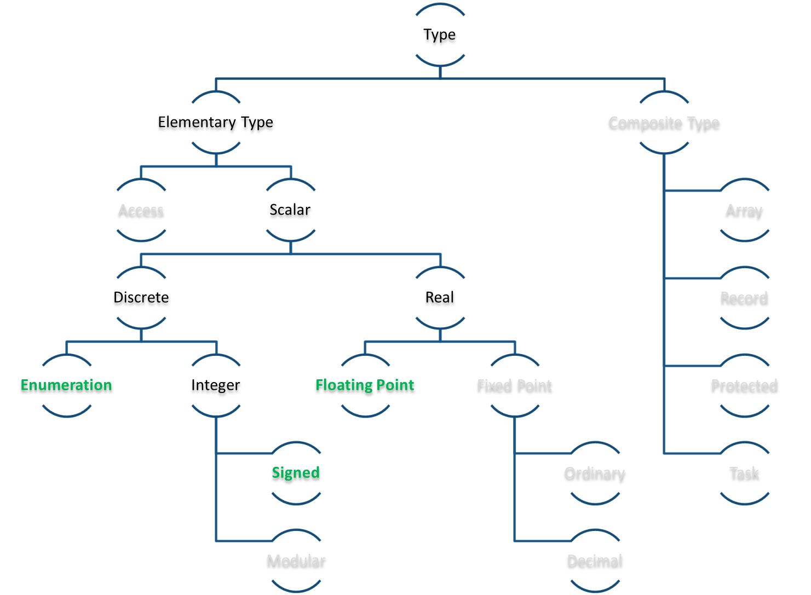
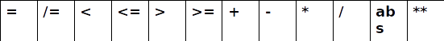
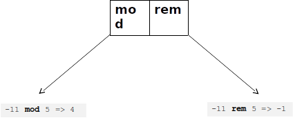

Lesson 1: Basic Types
=====================================================================

.. role:: ada(code)
   :language: ada

Welcome to the AdaCore University!

In this lesson, we will introduce to you the basic Ada type system. Let's get started!

A Few Syntactical Notes
---------------------------------------------------------------------

We will be assuming that you're familiar with the very first lessons of the Overview course. However, since this is the first formal lesson of the basic course, let's start by introducing some syntactical information.

Identifiers
~~~~~~~~~~~

Ada is a case-insensitive language, which means that identifier are the same if they're written in lower-case, uppercase, or mixed-case:

.. code:: ada

   HELLO = hello = HellO

This doesn't mean that the recommendation is to use random-casing for identifiers, but rather that a new identifier should not be created on the ground that the casing is different, which should avoid a number of programming mistakes. Identifier always start with a letter, and may end with a letter or a number. Underscore characters are allowed, as long as they are surrounded by letters or numbers, that is to say, you cannot have two or more consecutive underscores in the same identifier.

Some examples:

.. code:: ada

   Something      -- OK
   My__Id         -- Illegal: it contains two consecutive underscores
   _Hello         -- Illegal: it starts with an underscore
   A_67_9         -- OK
   _CONSTANT      -- Illegal: it starts with an underscore
   09_A_2         -- Illegal: it starts with a number
   YOP_           -- Illegal: it ends with an underscore

Comments
~~~~~~~~

Ada comments are written with two dashes (**:ada:`--`**) followed up by comments that will be written up until the end of the line:

.. code:: ada

   -- Some comments here...

This is equivalent to the C++ two-slashes comments (**:code:`//`**). Note that, in Ada, there is no block comment as you would have in Java or C++:

.. code:: ada

   /* block comment */  -- No equivalent in Ada

Numbers
~~~~~~~

Numbers can be expressed as in any other language, but Ada provides additional capabilities in that way that numbers can be expressed. The first one is the possibility of having underscores in the number, which can help separating groups of digits. For example:

.. code:: ada

   1_000_000 = 1000000

In the example above, the left number representation makes it clear that the number is one million (:math:`10^6`), whereas the right one is much less readable.

As in other languages, it is possible to express a number according to its base --- base 10 being the default. All bases from 2 up to 16 are allowed, and the syntax is :code:`base#value#`. For example:

.. code:: ada

   10#255# = 2#1111_1111# = 8#377# = 16#FF#

For floating-point numbers, literals needs to have a decimal part. So :math:`1.0` is a floating-point literal, and :math:`1` is not.

Variable declaration
~~~~~~~~~~~~~~~~~~~~

To declare a variable in Ada, you will write:

.. code::

   <name of the variable> : <type>

For example:

.. code:: ada

   A : Integer;

So, if you will, it's the other around compared to languages such as C, C++ or Java, where the type comes first and then the name:

.. code:: c

   int A;            /* C equivalent */

It is possible to have initialization at declaration time. In the Ada example below, we are saying that *B* is initialized with 5.

.. code:: ada

   B : Integer := 5;

This is the corresponding declaration in C:

.. code:: c

   int B = 5;        /* C equivalent */

A constant can be declared with the **:ada:`constant`** modifier coming right before the type name. In the case of a constant, an initialization is required. For example:

.. code:: ada

   C : constant Integer := 78;

This is the corresponding declaration in C:

.. code:: c

   const int C = 78; /* C equivalent */

In Ada, it is possible to declare several variables at the same declaration point. If this declaration point has a default value or a default expression, this default expression will be evaluated separately for every single variable. In the example below, we have *D* and *E* being initialized with the expression :ada:`F(5)`. Even though :ada:`F(5)` is written only once, it will be called twice (once for *D* and once for *E*):

.. code:: ada

   D, E : Integer := F (5);

This behavior is exactly the same as it would be the case in C:

.. code:: c

   int d = F (5), e = F(5);   /* C equivalent */

Another example:

.. code:: ada

   A, B : Float := Compute_New_Random;

   --  This is equivalent to:
   A : Float := Compute_New_Random;
   B : Float := Compute_New_Random;

Elaboration of variables is done sequentially. This means that you cannot refer to a variable before it has been declared. In the example below, we're trying to access *D* before it is created. This will result in a compilation error:

.. code:: ada

   A : Integer := 5;
   B : Integer := A;
   C : Integer := D; -- COMPILATION ERROR
   D : Integer := 0;

One last note: although we're using the assignment symbol (**:ada:`:=`**) in these examples, what we're really doing is called an initialization. The properties of assignments and initializations are slightly different. We will see the details in farther lessons.

Simple Scalar Types
---------------------------------------------------------------------

Ada Strong Typing
~~~~~~~~~~~~~~~~~

Now that we're done with this initial discussion, let's look at typing --- in particular, the simple types in Ada.

Ada is a strongly-typed language. This is probably one of the main differences with languages, such as C++ or Java. So there is a clear distinction between the semantic of a type --- its meaning, its purpose --- and its representation in memory. One of the most common examples is the notion of kilometers versus miles. Those two notions are incompatible: it does not make sense to add a number in miles to a number in kilometers. In most languages, it is very hard to represent this incompatibility. In Ada, those would be two different types, thus, by default, mixing those two types would be forbidden, except for explicit conversions.

In Ada, all types are named and associated with extra properties, attributes, ranges, sign, etc. Implicit conversions are forbidden. For example, a floating-point value is something very different from an integer value. An actual conversion from floating-point to integer has a lot of consequences. Many languages allow doing this operation implicitly when you need to mix two values of those two types. This is an example in C:

.. code:: c

   int A = 10 * 0.9;

It is going to be forbidded in Ada, and the developer will have to explicitly convert either the floating-point value to integer or the integer value to floating-point:

.. code:: ada

   A : Integer := 10 * Integer (0.9);
   A : Integer := Integer (Float (10) * 0.9);

As a matter of fact, as you can see in this example, doing one conversion or the other has a clear impact on the result of the computation.

Ada Type Model
~~~~~~~~~~~~~~

This is an overview of the Ada type model:

.. image:: type_model-01.png

On the left side, you'll find all the simple types (also called elementary type) containing, in particular, numbers. On the right side, composite types, that is to say, types that are composed of fields or components.

For now, we are going to concentrate on 3 categories of types. All of them will be elementary types --- actually elementary scalar types. We are going to look at enumerations, signed integers and floating-point types:

Scalar Types
~~~~~~~~~~~~

Scalar types are single-valued types. They are divided into two categories:

- Discrete types:

   - Type that can be enumerated and has a finite number of values.
   - No notion of precision.
   - Examples: integers and enumerations.

- Continuous types:

   - Types that map real numbers.
   - They are related to the precision.
   - Example: floating-point.

Some of the scalar types are associated with numerical operations: **:ada:`+`**, **:ada:`/`**, etc. We will list those a little bit later.

Standard Types
~~~~~~~~~~~~~~

The Ada standard provides some default types for signed integers, enumerations and floating-points.

The integer type that will be using the most is actually called :ada:`Integer`. Other integer types, such as :ada:`Short_Integer`, :ada:`Long_Integer` and :ada:`Long_Long_Integer` are available as well. Although, if you come to need some specific integer --- for example, in terms of data range ---, it will be better to define your own, as we will see later on.

One important point here is that the Ada standard does not provide any guarantee in terms of how big those types are. The only thing that we know is that :ada:`Short_Integer` is smaller or equal to :ada:`Integer`, which is smaller or equal to :ada:`Long_Integer`, etc. But, on certain implementations, all of these types might be implemented in 8 bits.

In terms of enumerations, the two main default enumerations that are available are :ada:`Character` and :ada:`Boolean` types, as you may expect.

For floating-point types, it's pretty much as for signed integer types: you will have access to a range of default floating-point types, such as :ada:`Short_Float`, :ada:`Float`, :ada:`Long_Float` and :ada:`Long_Long_Float`. Again, if you are relying on a specific data-range or precision, it will be better to create custom floating-point types.

Custom Type Declaration
~~~~~~~~~~~~~~~~~~~~~~~

Most of the time, you will find that the default types provided by the system don't quite fit what you need. So, it's very handy to be able to define your own type, and provide it with your own intent and semantic.

To define your own signed integer type, for example, you will create a type declaration and then complete it with a range definition:

.. code:: ada

   type Score is range 0 .. 20;
   type Percentage is range -100 .. 100;

In this example, we're creating a type called Score and specifying that the acceptable values for this type go from 0 to 20. We're declaring a second type called Percentage that is going to be used in a different context. For this second type, the range of valid values goes from -100 to 100. The compiler will check that it can represent this type using the processor that it is targeting. For example, if we want to create a very big type, but we only have access to a small processor with 8-bit or 16-bit units, the compiler will be able to flag that and refuse to compile a request that is not doable.

To declare an enumeration type, we will need to, again, create a type declaration and then define it by a list of literals. For example:

.. code:: ada

   type Color is (Red, Green, Blue, Yellow, Black);
   type Ternary is (True, False, Unknown);

Here, the type Color is defined by 5 values and the type Ternary is defined by 3 values.

To define a custom floating-point number, what we're going to provide is the minimum requested precision. For example:

.. code:: ada

   type Distance is digits 10;
   type Temperature is digits 5 range -273.15 .. 1_000_000.0;

Here, we're requesting that the type Distance to be at least of 10 decimal significant digits. If it is possible to compile such a type in the system, it will work fine. But, if we're requesting a precision that is too high, the compiler will flag that and refuse to compile. Also, it is possible to specify a range of valid values for a floating-point type --- as you can see in the declaration of Temperature.

Just a word of warning: introducing these range checks will decrease largely the performance of floating-point computations. So it may not be a good idea to do that: it depends on the usage of the type. This note only applies to floating-point types. It is perfectly fine to have ranges for integer types.

Creating a Type from an Existing Type
~~~~~~~~~~~~~~~~~~~~~~~~~~~~~~~~~~~~~

Types that were presented in the previous section were brand-new types. But, in a lot of situations, you will find that there is already a type implementation that you would like to reuse to create your new type. So it is perfectly possible to define a new type based on an existing one. For example:

.. code:: ada

   type Math_Score is new Score;

Here, we're saying that *Math_Score* is a new type based on the implementation of *Score*. *Math_Score* and *Score* are two completely independent types, but they share the same implementation. In addition to that, when creating a new type, if it's an integer type, it will be possible to reduce the range of values. For example:

.. code:: ada

   type Math_Score is new Score range 0 .. 10;
   type Primary_Color is new Color range Red .. Blue;

In this example, being bad in maths, it may be impossible to get a grade above 10. So we create this new type *Math_Score* and declare it to be of a range from 0 to 10, which is a smaller range than the one of *Score*. We could do that with pretty much any discrete type. For example, we have the type *Primary_Color*, which is based on the implementation of *Color*, but just accepting values from *Red* to *Blue*.

Type Conversion
~~~~~~~~~~~~~~~

Although it is impossible to mix different types by default, if they share commonalities in terms of implementation, it will be possible to make explicit conversions. For example:

.. code:: ada

   V1 : Float := 0.0;
   V2 : Integer := Integer (V1);

In this example, we have *V1* and *V2*. *V1* is of type *Float*, and the compiler knows how to convert a floating-point value to an integer, so we can convert it by writing the name of the type and the value in parantheses.

Note that a conversion may introduce an additional verification (a check). For example:

.. code:: ada

   type T1 is range 0 .. 10;
   type T2 is range 1 .. 10;

   V1 : T1 := 0;
   V2 : T2 := T2 (V1); -- Run-time error!

Here, we have *V1* and *V2*, which are variables of two types that are integer types. So, although we cannot mix them up, we will be able to convert one type into the other. However, the valid range of values is different. If *V1* equals 0, when we convert *V1* into the type *T2* (which does not accept the value 0), we will have a run-time error ---an exception--- and the program will stop.

Ada Operators
~~~~~~~~~~~~~

Signed integers and floating-point types share a lot of operators in common. Basically, all the common arithmetic operators are available.

Note that the comparison ---the inequality in particular--- is different in Ada than for languages such as C++ or Java: it's **:ada:`/=`** instead of **:code:`!=`**.

Signed integer types have two additional operators: **:ada:`mod`** and **:ada:`rem`**. Both of them compute the modulus of an integer number. The difference is that, when computing the modulus of a negative number, **:ada:`mod`** will look for the closest positive number, whereas **:ada:`rem`** will look for the closest negative number.

Attributes
~~~~~~~~~~

Let's now introduce attributes. Attributes are really useful in Ada: they are properties of Ada entities. Entities could be a variable, a subprogram and, of course, a type. You probably already know about the **:ada:`Image`** and **:ada:`Value`** attributes that can convert back-and-forth a value to a string.

.. code:: ada

   S : String := Integer'Image (42);

Depending on the category of a type, you will have access to different attributes. Let's have a look at a few examples. This is a list of attributes that are common to all scalar types:

+------------------------+----------------------------------------------+
| Attribute Name         | Documentation                                |
+========================+==============================================+
| First                  | Returns the first value of the type          |
+------------------------+----------------------------------------------+
| Last                   | Returns the last value of the type           |
+------------------------+----------------------------------------------+
| Image (X)              | Converts a value to its corresponding String |
+------------------------+----------------------------------------------+
| Value (X)              | Converts a String to its corresponding value |
+------------------------+----------------------------------------------+
| Min (X, Y)             | Returns the maximum of two values            |
+------------------------+----------------------------------------------+
| Max (X, Y)             | Returns the minimum of two values            |
+------------------------+----------------------------------------------+
| Pred (X)               | Returns the previous value                   |
+------------------------+----------------------------------------------+
| Succ (X)               | Returns the next value                       |
+------------------------+----------------------------------------------+
| Range                  | Equivalent of T’First ..T’Last               |
+------------------------+----------------------------------------------+

These are the attribute groups:

   - **:ada:`First`** will be providing the first value that can be represented with this type and **:ada:`Last`** will provide the biggest value.
   - **:ada:`Image`** and **:ada:`Value`** have already been mentioned: they convert a value back-and-forth to a string. This is available for all scalar types.
   - **:ada:`Min`** and **:ada:`Max`** will return conveniently the minimum and maximum between two values.
   - **:ada:`Pred`** and **:ada:`Succ`** will return the previous value and the successor (the next) value. It's interesting here that this notion of previous and next values is available for floating-point numbers as well. Of course, it will take into account the number of significant digits to computer the previous or next value available.
   - Range is an interesting attribute that you will see a lot later on as well when we talk about arrays. It's equivalent to defining a range using the **:ada:`First`** to the **:ada:`Last`** attributes.

Attributes specific to Discrete Types
~~~~~~~~~~~~~~~~~~~~~~~~~~~~~~~~~~~~~

Discrete types have two interesting attributes:

+------------------------+------------------------------------------------+
| Attribute Name         | Documentation                                  |
+========================+================================================+
| Pos (X)                | Returns the position of the value in the type  |
+------------------------+------------------------------------------------+
| Val (X)                | Returns a value according to its position      |
+------------------------+------------------------------------------------+

**:ada:`Pos`** will be take a value as a parameter the position of the value in the list of values. **:ada:`Val`** will do the other way around: it will create a value according to a position.

This is an example of usage:

.. code:: ada

   V : Character := Character’Val (0);
   W : Next_Character := Character’Val (Character’Pos (V) + 1);

Here, we want to retrieve the first character, so we use the position zero. Then we want to retrieve the character next to it, so we're retrieving the position, adding one, and then converting it back to a character. Of course, to do this specific task, we could use **:ada:`Pred`** and **:ada:`Succ`**, which have been presented in the previous section. But there are situations where those two attributes make a lot of sense.

Attributes specific to Floating-Point
~~~~~~~~~~~~~~~~~~~~~~~~~~~~~~~~~~~~~

Finally, here is a list of attributes that are specific to floating-point values:

+------------------------+------------------------------------------------+
| Attribute Name         | Documentation                                  |
+========================+================================================+
| Ceiling (X)            | Returns the smallest integral value after X    |
+------------------------+------------------------------------------------+
| Floor (X)              | Returns the largest integral value before X    |
+------------------------+------------------------------------------------+
| Truncation (X)         | Truncates towards 0                            |
+------------------------+------------------------------------------------+
| Rounding (X)           | Rounds to the closest integer                  |
+------------------------+------------------------------------------------+
| Remainder (X, Y)       | Returns the remainder of the Euclidian division|
+------------------------+------------------------------------------------+

You will find all means to convert a floating-point value to its closest integer value by truncating it, rounding it, getting the floor or the ceiling.

One very important information here with regard to conversion from floating-point to integer: a lot of languages are implementing this through truncation. However, with Ada, it's rounding that is used. In other words, the expectations that you will have in C ---in terms of conversion between floating-point to integer--- will be invalid in Ada.

Code Examples / Pitfalls
---------------------------------------------------------------------

Repeated variable declaration
~~~~~~~~~~~~~~~~~~~~~~~~~~~~~

In this example, we're trying to declare the same variable twice:

.. code:: ada

   V : Integer := 7;
   V : Integer := V + 5;

This will trigger a compilation error on the second line.

Unsupported range on target architecture
~~~~~~~~~~~~~~~~~~~~~~~~~~~~~~~~~~~~~~~~

In this example:

.. code:: ada

   type N is range -2 ** 256 .. 2 ** 256;

the compiler will verify that the requirement we have on the new type cannot be implemented on the target architecture. This type goes from :math:`-2^256` to :math:`2^256`. It is very unlikely that any architecture will support this range of values. So, in all likeness, the compiler will refuse to compile this type because it cannot be represented.

Coding style for variables
~~~~~~~~~~~~~~~~~~~~~~~~~~

This example is correct and will compile just fine because Ada is case-insensitive:

.. code:: ada

   ClassRoom : constant Natural := 5;
   Next_ClassRoom : Natural := classroom + 1;

However, it might make sense to use a style checker to ensure that the same convention is used everywhere.

Extending range of base type
~~~~~~~~~~~~~~~~~~~~~~~~~~~~

Let's look at this example:

.. code:: ada

   type T1 is new Integer range -10 .. 10;

   type T2 is new T1 range -100 .. 100;

Ada allows us to restrict the range of a given type, which is what we're doing on *T1*. However, we cannot extend this range when declaring a new type, so *T1* is between -10 and 10, but we cannot create a *T2* based on the implementation of *T1* will a larger range.

Rounding and truncation
~~~~~~~~~~~~~~~~~~~~~~~

Let's look at this example:

.. code:: ada

      F   : Float   := 7.6;
      Div : Integer := 10;
   begin
      F := Float (Integer (F) / Div);
      Put_Line (Float’Image (F));

What we're doing here is first converting the floating-point value 7.6 into an integer. We're doing a rounding here, so this conversion is equal to 8. We're then doing a division between 8 and 10. What we're doing is an integer division that, in most machines, will be perfomed as a truncation. The actual result of this integer division is zero, which is then converted into floating-point.

Mix-up of Val and Value
~~~~~~~~~~~~~~~~~~~~~~~

Let's look at this example:

.. code:: ada

   type T is (A, B, C);

   V1 : T := T'Val ("A");
   V2 : T := T'Value (2);

This is a very typical mix-up of the **:ada:`Val`** and **:ada:`Value`** attributes. **:ada:`Val`** takes a position and creates a value out of it. **:ada:`Value`** takes a string and creates a value out of it. So, in this example, what we really need to do is replace **:ada:`Val`** by **:ada:`Value`** for *V1* and **:ada:`Value`** by **:ada:`Val`** for *V2*.

Trimming and case-sensitiveness for Value
~~~~~~~~~~~~~~~~~~~~~~~~~~~~~~~~~~~~~~~~~

This code is perfectly fine:

.. code:: ada

   type T is (A, B, C);

   V1 : T := T'Value ("A");
   V2 : T := T'Value ("a");
   V3 : T := T'Value (" a ");

The first two calls to Value are acceptable: Ada is case-insensitive, so "A" and "a" are equivalent. The last line is a nice flexibility of the **:ada:`Value`** attribute, which automatically trims extra spaces.

Type with no valid value
~~~~~~~~~~~~~~~~~~~~~~~~

This type definition is peculiar:

.. code:: ada

   type T is range 1 .. 0;
   V : T;

Indeed, the range of *T* goes from 1 to 0. So far, we've only seen incremental ranges for good reasons: Ada always expects the range of a value to be even in a growing number. So what this created is a type that has no valid value. However, this is legal, and it is legal to declare a variable of that type as well. Of course, the minute we're assigning a value to this variable, we're going to have an exception.

There are situations where this construction is quite useful. We will see that later on.
