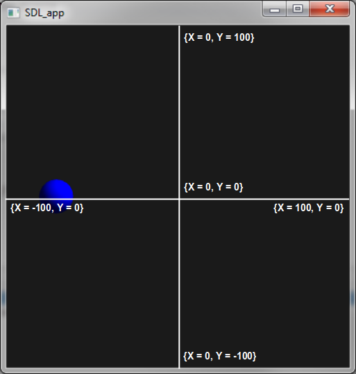

Lesson 2: A Bouncing Ball
=====================================================================

.. role:: ada(code)
   :language: ada

Welcome again to the AdaCore University!

In this lesson, we will going to look into something that is a little bit more interesting than the previous lesson, which is a ball that bounces from one end of the screen to the other one. Let's get started!

Introduction to graphical environment
---------------------------------------------------------------------

First of all, let's introduced you to the graphical environment that is going to be used throughout the courses and labs at AdaCore University. This is a simple, two-dimensional environment in which it will be possible to create objects, such as balls, lines, blocks, text, etc:

It's centered at the point (0, 0), the ordinate axis goes from -100 to 100, and so does the abscissa axis.

This is a very simple program that uses this graphical environment to create a ball going from one end of the screen to the other one:

.. code:: ada

   with Display;       use Display;
   with Display.Basic; use Display.Basic;

   procedure Main is
      Ball : Shape_Id := New_Circle
        (X      => 0.0,
         Y      => 0.0,
         Radius => 10.0,
         Color  => Blue);
      Step : Float := 0.05;
   begin
      loop
         if Get_X (Ball) > 100.0 then
            Step := -0.05;
         elsif Get_X (Ball) < -100.0 then
            Step := 0.05;
         end if;

         Set_X (Ball, Get_X (Ball) + Step);

         delay 0.001;
      end loop;
   end Main;

Opening project on GPS
---------------------------------------------------------------------

We can now see this live in the GPS environment. First of all, open the corresponding project (called ``Ball``). After the project is loaded, you can see that the setup is a little different from the previous one (the ``Hello`` project). First of all, in the ``project`` view, things are a bit more complex. We have the ``Game_Support`` project that is being included in the list of projects that ``Ball`` depends on. This ``Game_Support`` project is going to provide us with graphical capabilities. We will present details about how to handle GNAT project files in a different lesson.

For now, let's just compile this application. As before, you just go to ``Build`` -> ``Project`` -> ``main.adb``. Note that, this time, the main application is simply called ``Main`` (in file ``main.adb``). Again, the default options are all right, so you can simply click on ``Execute``.

After building the application, we can run the application by clicking on ``Build`` -> ``Run`` -> ``main``, using the default options on the ``Execute`` window, and clicking on ``Execute``. This will open the application window, which will show a ball bouncing from one end of the screen to the other as expected.

Using the graphical environment
---------------------------------------------------------------------

Let's see this code in more details now. The first thing we need to do is to gain access to the graphical environment. Note that this graphical environment is not standard Ada. It is provided for the purpose of doing this demos. It is actually coming from the ``Game_Support`` project that we've seen at the application before.

The library that provides the services to interact with the graphical environment is called ``Display`` and ``Display.Basic``, which is why we create references to this library:

.. code:: ada

   with Display;       use Display;
   with Display.Basic; use Display.Basic;

Note that, in this case, we've written the :ada:`with` to declare a dependency between my program and the graphical environment, and we've written :ada:`use` as well on those same packages of the same libraries. We will see why this :ada:`use` clause might be useful.

In this declaration, we're creating a new variable called ``Ball``, which is of type ``Shape_Id``:

.. code:: ada

      Ball : Shape_Id := New_Circle
        (X      => 0.0,
         Y      => 0.0,
         Radius => 10.0,
         Color  => Blue);

``Shape_Id`` is a type that is declared in the library Display.Basic, and it allows us to refer to an element on the screen. If you remember from the previous lesson, what we should have written here is ``Display.Basic.Shape_Id``. Fortunately, we have the :ada:`use` clause next to it, which allows us to omit the prefix, so that we can directly refer to ``Shape_Id``.

What we do in the code above is to initialize this object with a default value, and this value is computed from the call to ``New_Circle``. What ``New_Circle`` does is to create a Ball in the environment and to return a handle to this Ball for further manipulation.

If you need to know more about how ``New_Circle`` can be called, from GPS, you can go on the ``New_Circle`` name, click on it and then right-click to open a context menu, and hit ``Goto declaration of New_Circle``. If we click there, we jump right to the declaration of ``New_Circle``, and we can see that ``New_Circle`` is a function that takes four parameters: ``X`` and ``Y`` (the coordinates), ``Radius`` (the radius of the circle), and ``Color`` (of ``Color_Type``). ``X``, ``Y``, and ``Radius`` are of type :ada:`Float`, so it's easy enough to get what this may look like. However, ``Color_Type`` is a bit obscure here, so again, we're going to click on the ``Color_Type``, right-click, hit ``Goto declaration of Color_Type``, and then we can see that ``Color_Type`` is a type that has several values, such as ``Black``, ``Blue``, ``Green``, etc. We will dive into all the details of this typing system and this subprogram declarations later on. For now, let's get back to our example.

We're going to provide a value for each parameter of this call to ``New_Circle``. In this very case, we're using the name notation for parameter passing. This means that we're going to write the name of the parameter, then :ada:`=>` and then its value:

.. code:: ada

        (X      => 0.0,

This lets us know very easily which parameter we are using on every call. One important point to see here is that Ada is known as a strongly typed language. We will see later on exactly what that means, but, for our purpose here, it means that we cannot make the confusion between a floating-point literal and an integer literal. For Ada, 0.0 is considered to be a floating-point literal, while 0 is an integer literal. Those values cannot be mixed up. Since ``X`` is expecting a floating-point value, we have to write 0.0 to make it clear that the literal we're giving to it is indeed a floating-point literal. If we try to just write 0, the compiler will refuse to compile the application:

.. code:: ada

        (X      => 0,  --  This won't compile!

This brings us to the sequence of statements. What we're doing is an infinite loop, which will update the position of the ball at each step. In Ada, such a loop is introduced by the :ada:`loop` reserved word, and closed by :ada:`end loop`:

.. code:: ada

   begin
      loop
        -- ...
      end loop;

Because the time to compute the content of the loop may be too short, we need to wait a bit at each iteration. This is done through a delay statement:

.. code:: ada

      loop
         -- ...
         delay 0.001;
      end loop;

This is somewhat equivalent to sleep calls that you may have in C, and the effect is that the program will wait for the amount of seconds that is specified in the statement. So here, at each loop, once we've done all the processing, we will wait for one millisecond.

The actual computation starts by looking at value of ``X`` of the ``Ball``, and then checking if it is out of the boundaries of the screen:

.. code:: ada

         if Get_X (Ball) > 100.0 then
            Step := -0.05;
         elsif Get_X (Ball) < -100.0 then
            Step := 0.05;
         end if;

If it is out of the boundary, we're going to reverse the direction by changing the sign of the Step variable, which will be used later to increment or decrement the position of the ball. Note that, in this case, we're making a call to the ``Get_X`` function from ``Display.Basic``, but, this time, we're not providing the formal names of the parameters. This time, we're not choosing the naming notation. Instead, we're using the positional notation, which is perfectly fine. Therefore, we're just providing values for the parameters at the calling time.

Finally, we're calling the last function from ``Display.Basic``, which is ``Set_X``. It modifies the position of the ball:

.. code:: ada

         Set_X (Ball, Get_X (Ball) + Step);

Again, here, we're using the positional notation, we're not naming the parameters even if we could. What this line does is to take the previous position of the ball, add the ``Step``, and then use this value for the new position of the ball.
