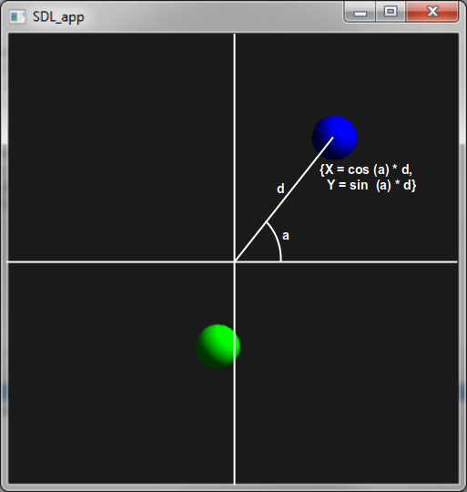

Lesson 3: Rotating Balls
=====================================================================

.. role:: ada(code)
   :language: ada

.. role:: c(code)
   :language: c

Welcome again to the AdaCore University!

In this lesson, we are going to look into a program where two balls are rotating around the center of the screen. Let's get started!

Geometry
---------------------------------------------------------------------

Before going any further, let's have a look at some basic geometry that is going to be required for this example and the next one.

There is a ball somewhere in the system, and we want this ball to rotate around the center of the screen. Therefore, we're going to need two data:

- ``a``: the angle around the center
- ``d``: the distance between the center of the screen and the center of the ball.

The rotation will result in increasing the angle ``a`` from 0 to :math:`2\pi`, or 360 degrees.

So, if we got these ``d`` and ``a`` variables, the value on the x axis is:

.. math::

   X = cos(a) * d

The function ``cos`` is available from the standard Ada API.

The value on the Y axis is:

.. math::

   Y = sin(a) * d

With these, we are going to be able to create very interesting animations.

Source-code
---------------------------------------------------------------------

This program is slightly more complex than the ones we've seen so far. What this program is going to do is create two balls on the screen and having them rotating around the center:

.. code:: ada

   with Display;                           use Display;
   with Display.Basic;                     use Display.Basic;
   with Ada.Numerics.Elementary_Functions; use Ada.Numerics.Elementary_Functions;

   procedure Main is
      type Ball_Type is record
         Shape       : Shape_Id;
         Angle_Speed : Float;
         Angle       : Float;
         Distance    : Float;
      end record;

      procedure Iterate (V : in out Ball_Type) is
      begin
         V.Angle := V.Angle + V.Angle_Speed;
         Set_X (V.Shape, Cos (V.Angle) * V.Distance);
         Set_Y (V.Shape, Sin (V.Angle) * V.Distance);
      end Iterate;

      B1 : Ball_Type :=
        (Shape       => New_Circle (0.0, 0.0, 10.0, Blue),
         Angle_Speed => 0.001,
         Angle       => 0.0,
         Distance    => 70.0);

      B2 : Ball_Type :=
        (Shape       => New_Circle (0.0, 0.0, 10.0, Green),
         Angle_Speed => -0.002,
         Angle       => 0.0,
         Distance    => 40.0);
   begin
      loop
         Iterate (B1);
         Iterate (B2);

         delay 0.001;
      end loop;
   end Main;

When you run the application, you can see that two balls are rotating around the screen, one is rotating in one direction and the other one is rotating in the opposite direction. Also, they have slightly different speeds.

Sine / cosine functions
---------------------------------------------------------------------

In order to write this program, we need access to mathematical functions, such as cosines and sines. These are part of a standard Ada library that is called ``Ada.Numerics.Elementary_Functions``. As before, we're declaring a dependency between our program and this library using a :ada:`with` and an :ada:`use` clause.

.. code:: ada

   with Ada.Numerics.Elementary_Functions; use Ada.Numerics.Elementary_Functions;

Composite data structure
---------------------------------------------------------------------

Because this is a slightly more complicated problem to model, we decided to introduce a composite data structure --- this is the equivalent of a :c:`struct` in C, for example. So the data we need here is the angle, the angle speed, the distance to the center, as well as a handle to the shape which contains the position in x and y. In order to do that, we're creating a new type in the system called ``Ball_Type``, which is defined by a :ada:`record`:

.. code:: ada

      type Ball_Type is record
         Shape       : Shape_Id;
         Angle_Speed : Float;
         Angle       : Float;
         Distance    : Float;
      end record;

As you can see, within the :ada:`record`, it looks as if we were declaring variables. But here, there is no variable that is being declared: these are components of a type, and we will have the possibility to create actual variables of this type later on.

Nested subprogram
---------------------------------------------------------------------

What we're introducing next is a piece of code that is going to be able to manipulate objects of this type. This is a subprogram --- a procedure in this case. What this procedure is going to do is to take an ``Ball_Type`` object, change its position, and update it on the screen.

.. code:: ada

      procedure Iterate (V : in out Ball_Type) is
      begin
         V.Angle := V.Angle + V.Angle_Speed;
         Set_X (V.Shape, Cos (V.Angle) * V.Distance);
         Set_Y (V.Shape, Sin (V.Angle) * V.Distance);
      end Iterate;

Input/output parameters
---------------------------------------------------------------------

This very subprogram does not return any value. As a matter of fact, in Ada, we call these subprograms not returning any values procedures. We will see the difference between procedures and functions later on.

This procedure (``Iterate``) is going to manipulate its parameter, which is an object of type ``Ball_Type``. It is going to update the value, changing X and Y. So, in other words, the parameter ``V`` has a value when it comes into the procedure, and then the procedure updates the value. We're expecting the update to be taken into account at call time on the actual object. This is why we need to say in the parameter declaration that the parameter may be updated, which is specified by a specific mode of parameter passing: :ada:`in out`. It literally means that the parameter has a value :ada:`in` and the value may be updated by the subprogram:

.. code:: ada

      procedure Iterate (V : in out Ball_Type) is

Within the procedure, we can access the various components of the parameter using the dot notation. So, for example, ``V.Angle`` gives us access to the angle component of the ``V`` parameter:

.. code:: ada

         V.Angle := V.Angle + V.Angle_Speed;

Aggregates
---------------------------------------------------------------------

We're creating an object of type ``Ball_Type`` simply by declaring a variable of its type, as we would do for other types, such as ``Shape_Id`` or :ada:`Float`. Here, we're initializing the object through an Ada construction that is called an aggregate. An aggregate is a list of values for all the components of the type. As for parameters in subprogram calls, there are two ways of doing that: the positional notation and the name notation. As you can see in the example, we're using the name notation. We're naming each component and then, on the right side of the arrow, providing the value to put to this component:

.. code:: ada

      B1 : Ball_Type :=
        (Shape       => New_Circle (0.0, 0.0, 10.0, Blue),
         Angle_Speed => 0.001,
         Angle       => 0.0,
         Distance    => 70.0);

One important point here is that every single component has to be mentioned here: if we're missing one of them, the program will not compile.

Call to nested subprogram
---------------------------------------------------------------------

At last, when all objects are created and we're in the infinite loop of the program, we're going to call the ``Iterate`` procedure we wrote earlier on these two objects. So here, at each iteration, we're updating the value of ``B1`` and then updating the value of ``B2``. Depending on the actual component's values, we're going to move the object in one way or the other.

.. code:: ada

   procedure Main is

   begin
      loop
         Iterate (B1);
         Iterate (B2);

         delay 0.001;
      end loop;
   end Main;
